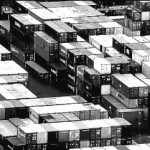
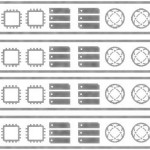
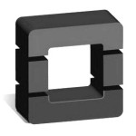

Google Wants Kubernetes To Rule The World

-

# Google Wants Kubernetes To Rule The World

November 8, 2016[Timothy Prickett Morgan](https://www.nextplatform.com/author/tpmn/)

At some point, all of the big public cloud providers will have to eat their own dog food, as the parlance goes, and run their applications atop the cloudy version of their infrastructure that they sell to other people, not distinct and sometimes legacy systems that predate the ascent of their clouds. In this regard, none of the cloud providers are any different from any major enterprise or government agency that struggles with any kind of legacy system.

Search engine and online advertising giant Google wants its Cloud Platform business to compete against Amazon Web Services and Microsoft Azure and stay well ahead of IBM SoftLayer, Rackspace Hosting, and other public cloud wannabees, and it has two strategic advantages into eventually growing Cloud Platform to be as large as that of AWS and perhaps even larger than the rest of its businesses put together. (Amazon believes that AWS can be larger than its online consumer product sales business, which is now about seven times larger than AWS but nowhere near as profitable.) The first is that Google designs its own uber-efficient servers, storage, and networks and the datacenters that wrap around them as well as the wide area networks that connect them in a global cluster that scales well beyond a million machines. The second advantage is not its vast library of software to storing data and analyzing it, but the open source Kubernetes container orchestration system that gets its inspiration from [the company’s Borg cluster controller and its Omega follow-on](https://www.nextplatform.com/2016/03/22/decade-container-control-google/).

It has been a little more than a year since Google set Kubernetes free and put it under the control of the Cloud Native Computing Foundation, and the software has gone from the foundational release 1.0 in July 2015 to a much more production ready release 1.4 at the end of September of this year. The Google Container Engine service – abbreviated GKE so as to not be confused with the Google Compute Engine raw VM service on the public cloud, and why not just call it Google Kubernetes Engine then? – was fired up shortly thereafter. With the KubeCon conference being hosted by the CNCF in the cloud capital of the world – Seattle, Washington, of course, where the big three have their operations – Kubernetes is on a lot of minds right now.

Including, as it turns out, developers inside of Google who don’t actually work on Kubernetes itself. The funny bit is that Google developers are starting to want to run applications on top of Kubernetes for the same flexibility and portability reasons that Google is using as a sales pitch for choosing its container abstraction layer for on-premises and public clouds.

“We regularly have conversations with people inside of Google about when are we going to bring some of the capabilities of Kubernetes inside of the Google and let them run some random application on top of Kubernetes, which is a complicated problem,” Tim Hockin, one of the original engineers on Kubernetes, tells *The Next Platform*. Hockin is acting as one of the voices for Kubernetes now that Craig McLuckie, who was the lead product manager for the Compute Engine service, one of the other founders of the Kubernetes project inside Google, and the related GKE container service, has left Google to run his own startup. Aparna Sinha, senior product manager for Google Container Engine, hopped on the call with Hockin to give us an update on where Kubernetes is at as a project and as a tool that Google itself is using.

**

> “We have already gotten requests from inside Google for people who want to run atop Kubernetes, and we are working with them to use Kubernetes through the cloud, literally through Google Container Engine. We are just starting down that road, and it is very challenging because Google brings a lot of requirements that we were hoping to ignore for a while. Google is a hard customer to have.”

**

So, the obvious question is when can Google just use Kubernetes instead of Borg? (One might also reasonably ask when Hadoop, which is based on Google’s MapReduce concept, might replace the tool of that name and the Google File System, which was the inspiration of the Hadoop Distributed File System.) But Google has its own kind of legacy software problem which would seem to cut against shifting from its internal software to open source variants inspired by them.

“What we are seeing is that for new applications, Google developers are looking at Borg or Kubernetes, and many of them are choosing Kubernetes,” says Sinha. “But I don’t think that it is practical to think that Gmail or search can move to Kubernetes.”

But Google is more than just two workloads, and anything it creates to make its public cloud better can – and we would argue should – be consumed by Google just like any other company. The real test of the cloud is when there simply is no difference between the raw infrastructure that a hyperscaler uses internally and the capacity and functions it sells on its public cloud. All of the real innovation will move up the stack, to the application software.

“There are a couple of ways to look at that,” says Hockin, who in his previous roles at Google worked on the Borg container management system and the cluster management tool that sits below it. “We have already gotten requests from inside Google for people who want to run atop Kubernetes, and we are working with them to use Kubernetes through the cloud, literally through Google Container Engine. We are just starting down that road, and it is very challenging because Google brings a lot of requirements that we were hoping to ignore for a while. Google is a hard customer to have. The larger question is could we use Kubernetes inside Google instead of Borg or alongside Borg – and that is a much harder question. We have many Borg clusters up and running, we have policies inside of Google that are all or nothing, so we can’t just upgrade one cluster to Kubernetes. Kubernetes is also missing hundreds and hundreds of features that Borg has – and whether they are good features or not is a good question, but these are things that Borg has and that people use. We don’t want to adopt all of those features in Kubernetes. So to bring Kubernetes in instead of Borg is an incredible challenge. That may never happen, or it may be on a five to ten year track, or I can imagine a certain end game where internally Borg has a dozen big customers and everyone else uses Kubernetes on our cloud.”

All of the big cloud providers face that same set of options and conundrums. It is just funny to think of Borg as being analogous to a mainframe at some point. (Maybe sooner than we think.) But of course, all of the services being created by public clouds will have their own maturation curve and will linger past their prime because change is sometimes as costly as not changing.

We are always looking for the next platform, as the name of this publication implies, and it is clear to use that Kubernetes is a contender as the centerpiece of a compelling platform based on mostly open source technologies. (Joe Beda, an ex-Googler who worked on Kubernetes beside McLuckie and who helped sell Urs Hoetzle, the head of the search engine giant’s massive infrastructure effort, on the idea of creating a more universal Borg and open sourcing it, [outlined what the next platform might look like](https://www.nextplatform.com/2015/10/16/stacking-up-a-modern-platform/) and we have also discussed [the integration of Kubernetes with the Prometheus monitoring system](https://www.nextplatform.com/2016/05/09/google-friends-add-prometheus-kubernetes-platform/).)

“The extensibility and the flexibility that Kubernetes offers is what really makes it a platform,” says Sinha. “You can run Kubernetes on virtual machines, on bare metal, on any cloud, and that is the beauty of it. It gives you that choice. You don’t just have a choice of clouds. You have a choice of storage, networks, and schedulers and you can plug those in as well, and this is what makes Kubernetes more applicable to the enterprise because they can tailor it to their environment.”

Microsoft, which adopted the alternative Mesos management tool as its container control layer on the Azure cloud’s container service and that also supports Docker Swarm, [has just announced this week](https://azure.microsoft.com/en-us/blog/azure-container-service-the-cloud-s-most-open-option-for-containers/) that it will be supporting Kubernetes, too. To be specific, Kubernetes has been supported on raw VMs for a while on Azure, soon the orchestration layer on the Azure Container Service will be able to be set up using Kubernetes rather than Mesos (or more precisely, [the commercial-grade Mesos that is known as DC/OS](https://www.nextplatform.com/2016/07/27/mesos-reaches-milestone-adds-native-docker/) and that is sold by Mesosphere). This provides Azure with a deeper, more native integration with Kubernetes, and interestingly, Microsoft is also opening up the code for its ACS Engine, the go-between that sits between Azure raw infrastructure and the DC/OS, Swarm, or Kubernetes container orchestration tools. This is, in effect, like Microsoft saying it is open sourcing the part of its Borg stack that it didn’t borrow from the open source community. Microsoft clearly also understands the concept of choice, and its embrace of Linux on Azure is but another example.

But Google and Microsoft are different. Microsoft wants to support everything on Azure, while Google wants Kubernetes everywhere. (In a sense, Microsoft is living up to the Borg name, assimilating all orchestrators, more than Google is.) And quite literally, Kubernetes is how Google is playing up to the on-premises cloud crowd giving it differentiation from AWS (which won’t sell its infrastructure as a stack with a license, [although it says VMware is its private cloud partner](https://www.nextplatform.com/2016/10/17/aws-vmware-acquaint-strange-cloudfellows/)) and Microsoft (which still doesn’t have its Azure Stack private cloud out the door).

“That is exactly the right way to think about it, that is exactly the intent, and that is how companies are using Kubernetes today and cluster federation is meant to build on top of that,” says Sinha. “Our strategy with Kubernetes has always been to provide an open source implementation that companies can use identically on premise as well as in *your choice* of clouds. So it is not just hybrid on-premises and public cloud, but it is multi-cloud, and there are customers that really take advantage of that. They deploy workloads wherever they want: On AWS, on GCP, or on premise, and federation allows them to build a control plane on top of all that.”

Cluster federation was introduced in Kubernetes 1.3 earlier this year, which allows multiple Kubernetes clusters to be spread across multiple clouds, public or private, or across different regions of a cloud provider and have a unified control plane that allows for the clusters and their replica sets to be provisioned as if they were on one giant instance of infrastructure. This federation layer obviously helps with resiliency and disaster recovery, but is also intended to allow for policies to be set that can push certain kinds of workloads and data only to specific clusters in specific regions if there are compliance or other restrictions. Just because you can put something anywhere on a cloud doesn’t mean developers should be able to do so.

The combination of abstraction and central control through federation is a powerful one, and a technique that Google returns to again and again in its own infrastructure.

“One of the things that the Kubernetes community is absolutely fanatical about is abstraction from cloud providers and their implementations,” Hockin explains. “We do not want to couple ourselves, with any part of the Kubernetes system, to Google Cloud Platform or Amazon Web Services or any on-premises infrastructure. As much pain as that causes us in the implementation, it is really important. This is reflected in our APIs and in our storage, for instance. The Kubernetes system uses abstract storage, but it gets bound on the back-end to concrete storage. So as a developer I just ask for 100 GB of fast disk, and that definition of fast depends on what the cluster administrators have set up. In my on premises Kubernetes clusters that might mean a NetApp appliance, and in GCP it might mean persistent disk and in AWS it might mean Elastic Block Storage, but as a developer I don’t actually know or care.”

Here at *The Next Platform*, we have a hard time believing that people won’t know or care, but Hockin’s point is taken. They will always want more speed, more capacity, and less latency. And scale. More scale, too. And that is why Google keeps pushing the scale barrier for Kubernetes, which it clearly knows how to do with some Borg clusters spanning more than 50,000 server nodes and lots of clusters spanning more than 10,000 nodes.

“We have a fairly stringent API latency requirement, and that is how we define the scaling limits, specifically for Google Cloud Platform,” explains Sinha. “With Kubernetes 1.3, we announced support for 2,000 nodes, and we intend to scale that up to 5,000 nodes. Externally, users do push it to their limits, and there is no hard set limit as such. But what we have seen is that large global customers are working with clusters with 1,000 or 2,000 nodes, and then they want to have separate clusters beyond that which work together, which is where federation comes in.”

Hockin says that Google has internally tested Kubernetes running across dozens of clusters that are federated, and that this federation feature was created specifically so customers could glue together clusters, from a management and workload sharing perspective, in every Google Cloud Platform region to take advantage of all of the geographical diversity that allows.

“We are definitely shooting for dozens if not low hundreds of clusters in a federation, and each cluster could have from 2,000 to 5,000 nodes and up to 60,000 pods,” says Hockin “If you take a dozen clusters in a dozen cloud regions times 5,000 nodes each, you have got quite a heap of machines.” (That’s 720,000 nodes if you want to be precise, and that is *a lot of iron*, even if a node is just a VM. At current densities of maybe 40 VMs per two-socket server, that is still 18,000 physical servers.)

Google might want to be more careful about enabling future competition. . . . Or not. Kubernetes is indeed a pilot, steering customers ultimately to Cloud Platform. Or so it must be thinking.

### Share this:

    - [Reddit](https://www.nextplatform.com/2016/11/08/google-wants-kubernetes-rule-world/?share=reddit&nb=1)
    - [Facebook13](https://www.nextplatform.com/2016/11/08/google-wants-kubernetes-rule-world/?share=facebook&nb=1)
    - [LinkedIn240](https://www.nextplatform.com/2016/11/08/google-wants-kubernetes-rule-world/?share=linkedin&nb=1)
    - [Twitter](https://www.nextplatform.com/2016/11/08/google-wants-kubernetes-rule-world/?share=twitter&nb=1)
    - [Google](https://www.nextplatform.com/2016/11/08/google-wants-kubernetes-rule-world/?share=google-plus-1&nb=1)
    - [Email](https://www.nextplatform.com/2016/11/08/google-wants-kubernetes-rule-world/?share=email&nb=1)

    -

### Similar Vein

    - [A Decade Of Container Control At Google](https://www.nextplatform.com/2016/03/22/decade-container-control-google/)
    - [What Makes Containers At Scale So Difficult](https://www.nextplatform.com/2015/09/29/why-containers-at-scale-is-hard/)
    - [HP Follows Hyperscale Lead With Composable Infrastructure](https://www.nextplatform.com/2015/06/04/hp-follows-hyperscale-lead-with-composable-infrastructure/)
    - [Scale And Database Pioneer Talks Hadoop Evolution](https://www.nextplatform.com/2015/06/25/scale-and-database-pioneer-talks-hadoop-evolution/)
    - [Google And Friends Add Prometheus To Kubernetes Platform](https://www.nextplatform.com/2016/05/09/google-friends-add-prometheus-kubernetes-platform/)
    - [OpenStack Aims Magnum At Containers](https://www.nextplatform.com/2015/05/11/openstack-aims-magnum-at-containers/)

Categories: [Cloud](https://www.nextplatform.com/category/cloud/), [Control](https://www.nextplatform.com/category/control/)

Tags: [Borg](https://www.nextplatform.com/tag/borg/), [Google](https://www.nextplatform.com/tag/google/), [Kubernetes](https://www.nextplatform.com/tag/kubernetes/), [Omega](https://www.nextplatform.com/tag/omega/)