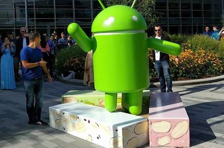

Google can't innovate anymore, exiting programmer laments

# Google can't innovate anymore, exiting programmer laments

## Steve Yegge torches Chocolate Factory on his way out

Seven years ago, Google software engineer Steve Yegge, having failed to understand the risk that a private social media rant might become public, [lambasted Google](https://plus.google.com/+RipRowan/posts/eVeouesvaVX) for its failure to understand software platforms, with Google+ serving as his whipping boy.

Despite calling out Google's leaders by name and highlighting the Chocolate Factory's "short-term thinking," he [did not get fired](https://plus.google.com/110981030061712822816/posts/AaygmbzVeRq), as happened with a more recent memo penned by former Google engineer James Damore.

On Tuesday, Yegge announced his departure from Google for Grab – perhaps not the best name for a ride-hailing service in the #MeToo era. But as he left the Chocolate Factory he couldn't resist pouring gasoline on the bridge he previously failed to burn.

In so doing, he adds to the surprisingly long list of Google departure declarations.

Other examples of this budding literary genre include: James Whittaker's "[Why I left Google](https://blogs.msdn.microsoft.com/jw_on_tech/2012/03/13/why-i-left-google/)" (spoiler alert: It was Google+); Spencer Tipping's "[why i left google](http://www.spencertipping.com/posts/2012.0530.why-i-left-google.html)" (a litany of technical sins including "pathological love of Java"); and Douglas Bowman's "[Goodbye, Google](http://stopdesign.com/archive/2009/03/20/goodbye-google.html)" (requiring data to justify design decisions and dithering over 41 shades of blue).

###  Scorched-earth

Not everyone bothers with a scorched-earth retreat. Developer [Tim Bray](https://www.tbray.org/ongoing/When/201x/2014/02/19/Leaving-Google) and marketer [Anastasia Leng](https://www.fastcompany.com/3016938/why-i-left-google) simply talk about moving on.

Alex Feinberg, strategic partner development manager at Google, earlier this week, announced [plans to leave Google](https://hackernoon.com/why-i-am-leaving-google-for-blockchain-endeavors-8394d06a0a8d) to participate in the blockchain craze (good luck with that). Others speak glowingly of their time at Google, perhaps aware future employers may read such things.

Other companies get these too, possibly because no one believes exit interview criticism will ever make its way up the management chain. Recall former Yahoo SVP Brad Garlinghouse's "[Peanut Butter Manifesto](https://www.wsj.com/articles/SB116379821933826657)" and contract worker Steve Barker's [letter](https://www.geekwire.com/2013/open-letter-jeff-bezos-contract-workers-amazoncom/) to Jeff Bezos about Amazon's hiring practices.

Greg Smith, once an executive director at Goldman Sachs, pilloried the finance firm in a New York Times op-ed, "[Why I Am Leaving Goldman Sachs](http://www.nytimes.com/2012/03/14/opinion/why-i-am-leaving-goldman-sachs.html)."

###  Blogging

In [a post](https://medium.com/@steve.yegge/why-i-left-google-to-join-grab-86dfffc0be84) on Medium, Yegge – who previously suggested Google leadership laughed off his criticism – says that "Google corporate didn't much care for my blogging" and that indirect pressure from VPs prompted him to curtail his penchant for posting thoughts online.

Google is not alone in its antipathy for Yegge's needling. If you go back to 2008, there's [a post](http://noop.nl/2008/03/why-i-would-nev.html) by Jurgen Appelo, who operates a consultancy in the Netherlands, titled, "Why I Would Never Hire Steve Yegge." His objection is Yegge's verbose writing and failure to properly spell the name of software luminary Edsger W. Dijkstra, a fellow Dutchman.

Yegge's critique is straightforward: "The main reason I left Google is that they can no longer innovate."

He explains this by arguing that Google, having become successful, has become focused on protecting its business rather than pushing boundaries. He contends the company is mired in politics and is arrogant – a criticism he rejected in 2011 when he insisted "We're, like, 99% Arrogance-Free," though he allowed that the "the Chrome team is flat-out arrogant" for not paying enough attention to accessibility features.

###  Watch your back, just not all the time

Lastly, Yegge slams Google for becoming competitor-focused rather than customer-focused. Pointing to a decade of product launches that follow in competitors' footsteps – Google+ (Facebook), Google Cloud (AWS), Google Home (Amazon Echo), Allo (WhatsApp), Android Instant Apps (Facebook, WeChat), and Google Assistant (Apple/Siri) – he concludes Google has lost the ability to develop its own new ideas.

There are exceptions, he grants, like Google’s Cloud Spanner, BigQuery, TensorFlow, and Waymo, but he insists his central premise remains valid.

*The Register* asked Google if anyone there would care to respond. We've not heard back.

It's perhaps too much to hope that someone at Google would reprise Apple senior VP for worldwide marketing Phil Schiller's response to similar criticism in 2013, following the introduction of the redesigned Mac Pro: "Can't innovate any more, my ass!"

Ironically, three years later, Apple exec Craig Federighi [acknowledged problems](https://daringfireball.net/2017/04/the_mac_pro_lives) with that design. Maybe there's something to be said for silence. ®

Sponsored: [Minds Mastering Machines - Call for papers now open](https://go.theregister.co.uk/tl/1757/shttp://www.mcubed.london/)