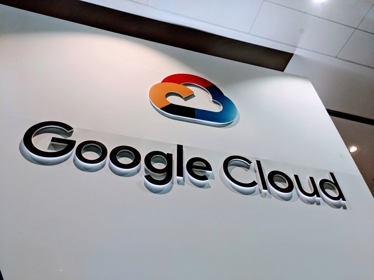

Google launches Cloud Code to make cloud-native development easier – TechCrunch

# Google launches Cloud Code to make cloud-native development easier

[Frederic Lardinois](https://techcrunch.com/author/frederic-lardinois/)[@fredericl](https://twitter.com/fredericl) / 1 month ago

[Google i](https://crunchbase.com/organization/google) today launched a set of plugins for popular development environments like IntelliJ and Visual Studio Code that promise to make building cloud-native applications significantly easier. You can’t say “cloud-native” without saying Kubernetes, so it’s no surprise that the focus here is on helping developers build, debug and deploy their code to a [Kubernetes i](https://crunchbase.com/organization/kubernetes) cluster right from their IDE.

Typically, Google argues, developers edit, compile and debug their code locally. That’s often just fine, but it can also create issues when the production environment doesn’t quite match the local one. But building containers comes with its own challenges — and nobody really enjoys writing YAML files by hand just to test code. Indeed, the promise here is that the developer doesn’t have to write a single line of YAML.

The promise then, is that you can continue to develop your code just like you used to, while Cloud Code handles all of the work of turning it into a cloud-native application. The tools are also integrated with Google’s DevOps tools like Cloud Build and Stackdriver.

Cloud Code combines a number of existing open-source tools, including [Kubectl](https://kubernetes.io/docs/tasks/tools/install-kubectl/), the command-line tools for working with the Kubernetes API; [Jib](https://github.com/GoogleContainerTools/jib), for building containers for Java applications; and [Skaffold](https://github.com/GoogleContainerTools/skaffold), for setting up the continuous deploying pipeline for Kubernetes applications.

The service will work for virtually all popular programming languages, including Microsoft’s .NET Core.

“This essentially gives you turbocharged, cloud-native app development, right in your IDE,” Google Cloud VP of product and design Pali Bhat told me. “It brings remote app development right into your developer loop right in the IDE. This unlocks the power of all of these developers and lets them build for Kubernetes, build for cloud-native, without having to worry about all of the different pieces that they had to learn.”

[## Disrupt SF 2019](https://techcrunch.com/events/disrupt-sf-2019/?ref=rightrailpromo#tickets)

[48 Hour Flash Sale Happening Now](https://techcrunch.com/events/disrupt-sf-2019/?ref=rightrailpromo#tickets)

San FranciscoOct 2 - 4

[Get Passes Now](https://techcrunch.com/events/disrupt-sf-2019/?ref=rightrailpromo#tickets)

