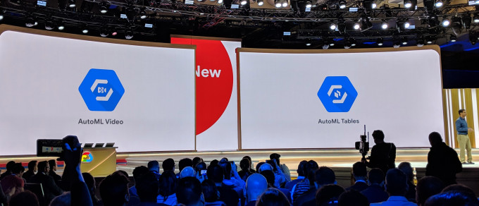

Google launches an end-to-end AI platform – TechCrunch

# Google launches an end-to-end AI platform

[Frederic Lardinois](https://techcrunch.com/author/frederic-lardinois/)[@fredericl](https://twitter.com/fredericl) / 1 month ago

As expected, [Google i](https://crunchbase.com/organization/google) used the second day of its annual [Cloud Next conference](https://techcrunch.com/tag/google-cloud-next-2019/) to shine a spotlight on its AI tools. The company made a dizzying number of announcements today, but at the core of all of these new tools and services is the company’s plan to democratize AI and machine learning with pre-built models and easier to use services, while also giving more advanced developers the tools to build their own custom models.

The highlight of today’s announcements is the beta launch of the company’s [AI Platform](https://cloud.google.com/ai-platform/). The idea here is to offer developers and data scientists an end-to-end service for building, testing and deploying their own models. To do this, the service brings together a variety of existing and new products that allow you to build a full data pipeline to pull in data, label it (with the help of a new built-in labeling service) and then either use existing classification, object recognition or entity extraction models, or use existing tools like AutoML or the Cloud Machine Learning engine to train and deploy custom models.

“The AI Platform is this place where, if you are taking this terrifying journey from a journeyman idea of how you can use AI in your enterprise, all the way through launch and a safe, reliable deployment, the AI Platform help you move between each of these stages in a safe way so that you can start with exploratory data analysis, start to build models using your data scientists, decide that you want to use this specific model, and then with essentially one click be able to deploy it,” a Google spokesperson said during a press conference ahead of today’s official announcement.

But there is plenty more AI news, too, mostly courtesy of Cloud [AutoML](https://cloud.google.com/automl/), Google’s tool for automating the model training process for developers with limited machine learning expertise.

One of these new features is [AutoML Tables](https://cloud.google.com/blog/products/data-analytics/google-cloud-smart-analytics-accelerates-your-business-transformation), which takes existing tabular data that may sit in Google’s BigQuery database or in a storage service and automatically creates a model that will predict the value of a given column.

Also new is AutoML Video Intelligence (now in beta), which can automatically annotate and tag video, using object recognition to classify video content and make it searchable. For detecting objects in photos, Google also today launched the beta of AutoML Vision and for applications that run at the edge, Google launched the beta AutoML Vision Edge, which includes the ability to then deploy these models to edge devices.

A lot of enterprise data comes in the form of straightforward, unstructured text, though. For these use cases, Google today launched the betas of its custom entity extraction service and a custom sentiment analysis service. Both of these tools can be customized to fit the needs of a given organization. It’s one thing to use a generic entity extraction service to understand documents, but for most businesses, the real value here is to be able to pull out information that may be very specific to their needs and processes.

Talking about documents, Google also today announced the beta of its [Document Understanding API](https://cloud.google.com/solutions/document-understanding/). This is a new platform that can automatically analyze scanned or digital documents. The service basically combines the ability to turn a scanned page into machine-readable text and then use Google’s other machine learning services to extract data from it.

After introducing it in preview last year, the company also today launched the beta of its Contact Center AI. This service, which was built with partners like Twilio, Vonage, Cisco, Five9, Genesys and Mitel, offers a full contact center AI solution that uses tools like Dialogflow and Google’s text-to-speech capabilities to allow its users to build a virtual agent system (and when things go awry, it can pass the customer to a human agent).

It’s no secret that many enterprises struggle to combine all of these tools and services into a coherent platform for their own needs. Maybe it’s no surprise then that Google also today launched it first AI solution for a specific vertical: Google Cloud Retail. This service combines the company’s Vision Product Search, Recommendations AI and AutoML Tables into a single solution for tackling retail use cases. Chances are, we will see more of the packages for other verticals in the near future.

[## Disrupt SF 2019](https://techcrunch.com/events/disrupt-sf-2019/?ref=rightrailpromo#tickets)

[48 Hour Flash Sale Happening Now](https://techcrunch.com/events/disrupt-sf-2019/?ref=rightrailpromo#tickets)

San FranciscoOct 2 - 4

[Get Passes Now](https://techcrunch.com/events/disrupt-sf-2019/?ref=rightrailpromo#tickets)

