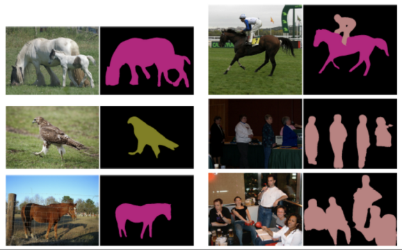
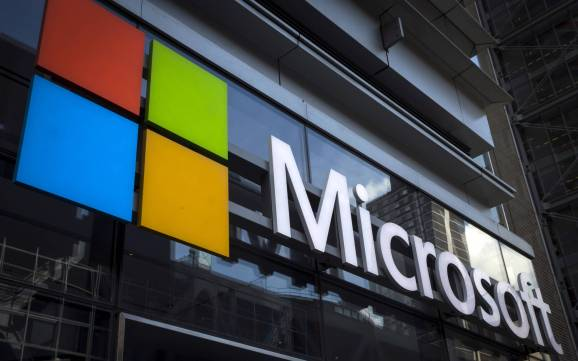
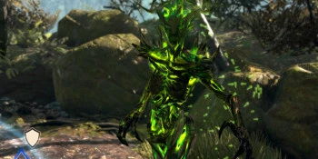
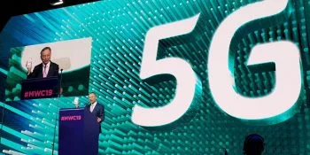
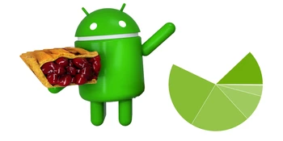
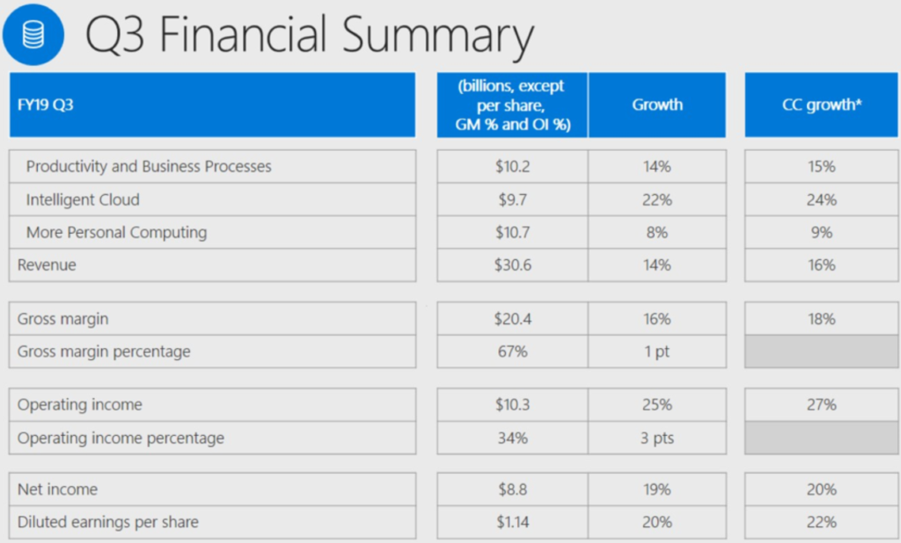

Google open-sources AI image segmentation models optimized for Cloud TPUs

[(L)](https://share.flipboard.com/bookmarklet/popout?v=2&title=Google%20open-sources%20AI%20image%20segmentation%20models%20optimized%20for%20Cloud%20TPUs%20%7C%20VentureBeat&url=https%3A%2F%2Fventurebeat.com%2F2019%2F04%2F24%2Fgoogle-open-sources-ai-image-segmentation-models-optimized-for-cloud-tpus%2F&t=1556483642897&utm_campaign=tools&utm_medium=article-share&utm_source=venturebeat.com)

[AI](https://venturebeat.com/category/ai)

# Google open-sources AI image segmentation models optimized for Cloud TPUs

[Kyle Wiggers](https://venturebeat.com/author/kylewiggers/)[@Kyle_L_Wiggers](https://twitter.com/Kyle_L_Wiggers)April 24, 2019 12:22 PM

Image Credit: Google

## MOST READ

- 

[What Google’s burst of cloud announcements tells us about its overall strategy](https://venturebeat.com/2019/04/27/what-googles-burst-of-cloud-announcements-tells-us-about-its-overall-strategy/)

- 

[Microsoft releases new Windows 10 preview with Your Phone, dictation, and Narrator improvements](https://venturebeat.com/2019/04/26/microsoft-releases-new-windows-10-preview-with-your-phone-dictation-and-narrator-improvements/)

## UPCOMING EVENTS

- [GamesBeat Summit:](https://vbevents.venturebeat.com/GamesBeatSummit2019)Apr. 23 - 24
- [Transform:](https://www.vbtransform.com/)Jul. 10 - 11

Google’s custom [tensor processing unit (TPU)](https://venturebeat.com/2018/06/19/googles-cloud-tpu-comes-to-europe-and-asia-with-preemptible-pricing/) chips, the latest generation of which became available to Google Cloud Platform customers last year, are tailor-made for AI inferencing and training tasks like image recognition, natural language processing, and reinforcement learning. To support the development of apps that tap them, the Mountain View company has steadily open-sourced architectures like [BERT](https://venturebeat.com/2018/11/02/google-open-sources-bert-a-state-of-the-art-training-technique-for-natural-language-processing/) (a language model), [MorphNet](https://venturebeat.com/2019/04/17/googles-morphnet-optimizes-ai-models-without-sacrificing-accuracy/) (an optimization framework), and [UIS-RNN](https://venturebeat.com/2018/11/12/google-open-sources-ai-that-can-distinguish-between-voices-with-92-percent-accuracy/) (a speaker diarization system), often along with data sets. Continuing in that vein, Google is [today](https://cloud.google.com/blog/products/ai-machine-learning/whats-in-an-image-fast-accurate-image-segmentation-with-cloud-tpus) adding two new models for image segmentation to its library, both of which it claims achieve state-of-the-art performance deployed on [Cloud TPU pods](https://cloud.google.com/tpu/).

The models — [Mask R-CNN](https://arxiv.org/abs/1703.06870) and [DeepLab v3+](https://arxiv.org/pdf/1706.05587.pdf) — automatically label regions in an image and support two types of segmentation. The first kind, instance segmentation, gives each instance of one or multiple object classes (e.g., people in a family photo) a unique label, while semantic segmentation annotates each pixel of an image according to the class of object or texture it represents. (A city street scene, for instance, might be labeled as “pavement,” “sidewalk,” and “building.”)

As Google explains, Mask R-CNN is a two-stage instance segmentation system that can localize multiple objects at once. The first stage extracts patterns from an input photo to identify potential regions of interest, while the second stage refines those proposals to predict object classes before generating a pixel-level mask for each.

Above: Semantic segmentation results using DeepLab v3+ .
*Image Credit: Google *

DeepLab 3+, on the other hand, prioritizes segmentation speed. Trained on the open source PASCAL VOC 2012 image corpus using Google’s TensorFlow machine learning framework on the latest-generation TPU hardware (v3), it’s able to complete training in less than five hours.

Tutorials and notebooks in Google’s Colaboratory platform for Mask R-CNN and DeepLab 3+ are available as of this week.

TPUs — application-specific integrated circuits (ASICs) that are liquid-cooled and designed to slot into server racks — have been used internally to power products like Google Photos, Google Cloud Vision API calls, and Google Search results. The first-generation design was announced in May at Google I.O, and the newest — the [third generation](https://venturebeat.com/2018/05/08/google-to-release-third-generation-of-its-tensor-processing-units-for-faster-ai/) — was detailed in May 2018. Google claims it offers up to 100 petaflops in performance, or about 8 times that of its second-generation chips.

Google isn’t the only one with cloud-hosted hardware optimized for AI. In March, Microsoft opened [Brainwave](https://venturebeat.com/2018/03/26/microsofts-brainwave-makes-bings-ai-over-10-times-faster/) –a fleet of field-programmable gate arrays (FPGAs) designed to speed up machine learning operations — to select Azure customers. (Microsoft said that this allowed it to achieve 10 times faster performance for the models that power its Bing search engine.) Meanwhile, Amazon provides its own FPGA hardware to customers, and is reportedly developing an [AI chip that will accelerate its Alexa speech engine’s model training](https://venturebeat.com/2018/02/16/get-ready-for-ai-chips-everywhere/).

# Microsoft reports $30.6 billion in Q3 2019 revenue: Azure up 73%, Surface up 21%, and LinkedIn up 27%

[Emil Protalinski](https://venturebeat.com/author/emil-protalinski/)[@EPro](https://twitter.com/EPro)April 24, 2019 01:06 PM

Above: A Microsoft logo is seen on an office building in New York City, July 28, 2015.

Image Credit: Reuters / Mike Segar

## MOST READ

- 

[What Google’s burst of cloud announcements tells us about its overall strategy](https://venturebeat.com/2019/04/27/what-googles-burst-of-cloud-announcements-tells-us-about-its-overall-strategy/)

- 

[Microsoft releases new Windows 10 preview with Your Phone, dictation, and Narrator improvements](https://venturebeat.com/2019/04/26/microsoft-releases-new-windows-10-preview-with-your-phone-dictation-and-narrator-improvements/)

- 

[Sensor Tower — The Elder Scrolls: Blades pulls in over $1.5 million on iOS](https://venturebeat.com/2019/04/26/sensor-tower-the-elder-scrolls-blades-pulls-in-over-1-5-million-on-ios/)

- 

[Don’t believe the 5G hype-killers — at least, most of them](https://venturebeat.com/2019/04/26/dont-believe-the-5g-hype-killers-at-least-most-of-them/)

- 

[ProBeat: Google hasn’t updated Android distribution data in 6 months](https://venturebeat.com/2019/04/26/probeat-google-hasnt-updated-android-distribution-data-in-6-months/)

## UPCOMING EVENTS

- [GamesBeat Summit:](https://vbevents.venturebeat.com/GamesBeatSummit2019)Apr. 23 - 24
- [Transform:](https://www.vbtransform.com/)Jul. 10 - 11

Microsoft today [reported](https://www.microsoft.com/en-us/Investor/earnings/FY-2019-Q3/press-release-webcast) earnings for its third fiscal quarter of 2019, including revenue of $30.6 billion, net income of $8.8 billion, and earnings per share of $1.14 (compared to [revenue of $26.8 billion, net income of $7.4 billion, and earnings per share of $0.95](https://venturebeat.com/2018/04/26/microsofts-quarterly-revenue-rises-to-26-8-billion-driven-by-office-and-cloud-gains/) in Q3 2018). All three of the company’s operating groups saw year-over-year growth.

Analysts had expected Microsoft to earn $29.8 billion in revenue and report earnings per share of $1.00. The company thus easily beat expectations. The company’s stock was down 0.34% in regular trading, but up some 3% in after-hours trading. Microsoft said it returned $7.4 billion billion to shareholders in the form of share repurchases and dividends during the quarter.

“Leading organizations of every size in every industry trust the Microsoft cloud,” Microsoft CEO Satya Nadella said in a statement. “We are accelerating our innovation across the cloud and edge so our customers can build the digital capability increasingly required to compete and grow.”

The consistent quarterly success can be attributed to Nadella’s plan to [turn Microsoft into a cloud company](https://venturebeat.com/2017/07/20/microsofts-cloud-business-continues-to-offset-weaker-operations/). In 2017, Microsoft’s [cloud annualized run rate passed $20 billion](https://venturebeat.com/2017/10/26/microsoft-cloud-annualized-run-rate-passes-20-billion/), ahead of schedule.

## Operating group highlights

Here are the highlights across Microsoft’s three operating groups:

- •Productivity and Business Processes: Up 14% to $10.2 billion. Office commercial revenue grew 12%, Office consumer and cloud revenue was up 8%, and Dynamics revenue increased 13%. LinkedIn revenue jumped a solid 27%. Office 365 consumer subscribers hit 34.2 million.
- •Intelligent Cloud: Up 22% to $9.7 billion. Server products and cloud services revenue grew 27%, while Enterprise Services revenue increased 4%. The big number as always was Azure revenue, which jumped by 73%.
- •More Personal Computing: Up 8% to $10.7 billion. Windows OEM revenue was up 9%, while Windows commercial revenue increased 18%. Search advertising revenue minus traffic acquisition costs jumped 12%. Surface revenue increased by 21%, and gaming revenue was up 5% (driven largely by Xbox software and service growth).

34.2 million consumer subscribers of Office 365 is significant, but it naturally pales in comparison to the enterprise side. Microsoft now has more than 180 million monthly active Office 365 business users.

## LinkedIn, GitHub, and Surface

Microsoft has successfully monetized [its LinkedIn acquisition](https://venturebeat.com/2016/06/13/microsoft-to-acquire-linkedin-for-26-2-billion/), which closed in December 2016. Various divisions at the company are still figuring out how they can integrate with the platform.

It’s not clear whether Microsoft can do the same with its [$7.5 billion acquisition of GitHub](https://venturebeat.com/2018/06/04/microsoft-confirms-it-will-acquire-github-for-7-5-billion/), which [closed in October](https://venturebeat.com/2018/10/26/microsoft-completes-its-7-5-billion-github-acquisition/). Microsoft is including GitHub numbers under its Intelligent Cloud division (specifically under server products). We expected the company to break GitHub out this quarter, but that didn’t happen, presumably because revenue there is not significant enough.

Surface continues to bring in $1 billion quarters. While Q2 was a $1.86 billion quarter, Q3 saw $1.33 billion from Surface. Earlier this month, Microsoft held [a Surface Hub event](https://venturebeat.com/2019/04/17/microsofts-surface-hub-2s-starts-at-8999-ships-in-june/) in New York City, where it announced the Surface Hub 2S will ship in June, starting at $8,999 and going up to nearly $12,000. Price tags like that could certainly juice up Surface revenue to the $2 billion range.