Google-backed massive housing and office plan wins approval

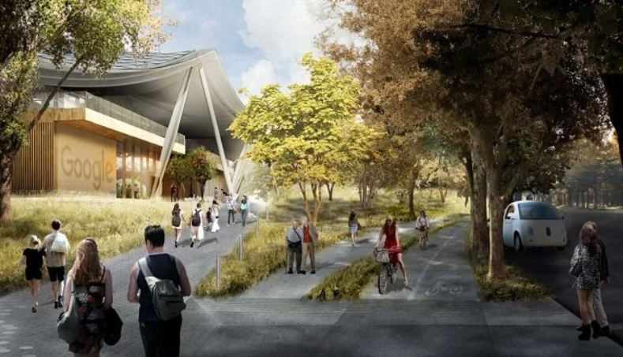

An artist’s rendering of Google’s planned Charleston East campus in the North Bayshore area of Mountain View (City of Mountain View)

By [Louis Hansen](https://www.mercurynews.com/author/louis-hansen/) | [lhansen@bayareanewsgroup.com](https://www.mercurynews.com/2017/12/12/googles-massive-housing-and-office-plan-poised-for-approval/mailto:lhansen@bayareanewsgroup.com) | Bay Area News Group

PUBLISHED: December 12, 2017 at 10:00 am | UPDATED: December 13, 2017 at 5:52 pm

[(L)](http://assets.newsinc.com/info/adchoices.html)

**Autoplay:**  [On](https://www.mercurynews.com/2017/12/12/googles-massive-housing-and-office-plan-poised-for-approval/#) | [Off](https://www.mercurynews.com/2017/12/12/googles-massive-housing-and-office-plan-poised-for-approval/#)

*****([Click here](http://www.mercurynews.com/2017/12/12/googles-massive-housing-and-office-plan-poised-for-approval/), if you are unable to view this video on your mobile device.)*****

MOUNTAIN VIEW — It’s a Google town.

Mountain View City Council Tuesday night unanimously approved a sweeping redevelopment plan, clearing the way for Google and other developers to create a dense, city-like campus of offices and homes in a housing-starving region.

The new master plan could reshape North Bayshore, home to Google headquarters, into the most ambitious new development in the Bay Area with nearly 10,000 new homes and apartments, about 3.6 million square feet of office space, and a mix of pedestrian-friendly parks, retail shops and businesses.

Advocates say the plan also creates a bold marker for large-scale housing development in the Bay Area, where a booming economy coupled with little new residential development has led to highest-in-the-nation rents and home prices.

Mountain View leaders said they hope to set a new tone for residential development in the Bay Area. Google endorsed the plan at Tuesday night’s six-hour meeting.

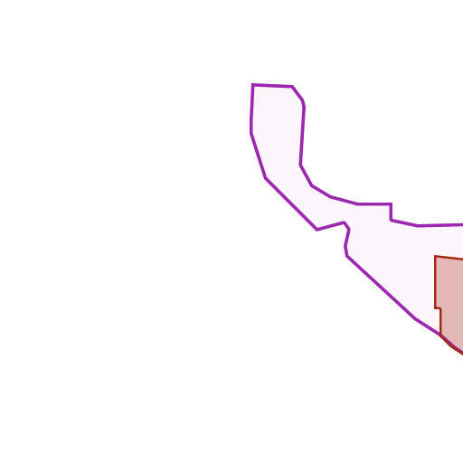

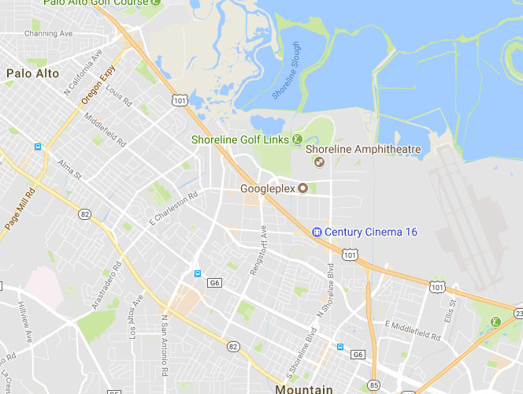
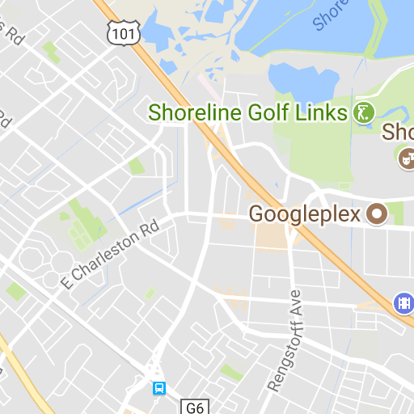
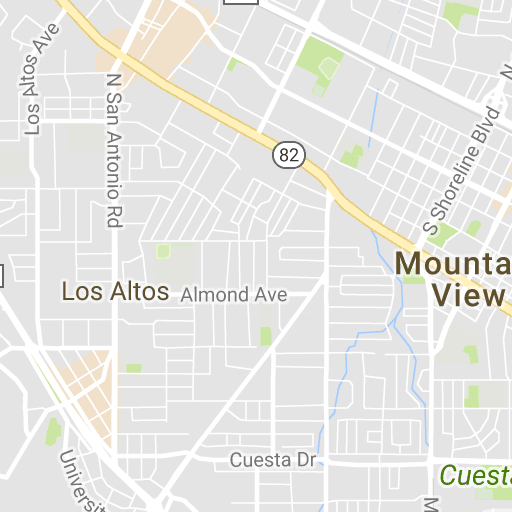
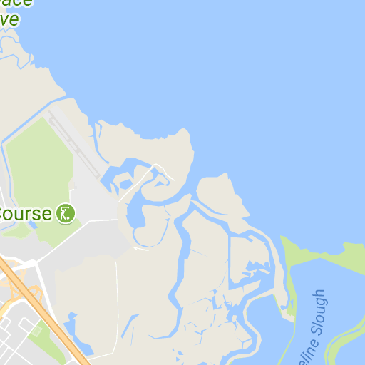
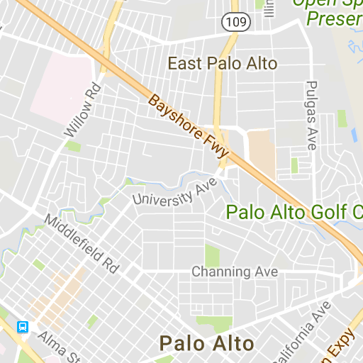

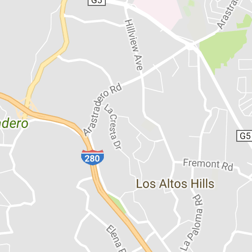
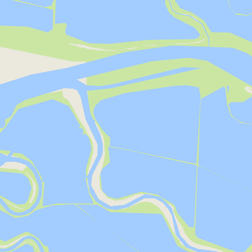
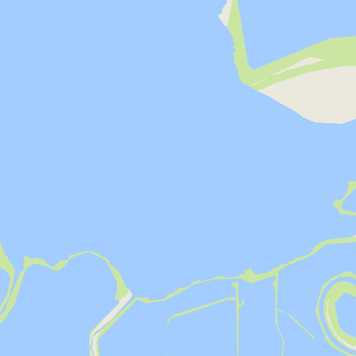
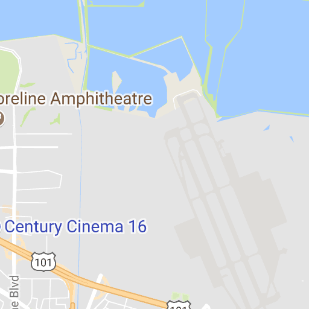
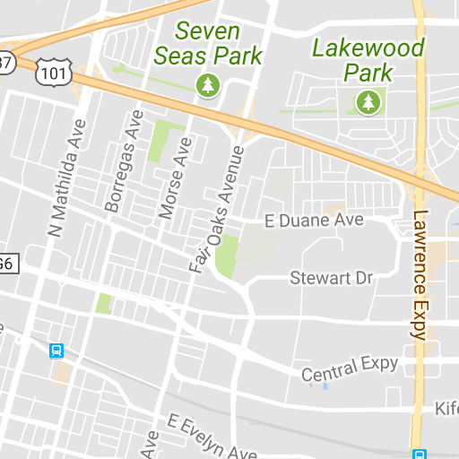
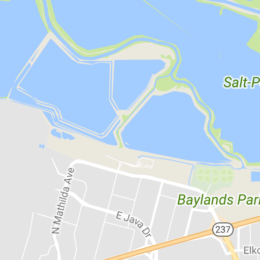
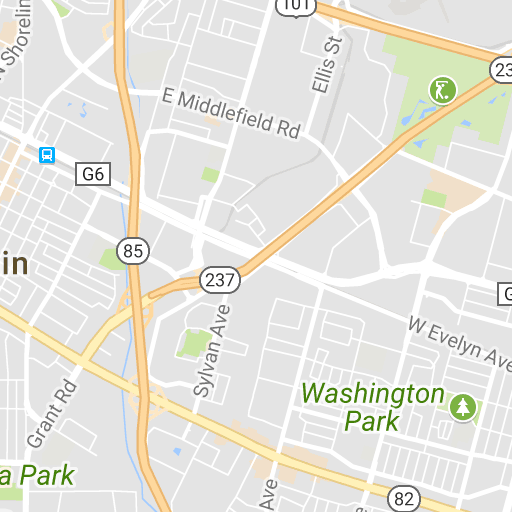
Use ⌘ + scroll to zoom the map

Google's North Bayshore plan

- Map data ©2017 Google
- [Terms](https://www.google.com/intl/en/help/terms_maps.html)

1 km

Marc Cohen
marcacohen@gmail.com

Create new map

Open map

Shared with you

Help

Feedback

Report inappropriate content

Google Drive

Vice mayor Lenny Siegel said the project would address the core issue facing the region. “This is a cutting edge plan that sets a standard,” he said. “Not just for the Bay Area, but for the rest of the country.”

Elected officials in the neighboring cities have discouraged new housing projects, even as major employers in those cities have expanded. According to the housing advocacy group SV@Home, Mountain View has a ratio of 2.7 workers for every housing unit, the second-highest in the region behind Palo Alto, with a ratio of 3.8 workers per home.

[](https://googleads.g.doubleclick.net/aclk?sa=l&ai=CK3I5fro7WsH5LvfQzAak64zoA-jImqpPnvTsjY0GwI23ARABIKW0sCJgu76ug9AKoAHLorLrA8gBAuACAKgDAcgDmQSqBIsCT9BSVE0ppEkNUBl7lYhHDBTebKXy7ZanuZAq1ywrgJRrvNFo1yQ1I-V7UGaz9QRmTdMVKAZRcULdnwXGLt8EC3jU62NBCopVwq06yqgozrGuwY_Ru1O87GEgaSzrYr8qxdNMDe-Fwi-OYYAr05QCpPYySD_PgGLXRIu0iIy2p2lRV7xFPVaCcu5I8aGOg1uFj0oQcz-DIha3niMU-PLiHEhBRIOJJYQ_IlCbSR20Jm3t1O8Sck87D1xV4_3E8D4RE4qzfO2-nnHfRSLuh3JKTHixVyVY33-BoUg_7QxT5Qk1R7Ij6I3LZSqAhndHUMPHhuQ7FukpB1lrECoBV2xdD5TrQ9cSH2EEq2qc4AQBoAYCgAed3c0UqAemvhvYBwHSCAcIjGMQARgBsQlZogoibJegnoAKA9gTDA&num=1&sig=AOD64_2AN3cPrClO6D_l6R_1UZ-Bi_FeKg&client=ca-pub-5831866191128057&adurl=https://www.fisherinvestments.eu/uk/15-minute-retirement-plan/3f/index.php%3FPC%3DGOOUKBNE06%26CC%3DMR94)

“This is a leap forward for the entire Bay Area,” said Pilar Lorenzana, deputy director of the non-profit. “No other city is trying to add this many homes.”

A recent report released by the Silicon Valley Community Foundation and the Silicon Valley Leadership Group found that between 2010 and 2015 the region created about 367,000 jobs while building just 57,000 new homes.

Financial details about the plan, including Mountain View-based Google’s investment, have not been released. Siegel said the full development could take a decade to complete.

Planners envision a redevelopment of the North Bayshore office park into a collection of office buildings, retail shops and entertainment, and three new neighborhoods called Joaquin, Shorebird and Pear. About 150 acres of the project are dedicated to residential development — including single family homes and apartments.

The city will allow up to 9,850 new housing units, with 70 percent targeted for studio or one-bedroom apartments. It also sets a goal to have 20 percent of the apartments be affordable units.

The plan calls for transforming the suburban office park filled with Google employees into a high-density, mixed-used district. Buildings are expected to be taller — up to 8 stories for offices and 15 stories for residential units — and friendlier to pedestrians, cyclists and public transit.

Planners are hopeful the project will alleviate traffic with increased transit opportunities, and by bringing more employees closer to their offices. Although part of the project will be developed by Google, housing will not be restricted to company employees.

Developers have not set a timeline for the various projects, although Lorenzana said Google and other developers are anxious to build.

The city, Google and other developers will come up with a master plan to detail specific phases of the redevelopment. The project is expected to undergo further public hearings.

On Tuesday night, dozens of pro-development residents and advocates packed city council chambers, waving signs reading “9,850 homes, #SayYesNBS.”

Carl Guardino, president of the Silicon Valley Leadership Group, said more homes for working families have been the top priority for valley businesses for the last 13 years. “Now is the time to move forward,” he said.

Residents near the proposed development urged the city to minimize disruptions, and alert neighbors of road closings and construction.

Siegel, a vocal supporter of the plan, said North Bayshore development would undergo further public hearings. “This is a living document,” he said. “It can be fine-tuned.”

The North Bayshore project is just one part of the digital advertising and search giant’s aggressive plans to expand and develop in Silicon Valley.

## Related Articles

- [As Mountain View plans for new housing, could other cities come next?](https://www.mercurynews.com/2017/12/13/as-mountain-view-plans-for-new-housing-could-other-cities-come-next/)
- [Microsoft unveils modern, green Silicon Valley campus plan](https://www.mercurynews.com/2017/12/05/microsoft-unveils-big-new-mountain-view-campus-plans/)
- [Google in San Jose? Look what happened with Amazon in Seattle](https://www.mercurynews.com/2017/12/03/google-in-san-jose-look-what-happened-with-amazon-in-seattle/)

The company plans to develop additional office space and pre-fabricated apartments at Moffett Field. It has also partnered with San Jose to create a [new village near Diridon Station](http://www.mercurynews.com/2017/11/11/google-san-jose-village-coyote-valley-comparison/), where as many as 20,000 employees could work in up to 8 million square feet of office space with ready access to pubic transit.

In Sunnyvale, the company has shown a voracious appetite for real estate, [spending $1 billion on properties and office buildings east of Moffett Field](http://www.mercurynews.com/2017/12/08/google-buys-sunnyvale-buildings-land-from-netapp-property-purchases-widen/).

- Tags:
- [Google](https://www.mercurynews.com/tag/google/),
- [Housing](https://www.mercurynews.com/tag/housing/),
- [Real Estate](https://www.mercurynews.com/tag/real-estate/)

### [Louis Hansen](https://www.mercurynews.com/author/louis-hansen/)

Louis Hansen covers Tesla and renewable energy for the Bay Area News Group and is based at The Mercury News. He's won national awards for his investigations and feature stories. Prior to joining the organization, he was an enterprise reporter at The Virginian-Pilot, where he covered state government, the military and criminal justice.

[**Follow Louis Hansen@HansenLouis](https://twitter.com/HansenLouis)

[Subscribe Today!All Access Digital offer for just 99 cents!](https://checkout.mercurynews.com/subscriptionpanel/?presentation=basic3)

-

 [Ask Amy: This suspicious incident six years ago still weighs on me](http://www.mercurynews.com/2017/03/08/ask-amy-i-saw-my-brother-in-law-holding-hands-with-another-woman/?origUrl=true)

-

 [Apple Park is one of the world’s most expensive buildings. What are some of the others?](http://www.mercurynews.com/2017/12/12/apple-park-joins-casinos-yankee-stadium-freedom-tower-among-nations-costly-buildings/?origUrl=true)

-

 [Howard Stern character died of heroin overdose, TMZ says](http://www.mercurynews.com/2017/03/13/howard-stern-character-died-of-heroin-overdose-tmz-says/?origUrl=true)

[Recommended by](https://www.outbrain.com/what-is/default/en)