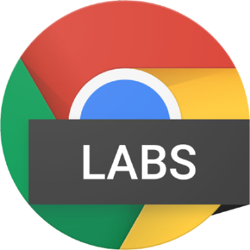

GoogleChromeLabs/carlo

GoogleChromeLabs/carlo

https://github.com/GoogleChromeLabs/carlo/blob/master/README.md

Web rendering surface for Node applications. Contribute to GoogleChromeLabs/carlo development by creating an account on GitHub.