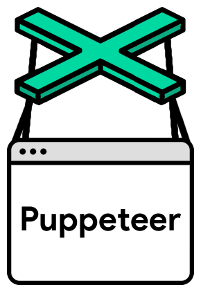

GoogleChrome/puppeteer

###    README.md

# [(L)](https://github.com/GoogleChrome/puppeteer#puppeteer--)Puppeteer [[Build Status](../_resources/af3359b6a330e8be6d21e0274c77bc30.bin)](https://travis-ci.com/GoogleChrome/puppeteer)  

###### [(L)](https://github.com/GoogleChrome/puppeteer#api--faq--contributing)[API](https://github.com/GoogleChrome/puppeteer/blob/master/docs/api.md) | [FAQ](https://github.com/GoogleChrome/puppeteer#faq) | [Contributing](https://github.com/GoogleChrome/puppeteer/blob/master/CONTRIBUTING.md)

> Puppeteer is a Node library which provides a high-level API to control > [> headless](https://developers.google.com/web/updates/2017/04/headless-chrome)>  Chrome over the > [> DevTools Protocol](https://chromedevtools.github.io/devtools-protocol/)> . It can also be configured to use full (non-headless) Chrome.

###### [(L)](https://github.com/GoogleChrome/puppeteer#what-can-i-do)What can I do?

Most things that you can do manually in the browser can be done using Puppeteer! Here are a few examples to get you started:

- Generate screenshots and PDFs of pages.
- Crawl a SPA and generate pre-rendered content (i.e. "SSR").
- Scrape content from websites.
- Automate form submission, UI testing, keyboard input, etc.
- Create an up-to-date, automated testing environment. Run your tests directly in the latest version of Chrome using the latest JavaScript and browser features.
- Capture a [timeline trace](https://developers.google.com/web/tools/chrome-devtools/evaluate-performance/reference) of your site to help diagnose performance issues.

## [(L)](https://github.com/GoogleChrome/puppeteer#getting-started)Getting Started

### [(L)](https://github.com/GoogleChrome/puppeteer#installation)Installation

*Puppeteer requires Node version 7.10 or greater*
To use Puppeteer in your project, run:

	yarn add puppeteer
	# or "npm i puppeteer"

**> Note**> : When you install Puppeteer, it downloads a recent version of Chromium (~71Mb Mac, ~90Mb Linux, ~110Mb Win) that is guaranteed to work with the API.

### [(L)](https://github.com/GoogleChrome/puppeteer#usage)Usage

Puppeteer will be familiar to using other browser testing frameworks. You create an instance of ` Browser `, open pages, and then manipulate them with [Puppeteer's API](https://github.com/GoogleChrome/puppeteer/blob/master/docs/api.md#).

**Example** - navigating to [https://example.com](https://example.com/) and saving a screenshot as *example.png*:

const  puppeteer  =  require('puppeteer');

(async() => {const  browser  =  await  puppeteer.launch();const  page  =  await  browser.newPage();await  page.goto('https://example.com');await  page.screenshot({path:  'example.png'});browser.close();

})();

Puppeteer sets an initial page size to 800px x 600px, which defines the screenshot size. The page size can be customized with [` Page.setViewport() `](https://github.com/GoogleChrome/puppeteer/blob/master/docs/api.md#pagesetviewportviewport).

**Example** - create a PDF.
const  puppeteer  =  require('puppeteer');

(async() => {const  browser  =  await  puppeteer.launch();const  page  =  await  browser.newPage();await  page.goto('https://news.ycombinator.com', {waitUntil:  'networkidle'});await  page.pdf({path:  'hn.pdf', format:  'A4'});browser.close();

})();

See [` Page.pdf() `](https://github.com/GoogleChrome/puppeteer/blob/master/docs/api.md#pagepdfoptions) for more information about creating pdfs.

## [(L)](https://github.com/GoogleChrome/puppeteer#default-runtime-settings)Default runtime settings

**1. Uses Headless mode**

Puppeteer launches Chromium in [headless mode](https://developers.google.com/web/updates/2017/04/headless-chrome). To launch a full version of Chromium, set the ['headless' option](https://github.com/GoogleChrome/puppeteer/blob/master/docs/api.md#puppeteerlaunchoptions) when creating a browser:

const  browser  =  await  puppeteer.launch({headless:  false});
**2. Runs a bundled version of Chromium**

By default, Puppeteer downloads and uses a specific version of Chromium so its API is guaranteed to work out of the box. To use Puppeteer with a different version of Chrome, pass in the executable's path when creating a ` Browser ` instance:

const  browser  =  await  puppeteer.launch({executablePath:  '/path/to/Chrome'});

See [` Puppeteer.launch() `](https://github.com/GoogleChrome/puppeteer/blob/master/docs/api.md#puppeteerlaunchoptions) for more information.

**3. Creates a fresh user profile**

Puppeteer creates its own Chromium user profile which it **cleans up on every run**.

## [(L)](https://github.com/GoogleChrome/puppeteer#api-documentation)API Documentation

Explore the [API documentation](https://github.com/GoogleChrome/puppeteer/blob/master/docs/api.md) and [examples](https://github.com/GoogleChrome/puppeteer/tree/master/examples/) to learn more.

## [(L)](https://github.com/GoogleChrome/puppeteer#contributing-to-puppeteer)Contributing to Puppeteer

Check out [contributing guide](https://github.com/GoogleChrome/puppeteer/blob/master/CONTRIBUTING.md) to get an overview of Puppeteer development.

# [(L)](https://github.com/GoogleChrome/puppeteer#faq)FAQ

#### [(L)](https://github.com/GoogleChrome/puppeteer#q-which-chromium-version-does-puppeteer-use)Q: Which Chromium version does Puppeteer use?

Look for ` chromium_revision ` in [package.json](https://github.com/GoogleChrome/puppeteer/blob/master/package.json).

Puppeteer bundles Chromium to ensure that the latest features it uses are guaranteed to be available. As the DevTools protocol and browser improve over time, Puppeteer will be updated to depend on newer versions of Chromium.

#### [(L)](https://github.com/GoogleChrome/puppeteer#q-what-is-the-difference-between-puppeteer-selenium--webdriver-and-phantomjs)Q: What is the difference between Puppeteer, Selenium / WebDriver, and PhantomJS?

Selenium / WebDriver is a well-established cross-browser API that is useful for testing cross-browser support.

Puppeteer works only with Chrome. However, many teams only run unit tests with a single browser (e.g. PhantomJS). In non-testing use cases, Puppeteer provides a powerful but simple API because it's only targeting one browser that enables you to rapidly develop automation scripts.

Puppeteer uses the latest versions of Chromium.

#### [(L)](https://github.com/GoogleChrome/puppeteer#q-who-maintains-puppeteer)Q: Who maintains Puppeteer?

The Chrome DevTools team maintains the library, but we'd love your help and expertise on the project! See [Contributing](https://github.com/GoogleChrome/puppeteer/blob/master/CONTRIBUTING.md).

#### [(L)](https://github.com/GoogleChrome/puppeteer#q-why-is-the-chrome-team-building-puppeteer)Q: Why is the Chrome team building Puppeteer?

The goals of the project are simple:

- Provide a slim, canonical library that highlights the capabilities of the [DevTools Protocol](https://chromedevtools.github.io/devtools-protocol/).
- Provide a reference implementation for similar testing libraries. Eventually, these other frameworks could adopt Puppeteer as their foundational layer.
- Grow the adoption of headless/automated browser testing.
- Help dogfood new DevTools Protocol features...and catch bugs!
- Learn more about the pain points of automated browser testing and help fill those gaps.

#### [(L)](https://github.com/GoogleChrome/puppeteer#q-how-does-puppeteer-compare-with-other-headless-chrome-projects)Q: How does Puppeteer compare with other headless Chrome projects?

The past few months have brought [several new libraries for automating headless Chrome](https://medium.com/@kensoh/chromeless-chrominator-chromy-navalia-lambdium-ghostjs-autogcd-ef34bcd26907). As the team authoring the underlying DevTools Protocol, we're excited to witness and support this flourishing ecosystem.

We've reached out to a number of these projects to see if there are opportunities for collaboration, and we're happy to do what we can to help.