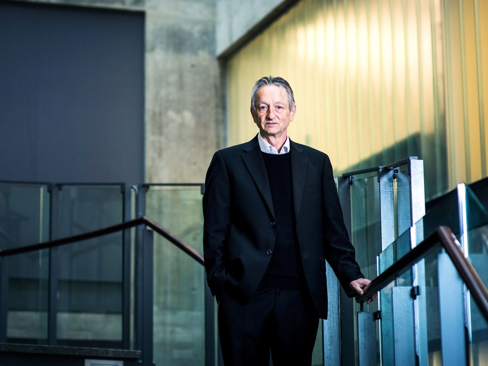
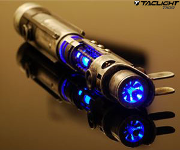

Google’s Artificial-Intelligence Wizard Unveils a New Twist on Neural Networks

[Tom Simonite](https://www.wired.com/contributor/tom-simonite?intcid=inline_amp),

11.01.17 7:00 AM

# Google’s AI Wizard Unveils a New Twist on Neural Networks

AARON VINCENT ELKAIM/Redux

If you want to blame someone for the hoopla around artificial intelligence, 69-year-old Google researcher Geoff Hinton is a good candidate.

The droll University of Toronto professor jolted the field onto a new trajectory in October 2012. With two grad students, Hinton showed that an unfashionable technology he’d championed for decades called artificial neural networks permitted a huge leap in machines’ ability to understand images. Within six months, all three researchers [were on Google’s payroll](https://www.wired.com/2013/03/google_hinton/?intcid=inline_amp). Today neural networks [transcribe our speech](https://www.wired.com/2013/02/android-neural-network/?intcid=inline_amp), [recognize our pets](https://www.wired.com/2014/12/deep-learning-renormalization/?intcid=inline_amp), [and fight our trolls](https://www.wired.com/2017/08/instagram-kevin-systrom-wants-to-clean-up-the-internet?intcid=inline_amp).

But Hinton now belittles the technology he helped bring to the world. “I think the way we’re doing computer vision is just wrong,” he says. “It works better than anything else at present but that doesn’t mean it’s right.”

Ad

In its place, Hinton has unveiled another “old” idea that might transform how computers see---and reshape AI. That’s important because computer vision is crucial to ideas such as [self-driving cars](https://www.wired.com/story/mighty-ai-training-self-driving-cars/?intcid=inline_amp), and having [software that plays doctor](https://www.wired.com/2017/06/googles-ai-eye-doctor-gets-ready-go-work-india/?intcid=inline_amp).

Late last week, Hinton released [two](https://arxiv.org/abs/1710.09829)  [research papers](https://openreview.net/forum?id=HJWLfGWRb&noteId=HJWLfGWRb) that he says prove out an idea he’s been mulling for almost 40 years. “It’s made a lot of intuitive sense to me for a very long time, it just hasn’t worked well,” Hinton says. “We’ve finally got something that works well.”

Hinton’s new approach, known as capsule networks, is a twist on neural networks intended to make machines better able to understand the world through images or video. In one of the papers posted last week, Hinton’s capsule networks matched the accuracy of the best previous techniques on a standard test of how well software can learn to recognize handwritten digits.

In the second, capsule networks almost halved the best previous error rate on a test that challenges software to recognize toys such as trucks and cars from different angles. Hinton has been working on his new technique with colleagues Sara Sabour and Nicholas Frost at Google’s Toronto office.

Capsule networks aim to remedy a weakness of today’s machine-learning systems that limits their effectiveness. Image-recognition software in use today by Google and others needs a large number of example photos to learn to reliably recognize objects in all kinds of situations. That’s because the software isn’t very good at generalizing what it learns to new scenarios, for example understanding that an object is the same when seen from a new viewpoint.

Ad

To teach a computer to recognize a cat from many angles, for example, could require thousands of photos covering a variety of perspectives. Human children don’t need such explicit and extensive training to learn to recognize a household pet.

Hinton’s idea for narrowing the gulf between the best AI systems and ordinary toddlers is to build a little more knowledge of the world into computer-vision software. Capsules---small groups of crude virtual neurons---are designed to track different parts of an object, such as a cat’s nose and ears, and their relative positions in space. A network of many capsules can use that awareness to understand when a new scene is in fact a different view of something it has seen before.

Hinton formed his intuition that vision systems need such an inbuilt sense of geometry in 1979, when he was trying to figure out how humans use mental imagery. He first laid out a preliminary design for capsule networks in 2011. The fuller picture released last week was long anticipated by researchers in the field. “Everyone has been waiting for it and looking for the next great leap from Geoff,” says Kyunghyun Cho, a professor at NYU who works on image recognition.

[(L)](https://www.wired.com/story/meet-the-high-schooler-shaking-up-artificial-intelligence?intcid=inline_amp)

Artificial Intelligence

[Meet the High Schooler Shaking Up Artificial Intelligence](https://www.wired.com/story/meet-the-high-schooler-shaking-up-artificial-intelligence?intcid=inline_amp)

[(L)](https://www.wired.com/story/googles-new-street-view-cameras-will-help-algorithms-index-the-real-world?intcid=inline_amp)

Artificial intelligence

[Google's New Street View Cameras Will Help Algorithms Index The Real World](https://www.wired.com/story/googles-new-street-view-cameras-will-help-algorithms-index-the-real-world?intcid=inline_amp)

[(L)](https://www.wired.com/story/machines-taught-by-photos-learn-a-sexist-view-of-women?intcid=inline_amp)

Machine bias

[Machines Taught by Photos Learn a Sexist View of Women](https://www.wired.com/story/machines-taught-by-photos-learn-a-sexist-view-of-women?intcid=inline_amp)

It’s too early to say how big a leap Hinton has made—and he knows it. The AI veteran segues from quietly celebrating that his intuition is now supported by evidence, to explaining that capsule networks still need to be proven on large image collections, and that the current implementation is slow compared to existing image-recognition software.

Ad

England Residents: We Suggest You To Carry This At All Times

Hinton is optimistic he can address those shortcomings. Others in the field are also hopeful about his long-maturing idea.

Roland Memisevic, cofounder of image-recognition startup Twenty Billion Neurons, and a professor at University of Montreal, says Hinton’s basic design should be capable of extracting more understanding from a given amount of data than existing systems. If proven out at scale, that could be helpful in domains such as healthcare, where image data to train AI systems is much scarcer than the large volume of selfies available around the internet.

In some ways, capsule networks are a departure from a recent trend in AI research. One interpretation of the recent success of neural networks is that humans should encode as little knowledge as possible into AI software, and instead make them figure things out for themselves from scratch. Gary Marcus, a professor of psychology at NYU who [sold an AI startup](https://www.wired.com/2016/12/uber-buys-mysterious-startup-make-ai-company/?intcid=inline_amp) to Uber last year, says Hinton’s latest work represents a welcome breath of fresh air. Marcus [argues](https://wp.nyu.edu/consciousness/innate-ai/) that AI researchers should be doing more to mimic how the brain has built-in, innate machinery for learning crucial skills like vision and language. “It’s too early to tell how far this particular architecture will go, but it’s great to see Hinton breaking out of the rut that the field has seemed fixated on,” Marcus says.

**UPDATED, Nov. 2, 12:55 PM:** This article has been updated to include the names of Geoff Hinton's co-authors.

- #[artificial intelligence](https://www.wired.com/tag/artificial-intelligence?intcid=inline_amp)
- #[neural networks](https://www.wired.com/tag/neural-networks?intcid=inline_amp)
- #[machine learning](https://www.wired.com/tag/machine-learning?intcid=inline_amp)
- #[computer vision](https://www.wired.com/tag/computer-vision?intcid=inline_amp)
- #[Google](https://www.wired.com/tag/google?intcid=inline_amp)