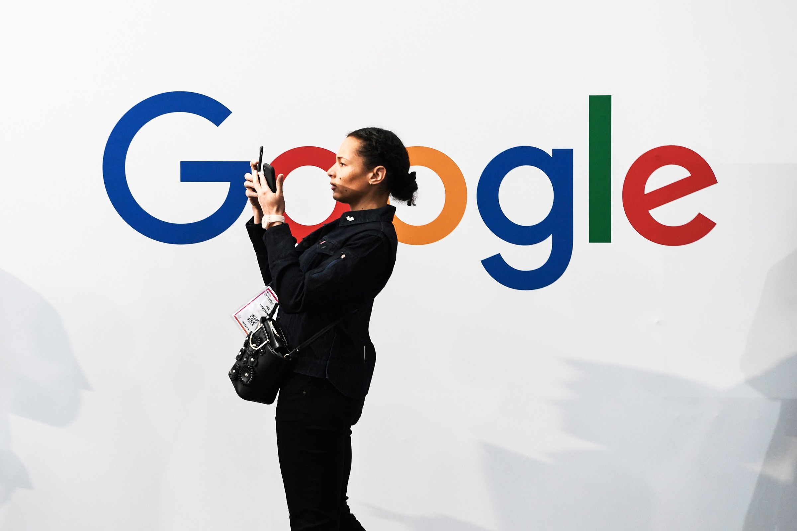

Google’s Big .New Thing Is Here to Simplify Your Life

[Brian Barrett](https://www.wired.com/contributor/brian-barrett)
[Gear](https://www.wired.com/category/gear)
10.29.2019 09:00 AM

# Google's .New Shortcuts Are Now for Everyone

Want to start a playlist, make a dinner reservation, or post code to Github? Try something .new

​Photograph: ALAIN JOCARD/Getty Images

- 
- 
- 

A year ago, Google introduced one of those time-saving tricks that makes the cold, relentless march of time just a little bit more bearable: You could suddenly create a new Google doc simply by [typing **doc.new** into your URL bar](https://www.wired.com/story/google-docs-doc-dot-new/). Ditto spreadsheets, calendar events, and other Google-specific tasks. Now Google’s making that small magic available to the rest of the internet as well.

As promised, Google has started the process of opening up its .new-powered shortcuts to the broader web. That includes a handful of select sites that have already implemented it, a few of which promise to be immediately life-changing depending on your specific needs. Want to start a new Spotify playlist? That’s [**playlist.new**](https://playlist.new/). List a widget on eBay? Try [**sell.new**](https://sell.new/). Github repository? Welcome to [**repo.new**](https://repo.new/). (Those two aren't live yet, but coming soon.) And in a lightly recursive touch, you can make new shortened links with Bitly at the very short new link [**link.new**](https://link.new/).

That’s just a sample of Google’s first dozen outside .new domain denizens. Open season for the rest of the web fast approaches. Trademark owners can register those names with a .new domain now through January 14 of next year. And starting December 2, anyone can apply for their own .new during Google’s Limited Registration Period.

As far as land grabs go, the pursuit of .new domains will be pretty structured. As noted above, Google already hand-picked the first registrants; it’s allowed to dole out up to 100 total at its discretion before broadening the field. And once the general public can apply, Google will vet entrants to make sure that they intend to use .new as intend: for “action generation or online creation flows,” as the company’s [policy page](https://www.registry.google/policies/registration/new/#!/) puts it. In other words, sending people to a .new address online has to save them a step. The only exception is if they have to get through a sign-in page first.

At a glance, the proliferation of .new sites will mean a bunch of handy new shortcuts. Fun! But it also represents an interesting shift in how you expect certain aspects of the web to act. “Right now we see [domains] as gateways to the web, bringing people to these static pages,” said Google program manager Stephanie Duchesneau at [a summit](https://icann.zoom.us/recording/play/0kxpJNAElEkYFTQhg2vj1_xtzOYfxZXtwjgtrmLEvt5Mp24rhznGLQuSEtNqN0hP) hosted by the Internet Corporation for Assigned Names and Numbers this spring. “But we really wanted the domain to be doing even more work.”

ICANN has steadily added top level domains to the web over the decades. But historically, new entrants like .biz and .porn have acted as signposts at best, categorizations rather than calls to action. Google’s use of .new inverts that experience. It indicates an action rather than a classification, and reorients your relationship with the internet in a way that’s subtle but impactful. “Even one single domain name, if it’s being used in frequency and it reflects a core part of someone’s life, can generate a lot of utility,” Duchesneau continued.

Every .new site also has to [incorporate HTTPS](https://www.wired.com/2016/04/hacker-lexicon-what-is-https-encryption/), meaning the connection is encrypted between your browser and the server. That’s no surprise given [Google’s years-long, largely successful push](https://www.wired.com/story/google-chrome-https-not-secure-label/) to [make HTTPS mainstream], but it’s a welcome requirement, given the assurance it provides that [outside snoops won’t be looking](https://www.wired.com/story/hotel-airport-wifi-safe/) at your embarrassing **playlist.new** of slow jams. (How it fits in with Google’s broader ambitions to [kill the URL](https://www.wired.com/story/google-wants-to-kill-the-url/) in Chrome remains to be seen.)

There’s room to quibble here, especially if you’re a site that wouldn’t have minded a shot at one of the domains that’s already spoken for. Similarly, anyone who doesn’t use Stripe might be disappointed to find that **[invoice.new](http://invoice.new/)** take them there, rather than the platform of their choice. And Google’s role as a registrar causes some broader concerns. “Given the size of Google there could be some potential anti-competitive issues that might arise down the road,” says Allesandra de Santillana, a spokesperson for the nonprofit Internet Society.

For now, though, Google’s following all the right procedures. And while that involves picking a few early winners, that still seems preferable to ceding .new to a bunch of profiteering squatters. And most of all, the broader use of the .new domain will make your life online a little bit easier. How often can you say that about anything?

* * *

### More Great WIRED Stories

- Neil Young’s adventures [on the hi-res frontier](https://www.wired.com/story/neil-young/?itm_campaign=BottomRelatedStories_Sections_2)
- A new Crispr technique could fix [almost all genetic diseases](https://www.wired.com/story/a-new-crispr-technique-could-fix-many-more-genetic-diseases/?itm_campaign=BottomRelatedStories_Sections_2)
- The quest to get photos of the [USSR's first space shuttle](https://www.wired.com/story/jonk-buran-photo-gallery/?itm_campaign=BottomRelatedStories_Sections_2)
- The death of cars [was greatly exaggerated](https://www.wired.com/story/death-cars-greatly-exaggerated/?itm_campaign=BottomRelatedStories_Sections_2)
- Why one secure platform [passed on two-factor authentication](https://www.wired.com/story/keybase-two-factor-authentication/?itm_campaign=BottomRelatedStories_Sections_2)
- Prepare for the [deepfake era of video](https://www.wired.com/story/prepare-deepfake-era-web-video/?itm_campaign=BottomRelatedStories_Sections_2); plus, check out the [latest news on AI](https://www.wired.com/category/business/artificial-intelligence/?itm_campaign=BottomRelatedStories_Sections_2)
- ✨ Optimize your home life with our Gear team’s best picks, from [robot vacuums](https://www.wired.com/gallery/best-robot-vacuums/?itm_campaign=BottomRelatedStories) to [affordable mattresses](https://www.wired.com/gallery/best-mattresses/?itm_campaign=BottomRelatedStories) to [smart speakers](https://www.wired.com/gallery/best-google-speakers-buying-guide/?itm_campaign=BottomRelatedStories).

Most Popular

- [(L)](https://www.wired.com/story/apple-airpods-pro/#intcid=recommendations_wired-right-rail-popular_8defc7a1-e43c-46fd-8073-839bee9521ab_cral-top3-1)

Gear

[ Apple Reveals $250 Noise-Canceling AirPods Pro](https://www.wired.com/story/apple-airpods-pro/#intcid=recommendations_wired-right-rail-popular_8defc7a1-e43c-46fd-8073-839bee9521ab_cral-top3-1)

Lauren Goode

- [(L)](https://www.wired.com/story/whats-blockchain-good-for-not-much/#intcid=recommendations_wired-right-rail-popular_8defc7a1-e43c-46fd-8073-839bee9521ab_cral-top3-1)

Business

[ What's Blockchain Good for, Anyway? For Now, Not Much](https://www.wired.com/story/whats-blockchain-good-for-not-much/#intcid=recommendations_wired-right-rail-popular_8defc7a1-e43c-46fd-8073-839bee9521ab_cral-top3-1)

Gregory Barber

- [(L)](https://www.wired.com/story/untold-story-2018-olympics-destroyer-cyberattack/#intcid=recommendations_wired-right-rail-popular_8defc7a1-e43c-46fd-8073-839bee9521ab_cral-top3-1)

Security

[ Inside Olympic Destroyer, the Most Deceptive Hack in History](https://www.wired.com/story/untold-story-2018-olympics-destroyer-cyberattack/#intcid=recommendations_wired-right-rail-popular_8defc7a1-e43c-46fd-8073-839bee9521ab_cral-top3-1)

Andy Greenberg and Excerpt

- 

Sponsor Content

 [  ### 9 Hotel Bars Shaking Up Cocktails with Culture](https://www.cntraveler.com/branded/article/cnt/9-hotel-bars-shaking-up-cocktails-with-culture?intcid=polar&utm_source=polar&utm_medium=nativetile)

Conrad Hotels & Resorts

- [(L)](https://www.wired.com/story/californias-wildfires-are-the-doom-of-our-own-making/#intcid=recommendations_wired-right-rail-popular_8defc7a1-e43c-46fd-8073-839bee9521ab_cral-top3-1)

Science

[ California’s Wildfires Are the Doom of Our Own Making](https://www.wired.com/story/californias-wildfires-are-the-doom-of-our-own-making/#intcid=recommendations_wired-right-rail-popular_8defc7a1-e43c-46fd-8073-839bee9521ab_cral-top3-1)

Matt Simon