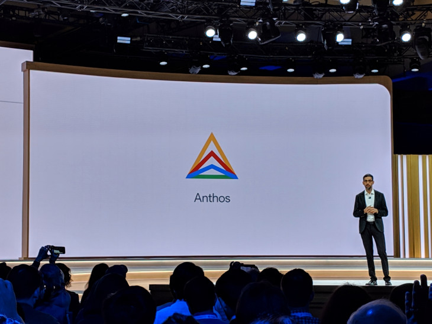
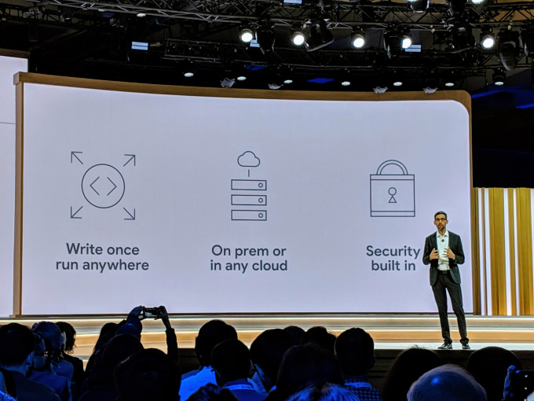
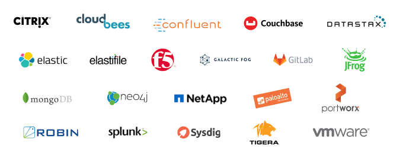

Google’s hybrid cloud platform is coming to AWS and Azure – TechCrunch

# Google’s hybrid cloud platform is coming to AWS and Azure

[Frederic Lardinois](https://techcrunch.com/author/frederic-lardinois/)[@fredericl](https://twitter.com/fredericl) / 1 month ago

[Google’s i](https://crunchbase.com/organization/google) Cloud Services Platform for managing hybrid clouds that span on-premise data centers and the Google cloud is coming out of beta today. The company is also changing the product’s name to Anthos, a name that either refers to a lost [Greek tragedy](https://en.wikipedia.org/wiki/Anthos_(play)), the name of an obscure god in the [Marvel universe](https://en.wikipedia.org/wiki/Anthos_(play)) or rosemary. That by itself would be interesting, but minor news. What makes this interesting is that Google also today announced that Anthos will run on third-party clouds, as well, including AWS and Azure.

“We will support Anthos and AWS and [Azure i](https://crunchbase.com/organization/azure) as well, so people get one way to manage their application and that one way works across their on-premise environments and all other clouds,” Google’s senior VP for its technical infrastructure, Urs Hölzle, explained in a press conference ahead of today’s announcement.

So with Anthos, Google will offer a single managed service that will let you manage and deploy workloads across clouds, all without having to worry about the different environments and APIs. That’s a big deal and one that clearly delineates Google’s approach from its competitors’. This is Google, after all, managing your applications for you on AWS and Azure.

“You can use one consistent approach — one open-source based approach — across all environments,” Hölzle said. “I can’t really stress how big a change that is in the industry, because this is really the stack for the next 20 years, meaning that it’s not really about the three different clouds that are all randomly different in small ways. This is the way that makes these three cloud — and actually on-premise environments, too — look the same.”

Anthos/Google Cloud Services Platform is based on the Google [Kubernetes i](https://crunchbase.com/organization/kubernetes) Engine, as well as other open-source projects like the Istio service mesh. It’s also hardware agnostic, meaning that users can take their current hardware and run the service on top of that without having to immediately invest in new servers.

Why is Google doing this? “We hear from our customers that multi-cloud and hybrid is really an acute pain point,” Hölzle said. He noted that containers are the enabling technology for this but that few enterprises have developed a unifying strategy to manage these deployments and that it takes expertise in all major clouds to get the most out of them.

Enterprises already have major investments in their infrastructure and created relationships with their vendors, though, so it’s no surprise that Google is launching Anthos with more than 30 major hardware and software partners that range from Cisco to Dell EMC, HPE and VMware, as well as application vendors like Confluent, Datastax, Elastic, Portworx, Tigera, Splunk, GitLab, MongoDB and others.

[Robin.io](https://robin.io/), a data management service that offers a hyper-converged storage platform based on Kubernetes, also tells me that it worked closely with Google to develop the Anthos Storage API. “Robin Storage offers bare metal performance, powerful data management capabilities and Kubernetes-native management to support running enterprise applications on Google Cloud’s Anthos across on-premises data centers and the cloud,” said Premal Buch, CEO of Robin.io.

Anthos is a subscription-based service, with the list prices starting at $10,000/month per 100 vCPU block. Enterprise prices will then be up for negotiation, though, so many customers will likely pay less.

It’s one thing to use a service like this for new applications, but many enterprises already have plenty of line-of-business tools that they would like to bring to the cloud as well. For them, Google is launching the first beta of Anthos Migrate today. This service will auto-migrate VMs from on-premises or other clouds into containers in the Google Kubernetes Engine. The promise here is that this is essentially an automatic process and once the container is on Google’s platform, you’ll be able to use all of the other features that come with the Anthos platform, too.

Google’s Hölzle noted that the emphasis here was on making this migration as easy as possible. “There’s no manual effort there,” he said.

[## Disrupt SF 2019](https://techcrunch.com/events/disrupt-sf-2019/?ref=rightrailpromo#tickets)

[48 Hour Flash Sale Happening Now](https://techcrunch.com/events/disrupt-sf-2019/?ref=rightrailpromo#tickets)

San FranciscoOct 2 - 4

[Get Passes Now](https://techcrunch.com/events/disrupt-sf-2019/?ref=rightrailpromo#tickets)

