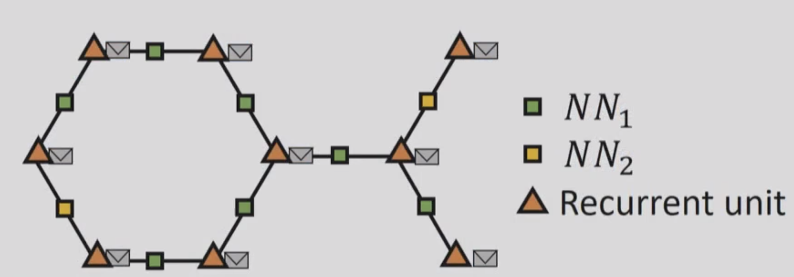
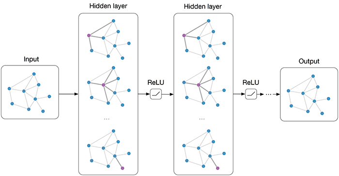

Graph Neural Networks - An overview | AI Summer

# Graph Neural Networks: An overview

Over the past decade, we’ve seen that Neural Networks can perform tremendously well in structured data like images and text. Most of the popular models like convolutional networks, recurrent, autoencoders work very well on data that have a tabular format like a matrix or a vector. But what about unstructured data? What about Graph data? Is there a model that can learn efficiently from them? Probably you guessed it from the title. The answer is Graph Neural Networks.

Graph Neural Networks were introduced back in 2005 (like all the other good ideas) but they started to gain popularity in the last 5 years. The GNNs are able to model the relationship between the nodes in a graph and produce a numeric representation of it. The importance of GNNs is quite significant because there are so many real-world data that can be represented as a graph. Social networks, chemical compounds, maps, transportation systems to name a few. So let’s find out the basic principles behind GNNs and why they work.

Let’s define our basic problem first: We want to map a given graph to a single label, which can be a numeric value, a class or whatever really. In other words:

>
>
>
> F ( Graph ) = embedding
>

And we want to find the function F. For example, imagine that each graph is a chemical compound or a molecule and the label is the likelihood that this molecule can be used to produce a certain drug. If we have a way to extract the label from every graph, we essentially found a way to predict which molecules are more likely to be used in a drug. Cool, right?

How do we do this? We already know a type of Neural Network that can be used on Graphs (sort of). If you think about it, recurrent neural networks can operate on a special type of graph. A chained graph (This a graph that is basically a line). Time series are actually chained graphs, where each timestamp is a node followed by the next timestamp.

So, in fact, we can build a network where each graph node is a recurrent unit (LSTM or something else) and the information of the node is an embedding that will be transferred through the chain (like a message). And because the units are all recurrent, the information won’t be lost when the embedding travels through the graph. It is our familiar Recurrent neural networks. Exactly the same as the ones used in language translation and the other natural language processing applications.

We can of course extend this idea to proper graphs and we get this:

>
>
>

> [> Graph neural networks: Variations and applications](https://www.youtube.com/watch?v=cWIeTMklzNg)

>

This slide is taken from an awesome [talk](http://talk/) about GNNs by Microsoft Research. Let’s see for a moment what is going on here.

Each orange triangle used to be graph node and it’s now replaced by a recurrent unit. The envelopes represent the embeddings of the nodes that will travel through the graph. Each graph edge is also replaced by a Neural network to capture the information of the edge (its weight).

Now for the learning part. At a single time step, each node pulls the embedding from all its neighbors, calculates their sum and passes them along with its embedding to the recurrent unit, which will produce a new embedding. This new embedding contains the information of the node plus the information of all the neighbors. In the next time step, it will also contain the information of its second-order neighbors. And so on and so on. The process continues until every node knows about all the other nodes in the graph.  Each one of the embeddings has now information from all the other nodes. The final step is to collect all embeddings and add them, which will give us a single embedding for the whole graph.

>
>
>
> [https://tkipf.github.io/graph-convolutional-networks/
>

That’s it. We did it. We manage to capture the whole graph in a single embedding. This embedding can now be used in some other model to perform some classification, prediction, clustering whatever. Let your imagination wander.

If you want to experiment with Graph Neural Networks, I got you covered:

- [deepmind/graph_nets: Build Graph Nets in Tensorflow](https://github.com/deepmind/graph_nets)

- [rusty1s/pytorch_geometric: Geometric Deep Learning Extension Library for PyTorch](https://github.com/rusty1s/pytorch_geometric)

- [Deep Graph Library](https://www.dgl.ai/)

I would personally go with the third one since it has better documentation but is your choice.

Here you go. Ta-ra lad.