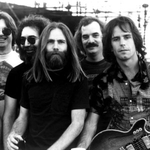
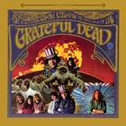

Grateful Dead: May 1977: Get Shown the Light Album Review | Pitchfork

##

- [Grateful Dead](http://pitchfork.com/artists/5843-grateful-dead/)

# May 1977: Get Shown the Light

- Rhino

• 2017
9.0
Best new reissue

- by [Jesse Jarnow](http://pitchfork.com/staff/jesse-jarnow/)

Contributor

- /[Rock](http://pitchfork.com/reviews/albums/?genre=rock)

May 6 2017
-
-
-

Hailed often as the Dead’s best shows of their career, this massive box set showcases the band at their tightest and most accessible—it’s perfect for beginners and lifelong Deadheads alike.

While nearly every Grateful Dead freak has an opinion on the matter, [the Dead](http://pitchfork.com/artists/5843-grateful-dead/)’s May 8, 1977 show at Cornell University’s Barton Hall has achieved the unofficial status as their best show ever. Regularly topping collector polls in fan bible DeadBase, Barton Hall has been added to the Library of Congress’ National Recording Registry, remixed in 5.1 surround sound by audiophile tapers, pressed to vinyl in the recent bootleg LP revival, replicated by cover bands (and released as a live album in its own right), and earned its own truther conspiracy theory, all before the show’s first official release, just in time for its 40th anniversary.

With Cornell’s 25-minute “Scarlet Begonias” into “Fire in the Mountain” as a joyous centerpiece, a pristine-sounding 11-CD/10-plus hour/four-show box set extravaganza finally elevates the mythical 5/8/77 from the long-existing Deadhead trading network to the officially streaming ecosystem. Though Cornell ’77 is neither the Dead’s most adventurous nor creative performance, it also remains arguably the Best Ever for several enduring reasons. Perhaps chief among them is that it is live Grateful Dead at its most accessible, with the Dead sounding vivid and tight and full of pep, characteristics shared by all four shows on *May 1977: Get Shown the Light*. Compared to most Grateful Dead shows, Cornell ’77 (and its chronological neighbors) are excellent places for (some) newbie listeners to start.

Though an ongoing critical reassessment of the Dead has been based on their woolly psychedelic jam experiments of the ’60s and sweeping Americana of the early ’70s, the revered May 1977 model was perhaps the most conservative of the band’s long career. Those hoping to find evidence of the boundary-pushing Acid Testers should first seek recordings from earlier eras, but those looking to appreciate where those boundaries settled will find them here. It’s a conservatism some Dead freaks can’t abide, their interests fading in parallel with the band’s sense of serious exploration. Cracking only short windows into open-ended jamming, the band had put their psychedelic space opus “Dark Star” on ice during their year-and-a-half touring hiatus in 1975, and quickly abandoned the fusion experiments of that year’s *Blues For Allah*. While still containing the core band that regularly went on extended free improv tangents a half-decade earlier, the return of second drummer Mickey Hart set the course for the arena thunder that would follow. [Jerry Garcia](http://pitchfork.com/artists/22079-jerry-garcia/)’s voice still retained much of its youthful sweetness, and—key for casual listeners—the second-set anchoring “drumz/space” jam hadn’t been invented yet.

Even more crucially, in spring of 1977, the Dead had also just spent the early part of the year with [Fleetwood Mac](http://pitchfork.com/artists/6026-fleetwood-mac/) producer Keith Olsen, shaping what would become *Terrapin Station*, released that July. Olsen, who stayed on the road with the band for late-night/off-day mixing sessions until just before the box’s start, reportedly told the band’s two drummers to tighten up. They did. Though *Terrapin* wasn’t the hit that their new label boss Clive Davis of Arista Records wanted when he signed the band, Olsen’s influence was arguably even more important, the last piece feeding into perhaps their most legendary tour.

When the curtain rises on *Get Shown the Light*—on the 12th anniversary of the proto-Dead’s debut at a Menlo Park pizza parlor—the Dead sound ebullient as they crack into [Chuck Berry](http://pitchfork.com/artists/5674-chuck-berry/)’s “The Promised Land.” Almost inadvertently, the band created a new kind of greatest hits album on every night of the spring ’77 tour, churning out different combinations of classics and concise jams, plus a small handful of new songs. The result was a much-loved conceptual box set available for years exclusively via the Deadheads’ non-commercial alternative distribution network of tape traders. Instead of one mainstream smash, Keith Olsen yielded the band many more underground hits. And counting *Get Shown the Light*, 15 of the tour’s 30 shows have now been officially released.

Alternating songs led by guitarists Jerry Garcia and [Bob Weir](http://pitchfork.com/artists/22080-bob-weir/), the band virtually never worked from a setlist, though in 1977 they still occasionally repeated songs from show-to-show. Subsequently, *Get Shown the Light *winds up with four versions each of Weir’s brand new paranoid space-reggae jam “Estimated Prophet.” On the former, one can very clearly hear the Dead’s creative process unfolding. Over the first three nights, “Estimated Prophet” stands alone, as it had during the previous 15 versions since its February debut, Garcia’s Mu-Tron III pedal giving his quizzical solos a whoa-his-guitar-is-talkin’-to-me tone, surely translatable by some Deadheads. On the last night of the box though—May 9 at Buffalo’s Memorial Auditorium—Weir lets the rhythm tension slack, the band shifts easily and thrillingly into the time of no-time, and (too soon) segue into the decade-old triplet-powered improv vehicle “The Other One.” By the year’s end, “Estimated Prophet” had settled permanently into its new second set slot, its non-ending a portal for the band’s evolving second set jam suite.

The vast majority of the box showcases an improvisation of a different kind, though: the sound of the band changing slowly over time, fixed only temporarily as their 1977 selves. This is especially evident during the shorter songs of the first sets whose arrangements remained fairly constant from year to year. Introducing several albums worth of new material during Mickey Hart’s half-decade touring absence from the band, the band was still adjusting to his return. On Garcia favorites like “Bertha” and the traditional “Peggy-O” (both played all three nights besides Cornell), the band’s groove is in the process of shifting. The former’s barroom jaunt is taken over by a heavier two-drummer backbeat, the latter’s sparse ghost-folk is likewise taken over by a heavier two-drummer backbeat. It’s something of a motif. Elsewhere, as during the rippling and cresting “Mississippi Half-Step” at Boston Garden on May 7, the drummers create an even bigger sound for Garcia to ride.

To Deadheads, each of the four shows of *Get Shown the Light* has its own personality. Defined predominantly by the shows’ big jams and song suites, all the tiny long-term changes in the band’s complexion find their biggest outlet as they mix with the real-time creative decisions of the musicians. Like Cornell, New Haven’s second set centers around the then-new pairing of “Scarlet Begonias” and “Fire on the Mountain”, a 23-minute combination that opens into a quiet valley, tethered by Mickey Hart’s chattering cowbell and [the Allman Brothers](http://pitchfork.com/artists/14275-the-allman-brothers/)-like twin guitar figures Garcia and Weir use to climb out. May 7 in Boston builds a narrative around a rare triple-shot of Garcia songs, as the breezy hippie-jazz groove of “Eyes of the World” gives way to a brief-by-later-standards Mickey Hart/Billy Kreutzmann drum session before finding deep space in “The Wheel” and redemption in “Wharf Rat.” And Buffalo on May 9 (which many Deadheads prefer to Cornell) features a sharp reading of the tricky “Help on the Way”/”Slipknot!”/”Franklin’s Tower” suite, along with the aforementioned “Estimated Prophet” to open a sequence that works its way to one of the all-time great readings of Garcia’s soulful “Comes a Time,” itself capped by an ineffable, lyrical solo that builds from a duet with Keith Godchaux to a screaming crest and back to a tender quiet. Nearly all of it was music to make Deadheads and civilians alike dance and spin and twirl and noodle and get real high, primary purposes of these performances in their original context.

But Cornell really does carry an extra magic. There is the “Scarlet Begonias”/”Fire on the Mountain” pairing to begin the second set, of course, with its upper register [Phil Lesh](http://pitchfork.com/artists/22081-phil-lesh/) bass slides and the rising harmonized piano figure that extrapolates itself into a jam. But that’s far from all the wonders of Cornell ’77. Nothing supernovas into psychedelic cataclysm ala “Dark Star” or “Playing in the Band” from 8/27/72 (arguably a more worthy Best Ever, released as 2013’s *Sunshine Daydream*), but that’s okay, too. The music is less like the transportation of an LSD peak and more akin to the long, soft glow of a psilocybin comedown, veritably emitting an everything-in-its-right-place pronoia, where the universe conspires in one’s favor.

Besides driving Dead staples like “Brown Eyed Women” (one of the few songs to survive the two-drummer transition intact), the first set closes with a 16-minute “Dancing in the Street,” the disco’d up Motown cover sounding pretty goofy until, like most Dead songs, it turns into a platform for Garcia’s guitar to converse and weave. The back-half of the show features more of that in a 16-minute version of [Buddy Holly](http://pitchfork.com/artists/15153-buddy-holly/)’s “Not Fade Away”, an oldie that could sometimes run on autopilot as if Garcia’s guitar were simply reading the intergalactic phonebook. But at Cornell, Garcia luxuriates in bright themes, spinning off multi-colored yarns atop the drummers’ slow roll, the jam eventually flying into a no-time of its own. And what Cornell has especially that the other three shows of the box don’t (nor most of the shows in ’77) is “Morning Dew.” A folk cover the Dead adapted for their first album, the song was likewise the process of gradual improvisation, slowing from the uptempo 1967 arrangement to a dramatic showcase for Garcia, the sentiment of his voice and guitar interchangeable. At Cornell, the solo/jam rises from a troubled lover’s whisper to a life-affirming scream into the void, Garcia’s guitar fanning open into the song’s final refrain.

Hailed as a Deadhead favorite from the first fan-made recordings that began to circulate immediately after the show, Cornell’s legend only really began in the late 1980s, when a number of tapes recorded by former sound engineer (and Deadhead saint) Betty Cantor-Jackson were purchased from a storage locker auction by Deadheads. With the Dead themselves yet-uninterested in releasing archival live material, Deadheads restored and disseminated the recordings for free. The effect of the so-called Betty Boards was as if the band released dozens of high-quality vintage live albums simultaneously, almost unquestionably furthering the success the band achieved with “Touch of Grey” and *In the Dark*, their only top 10 single and album, in 1987. With its dashing performance, neither too weird nor too loose, Cornell became a dorm room staple. Only recently did the band acquire the master recordings, now able to put the show into the proper Dead canon.

Forty years later, Cornell serves as an artistic achievement in its own right, an assertion that an unofficial live recording could be just as enduring as a studio album, and just as important to the band’s popular success. Cornell ’77 and its surrounding tour now represent an almost Platonic ideal of the band, and almost certainly solidified the way Deadheads thought about the Dead.

And like many classic albums, the band created it under increasing stress. Both Lesh and Kreutzmann, the heart of the band’s rhythm section, wrote in their memoirs about their own isolating substance abuse problems that began during the band’s 1975 hiatus year. Jerry Garcia, as director of the far over-budget and overdue *Grateful Dead Movie* filmed at the band’s “farewell” shows in October 1974 and finally released in June 1977, had fallen into a heroin habit that would follow him until his death in 1995. In the spring of 1977, in part because of the financial chaos wreaked by the *Dead Movie*, the band had stripped his salary to $50 a week. He was starting to forget lyrics in ways he never had previously, too, and in the next years his prodigious songwriting output would dwindle, his voice would change, and the Grateful Dead would continue to evolve.

But in May of 1977, the Grateful Dead were just exactly perfect, a state they’d experienced before, and which many Deadheads would swear they never deviated from afterwards. And while those arguments might be valid for some segment of the Dead’s vast audience, Cornell and the spring of ’77 is one of the last places where one might find a consensus among listeners, before the Dead’s music transformed from something vaguely recognizable as mainstream rock into an even-more-secret language. After the tour, drummer Mickey Hart would crash his car, seriously injuring himself, and breaking the particular spell the Dead and Keith Olsen had cast on themselves earlier that year. It would be the last summer without a Dead tour until 1996. But May of 1977 is forever.

[Back to home](http://pitchfork.com/)

[Grateful Dead](http://pitchfork.com/artists/5843-grateful-dead/)

## More Album Reviews For [Grateful Dead](http://pitchfork.com/artists/5843-grateful-dead/)

- [     ## The Grateful Dead: 50th Anniversary Deluxe Edition       - by: Sam Sodomsky  /January 19 2017  At the time of their endearing-but-muddy self-titled debut, “San Francisco’s Grateful Dead” were already local legends, but no one quite knew what to do with them on record. ](http://pitchfork.com/reviews/albums/22733-the-grateful-dead-50th-anniversary-deluxe-edition/)