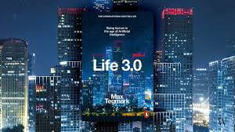
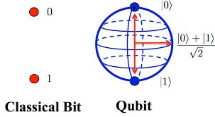

Great Scott! The Mad Scientists of Quantum Computing

# Great Scott! The Mad Scientists of Quantum Computing

## The movie director David Cronenberg famously said: ‘Everybody’s a mad scientist, and life is their lab.’ Though this may be an over exaggeration, it’s surely going to be the unique ones of the mind who will change our lives irrevocably in the coming years

[James Dargan](https://hackernoon.com/@JimDargan)
Jun 8·5 min read

### Quantum Hegemony

Quantum computers are here to stay if Norishige Morimoto is a reliable source. Only recently the global vice-president of IBM stated that his company will have [fully-functional commercial quantum computers within the next five years](https://www.digitimes.com/news/a20190523PD205.html). Big words from a man who apparently sees the realization of this happening once IBM achieves a level of performance called ‘quantum supremacy’. This is, in a word, when quantum machines will be able to perform much better than even the best supercomputers that exist in the world in a specific area.

These are big words and great promises, yet if they are realized, they will transform our world in ways we thought impossible to imagine.

Quantum supremacy is similar in context to the [Singularity](https://en.wikipedia.org/wiki/Technological_singularity) in AI theory. This watershed moment — whether it comes — can go either way of good or bad. The term in itself, ‘quantum supremacy’, denotes both progress and carnage at the same time.

Just think for a moment, if you will for a second, a time when quantum computers outperform the most advanced supercomputer we have ever built and, from it, we control how and what they can do for us. Helping mankind develop and tackle some of the conundrums of our very existence and how we are in the world, assisting us hopefully, in fields of intellectual disciplines that have baffled us since the very dawn of the scientific age — of quantum gravity and particle physics, wormholes, black holes, anti-matter, and lastly — so connected to what a quantum computer is anyway — quantum entanglement.

> ‘In less than ten years quantum computers will begin to outperform everyday computers, leading to breakthroughs in artificial intelligence, the discovery of new pharmaceuticals and beyond… The very fast computing power given by quantum computers has the potential to disrupt traditional businesses and challenge our cyber-security. **> Businesses need to be ready for a quantum future because it’s coming.’**

**> — **> Jeremy O’Brien, physicist

### Breakout

To say it will take a quantum computer to understand quantum entanglement to its fullest is an easy assumption to make, though it’s like asking who cuts the barber’s hair. Or what was first, the chicken or the egg? You will always get a different answer depending on whom you ask the question to. One thing is for certain, though, there’s a risk that what we create will go beyond our comprehension of it, initiating a ‘breakout’ when the exponential growth of qubit power in the quantum processor becomes too much for humans to handle.

Breakout is an AI theory, described in some detail in Swedish-American physicist and cosmologist Max Tegmark’s bestselling book [*Life 3.0*: *Being Human in the Age of Artificial Intelligence* chapter 4 *Intelligence Explosion?*](https://www.theguardian.com/books/2017/sep/22/life-30-max-tegmark-review), when the AI becomes too powerful for its creators and takes control. Tegmark discusses many scenarios of this, most of them rather doom-laden, though what I find interesting is how Tegmark’s predictions sit side by side with Morimoto’s quantum supremacy. The only difference is there is a shift from pure AI to quantum computers. However, if quantum computers become so powerful, won’t they possess AI anyway, or to even complicate things more, have at their core artificial general intelligence, (AGI), which is intelligence that can execute an intellectual operation that any human being can?

Max Tegmark’s book, a must read

If the mad scientists working on the IBM Q System One quantum computer and any others out there like Microsoft or Google in the tech sphere which believe the direction of AI’s in their hands, those with the big brains and bigger ambitions for the future of our species, shouldn’t they be careful about what they’re doing? The risk of all this, one way or another, is that egos can get in the way of altruistic intentions.

> ‘Quantum computing will answer fundamental questions about the origins of our universe.’

*> — Microsoft*

### Fifty-qubit Target

IBM’s progress in the field of quantum computers, which they claim has reached 20 qubits so far, while achieving — from a metric devised by the company called the ‘quantum volume’ — 16 qubits in real terms, taking into account the number of total qubits while examining the error rate of the system, is impressive.

Source: qoq.phys.strath.ac.uk

IBM’s analysis of this metric system has blown the theory of Moore’s Law on its back: they extrapolate the power of their quantum computer to double every twelve months, rather than every eighteen months to two years, as in Moore’s Law. If IBM’s declaration is true, it will lead us into a new era of technological development.

> ‘Here’s to the crazy ones, the misfits, the rebels, the troublemakers, the **> round pegs **> in the **> square holes**> … the ones who see things differently — they’re not fond of rules… You can quote them, disagree with them, glorify or vilify them, but the only thing you can’t do is ignore them because they change things…’

> — Steve Jobs

To achieve quantum supremacy, countless computer scientists and quantum physicists say the 50-qubit mark will have to be reached. Morimoto goes on to state that with his company’s current work, it shouldn’t be long before IBM has an operational quantum computer that is more powerful than any supercomputer on the planet. Once that is done, the commercialization process can begin in earnest.

From Stephen Wiesner’s initial theories in conjugate coding to Nike Dattani’s groundbreaking work in quantum master equations, these Dr. Emmett Browns of the quantum world along with dozens of others will, in one way or another, change our world in a manner that is going to influence how future generations live and understand the world around them.

Granted that IBM’s intentions are positive, and they are not advocating a real-world, corporate Skynet that loses control, then let us suppose Norishige Morimoto is the man we think he is, and what he and his corporate employee is looking to achieve will place us in a position to move humanity on to its future place in the universe.