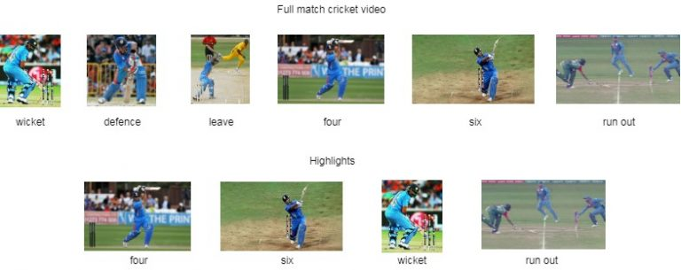
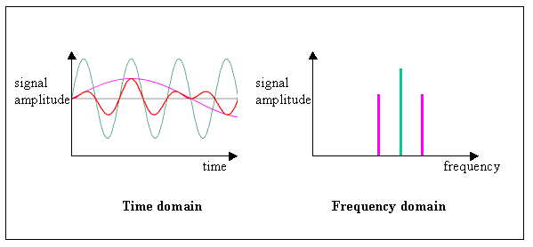
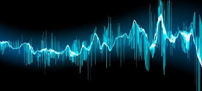
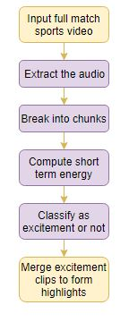
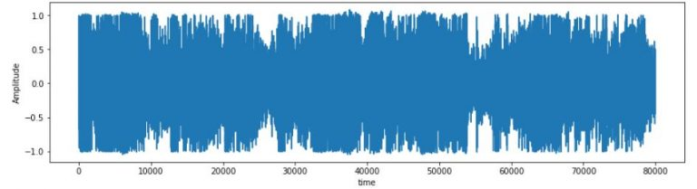
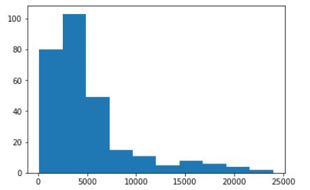
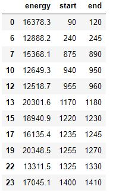
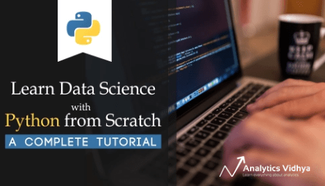
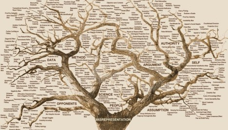

Guide to Automatic Highlight Generation in Python

[Machine Learning](https://www.analyticsvidhya.com/blog/category/machine-learning/)[Python](https://www.analyticsvidhya.com/blog/category/python-2/)

# Become a Video Analysis Expert: A Simple Approach to Automatically Generating Highlights using Python

[Aravind Pai](https://www.analyticsvidhya.com/blog/author/aravindpai/),September 9, 2019

[Login to Bookmark this article](https://id.analyticsvidhya.com/accounts/login/?next=https://www.analyticsvidhya.com/blog/2019/09/guide-automatic-highlight-generation-python-without-machine-learning/)

## **Overview**

- Build your own highlights package in Python using a simple approach
- That’s right – learn how automatic highlight generation works without using machine learning or deep learning!
- We will implement our own approach to automatic highlight generation using a full-length cricket match

## Introduction

I’m a huge cricket fan. I’ve been hooked to the game since I can remember and it still fuels my day-to-day routine. I’m sure a lot of you reading this will be nodding your head!

But ever since I started working full-time, keeping up with all the matches has been a tough nut to crack. I can only catch fleeting finishes to matches rather than the whole package. Or I have to follow along with text commentary – either way, it leaves me wanting more.

So the data scientist in me decided to do something about this. Was there a way I could put my [Python skills](http://courses.analyticsvidhya.com/courses/introduction-to-data-science?utm_source=blog&utm_medium=guide-automatic-highlight-generation-python-without-machine-learning) to use and cut out all the important parts of a match? I essentially wanted to create my own highlights package using Python.

Turns out, I didn’t even need to rely on machine learning or deep learning techniques to do it! And now, I want to share my learning (and code) with our community. Check out the below highlight package. This will give you a taste of what we will be building in this article using a simple speech analysis approach:

Awesome! l will discuss how I made this automatic highlight generation process so you can learn and apply it to any match (or any sport) that you want. Let’s get rolling!

*If you’re new to Python or need a quick refresher, make sure you check out our FREE course [here](http://courses.analyticsvidhya.com/courses/introduction-to-data-science?utm_source=blog&utm_medium=guide-automatic-highlight-generation-python-without-machine-learning).*

## Table of Contents

1. A Brief Introduction to Sports Video Highlights
2. Different Approaches to Automatic Highlight Generation
3. My Approach to Automatic Highlight Generation
4. Understanding the Problem Statement
5. Implementing Automatic Highlight Generation in Python

## A Brief Introduction to Sports Video Highlights

We’ve all seen highlights of sports matches at some point. Even if you don’t have an inclination towards sports, you’ll have come across highlights on the television while sitting in a restaurant, lounging in a hotel, etc.

**

> Highlight Generation is the process of extracting the most interesting clips from a sports video> .

**

You can think of this as a classic use case of video summarization. In video summarization, the full-length video is converted into a shorter format such that the most important content is preserved.

In cricket, the full match video contains actions like fours, sixes, wickets, and so on. The unedited version even captures uninteresting events too like defenses, leaves, wide balls, byes, etc.

Highlights, on the other hand, is where the adrenaline-rush kicks in. All the major talking points, like fours, sixes, and wickets – these combine to make the quintessential highlights package.

Extracting highlights manually from a full match video requires a lot of human effort. It is a time-consuming task and unless you work for a video company that does this job day in and day out, you need to find a different approach.

It is also memory-hogging to store a full match video. So, extracting highlights automatically from a full match video saves a lot of time for the creator as well as the user. And that is what we will discuss in this article.

## Different Approaches to Highlight Generation

There are different ways we can generate highlights, apart from the manual approach. Two common approaches we can use are – Natural Language Processing (NLP) and Computer Vision. Let’s briefly discuss how they work before we jump to my approach.

### Natural Language Processing (NLP) based approach

Think about this for a moment before you look at the steps below. How can you use NLP or a text-based approach to extract the important bits from a cricket match?

Here is a step-by-step procedure:

- Extract the audio from an input video
- Transcribe the audio to text
- Apply Extractive based Summarization techniques on text to identify the most important phrases
- Extract the clips of corresponding important phrases to generate highlights

### Computer Vision-based approach

This computer vision-based approach will come across as quite intuitive. Computer vision is, after all, the field where we train our machines to look at images and videos. So one way to generate highlights using computer vision is to track the scorecard continuously and extract clips only when there is a four, six or a wicket.

Can you think of any other approaches using either of these techniques? Let me know in the comments section below – I’m very interested in hearing your ideas.

## My Approach to Automatic Highlight Generation

AT this point, you might be wondering – we just spoke about two sub-fields of machine learning and deep learning. But the article heading and introduction suggest that we won’t be using these two fields. So can we really generate highlights without building models? Yes!

**

*> “Not every problem requires Deep Learning and Machine Learning. Most of the problems can be solved with a thorough understanding of the domain and the data.” **> – Sunil Ray*

**

I will discuss the concept of automatic highlight generation using **S****imple Speech Analysis**. Let’s discuss a few terminologies before moving on to the ultimate approach.

### What is Short Time Energy?

An audio signal can be analyzed in the time or frequency domain. In the time domain, an audio signal is analyzed with respect to the time component, whereas in the frequency domain, it is analyzed with respect to the frequency component:

**The energy or power of an audio signal refers to the loudness of the sound**. It is computed by the sum of the square of the amplitude of an audio signal in the time domain. When energy is computed for a chunk of an entire audio signal, then it is known as **Short Time Energy**.

Source: facto-facts.com
**

> The basic idea behind the solution is that in most sports, whenever an interesting event occurs, there is an increase in the commentator’s voice as well as the spectators’> .

**

Let’s take cricket for example. Whenever a batsman hits a boundary or a bowler takes a wicket, there is a rise in the commentator’s voice. The ground swells with the sound of the spectators cheering. We can use these changes in audio to capture interesting moments from a video.

Here is the step-by-step process:

- Input the full match video
- Extract the audio
- Break the audio into chunks
- Compute short-time energy of every chunk
- Classify every chunk as excitement or not (based on a threshold value)
- Merge all the excitement-clips to form the video highlights

## Understanding the Problem Statement

Cricket is the most famous sport in India and played in almost all parts of the country. So, being a die-hard cricket fan, I decided to automate the process of highlights extraction from a full match cricket video. Nevertheless, the same idea can be applied to other sports as well.

For this article, I have considered only the first 6 overs (PowerPlay) of the semi-final match between India and Australia at the T20 World Cup in 2007. You can watch the full match on YouTube [here](https://www.youtube.com/watch?v=lFq4eW9ewRE&t=2162s) and download the video for the first six overs from [here](https://drive.google.com/open?id=1FRODSq1dgp-JvUcXRALKjn6bvIu15gU6).

## Automatic Highlight Generation in Python

I have extracted the audio from the video with the help of a software called **WavePad Audio Editor**. You can download the audio clip from [here](https://drive.google.com/open?id=1FRODSq1dgp-JvUcXRALKjn6bvIu15gU6).

|     |     |
| --- | --- |
| 1   | filename='powerplay.wav' |
| 2   | import librosa |
| 3   | x, sr = librosa.load(filename,sr=16000) |

 [view raw](https://gist.github.com/aravindpai/a4eed5218847b3e493443c2ecae2d919/raw/2919ea90eec063246a7b146af2a543c45af60a29/read.py)  [read.py](https://gist.github.com/aravindpai/a4eed5218847b3e493443c2ecae2d919#file-read-py) hosted with  by [GitHub](https://github.com/)

We can get the duration of the audio clip in minutes using the code below:

|     |     |
| --- | --- |
| 1   | int(librosa.get_duration(x, sr)/60) |

 [view raw](https://gist.github.com/aravindpai/c7e09464124d4ed4393ad0a008689306/raw/bb1393c77cd59f405c2702ad8a55a336c5e12d64/duration.py)  [duration.py](https://gist.github.com/aravindpai/c7e09464124d4ed4393ad0a008689306#file-duration-py) hosted with  by [GitHub](https://github.com/)

Now, we will break the audio into chunks of 5 seconds each since we are interested in finding out whether a particular audio chunk contains a rise in the audio voice:

|     |     |
| --- | --- |
| 1   | max_slice=5 |
| 2   | window_length = max_slice * sr |

 [view raw](https://gist.github.com/aravindpai/ef20231ff0afdd1e3e4fb745b3432c04/raw/9e629497e001417752e7dab5f6a92a4082a5cebd/window.py)  [window.py](https://gist.github.com/aravindpai/ef20231ff0afdd1e3e4fb745b3432c04#file-window-py) hosted with  by [GitHub](https://github.com/)

Let us listen to one of the audio chunks:

|     |     |
| --- | --- |
| 1   | import IPython.display as ipd |
| 2   | a=x[21*window_length:22*window_length] |
| 3   | ipd.Audio(a, rate=sr) |

 [view raw](https://gist.github.com/aravindpai/053e582759de65a6b6b93b733e5bca02/raw/7168f8fe20079f249fec6a14bcff3ad6cfcd0101/listen.py)  [listen.py](https://gist.github.com/aravindpai/053e582759de65a6b6b93b733e5bca02#file-listen-py) hosted with  by [GitHub](https://github.com/)

Compute the energy for the chunk:

|     |     |
| --- | --- |
| 1   | energy =  sum(abs(a**2)) |
| 2   | print(energy) |

 [view raw](https://gist.github.com/aravindpai/5c27b1a678942d77841112af796c8bb3/raw/f1e08527bb2236b3465e6811a0e5f44cca2e7d9c/energy.py)  [energy.py](https://gist.github.com/aravindpai/5c27b1a678942d77841112af796c8bb3#file-energy-py) hosted with  by [GitHub](https://github.com/)

Visualize the chunk in the time-series domain:

|     |     |
| --- | --- |
| 1   | import matplotlib.pyplot as plt |
| 2   | fig = plt.figure(figsize=(14, 8)) |
| 3   | ax1 = fig.add_subplot(211) |
| 4   | ax1.set_xlabel('time') |
| 5   | ax1.set_ylabel('Amplitude') |
| 6   | ax1.plot(a) |

 [view raw](https://gist.github.com/aravindpai/027f86026d72a2909eb8b6e7b13cf25d/raw/c76b41adbb9ebd50804ae7d249c1e41f2f30adaf/viz.py)  [viz.py](https://gist.github.com/aravindpai/027f86026d72a2909eb8b6e7b13cf25d#file-viz-py) hosted with  by [GitHub](https://github.com/)

As we can see, the amplitude of a signal is varying with respect to time. Next, compute the Short Time Energy for every chunk:

|     |     |
| --- | --- |
| 1   | import numpy as np |
| 2   | energy = np.array([sum(abs(x[i:i+window_length]**2)) for i in  range(0, len(x), window_length)]) |

 [view raw](https://gist.github.com/aravindpai/444f30a17230b5b66b68644b9a5143f2/raw/e9ba2551eac60a75461f7147349da7448ac5faec/ste.py)  [ste.py](https://gist.github.com/aravindpai/444f30a17230b5b66b68644b9a5143f2#file-ste-py) hosted with  by [GitHub](https://github.com/)

Let us understand the Short Time Energy distribution of the chunks:

|     |     |
| --- | --- |
| 1   | import matplotlib.pyplot as plt |
| 2   | plt.hist(energy) |
| 3   | plt.show() |

 [view raw](https://gist.github.com/aravindpai/7dbee945b75af7eccf6e1933f2ae1f4d/raw/f16551a27a554800ea3d2bda8fcb10ee4206d7c0/distribution.py)  [distribution.py](https://gist.github.com/aravindpai/7dbee945b75af7eccf6e1933f2ae1f4d#file-distribution-py) hosted with  by [GitHub](https://github.com/)

The energy distribution is right-skewed as we can see in the above plot. We will choose the extreme value as the threshold since we are interested in the clips only when the commentator’s speech and spectators cheers are high.

Here, I am considering the threshold to be 12,000 as it lies on the tail of the distribution. Feel free to experiment with different values and see what result you get.

|     |     |
| --- | --- |
| 1   | import pandas as pd |
| 2   | df=pd.DataFrame(columns=['energy','start','end']) |
| 3   | thresh=12000 |
| 4   | row_index=0 |
| 5   | for i in  range(len(energy)): |
| 6   | value=energy[i] |
| 7   |  if(value>=thresh): |
| 8   | i=np.where(energy == value)[0] |
| 9   |    df.loc[row_index,'energy']=value |
| 10  |    df.loc[row_index,'start']=i[0] *  5 |
| 11  |    df.loc[row_index,'end']=(i[0]+1) *  5 |
| 12  |    row_index= row_index +  1 |

 [view raw](https://gist.github.com/aravindpai/aa7b4fa3959ffb8eb0445b75a4e45863/raw/9a17c2a6fbc791257b36e7ebf2a2f3b9c7964201/excitement.py)  [excitement.py](https://gist.github.com/aravindpai/aa7b4fa3959ffb8eb0445b75a4e45863#file-excitement-py) hosted with  by [GitHub](https://github.com/)

Merge consecutive time intervals of audio clips into one:

|     |     |
| --- | --- |
| 1   | temp=[] |
| 2   | i=0 |
| 3   | j=0 |
| 4   | n=len(df) -  2 |
| 5   | m=len(df) -  1 |
| 6   | while(i<=n): |
| 7   | j=i+1 |
| 8   |  while(j<=m): |
| 9   |  if(df['end'][i] == df['start'][j]): |
| 10  | df.loc[i,'end'] = df.loc[j,'end'] |
| 11  |      temp.append(j) |
| 12  |      j=j+1 |
| 13  |    else: |
| 14  | i=j |
| 15  |      break |
| 16  | df.drop(temp,axis=0,inplace=True) |

 [view raw](https://gist.github.com/aravindpai/17e40e9cd9778322161f59fff078e3a7/raw/d225726fea94c4374ba00aa2e3c4f84ce1fbfeeb/highlight.py)  [highlight.py](https://gist.github.com/aravindpai/17e40e9cd9778322161f59fff078e3a7#file-highlight-py) hosted with  by [GitHub](https://github.com/)

Extract the video within a particular time interval to form highlights. Remember – Since the commentator’s speech and spectators’ cheers increase only after the batsman has played a shot, I am considering only five seconds post every excitement clip:

|     |     |
| --- | --- |
| 1   | from moviepy.video.io.ffmpeg_tools import ffmpeg_extract_subclip |
| 2   | start=np.array(df['start']) |
| 3   | end=np.array(df['end']) |
| 4   | for i in  range(len(df)): |
| 5   |  if(i!=0): |
| 6   | start_lim = start[i] -  5 |
| 7   |  else: |
| 8   |  start_lim = start[i] |
| 9   | end_lim   = end[i] |
| 10  | filename="highlight"  +  str(i+1) +  ".mp4" |
| 11  |  ffmpeg_extract_subclip("powerplay.mp4",start_lim,end_lim,targetname=filename) |

 [view raw](https://gist.github.com/aravindpai/02140c23f8e0ca9c0baba1bb348fde42/raw/bbd67de2df355501ca08286eb81db2427def95b3/final.py)  [final.py](https://gist.github.com/aravindpai/02140c23f8e0ca9c0baba1bb348fde42#file-final-py) hosted with  by [GitHub](https://github.com/)

I have used online editors to merge all the extracted clips to form a single video. Here are the highlights generated from the PowerPlay using a simple speech analysis approach:

Congratulations on making it this far and generating your own highlight package! Go ahead and apply this technique to any match or sport you want. It might appear straightforward but it’s such a powerful approach.

## **End Notes**

The key takeaways from the article – have a thorough understanding of the domain as well as the data before getting into the model building process since it drives us to a better solution in most of the problems.

In this article, we have seen how to automate the process of highlight extraction from a full match sports video using simple speech analysis. I would recommend you to experiment in different sports too.

Liked the article? Want to share a different approach? Feel free to connect with me in the comments section below! And if you’re looking to learn Python, here’s a FREE course for you:

- [Python for Data Science](http://courses.analyticsvidhya.com/courses/introduction-to-data-science?utm_source=blog&utm_medium=guide-automatic-highlight-generation-python-without-machine-learning)

You can also read this article on Analytics Vidhya's Android APP 

### Share this:

- [Click to share on LinkedIn (Opens in new window)](https://www.analyticsvidhya.com/blog/2019/09/guide-automatic-highlight-generation-python-without-machine-learning/?share=linkedin&nb=1)
- [Click to share on Facebook (Opens in new window)](https://www.analyticsvidhya.com/blog/2019/09/guide-automatic-highlight-generation-python-without-machine-learning/?share=facebook&nb=1)
- [Click to share on Twitter (Opens in new window)](https://www.analyticsvidhya.com/blog/2019/09/guide-automatic-highlight-generation-python-without-machine-learning/?share=twitter&nb=1)
- [Click to share on Pocket (Opens in new window)](https://www.analyticsvidhya.com/blog/2019/09/guide-automatic-highlight-generation-python-without-machine-learning/?share=pocket&nb=1)
- [Click to share on Reddit (Opens in new window)](https://www.analyticsvidhya.com/blog/2019/09/guide-automatic-highlight-generation-python-without-machine-learning/?share=reddit&nb=1)

-

### Related Articles

#### [A Complete Python Tutorial to Learn Data Science from Scratch](https://www.analyticsvidhya.com/blog/2016/01/complete-tutorial-learn-data-science-python-scratch-2/)

January 14, 2016
In "Data Science"

#### [Here are 7 Data Science Projects on GitHub to Showcase your Machine Learning Skills!](https://www.analyticsvidhya.com/blog/2019/09/7-data-science-projects-github-showcase-your-skills/)

September 2, 2019
In "Data Science"

#### [A Complete Tutorial on Tree Based Modeling from Scratch (in R & Python)](https://www.analyticsvidhya.com/blog/2016/04/complete-tutorial-tree-based-modeling-scratch-in-python/)

April 12, 2016
In "Machine Learning"

Tags : [analytics in sports](https://www.analyticsvidhya.com/blog/tag/analytics-in-sports/),  [automatic highlight generation](https://www.analyticsvidhya.com/blog/tag/automatic-highlight-generation/),  [cricket highlights](https://www.analyticsvidhya.com/blog/tag/cricket-highlights/),  [speech analysis](https://www.analyticsvidhya.com/blog/tag/speech-analysis/),  [Sports analytics](https://www.analyticsvidhya.com/blog/tag/sports-analytics/),  [sports video highlights](https://www.analyticsvidhya.com/blog/tag/sports-video-highlights/),  [video summarization](https://www.analyticsvidhya.com/blog/tag/video-summarization/)

[*U* Next Article  ### WNS Analytics Wizard 2019: Top 3 Winners’ Solutions from our Biggest Data Science Hackathon](https://www.analyticsvidhya.com/blog/2019/09/wns-marketing-analytics-hackathon-top-3-inspiring-winning-solutions/)  *h*[*T* Previous Article  ### Everything you Should Know about p-value from Scratch for Data Science](https://www.analyticsvidhya.com/blog/2019/09/everything-know-about-p-value-from-scratch-data-science/)

### [Aravind Pai](https://www.analyticsvidhya.com/blog/author/aravindpai/)

 A curious and self-driven data scientist who is passionate about building data-driven products that ease the lives of people. Possess strong knowledge of Deep Learning and Natural Language Processing. Completing 5-year Integrated MSc Data Science at PSG College of Technology, Coimbatore.

- [*x*](https://www.linkedin.com/in/aravind-pai-57a1bb180/)
- [*I*](https://github.com/aravindpai)