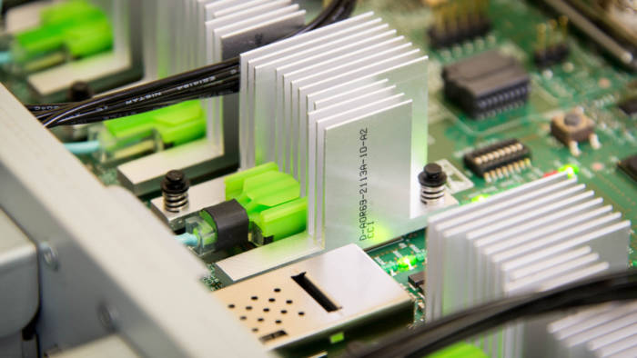
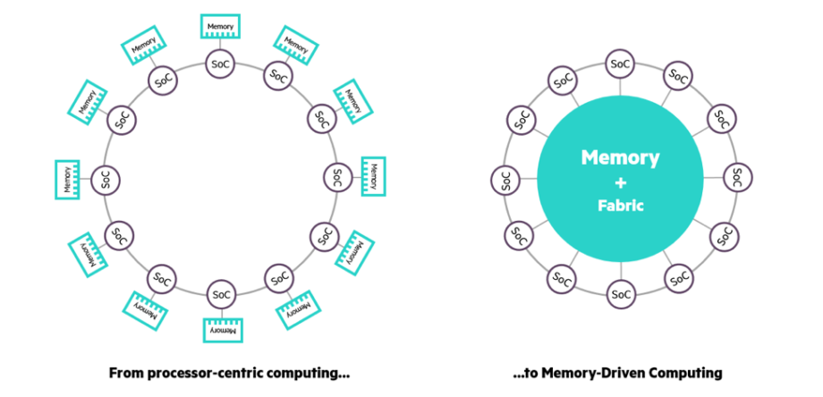
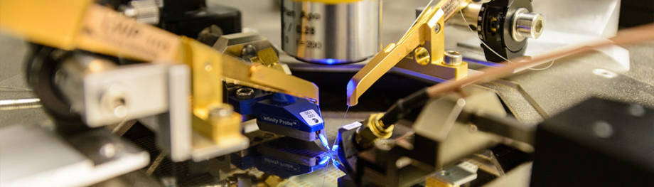
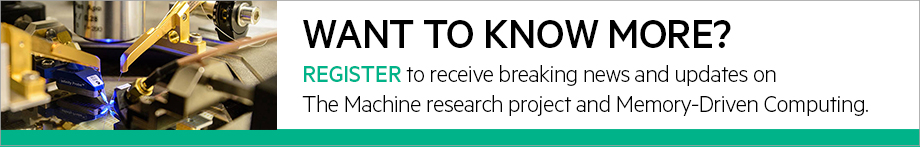
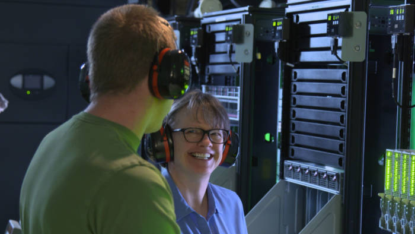

HPE Newsroom | HPE.com | Memory-Driven Computing Explained

# Memory-Driven Computing Explained

By Staff Writer•Blog Post
 

 [Share on Facebook  **  **](https://news.hpe.com/memory-driven-computing-explained/?jumpid=em_fmxp7ubt1k_aid-510285515#)  [Share on Twitter  **  **](https://news.hpe.com/memory-driven-computing-explained/?jumpid=em_fmxp7ubt1k_aid-510285515#)  [Share on LinkedIn  **  **](https://news.hpe.com/memory-driven-computing-explained/?jumpid=em_fmxp7ubt1k_aid-510285515#)  [Share via Email  **  **](https://news.hpe.com/memory-driven-computing-explained/?jumpid=em_fmxp7ubt1k_aid-510285515#)  [Print  **  **](#)  [Share via AddThis  **  **](https://news.hpe.com/memory-driven-computing-explained/?jumpid=em_fmxp7ubt1k_aid-510285515#)

 **  **
Highlight any text
to share immediately

 Hewlett Packard Enterprise (HPE) is an industry leading technology company that enables customers to go further, faster.

### In this article

- Why do we need Memory-Driven Computing, what is it and how does it work?
- [Register to receive breaking news and updates](https://news.hpe.com/register-to-stay-up-to-date-on-the-machine-research-project-and-memory-driven-computing/) on The Machine research project and Memory-Driven Computing

Understanding HPE’s vision for a new kind of computer designed for the big data era

We’re asking today’s computers to do jobs scientists couldn’t have envisioned 20 years ago, let alone 60 years ago at the dawn of the computer age. If we’re going to send humans to Mars, create data-driven cures for rare diseases and light up smart cities, we need a new paradigm that shifts processing from slow silicon to hyper-fast memory. We call this approach **Memory-Driven Computing** and we’re bringing it to life through **The Machine research project**, the largest and most complex research project in our company’s history.With Memory-Driven Computing we believe we can throw away 60 years of compromise to deliver an entirely new way of computing specifically designed for the big data era.

Around the world, the volume of available data is growing faster than our ability to process it and create insight. Think of the irony in that: At a time of unprecedented connectivity and technical prowess, many of us are flying blind.

Some will argue this isn’t news, and they’re right. Pundits have been predicting the end of Moore’s Law for years. The difference is, at Hewlett Packard Enterprise, we set out to solve the problem by reinventing the most basic functions of a computing system from the ground up. That effort, known as **The Machine research project**, aims to bring to life what we call **Memory-Driven Computing**. And, in November 2016, we delivered [a prototype](https://news.hpe.com/innovation-at-work-how-hpe-is-leading-the-future-of-memory-driven-computing/).

# Article Pull Quote

“We can throw away 60 years of compromise and deliver an entirely new way of computing.”

How does it work? Let’s start with the basics. Memory-Driven Computing sets itself apart by giving every processor in a system access to a giant shared pool of memory—a sharp departure from today’s systems where relatively small amounts of memory are tethered to each processor. The resulting inefficiencies limit performance.

For one processor to access data not held in its own memory, the computer must play an inefficient game of “Mother May I,” so to speak. One processor must request access from another processor to get anything accomplished. What’s worse, the relationship between storage and memory is also inefficient. In fact, in today’s computers it’s estimated that 90 percent of work is devoted to moving information between tiers of memory and storage.

At HPE, we think that should change. We want to give all the processors equal access to a big pool of shared memory, thereby eliminating all the back and forth, and we want to build this pool out of new types of non-volatile memory.

We want memory to be central to the system, not just something tethered to a processor. We believe Memory-Driven Computing is the solution.

**Non-volatile memory: **As mentioned above, the perfect memory for Memory-Driven Computing combines the best features of today’s memory and storage technologies. We want the speed of DRAM—which is used for “working” data in computers today, but the permanence—non-volatility—and low cost of Flash and hard drives. Another term for this approach that is growing in popularity is “storage class memory.”

 HPE is in the process of bringing byte-addressable NVM to market. Using technologies from The Machine research project, the company developed HPE Persistent Memory—a step on the path to byte-addressable non-volatile memory, which offers the performance of DRAM and battery-based persistence in a traditional DIMM form factor. The company launched HPE Persistent Memory in the HPE ProLiant DL360 and DL380 Gen9 servers.

**Fabric**: In this context, “fabric” refers to the communication vehicle that facilitates data transfer between the different elements of the computer system.

Today, each computer component is connected using a different type of interconnect: memory connects using DDR, hard drives via SATA, flash drives and graphics processing units via PCIe and so on.

Memory-Driven Computing takes a very different approach: Every component is connected using the same high-performance interconnect protocol. This is a much simpler and more flexible way to build a computer. One key reason it’s faster is that data is accessed one byte at a time using the same simple commands used to access memory: just “load” and “store.” This eliminates the necessity to move many large blocks of data around and is much more efficient.

The fabric is what ties physical packages of memory together to form the vast pool of memory at the heart of Memory-Driven Computing. The result of our fabric research is working in the prototype we announced in November. But we’re not the only people in the industry who see the necessity for a fast fabric. We’re contributing these findings to an industry-led consortium called [Gen-Z](https://news.hpe.com/gen-z-looks-to-ignite-it-innovation-with-open-high-performance-interconnect-technology/), which is tasked with developing an industry standard for this kind of technology. Now on to photonics.

**Photonics**: Current computer systems use electrons traveling in copper wire to transmit data between compute components. The problem is that there’s only so much data you can force down a copper wire, as much as 99 percent of the energy is lost through heat and cables are bulky.

The fix is to use light instead—a technology called photonics. Using microscopic lasers, we can funnel hundreds of times more data down an optic fiber ribbon using much less energy. The fibers are also tiny, making physical installation easier. In the latest prototype, we already replaced communications between computing boards (called nodes) with photonics interconnects. This approach allows us to more efficiently communicate larger amounts of data faster using less power and space.

Research into photonics and fabric will continue under The Machine research project, including work to translate these findings to an even smaller scale, such as into the transistors themselves.

**Ecosystem enablement (software)**: Even the most advanced hardware is useless without software. A completely new Memory-Driven Computing architecture is no different. We’ve written hundreds of thousands of lines of code to allow developers to harness the power of Memory-Driven Computing using familiar programming languages and a version of the ubiquitous Linux operating system, enhanced to “comprehend” the new architecture.

Much work has already been completed to help developers write applications for future Memory-Driven Computing systems. HPE launched a Hortonworks/Spark collaboration last year to bring software built for Memory-Driven Computing to market. In June 2016, the company also began releasing code packages on Github to begin familiarizing developers with programming on the new memory-driven architecture.

**Security**: As part of HPE’s research into Memory-Driven Computing, the company aims to transform how we think about security on today’s hardware. Traditionally, security is bolted onto the system, so to speak. With a new computer design comes new opportunities to embed security throughout software and hardware.

[With the prototype introduced last November](https://news.hpe.com/behind-the-scenes-of-the-machine-research-project/), HPE demonstrated the ability to embed security throughout the entire hardware and software. While this was a first step, HPE plans to further this work with new hardware security features in the next year, followed by new software security features rolling out over the next three years. Beginning in 2020, the company plans to bring these solutions together with additional security technologies currently in the research phase.

* * *

## Related News

 [Blog Post SAVE THE DATE: Making the Mission to Mars Compute](https://news.hpe.com/save-the-date-mission-to-mars-memory-driven-computing/)[Blog Post Meet the Innovators: The Men and Women Behind The Machine & Memory-Driven Computing](https://news.hpe.com/the-men-and-women-behind-the-innovation/)[Blog Post What Memory-Driven Computing Means for Your Industry](https://news.hpe.com/what-memory-driven-computing-means-for-your-industry/)