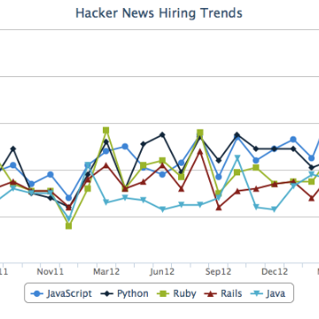

Hacker News Hiring Trends - Most Popular Programming Languages (April 2018)

Hacker News Hiring Trends - Most Popular Programming Languages (April 2018)

https://www.hntrends.com/2018/apr-golang-jumps-into-top-10.html?compare1=React&compare2=Polymer&compare3=Angular+2&compare4=vue#data

Most Popular programming languanges and software development technologies for April, 2018