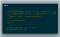
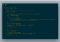
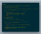

Hacking Google Cloud Run

# Hacking Google Cloud Run

[Aviv Laufer](https://blog.doit-intl.com/@avivl?source=post_page-----6eb410259a81----------------------)

[Oct 2](https://blog.doit-intl.com/hacking-google-cloud-run-to-run-long-background-tasks-6eb410259a81?source=post_page-----6eb410259a81----------------------) · 3 min read

*Opinionated take on how to use Google Cloud Run for functions that take longer than 10–15 minutes*

[Google Cloud Run](https://cloud.google.com/run/) is a managed compute platform that enables you to run stateless containers that are invocable via web requests or Cloud Pub/Sub events. Cloud Run is serverless: it abstracts away all infrastructure management, so you can focus on what matters most — building great applications. It is based on [Knative](https://cloud.google.com/knative/), and it let you choose to run your containers either fully managed, or in your own Google Kubernetes Engine cluster.

As a cloud architect at [DoiT International](http://www.doit-intl.com/), I get to work with many companies looking to move some of their workloads to serverless computing and I believe that in the near future more workloads will be to services such as Google Cloud Run.

Using Google Cloud Run however imposes a serious limitation — your tasks can run up to 15 minutes on the fully managed service or 10 minutes if you use Google Cloud Run on your own GKE cluster. Generally, this should not be a problem as most workloads do not require such a long processing time, however, for some workloads, this might be very limiting.

Lak Lakshmanan has recently published [a solution](https://medium.com/google-cloud/how-to-run-serverless-batch-jobs-on-google-cloud-ca45a4e33cb1) [1] for running background tasks using Google AI Platform, which can be an alternative to the ideas described in this article.

I spent some time exploring how I can use Google Cloud Run to run long background tasks, and here is what I have found.

***Disclaimer**** — this solution based on some assumptions and observations which are not guaranteed to always exist. The *[*code*](https://github.com/doitintl/long_john_silver/)* is not a production-grade quality but can serve as a framework to build a service that will run long background tasks.*

Here are my assumptions:

- As long as there are incoming requests, the Cloud Run will not shut down the container.
- The load balancer will distribute incoming requests equally between service instances.

I took advantage of a well-known pattern for running long requests using client-side polling. When a client requests an operation, the server will create a background worker and will respond with HTTP 202 code (accepted)

longTaskHandler

json response

worker code

The ‘href’ field is what the client should poll in order to get the operation status. The client will need to call this endpoint every few seconds in order to get the status of the job. That’s also making sure the instance is up.

taskStatusHandler

task status response

In order to support more than one Google Cloud Run instance, I had to have some sort of persistent layer in order to share the task statuses. Initially, my intent was to use the Google Cloud Memorystore [2], however, it is not yet accessible from the Google Cloud Run. Therefore, I am using Google Cloud Firestore [3] as a persistent layer.

In my experiments, I could run multiple background tasks for well over an hour. All of our tests were performed on the fully managed version of Google Cloud Run.

The full source code can be found [here](https://github.com/doitintl/long_john_silver/).

[1] https://medium.com/google-cloud/how-to-run-serverless-batch-jobs-on-google-cloud-ca45a4e33cb1 by Lak Lakshmanan.

[2] [https://cloud.google.com/memorystore](https://cloud.google.com/memorystore/)

[3] [https://cloud.google.com/firestore](https://cloud.google.com/firestore/)

Want more stories? Check our blog on [Medium](http://blog.doit-intl.com/), or [follow Aviv on Twitter](https://twitter.com/avivl).