Hacking the official Raspberry Pi keyboard: Build a battery-powered all-in-one Pi keyboard!

# Hacking the official Raspberry Pi keyboard: Build a battery-powered all-in-one Pi keyboard!

Talk about compact.

- by [Zach](https://howchoo.com/u/zach) (144)
- 45 minutes

I've long been fascinated with the compact simplicity of all-in-one computer/keyboards such as the Commodore 64. When the official Raspberry Pi keyboard was released, I knew what had to be done.

So I built a battery-powered all-in-one Raspberry Pi computer *inside* an [official Raspberry Pi keyboard](https://howchoo.com/g/nzy0ndy5zjm/official-raspberry-pi-keyboard-and-mouse) (well, I guess it isn't *technically* an all-in-one since it doesn't have a built-in monitor). In addition to a battery, I added a power LED and button so I'll know when the Pi was on and can safely turn it on and off.

The official Raspberry Pi mouse connects directly to the keyboard, giving you a super compact setup with a small footprint. Finally, the keyboard connects to the Pi externally via a small cable; this way, you can still use the keyboard with other computers as a normal keyboard!

I know there isn't much of a point in adding a battery since you still need to connect an HDMI cable -- but I still find it useful since I log into my Pi remotely all the time. Also, it's more fun this way and if you add a portable monitor... :)

In this guide, I'll show you step-by-step how to build your own. Let's get started!

### Note: This project [might] involve soldering

Most of this project can be done without any soldering. The battery, power button, and status LED require soldering but are all optional. If you don't know how to solder or don't feel like busting out the ol' soldering iron, you can still put a Pi Zero in your keyboard.

Mentioned here:

- [(L)](https://howchoo.com/g/nzy0ndy5zjm/official-raspberry-pi-keyboard-and-mouse)

#### [Official Raspberry Pi keyboard and mouse](https://howchoo.com/g/nzy0ndy5zjm/official-raspberry-pi-keyboard-and-mouse)

[What you'll need:](https://howchoo.com/g/zgmzytq1mmy/raspberry-pi-in-official-pi-keyboard#parts-list)

|     |     |     |     |
| --- | --- | --- | --- |
| [Official Raspberry Pi keyboard](https://howchoo.com/resource/tool/yzbkotzly2v/zgmzytq1mmy) | ×   | 1   | [(L)](https://howchoo.com/resource/tool/yzbkotzly2v/zgmzytq1mmy) |
| [Official Raspberry Pi mouse](https://howchoo.com/resource/tool/mgfinznhoti/zgmzytq1mmy) | ×   | 1   | [(L)](https://howchoo.com/resource/tool/mgfinznhoti/zgmzytq1mmy) |
| [Raspberry Pi Zero W](https://howchoo.com/resource/tool/mdgwzdnjyjb/zgmzytq1mmy) | ×   | 1   | [(L)](https://howchoo.com/resource/tool/mdgwzdnjyjb/zgmzytq1mmy) |
| [Adafruit Powerboost 1000C](https://howchoo.com/resource/tool/zjc5n2fjntb/zgmzytq1mmy) | ×   | 1   | [(L)](https://howchoo.com/resource/tool/zjc5n2fjntb/zgmzytq1mmy) |
| [Adafruit Lithium-Polymer battery, 2000mAh](https://howchoo.com/resource/tool/ztfkytnmzmm/zgmzytq1mmy) | ×   | 1   | [(L)](https://howchoo.com/resource/tool/ztfkytnmzmm/zgmzytq1mmy) |
| [Short micro USB male to male cable](https://howchoo.com/resource/tool/mwjiotvkztm/zgmzytq1mmy) | ×   | 1   | [(L)](https://howchoo.com/resource/tool/mwjiotvkztm/zgmzytq1mmy) |
| [Soldering Iron](https://howchoo.com/resource/tool/nznmyza4ymm/zgmzytq1mmy) | ×   | 1   | [(L)](https://howchoo.com/resource/tool/nznmyza4ymm/zgmzytq1mmy) |
| → Show all |

Ad

[New Device Fixes Slow Wi-Fi](https://googleads.g.doubleclick.net/aclk?sa=l&ai=C2-TXMVWdXPewGNHigQfW3pqgAdGNmPVV6a-B3qQJv-EeEAEg9PnGJWC7_smD3AqgAYXcuPoCyAEG4AIAqAMByAMCqgTmAU_QJprH2B_qOAenONZHgcAye7GiFkuKm3ivgtUAVvlrNCybw8n-L5E_d3lFoUyBIor-TAUoU9tEhkPiidkP2TwNHMG-vbWsXuQjr3FkniEV9-W8fVIbMoLPgwtgyOYx3iTaT9w1hLWPfcUkijcrj094dHecvnCo__oak8u557euf0q_3XuVr5WT4UPvcZjhm93IRmyB3UjFfJzxHVzrU_FzQDGFQdDc0Hfs-Jghw8T2YxpoZXruaC7xTKCte87FvEgOLaiP-XJMFzocjDsxk3aQQAKEqUMQBC_gF6fymBUS0zrvRsUy4AQBoAY3gAfjo8eFAagHjs4bqAfVyRuoB-DTG6gHqAaoB9nLG6gHz8wbqAemvhvYBwHSCAkIjOOAEBABGAHyCBthZHgtc3Vic3luLTk0OTM1NDY0OTExMDc1NjaxCc8FusjDFgqfgAoD2BMMiBQB&ae=1&num=1&sig=AOD64_0KoyvyLCloogUkNMMByy6y_MjmBQ&client=ca-pub-6396844742497208&adurl=https://wifiblastshop.com/tech/wifi-uk.php%3FaffId%3DDA2379F6%26c1%3Duk%26c2%3Dcomp_fmun_un_adgroup2_res%26gclid%3DEAIaIQobChMIt43Eqful4QIVUXHgCh1WrwYUEAEYASAAEgIn2vD_BwE)

[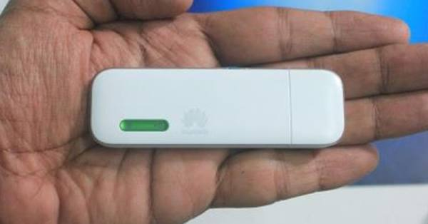](https://googleads.g.doubleclick.net/aclk?sa=l&ai=C2-TXMVWdXPewGNHigQfW3pqgAdGNmPVV6a-B3qQJv-EeEAEg9PnGJWC7_smD3AqgAYXcuPoCyAEG4AIAqAMByAMCqgTmAU_QJprH2B_qOAenONZHgcAye7GiFkuKm3ivgtUAVvlrNCybw8n-L5E_d3lFoUyBIor-TAUoU9tEhkPiidkP2TwNHMG-vbWsXuQjr3FkniEV9-W8fVIbMoLPgwtgyOYx3iTaT9w1hLWPfcUkijcrj094dHecvnCo__oak8u557euf0q_3XuVr5WT4UPvcZjhm93IRmyB3UjFfJzxHVzrU_FzQDGFQdDc0Hfs-Jghw8T2YxpoZXruaC7xTKCte87FvEgOLaiP-XJMFzocjDsxk3aQQAKEqUMQBC_gF6fymBUS0zrvRsUy4AQBoAY3gAfjo8eFAagHjs4bqAfVyRuoB-DTG6gHqAaoB9nLG6gHz8wbqAemvhvYBwHSCAkIjOOAEBABGAHyCBthZHgtc3Vic3luLTk0OTM1NDY0OTExMDc1NjaxCc8FusjDFgqfgAoD2BMMiBQB&ae=1&num=1&sig=AOD64_0KoyvyLCloogUkNMMByy6y_MjmBQ&client=ca-pub-6396844742497208&adurl=https://wifiblastshop.com/tech/wifi-uk.php%3FaffId%3DDA2379F6%26c1%3Duk%26c2%3Dcomp_fmun_un_adgroup2_res%26gclid%3DEAIaIQobChMIt43Eqful4QIVUXHgCh1WrwYUEAEYASAAEgIn2vD_BwE)

1

## [First, a final photo: Business in the front.](https://howchoo.com/g/zgmzytq1mmy/raspberry-pi-in-official-pi-keyboard#first-a-final-photo-business-in-the-front)

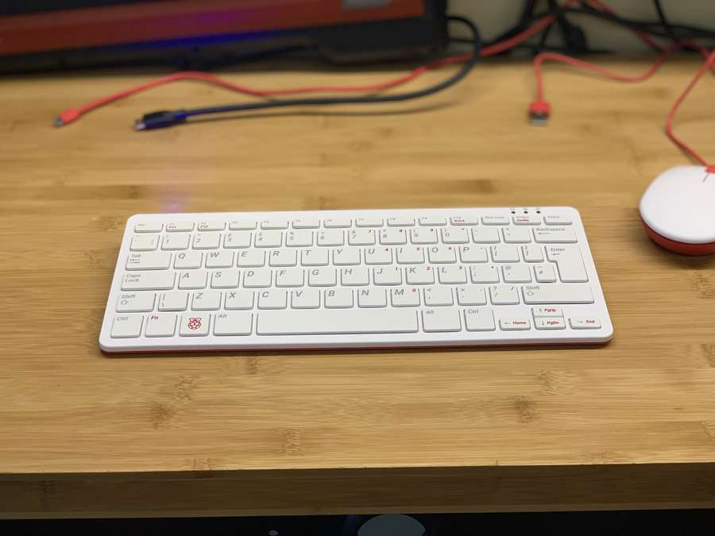

[](https://googleads.g.doubleclick.net/aclk?sa=l&ai=CQpLFLFWdXMenGdLv3wPvpIHAC9X75ORV9erd7uEHy5KK-cESEAEg9PnGJWC7_smD3AqgAe_1jtsDyAEC4AIAqAMByAOZBKoE3gFP0GJl_pP6kNvltr2GVN09f537bXY6ReLLj73kf_TMVJMGvT80Is0iI6m1NDo3qUbHSfCdQ6v-A-f1qbQRJaXofrIojxLtsODxwONJfrLDnQschOkj7oHUw0OLzjxEWTavvdY6WMQgKtFD8W3WjdMcTHgPN53nZyIfbffg64vfVJnkh6tDd9zBSa5wzRD4eZOp5g2lwYBeh0o0xmqgzhfWXLOb7dwQxW9iJeK2_dmzbogZ5pC5S2q7-5mrmhU8O4KgD0A2h0paT67bsboRcCXjzda-OU0TeV2iaWytr-HgBAGgBgKAB562mymoB47OG6gH1ckbqAfg0xuoB6gGqAfZyxuoB8_MG6gHpr4b2AcB0ggJCIzjgBAQARgB8ggbYWR4LXN1YnN5bi05NDkzNTQ2NDkxMTA3NTY2sQlczWv-RT4Gr4AKA9gTDA&ae=1&num=1&sig=AOD64_2SHAg5auy8tm-WBAaLRGU6AkX3mg&client=ca-pub-6396844742497208&adurl=https://ad.doubleclick.net/ddm/trackclk/N790339.3288108GOOGLE-ADWORDS/B21456311.230139345%3Bdc_trk_aid%3D427930495%3Bdc_trk_cid%3D103895587%3Bdc_lat%3D%3Bdc_rdid%3D%3Btag_for_child_directed_treatment%3D%3Btfua%3D%3Fgclid%3DEAIaIQobChMIx-2Tp_ul4QIV0vd3Ch1vUgC4EAEYASAAEgJBrfD_BwE)

2

## [Party in the back!](https://howchoo.com/g/zgmzytq1mmy/raspberry-pi-in-official-pi-keyboard#party-in-the-back)

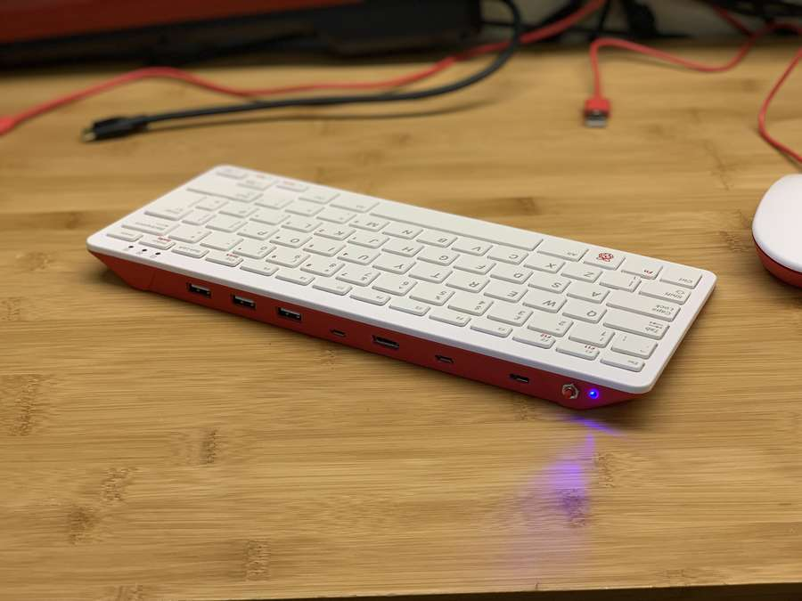

3

## [And the insides](https://howchoo.com/g/zgmzytq1mmy/raspberry-pi-in-official-pi-keyboard#and-the-insides)

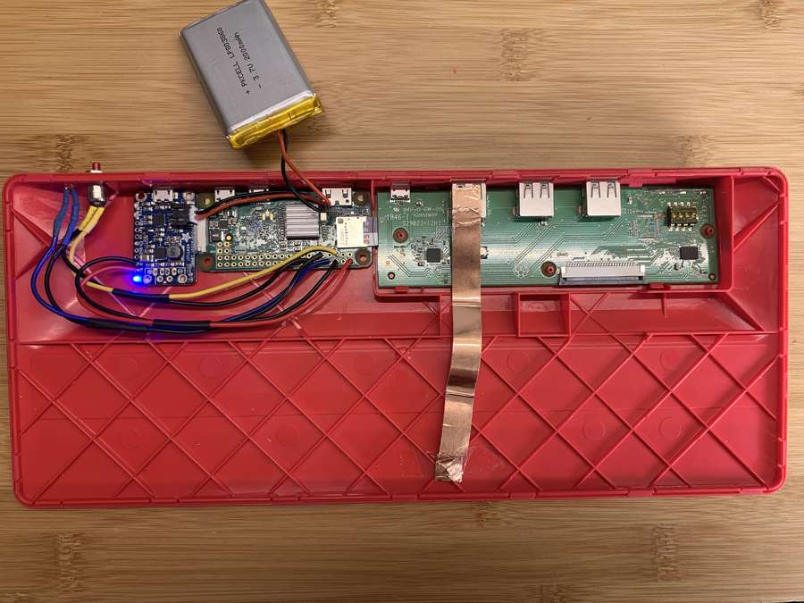

[](https://googleads.g.doubleclick.net/aclk?sa=l&ai=CRrMaL1WdXMzbCYuVgAfP0pjoBtX75ORV9erd7uEHy5KK-cESEAEg9PnGJWC7_smD3AqgAe_1jtsDyAEC4AIAqAMByAOZBKoE5AFP0Fa9XerdOxLdP2max5O-h_d96boMHci87eoeOr49LV5xexIanSoUaO5buc6k4HgdVj-Jr2-yfoz_P6CJGxxYxDbAEAPRYAWIsg7KFn6x7EaFNu9y9-TdaanGJrUqjYt2ipq8INqCDoWaoC_rL87TeXWltosaYzB_tp8VNO9EuKLacKqSEgDAT8IIwdhZxFmUSZy5HHJCyo8B94RESOzsc3YEwjx4L-tOYhGzITM-1RL99eI71BNTn-6P0U5BvLWScazij1a4hVdE3lxAh9MkwEjDR-dpOTTfAtdCtqB50WOU06TgBAGgBgKAB562mymoB47OG6gH1ckbqAfg0xuoB6gGqAfZyxuoB8_MG6gHpr4b2AcB0ggJCIzjgBAQARgB8ggbYWR4LXN1YnN5bi05NDkzNTQ2NDkxMTA3NTY2sQlczWv-RT4Gr4AKA9gTDA&ae=1&num=1&sig=AOD64_1hL3UNp2PoIfEPWQHIS1ehHWLjPA&client=ca-pub-6396844742497208&adurl=https://ad.doubleclick.net/ddm/trackclk/N790339.3288108GOOGLE-ADWORDS/B21456311.230139345%3Bdc_trk_aid%3D427930495%3Bdc_trk_cid%3D103895587%3Bdc_lat%3D%3Bdc_rdid%3D%3Btag_for_child_directed_treatment%3D%3Btfua%3D%3Fgclid%3DEAIaIQobChMIjK-7qPul4QIViwrgCh1PKQZtEAEYASAAEgJ5DPD_BwE)

4

## [Open the keyboard housing](https://howchoo.com/g/zgmzytq1mmy/raspberry-pi-in-official-pi-keyboard#open-the-keyboard-housing)

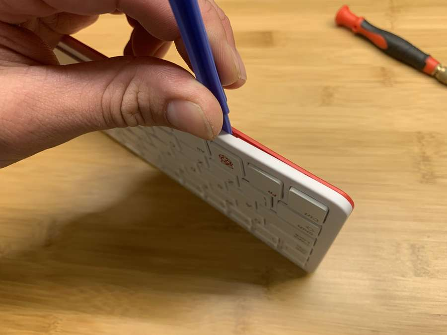

The back keyboard cover is secured using small plastic "snaps" around its perimeter.

Using a small plastic prying tool (like the type you use to open cellphones), carefully separate the housing at one of these clips.

Then, slide your tool all the way around to release the rest.

5

## [Disconnect the keyboard ribbon cables](https://howchoo.com/g/zgmzytq1mmy/raspberry-pi-in-official-pi-keyboard#disconnect-the-keyboard-ribbon-cables)

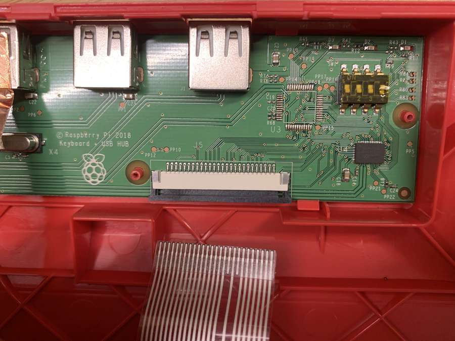

There are two ribbon cables connecting the front and back of the keyboards. We'll need to remove these.

*Gently* flip open the two halves of the keyboard so that you can access the keyboard's innards. Remove the three small screws from the black plastic keyboard electronics cover. Then, set the cover aside.

For clear the multi-pin ribbon cable, carefully slide the ribbon cable connector retention tab using a small flathead screwdriver. This will release the ribbon cable.

The other ribbon cable is actually just a grounding strip -- for this one, simply remove the tape from the keyboard key side.

Note:
*Be very careful not to bend or break either ribbon cable.*

6

## [Keyboard teardown](https://howchoo.com/g/zgmzytq1mmy/raspberry-pi-in-official-pi-keyboard#keyboard-teardown)

Here you can see the two halves of the keyboard. The keyboard PCB can be removed by depressing two small tabs that secure it in place.

Note:
*There's so much room for activities in here!*

7

## [Make some room](https://howchoo.com/g/zgmzytq1mmy/raspberry-pi-in-official-pi-keyboard#make-some-room)

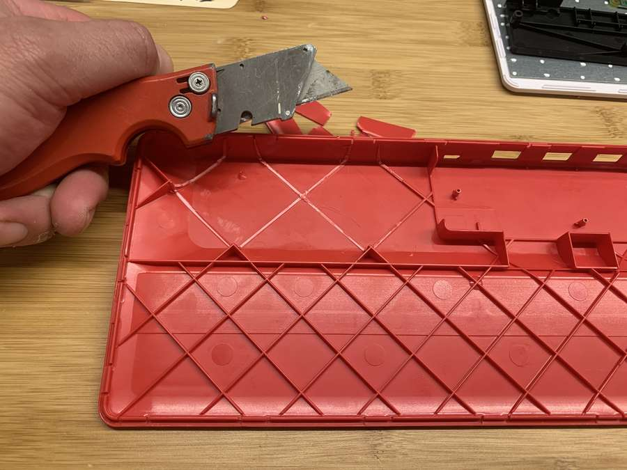

Use a box cutter, Dremel, or wire cutters to remove the cross-hatch support material adjacent to the PCB section. This is where all of our electronics will go.

[](https://googleads.g.doubleclick.net/aclk?sa=l&ai=Cnnz_s1WdXPOuE8eB-gaJ9byoDszjq-VV_eupkt4H4LmVmEMQASD0-cYlYLv-yYPcCqAB7_WO2wPIAQLgAgCoAwHIA5kEqgTrAU_Qm9ChJ3G1ZE6SpQg1psi_jpYM30yJ6bxBqH1w3LpByOKATBXhFVBagMLxqRD3NpsZQAirBkhWCse9BQRTaINDzOPsEebVTieMZ_VM_0H0Q0GBwBm9FqnMqywIyxK3MUkKhjIYizMsnfnFF5wcU6gQd6Zu1seHnq6Q-3g5awGIwMNq__dM-IIlnid1Edkd7rfkwOoy-fQ2eGjAkVXc7h_MO82xxx6CCTNN0pLWn549W_I-l48ak9jl-05esh_ogvLhtfkckmTKcC94ChavZdc9vBCWRX4AiexwkeMbbwN5rWWryop7FTTH2e3gBAGgBgKAB562mymoB47OG6gH1ckbqAfg0xuoB6gGqAfZyxuoB8_MG6gHpr4b2AcB0ggJCIzjgBAQARgB8ggbYWR4LXN1YnN5bi05NDkzNTQ2NDkxMTA3NTY2sQlkxOh9fZ55l4AKA9gTDA&ae=1&num=1&sig=AOD64_2MYJNR61yLBQIgM1jXMKsyLHVVcg&client=ca-pub-6396844742497208&adurl=https://ad.doubleclick.net/ddm/trackclk/N790339.3288108GOOGLE-ADWORDS/B21456311.227988192%3Bdc_trk_aid%3D426015856%3Bdc_trk_cid%3D103895587%3Bdc_lat%3D%3Bdc_rdid%3D%3Btag_for_child_directed_treatment%3D%3Btfua%3D%3Fgclid%3DEAIaIQobChMIs9S95_ul4QIVx4DeCh2JOg_lEAEYASAAEgIRPPD_BwE)

8

## [Drill holes for the power LED and power button](https://howchoo.com/g/zgmzytq1mmy/raspberry-pi-in-official-pi-keyboard#drill-holes-for-the-power-led-and-power-button)

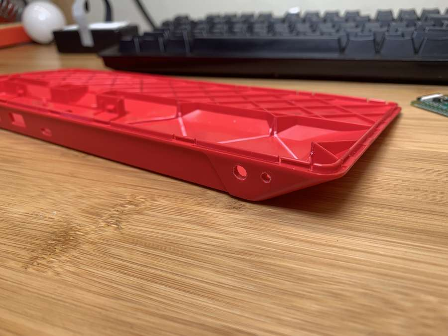

I wanted to add [this blue power LED](https://howchoo.com/resource/material/odrlzjk5zwi/zgmzytq1mmy) that will illuminate when the Pi is on. I also wanted to add a power button that will safely turn the Pi on and off. These are optional for your project, of course, but I think they add a lot of functionality. :)

Used here: ![](data:image/svg+xml,%3csvg viewBox='0 0 40 40' xmlns='http://www.w3.org/2000/svg' data-evernote-id='953' class='js-evernote-checked'%3e%3cpath d='M19.733.002c-11.045.148-19.878 9.222-19.731 20.267.148 11.041 9.221 19.876 20.266 19.729 11.043-.149 19.877-9.223 19.73-20.267-.148-11.041-9.221-19.877-20.265-19.729zm-.059 32.172l-.11-.002c-1.701-.05-2.9-1.303-2.852-2.979.047-1.647 1.276-2.843 2.92-2.843l.099.002c1.748.052 2.934 1.292 2.885 3.016-.049 1.652-1.258 2.806-2.942 2.806zm7.154-14.2c-.4.568-1.28 1.274-2.388 2.137l-1.22.843c-.67.521-1.074 1.011-1.226 1.493-.12.38-.178.48-.189 1.252l-.002.196h-4.66l.013-.394c.057-1.621.097-2.574.769-3.362 1.054-1.237 3.379-2.734 3.477-2.798.333-.251.614-.537.823-.842.489-.674.706-1.205.706-1.727 0-.724-.215-1.393-.64-1.99-.408-.575-1.184-.867-2.306-.867-1.113 0-1.874.353-2.33 1.077-.469.745-.706 1.527-.706 2.326v.199h-4.805l.009-.207c.124-2.943 1.174-5.062 3.121-6.299 1.223-.787 2.745-1.187 4.52-1.187 2.324 0 4.287.565 5.831 1.679 1.565 1.129 2.359 2.819 2.359 5.024.003 1.236-.387 2.394-1.156 3.447z' fill='%239E9E9E' data-evernote-id='954' class='js-evernote-checked'%3e%3c/path%3e%3c/svg%3e)

- [LED, blue, 3mm on Amazon](https://howchoo.com/resource/material/odrlzjk5zwi/zgmzytq1mmy)  [Check Price](https://howchoo.com/resource/material/odrlzjk5zwi/zgmzytq1mmy)

On the left-hand side of the case (when using the keyboard), drill two small holes for the power LED and button. The size of these holes will vary based on the size of your LED and button. I drilled a 3mm hole for my 3mm LED and a 5mm hole for my tiny power button.

9

## [Add foam tape to the Pi](https://howchoo.com/g/zgmzytq1mmy/raspberry-pi-in-official-pi-keyboard#add-foam-tape-to-the-pi)

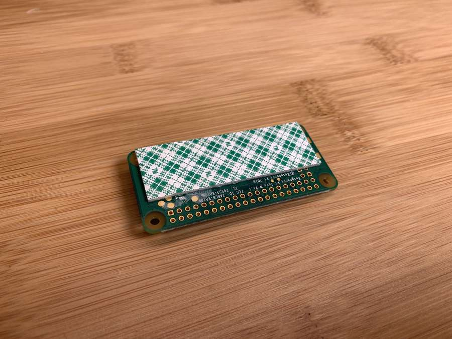

Later, we'll secure the Pi in place using foam tape. You can use hot glue if you wish, but I find foam tape is easier to remove later if need be.

Secure a piece of foam tape to the Pi but leave the backing in place.
Note:
*Don't cover the GPIO header with tape; we need to solder things to it later!*

10

## [Cut holes for the Pi Zero ports](https://howchoo.com/g/zgmzytq1mmy/raspberry-pi-in-official-pi-keyboard#cut-holes-for-the-pi-zero-ports)

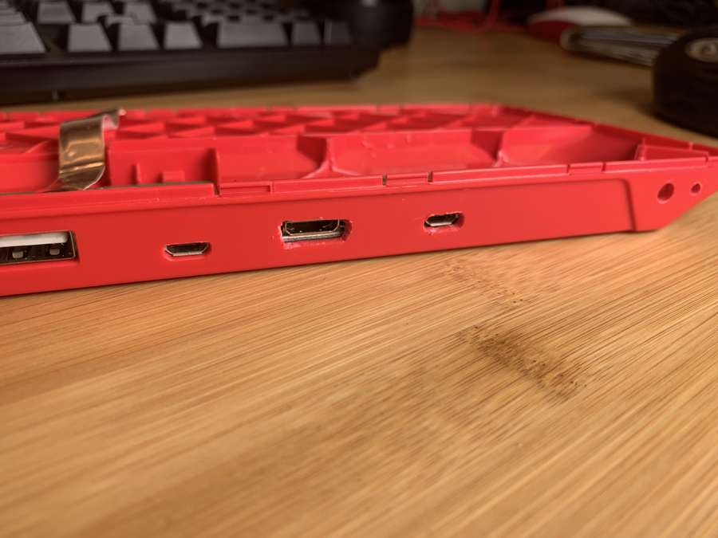

Next, we'll need to cut some holes into the back of the keyboard for the Pi Zero ports.

If you're adding a battery to your keyboard like I am, you only need to cut holes for the mini HDMI port and micro USB *data* port. We won't need a hole for the micro USB *power* port since the power input lives on the charging circuit for the battery (more on that later).

If you *aren't* adding a battery, also be sure to cut a hole for the micro USB *power* port.

### Marking the holes

To mark the holes, line the Pi up inside the back of the case and use a sharp permanent marker to mark the top and length of each port.

### Cutting the holes

This can be done using a drill or Dremel. I found the easiest way to cut the holes is to drill holes at the end of each "port opening" using a super small drill bit. You can then drill additional holes along the length of the port, and then remove excess material using a Dremel or box cutter.

11

## [Cut a hole for the PowerBoost](https://howchoo.com/g/zgmzytq1mmy/raspberry-pi-in-official-pi-keyboard#cut-a-hole-for-the-powerboost)

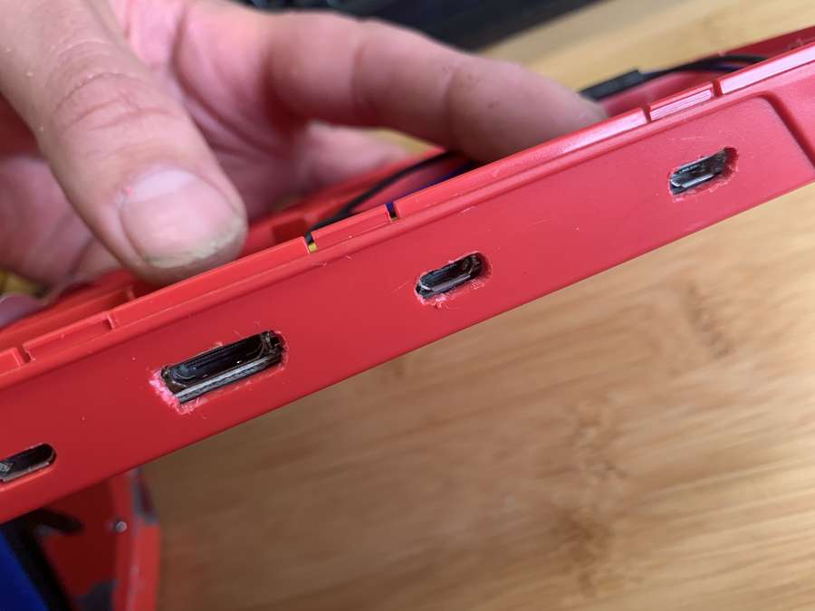

The [PowerBoost 1000C](https://howchoo.com/resource/tool/zjc5n2fjntb/zgmzytq1mmy) circuit board increases our battery's 3.3V to the 5V needed by the Pi, while also charging the battery and adding safety circuitry. If you plan on adding battery power to your keyboard to make it totally portable, this is necessary!

Used here: ![](data:image/svg+xml,%3csvg viewBox='0 0 40 40' xmlns='http://www.w3.org/2000/svg' data-evernote-id='1005' class='js-evernote-checked'%3e%3cpath d='M19.733.002c-11.045.148-19.878 9.222-19.731 20.267.148 11.041 9.221 19.876 20.266 19.729 11.043-.149 19.877-9.223 19.73-20.267-.148-11.041-9.221-19.877-20.265-19.729zm-.059 32.172l-.11-.002c-1.701-.05-2.9-1.303-2.852-2.979.047-1.647 1.276-2.843 2.92-2.843l.099.002c1.748.052 2.934 1.292 2.885 3.016-.049 1.652-1.258 2.806-2.942 2.806zm7.154-14.2c-.4.568-1.28 1.274-2.388 2.137l-1.22.843c-.67.521-1.074 1.011-1.226 1.493-.12.38-.178.48-.189 1.252l-.002.196h-4.66l.013-.394c.057-1.621.097-2.574.769-3.362 1.054-1.237 3.379-2.734 3.477-2.798.333-.251.614-.537.823-.842.489-.674.706-1.205.706-1.727 0-.724-.215-1.393-.64-1.99-.408-.575-1.184-.867-2.306-.867-1.113 0-1.874.353-2.33 1.077-.469.745-.706 1.527-.706 2.326v.199h-4.805l.009-.207c.124-2.943 1.174-5.062 3.121-6.299 1.223-.787 2.745-1.187 4.52-1.187 2.324 0 4.287.565 5.831 1.679 1.565 1.129 2.359 2.819 2.359 5.024.003 1.236-.387 2.394-1.156 3.447z' fill='%239E9E9E' data-evernote-id='1006' class='js-evernote-checked'%3e%3c/path%3e%3c/svg%3e)

- [Adafruit Powerboost 1000C on Amazon](https://howchoo.com/resource/tool/zjc5n2fjntb/zgmzytq1mmy)  [Check Price](https://howchoo.com/resource/tool/zjc5n2fjntb/zgmzytq1mmy)

Add a piece of foam tape to the back of the PowerBoost, mark a hole for its USB port, and cut the hole.

If you aren't putting a battery into your keyboard, skip this step and instead cut a hole for the Pi Zero's micro USB power port.

12

## [Create the power button circuit](https://howchoo.com/g/zgmzytq1mmy/raspberry-pi-in-official-pi-keyboard#create-the-power-button-circuit)

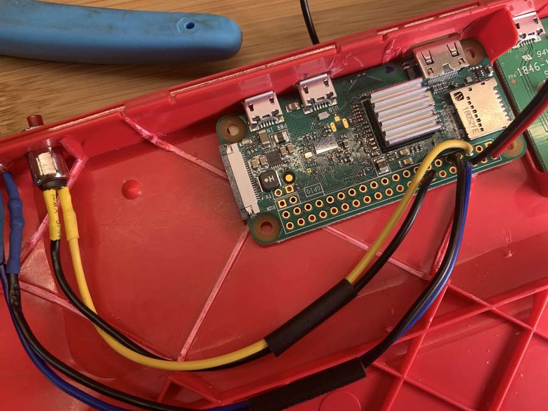
Next, we'll need to solder the power button to the Pi's GPIO header.

Using a few lengths of wire, solder the power button circuit per the instructions in our [Pi power button guide](https://howchoo.com/g/mwnlytk3zmm/how-to-add-a-power-button-to-your-raspberry-pi). That guide also includes instructions on a few scripts you'll need to run for the power button to work. You can add those scripts at the end.

Note:
*Be sure to leave sufficient lengths of wire. I found ~8" of wire worked well.*
Mentioned here:

- [(L)](https://howchoo.com/g/mwnlytk3zmm/how-to-add-a-power-button-to-your-raspberry-pi)

#### [How to add a power button to your Raspberry Pi](https://howchoo.com/g/mwnlytk3zmm/how-to-add-a-power-button-to-your-raspberry-pi)

13

## [Create the power status LED circuit](https://howchoo.com/g/zgmzytq1mmy/raspberry-pi-in-official-pi-keyboard#create-the-power-status-led-circuit)

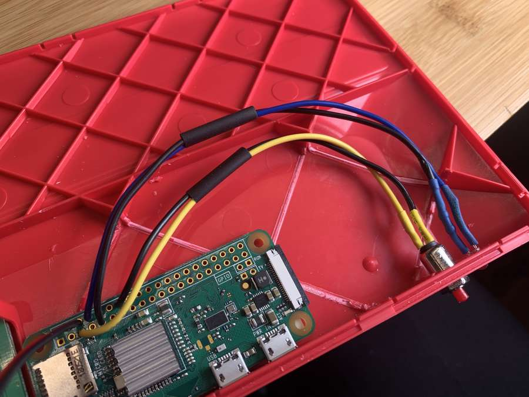

Next, we'll need to create the power LED circuit. I wrote a separate guide on [adding a power LED to the Pi](https://howchoo.com/g/ytzjyzy4m2e/build-a-simple-raspberry-pi-led-power-status-indicator); use that guide to get it up and running!

Mentioned here:

- [(L)](https://howchoo.com/g/ytzjyzy4m2e/build-a-simple-raspberry-pi-led-power-status-indicator)

#### [Build a simple Raspberry Pi LED power/status indicator](https://howchoo.com/g/ytzjyzy4m2e/build-a-simple-raspberry-pi-led-power-status-indicator)

14

## [Powering the Pi](https://howchoo.com/g/zgmzytq1mmy/raspberry-pi-in-official-pi-keyboard#powering-the-pi)

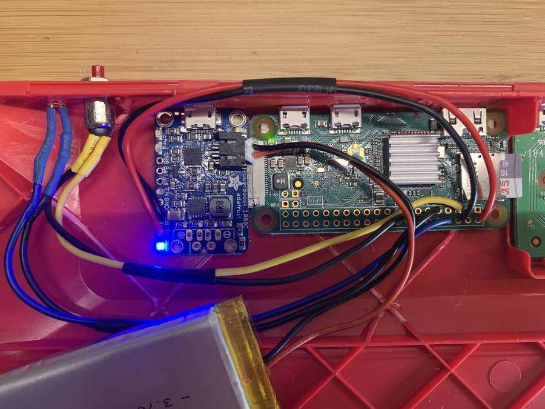

### Powering from the outside

If you aren't putting a battery in your keyboard, skip this step -- your Pi will be powered directly via USB from the outside (by connecting a power cable to the Pi's power port).

### Powering from the inside

You can also derive power by soldering the Pi's 5V/GND pins on the Pi's GPIO header directly to the power pins of one of the keyboard's full-sized USB ports (more information on GPIO below).

### Powering via battery

If you are putting a battery in your keyboard, you'll need a way to get power from the PowerBoost/battery to the Pi. Normally, the PowerBoost feeds power to the Pi via USB. However, I wanted to avoid running additional cables outside the Pi. Therefore, we'll power the Pi using its GPIO header.

It is hotly debated whether it's safe to power a Pi by connecting power to its expansion header. The header doesn't have the same protection circuitry as the Pi's power port; thus, supplying far too much current (or incorrect voltage) could theoretically damage the Pi.

Nonetheless, the Pi Zero W is only $10, so this is a calculated risk I'm willing to take. :) As long as you don't use an incorrect power supply or do anything else odd, your Pi will be fine.

Solder your connections as follows:

	Pi 5V (pin 2) => PowerBoost 5V
	Pi GND (pin 6) => PowerBoost G or GND

If you aren't sure which pin is which, [Pinout.xyz](https://pinout.xyz/) can help you identify your pins.

15

## [Mount everything](https://howchoo.com/g/zgmzytq1mmy/raspberry-pi-in-official-pi-keyboard#mount-everything)

We're almost done!
Remove the foam tape backing and secure the Pi and PowerBoost in place.

Then, secure your power button. My power button uses a threaded nut, but yours might need to be glued into place.

Finally, use hot or super glue to secure the LED in place.

16

## [Add your battery](https://howchoo.com/g/zgmzytq1mmy/raspberry-pi-in-official-pi-keyboard#add-your-battery)

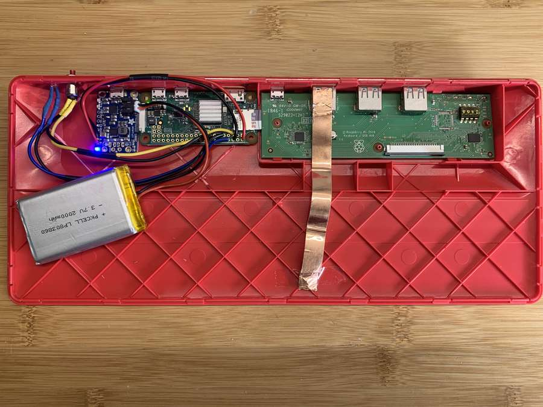

I'm using a 2000mAh Lithium-Polymer (LiPo) battery from Adafruit. This battery should run the Pi and keyboard for at least 4 hours. When a power supply is connected to the PowerBoost, it will use that instead while it simultaneously charges the battery.

Connect the battery's JST connector to the PowerBoost. As soon as the battery is connected the Pi will boot; so be extra careful not to short anything.

I placed the battery sort of between the PowerBoost and Pi. The battery will stay in place since it's a tight fit.

Note:

*Unfortunately, I didn't take a photo that shows proper battery placement while the case was still open.*

17

## [Connect and test](https://howchoo.com/g/zgmzytq1mmy/raspberry-pi-in-official-pi-keyboard#connect-and-test)

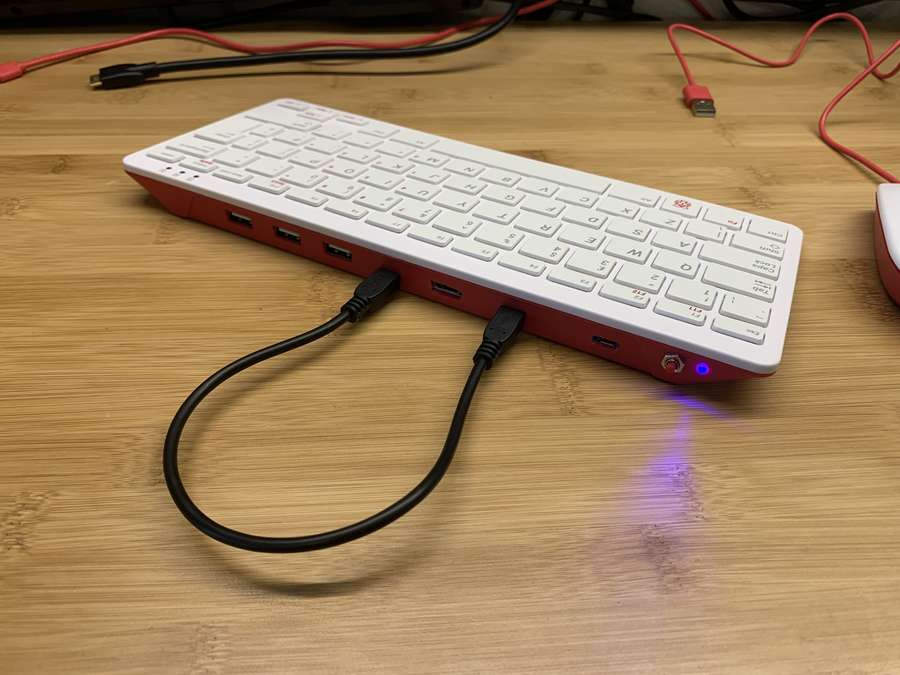

You'll need [this small male-male micro USB cable](https://howchoo.com/resource/tool/mwjiotvkztm/zgmzytq1mmy) to act as a jumper cable and connect the Pi's data port to the keyboard's micro USB port. I opted for this approach so that the keyboard could still be used with other Pis.

Used here: ![](data:image/svg+xml,%3csvg viewBox='0 0 40 40' xmlns='http://www.w3.org/2000/svg' data-evernote-id='1097' class='js-evernote-checked'%3e%3cpath d='M19.733.002c-11.045.148-19.878 9.222-19.731 20.267.148 11.041 9.221 19.876 20.266 19.729 11.043-.149 19.877-9.223 19.73-20.267-.148-11.041-9.221-19.877-20.265-19.729zm-.059 32.172l-.11-.002c-1.701-.05-2.9-1.303-2.852-2.979.047-1.647 1.276-2.843 2.92-2.843l.099.002c1.748.052 2.934 1.292 2.885 3.016-.049 1.652-1.258 2.806-2.942 2.806zm7.154-14.2c-.4.568-1.28 1.274-2.388 2.137l-1.22.843c-.67.521-1.074 1.011-1.226 1.493-.12.38-.178.48-.189 1.252l-.002.196h-4.66l.013-.394c.057-1.621.097-2.574.769-3.362 1.054-1.237 3.379-2.734 3.477-2.798.333-.251.614-.537.823-.842.489-.674.706-1.205.706-1.727 0-.724-.215-1.393-.64-1.99-.408-.575-1.184-.867-2.306-.867-1.113 0-1.874.353-2.33 1.077-.469.745-.706 1.527-.706 2.326v.199h-4.805l.009-.207c.124-2.943 1.174-5.062 3.121-6.299 1.223-.787 2.745-1.187 4.52-1.187 2.324 0 4.287.565 5.831 1.679 1.565 1.129 2.359 2.819 2.359 5.024.003 1.236-.387 2.394-1.156 3.447z' fill='%239E9E9E' data-evernote-id='1098' class='js-evernote-checked'%3e%3c/path%3e%3c/svg%3e)

- [Short micro USB male to male cable on Amazon](https://howchoo.com/resource/tool/mwjiotvkztm/zgmzytq1mmy)  [Check Price](https://howchoo.com/resource/tool/mwjiotvkztm/zgmzytq1mmy)

So if you wanted to use the keyboard as a normal keyboard, you could just disconnect the cable from the keyboard's micro USB port and connect another computer there instead. This is especially handy if you're working on a Pi project that needs GPIO access.

### Advanced: Avoiding the external "jumper" cable

It's possible to avoid the external cable entirely by soldering directly to the keyboard's micro USB port. Since the micro USB port's pins are so small, you'll want to solder to the traces instead.

To do this, locate the data PCB traces coming from the keyboard's micro USB port, carefully scrape away a bit of the trace's protection layer, and solder small wires that connect to the Pi's data micro USB port (either with a cable or via trace soldering).

18

## [Snap everything back together](https://howchoo.com/g/zgmzytq1mmy/raspberry-pi-in-official-pi-keyboard#snap-everything-back-together)

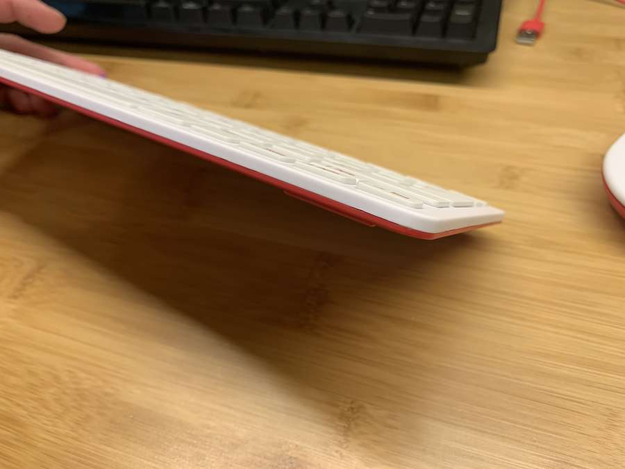

Make sure no parts of your new circuitry are touching the top of the case; if they are, use a bit of Kapton tape to prevent them from shorting against the case.

Reattach the black plastic cover using its three screws.
Then, Reconnect the keyboard ribbon cable and grounding strap.
Finally, snap the case back together.

19

## [Add labels](https://howchoo.com/g/zgmzytq1mmy/raspberry-pi-in-official-pi-keyboard#add-labels)

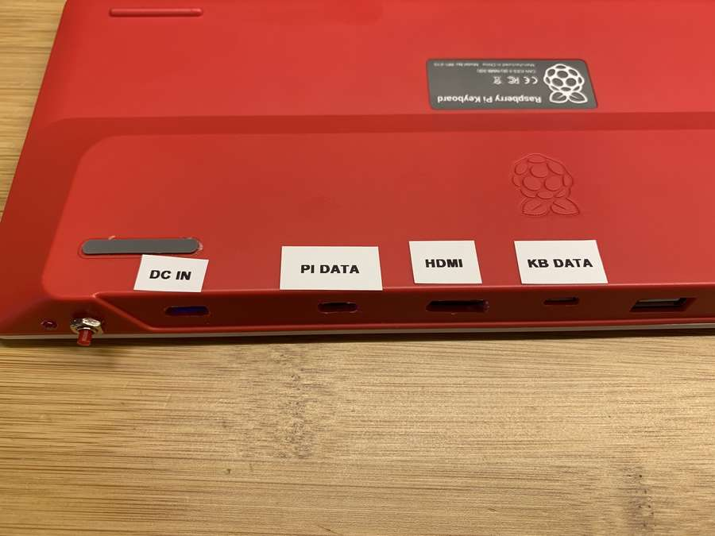

I recommend labeling your USB ports so that you (and others) know what each port does. I used a label maker and put the labels on the bottom for extra cleanness.

20

## [You're all done!](https://howchoo.com/g/zgmzytq1mmy/raspberry-pi-in-official-pi-keyboard#youre-all-done)

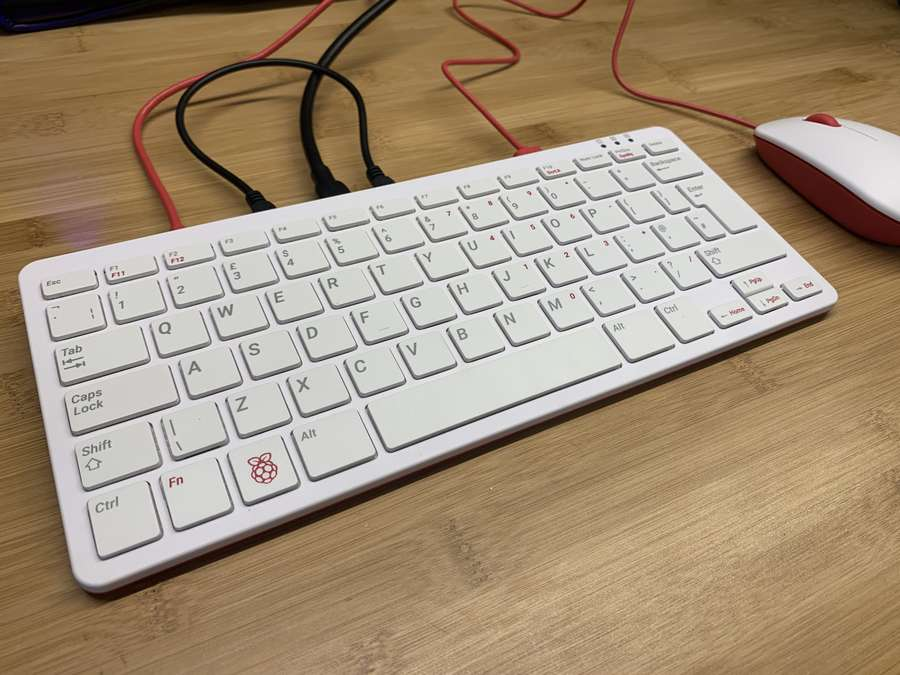

The LED is shining, the power button turns the Pi on and off, and you can disconnect the cables for a battery-powered Pi on the go.

In the future, I'd love to create a version that has GPIO access and perhaps also add a micro SD card extension for external card accessibility.

### Let me know what you think!

Questions? Ideas? Post in the comments section below. I'd love to hear from you!

[](https://googleads.g.doubleclick.net/aclk?sa=l&ai=CV6ntMFWdXJnrLtiQgAfagoGwBNX75ORV3ejd7uEHy5KK-cESEAEg9PnGJWC7_smD3AqgAe_1jtsDyAEC4AIAqAMByAOZBKoE6AFP0JLwp8pZc5n9fKGQeCGW1hUZzdNjMFzXt8UHk7idUfI7B7LH_QtGVnROfC996p1MTDYHHoWFE0gMg1dxP4EZ9kyE_mn5taazMyOcnon_aauhyfo0Rini7r7HBR7PVMrXhXQBtRskSWj_sm3A4CzK61xusa3QX21V9hyXCq8TmkqznHtnNLqPkC23g9GkGqWnvVI-1A5aAzNZqLQCg_rmGVHPs8DX-Od4k1FrvVMGZ747xUcEFr7JFOE9lqJIrJbIslv9hOa7Q0u86g1DHzxggRomGdW2M5NqAxIcxwEGtoZCq2JAePey4AQBoAYCgAeetpspqAeOzhuoB9XJG6gH4NMbqAeoBqgH2csbqAfPzBuoB6a-G9gHAdIICQiM44AQEAEYAfIIG2FkeC1zdWJzeW4tOTQ5MzU0NjQ5MTEwNzU2NrEJXM1r_kU-Bq-ACgPYEww&ae=1&num=1&sig=AOD64_0M70bJHWkrTtrC6BXDwkP3WvUqWw&client=ca-pub-6396844742497208&adurl=https://ad.doubleclick.net/ddm/trackclk/N790339.3288108GOOGLE-ADWORDS/B21456311.230139345%3Bdc_trk_aid%3D427930495%3Bdc_trk_cid%3D103895587%3Bdc_lat%3D%3Bdc_rdid%3D%3Btag_for_child_directed_treatment%3D%3Btfua%3D%3Fgclid%3DEAIaIQobChMImcOdqful4QIVWAjgCh1aQQBGEAEYASAAEgJ7KvD_BwE)

report this ad