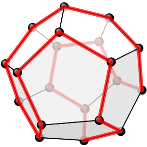
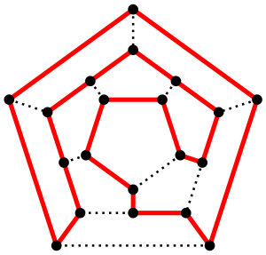
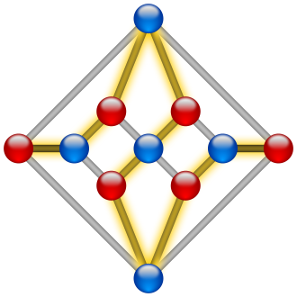

Hamiltonian path - Wikipedia

# Hamiltonian path

From Wikipedia, the free encyclopedia

[Jump to navigation](https://en.wikipedia.org/wiki/Hamiltonian_path#mw-head)[Jump to search](https://en.wikipedia.org/wiki/Hamiltonian_path#p-search)

This article is about the nature of Hamiltonian paths. For the question of the existence of a Hamiltonian path or cycle in a given graph, see [Hamiltonian path problem](https://en.wikipedia.org/wiki/Hamiltonian_path_problem).

One possible [Hamiltonian cycle](https://en.wikipedia.org/wiki/Hamiltonian_cycle) through every vertex of a [dodecahedron](https://en.wikipedia.org/wiki/Dodecahedron) is shown in red – like all [platonic solids](https://en.wikipedia.org/wiki/Platonic_solid), the dodecahedron is Hamiltonian

The above as a two-dimensional planar graph

[(L)](https://en.wikipedia.org/wiki/File:Herschel_graph_planar_straight.svg)

The [Herschel graph](https://en.wikipedia.org/wiki/Herschel_graph) is the smallest possible [polyhedral graph](https://en.wikipedia.org/wiki/Polyhedral_graph) that does not have a Hamiltonian cycle. A possible Hamiltonian path is shown.

In the [mathematical](https://en.wikipedia.org/wiki/Mathematics) field of [graph theory](https://en.wikipedia.org/wiki/Graph_theory), a **Hamiltonian path** (or **traceable path**) is a [path](https://en.wikipedia.org/wiki/Path_(graph_theory)) in an undirected or directed graph that visits each [vertex](https://en.wikipedia.org/wiki/Vertex_(graph_theory)) exactly once. A **Hamiltonian cycle** (or **Hamiltonian circuit**) is a Hamiltonian path that is a [cycle](https://en.wikipedia.org/wiki/Cycle_(graph_theory)). Determining whether such paths and cycles exist in graphs is the [Hamiltonian path problem](https://en.wikipedia.org/wiki/Hamiltonian_path_problem), which is [NP-complete](https://en.wikipedia.org/wiki/NP-complete_problem).

Hamiltonian paths and cycles are named after [William Rowan Hamilton](https://en.wikipedia.org/wiki/William_Rowan_Hamilton) who invented the [icosian game](https://en.wikipedia.org/wiki/Icosian_game), now also known as *Hamilton's puzzle*, which involves finding a Hamiltonian cycle in the edge graph of the [dodecahedron](https://en.wikipedia.org/wiki/Dodecahedron). Hamilton solved this problem using the [icosian calculus](https://en.wikipedia.org/wiki/Icosian_calculus), an [algebraic structure](https://en.wikipedia.org/wiki/Algebraic_structure) based on [roots of unity](https://en.wikipedia.org/wiki/Root_of_unity) with many similarities to the [quaternions](https://en.wikipedia.org/wiki/Quaternion) (also invented by Hamilton). This solution does not generalize to arbitrary graphs.

Despite being named after Hamilton, Hamiltonian cycles in polyhedra had also been studied a year earlier by [Thomas Kirkman](https://en.wikipedia.org/wiki/Thomas_Kirkman), who, in particular, gave an example of a polyhedron without Hamiltonian cycles.[[1]](https://en.wikipedia.org/wiki/Hamiltonian_path#cite_note-1) Even earlier, Hamiltonian cycles and paths in the [knight's graph](https://en.wikipedia.org/wiki/Knight%27s_graph) of the [chessboard](https://en.wikipedia.org/wiki/Chessboard), the [knight's tour](https://en.wikipedia.org/wiki/Knight%27s_tour), had been studied in the 9th century in [Indian mathematics](https://en.wikipedia.org/wiki/Indian_mathematics) by [Rudrata](https://en.wikipedia.org/wiki/Rudrata), and around the same time in [Islamic mathematics](https://en.wikipedia.org/wiki/Mathematics_in_medieval_Islam) by [al-Adli ar-Rumi](https://en.wikipedia.org/wiki/Al-Adli_ar-Rumi). In 18th century Europe, knight's tours were published by [Abraham de Moivre](https://en.wikipedia.org/wiki/Abraham_de_Moivre) and [Leonhard Euler](https://en.wikipedia.org/wiki/Leonhard_Euler).[[2]](https://en.wikipedia.org/wiki/Hamiltonian_path#cite_note-2)

## Contents

[hide]

- [1  Definitions](https://en.wikipedia.org/wiki/Hamiltonian_path#Definitions)
- [2  Examples](https://en.wikipedia.org/wiki/Hamiltonian_path#Examples)
- [3  Properties](https://en.wikipedia.org/wiki/Hamiltonian_path#Properties)
- [4  Bondy–Chvátal theorem](https://en.wikipedia.org/wiki/Hamiltonian_path#Bondy%E2%80%93Chv%C3%A1tal_theorem)
- [5  Existence of Hamiltonian cycles in planar graphs](https://en.wikipedia.org/wiki/Hamiltonian_path#Existence_of_Hamiltonian_cycles_in_planar_graphs)
- [6  The Hamiltonian cycle polynomial](https://en.wikipedia.org/wiki/Hamiltonian_path#The_Hamiltonian_cycle_polynomial)
- [7  See also](https://en.wikipedia.org/wiki/Hamiltonian_path#See_also)
- [8  Notes](https://en.wikipedia.org/wiki/Hamiltonian_path#Notes)
- [9  References](https://en.wikipedia.org/wiki/Hamiltonian_path#References)
- [10  External links](https://en.wikipedia.org/wiki/Hamiltonian_path#External_links)

## Definitions[[edit](https://en.wikipedia.org/w/index.php?title=Hamiltonian_path&action=edit&section=1)]

A *Hamiltonian path* or *traceable path* is a [path](https://en.wikipedia.org/wiki/Path_(graph_theory)) that visits each vertex of the graph exactly once. A graph that contains a Hamiltonian path is called a **traceable graph**. A graph is **Hamiltonian-connected** if for every pair of vertices there is a Hamiltonian path between the two vertices.

A *Hamiltonian cycle*, *Hamiltonian circuit*, *vertex tour* or *graph cycle* is a [cycle](https://en.wikipedia.org/wiki/Cycle_(graph_theory)) that visits each vertex exactly once. A graph that contains a Hamiltonian cycle is called a **Hamiltonian graph**.

Similar notions may be defined for *[directed graphs](https://en.wikipedia.org/wiki/Directed_graph)*, where each edge (arc) of a path or cycle can only be traced in a single direction (i.e., the vertices are connected with arrows and the edges traced "tail-to-head").

A [Hamiltonian decomposition](https://en.wikipedia.org/wiki/Hamiltonian_decomposition) is an edge decomposition of a graph into Hamiltonian circuits.

A *Hamilton maze* is a type of logic puzzle in which the goal is to find the unique Hamiltonian cycle in a given graph.[[3]](https://en.wikipedia.org/wiki/Hamiltonian_path#cite_note-3)[[4]](https://en.wikipedia.org/wiki/Hamiltonian_path#cite_note-4)

## Examples[[edit](https://en.wikipedia.org/w/index.php?title=Hamiltonian_path&action=edit&section=2)]

- a [complete graph](https://en.wikipedia.org/wiki/Complete_graph) with more than two vertices is Hamiltonian
- every [cycle graph](https://en.wikipedia.org/wiki/Cycle_graph) is Hamiltonian
- every [tournament](https://en.wikipedia.org/wiki/Tournament_(graph_theory)) has an odd number of Hamiltonian paths ([Rédei](https://en.wikipedia.org/wiki/L%C3%A1szl%C3%B3_R%C3%A9dei) 1934)
- every [platonic solid](https://en.wikipedia.org/wiki/Platonic_solid), considered as a graph, is Hamiltonian[[5]](https://en.wikipedia.org/wiki/Hamiltonian_path#cite_note-5)
- the [Cayley graph](https://en.wikipedia.org/wiki/Cayley_graph) of a finite [Coxeter group](https://en.wikipedia.org/wiki/Coxeter_group) is Hamiltonian (For more information on Hamiltonian paths in Cayley graphs, see the [Lovász conjecture](https://en.wikipedia.org/wiki/Lov%C3%A1sz_conjecture))

## Properties[[edit](https://en.wikipedia.org/w/index.php?title=Hamiltonian_path&action=edit&section=3)]

Any Hamiltonian cycle can be converted to a Hamiltonian path by removing one of its edges, but a Hamiltonian path can be extended to Hamiltonian cycle only if its endpoints are adjacent.

All Hamiltonian graphs are [biconnected](https://en.wikipedia.org/wiki/Biconnected_graph), but a biconnected graph need not be Hamiltonian (see, for example, the [Petersen graph](https://en.wikipedia.org/wiki/Petersen_graph)).[[6]](https://en.wikipedia.org/wiki/Hamiltonian_path#cite_note-6)

An [Eulerian graph](https://en.wikipedia.org/wiki/Eulerian_graph)  *G* (a [connected graph](https://en.wikipedia.org/wiki/Connected_graph) in which every vertex has even degree) necessarily has an Euler tour, a closed walk passing through each edge of *G* exactly once. This tour corresponds to a Hamiltonian cycle in the [line graph](https://en.wikipedia.org/wiki/Line_graph)  *L*(*G*), so the line graph of every Eulerian graph is Hamiltonian. Line graphs may have other Hamiltonian cycles that do not correspond to Euler tours, and in particular the line graph *L*(*G*) of every Hamiltonian graph *G* is itself Hamiltonian, regardless of whether the graph *G* is Eulerian.[[7]](https://en.wikipedia.org/wiki/Hamiltonian_path#cite_note-7)

A [tournament](https://en.wikipedia.org/wiki/Tournament_(graph_theory)) (with more than two vertices) is Hamiltonian if and only if it is [strongly connected](https://en.wikipedia.org/wiki/Strongly_connected_component).

The number of different Hamiltonian cycles in a complete undirected graph on *n* vertices is (*n* − 1)! / 2 and in a complete directed graph on *n* vertices is (*n* − 1)!. These counts assume that cycles that are the same apart from their starting point are not counted separately.

## Bondy–Chvátal theorem[[edit](https://en.wikipedia.org/w/index.php?title=Hamiltonian_path&action=edit&section=4)]

The best vertex [degree](https://en.wikipedia.org/wiki/Degree_(graph_theory)) characterization of Hamiltonian graphs was provided in 1972 by the [Bondy](https://en.wikipedia.org/wiki/J._A._Bondy)–[Chvátal](https://en.wikipedia.org/wiki/V%C3%A1clav_Chv%C3%A1tal) theorem, which generalizes earlier results by [G. A. Dirac](https://en.wikipedia.org/wiki/Gabriel_Andrew_Dirac) (1952) and [Øystein Ore](https://en.wikipedia.org/wiki/%C3%98ystein_Ore). Both Dirac's and Ore's theorems can also be derived from [Pósa](https://en.wikipedia.org/wiki/Lajos_P%C3%B3sa_(mathematician))'s theorem (1962). Hamiltonicity has been widely studied with relation to various parameters such as graph [density](https://en.wikipedia.org/wiki/Dense_graph), [toughness](https://en.wikipedia.org/wiki/Graph_toughness), [forbidden subgraphs](https://en.wikipedia.org/wiki/Forbidden_subgraph_problem) and [distance](https://en.wikipedia.org/wiki/Distance_(graph_theory)) among other parameters.[[8]](https://en.wikipedia.org/wiki/Hamiltonian_path#cite_note-8) Dirac and Ore's theorems basically state that a graph is Hamiltonian if it has *enough edges*.

The Bondy–Chvátal theorem operates on the **closure** cl(*G*) of a graph *G* with *n* vertices, obtained by repeatedly adding a new edge *uv* connecting a [nonadjacent](https://en.wikipedia.org/wiki/Nonadjacent) pair of vertices *u* and *v* with degree(*v*) + degree(*u*) ≥ *n* until no more pairs with this property can be found.

**Bondy–Chvátal theorem** (1976)
A graph is Hamiltonian if and only if its closure is Hamiltonian.

As complete graphs are Hamiltonian, all graphs whose closure is complete are Hamiltonian, which is the content of the following earlier theorems by Dirac and Ore.

**Dirac** (1952)

A [simple graph](https://en.wikipedia.org/wiki/Simple_graph) with *n* vertices (*n* ≥ 3) is Hamiltonian if every vertex has degree *n* / 2 or greater.

**Ore** (1960)

A [simple graph](https://en.wikipedia.org/wiki/Simple_graph) with *n* vertices (*n* ≥ 3) is Hamiltonian if, for every pair of non-adjacent vertices, the sum of their degrees is *n* or greater (see [Ore's theorem](https://en.wikipedia.org/wiki/Ore%27s_theorem)).

The following theorems can be regarded as directed versions:
**Ghouila-Houiri** (1960)

A [strongly connected](https://en.wikipedia.org/wiki/Strongly_connected_graph)  [simple](https://en.wikipedia.org/wiki/Simple_graph)  [directed graph](https://en.wikipedia.org/wiki/Directed_graph) with *n* vertices is Hamiltonian if every vertex has a full degree greater than or equal to *n*.

**Meyniel** (1973)

A [strongly connected](https://en.wikipedia.org/wiki/Strongly_connected_graph)  [simple](https://en.wikipedia.org/wiki/Simple_graph)  [directed graph](https://en.wikipedia.org/wiki/Directed_graph) with *n* vertices is Hamiltonian if the sum of full degrees of every pair of distinct non-adjacent vertices is greater than or equal to 2*n* − 1.

The number of vertices must be doubled because each undirected edge corresponds to two directed arcs and thus the degree of a vertex in the directed graph is twice the degree in the undirected graph.

**Rahman-[Kaykobad](https://en.wikipedia.org/wiki/Mohammad_Kaykobad)** (2005)

A [simple graph](https://en.wikipedia.org/wiki/Simple_graph) with *n* vertices has a Hamiltonian path if, for every non-adjacent vertex pairs the sum of their degrees and their shortest path length is greater than *n*.[[9]](https://en.wikipedia.org/wiki/Hamiltonian_path#cite_note-9)

The above theorem can only recognize the existence of a Hamiltonian path in a graph and not a Hamiltonian Cycle.

Many of these results have analogues for balanced [bipartite graphs](https://en.wikipedia.org/wiki/Bipartite_graph), in which the vertex degrees are compared to the number of vertices on a single side of the bipartition rather than the number of vertices in the whole graph.[[10]](https://en.wikipedia.org/wiki/Hamiltonian_path#cite_note-10)

## Existence of Hamiltonian cycles in planar graphs[[edit](https://en.wikipedia.org/w/index.php?title=Hamiltonian_path&action=edit&section=5)]

Theorem (Whitney, 1931)
A 4-connected planar triangulation has a Hamiltonian cycle.
Theorem (Tutte, 1956)
A 4-connected planar graph has a Hamiltonian cycle.

## The Hamiltonian cycle polynomial[[edit](https://en.wikipedia.org/w/index.php?title=Hamiltonian_path&action=edit&section=6)]

An algebraic representation of the Hamiltonian cycles of a given weighted digraph (whose arcs are assigned weights from a certain ground field) is the [Hamiltonian cycle polynomial](https://en.wikipedia.org/wiki/Hamiltonian_cycle_polynomial) of its weighted adjacency matrix defined as the sum of the products of the arc weights of the digraph's Hamiltonian cycles. This polynomial is not identically zero as a function in the arc weights if and only if the digraph is Hamiltonian. The relationship between the computational complexities of computing it and [computing the permanent](https://en.wikipedia.org/wiki/Computing_the_permanent) was shown in [Kogan (1996)](https://en.wikipedia.org/wiki/Hamiltonian_path#CITEREFKogan1996).

## See also[[edit](https://en.wikipedia.org/w/index.php?title=Hamiltonian_path&action=edit&section=7)]

- [Barnette's conjecture](https://en.wikipedia.org/wiki/Barnette%27s_conjecture), an open problem on Hamiltonicity of cubic [bipartite](https://en.wikipedia.org/wiki/Bipartite_graph)  [polyhedral graphs](https://en.wikipedia.org/wiki/Polyhedral_graph)
- [Eulerian path](https://en.wikipedia.org/wiki/Eulerian_path), a path through all edges in a graph
- [Fleischner's theorem](https://en.wikipedia.org/wiki/Fleischner%27s_theorem), on Hamiltonian [squares of graphs](https://en.wikipedia.org/wiki/Power_of_graph)
- [Gray code](https://en.wikipedia.org/wiki/Gray_code)
- [Grinberg's theorem](https://en.wikipedia.org/wiki/Grinberg%27s_theorem) giving a necessary condition for [planar graphs](https://en.wikipedia.org/wiki/Planar_graph) to have a Hamiltonian cycle
- [Hamiltonian path problem](https://en.wikipedia.org/wiki/Hamiltonian_path_problem), the computational problem of finding Hamiltonian paths
- [Hypohamiltonian graph](https://en.wikipedia.org/wiki/Hypohamiltonian_graph), a non-Hamiltonian graph in which every vertex-deleted subgraph is Hamiltonian
- [Knight's tour](https://en.wikipedia.org/wiki/Knight%27s_tour), a Hamiltonian cycle in the [knight's graph](https://en.wikipedia.org/wiki/Knight%27s_graph)
- [LCF notation](https://en.wikipedia.org/wiki/LCF_notation) for Hamiltonian [cubic graphs](https://en.wikipedia.org/wiki/Cubic_graph).
- [Lovász conjecture](https://en.wikipedia.org/wiki/Lov%C3%A1sz_conjecture) that [vertex-transitive graphs](https://en.wikipedia.org/wiki/Vertex-transitive_graph) are Hamiltonian
- [Pancyclic graph](https://en.wikipedia.org/wiki/Pancyclic_graph), graphs with cycles of all lengths including a Hamiltonian cycle
- [Seven Bridges of Königsberg](https://en.wikipedia.org/wiki/Seven_Bridges_of_K%C3%B6nigsberg)
- [Shortness exponent](https://en.wikipedia.org/wiki/Shortness_exponent), a numerical measure of how far from Hamiltonian the graphs in a family can be
- [Snake-in-the-box](https://en.wikipedia.org/wiki/Snake-in-the-box), the longest [induced path](https://en.wikipedia.org/wiki/Induced_path) in a hypercube
- [Steinhaus–Johnson–Trotter algorithm](https://en.wikipedia.org/wiki/Steinhaus%E2%80%93Johnson%E2%80%93Trotter_algorithm) for finding a Hamiltonian path in a [permutohedron](https://en.wikipedia.org/wiki/Permutohedron)
- [Subhamiltonian graph](https://en.wikipedia.org/wiki/Subhamiltonian_graph), a subgraph of a [planar](https://en.wikipedia.org/wiki/Planar_graph) Hamiltonian graph
- [Tait's conjecture](https://en.wikipedia.org/wiki/Tait%27s_conjecture) (now known false) that 3-regular [polyhedral graphs](https://en.wikipedia.org/wiki/Polyhedral_graph) are Hamiltonian
- [Travelling salesman problem](https://en.wikipedia.org/wiki/Travelling_salesman_problem)

## Notes[[edit](https://en.wikipedia.org/w/index.php?title=Hamiltonian_path&action=edit&section=8)]

1. **[^](https://en.wikipedia.org/wiki/Hamiltonian_path#cite_ref-1)**  Biggs, N. L. (1981), "T. P. Kirkman, mathematician", *The Bulletin of the London Mathematical Society*, **13** (2): 97–120, [doi](https://en.wikipedia.org/wiki/Digital_object_identifier):[10.1112/blms/13.2.97](https://doi.org/10.1112%2Fblms%2F13.2.97), [MR](https://en.wikipedia.org/wiki/Mathematical_Reviews) [0608093](https://www.ams.org/mathscinet-getitem?mr=0608093).

2. **[^](https://en.wikipedia.org/wiki/Hamiltonian_path#cite_ref-2)**  Watkins, John J. (2004), "Chapter 2: Knight's Tours", *Across the Board: The Mathematics of Chessboard Problems*, Princeton University Press, pp. 25–38, [ISBN](https://en.wikipedia.org/wiki/International_Standard_Book_Number) [978-0-691-15498-5](https://en.wikipedia.org/wiki/Special:BookSources/978-0-691-15498-5).

3. **[^](https://en.wikipedia.org/wiki/Hamiltonian_path#cite_ref-3)**  de Ruiter, Johan (2017). *Hamilton Mazes - The Beginner's Guide*.

4. **[^](https://en.wikipedia.org/wiki/Hamiltonian_path#cite_ref-4)**  Friedman, Erich (2009). ["Hamiltonian Mazes"](https://www2.stetson.edu/~efriedma/puzzle/ham/). *Erich's Puzzle Palace*. [Archived](https://web.archive.org/web/20160416235225/http://www2.stetson.edu/~efriedma/puzzle/ham/) from the original on 16 April 2016. Retrieved 27 May 2017.

5. **[^](https://en.wikipedia.org/wiki/Hamiltonian_path#cite_ref-5)**  [Gardner, M. "Mathematical Games: About the Remarkable Similarity between the Icosian Game and the Towers of Hanoi." Sci. Amer. 196, 150–156, May 1957](http://www.scientificamerican.com/magazine/sa/1957/05-01/)

6. **[^](https://en.wikipedia.org/wiki/Hamiltonian_path#cite_ref-6)**  Eric Weinstein. ["Biconnected Graph"](http://mathworld.wolfram.com/BiconnectedGraph.html). Wolfram MathWorld.

7. **[^](https://en.wikipedia.org/wiki/Hamiltonian_path#cite_ref-7)**  Balakrishnan, R.; Ranganathan, K. (2012), "Corollary 6.5.5", [*A Textbook of Graph Theory*](https://books.google.com/books?id=mpgu6wgnZgYC&pg=PA134), Springer, p. 134, [ISBN](https://en.wikipedia.org/wiki/International_Standard_Book_Number) [9781461445296](https://en.wikipedia.org/wiki/Special:BookSources/9781461445296).

8. **[^](https://en.wikipedia.org/wiki/Hamiltonian_path#cite_ref-8)**  Gould, Ronald J. (July 8, 2002). ["Advances on the Hamiltonian Problem - A Survey"](http://www.mathcs.emory.edu/~rg/advances.pdf)  (PDF). Emory University. Retrieved 2012-12-10.

9. **[^](https://en.wikipedia.org/wiki/Hamiltonian_path#cite_ref-9)**  Rahman, M. S.; Kaykobad, M. (April 2005). "On Hamiltonian cycles and Hamiltonian paths". *Information Processing Letters*. **94**: 37–41. [doi](https://en.wikipedia.org/wiki/Digital_object_identifier):[10.1016/j.ipl.2004.12.002](https://doi.org/10.1016%2Fj.ipl.2004.12.002).

10. **[^](https://en.wikipedia.org/wiki/Hamiltonian_path#cite_ref-10)**  Moon, J.; [Moser, L.](https://en.wikipedia.org/wiki/Leo_Moser) (1963), "On Hamiltonian bipartite graphs", *[Israel Journal of Mathematics](https://en.wikipedia.org/wiki/Israel_Journal_of_Mathematics)*, **1**: 163–165, [doi](https://en.wikipedia.org/wiki/Digital_object_identifier):[10.1007/BF02759704](https://doi.org/10.1007%2FBF02759704), [MR](https://en.wikipedia.org/wiki/Mathematical_Reviews) [0161332](https://www.ams.org/mathscinet-getitem?mr=0161332)

## References[[edit](https://en.wikipedia.org/w/index.php?title=Hamiltonian_path&action=edit&section=9)]

- [Berge, Claude](https://en.wikipedia.org/wiki/Claude_Berge); Ghouila-Houiri, A. (1962), *Programming, games and transportation networks*, New York: Sons, Inc.
- DeLeon, Melissa (2000), ["A study of sufficient conditions for Hamiltonian cycles"](http://www.rose-hulman.edu/mathjournal/archives/2000/vol1-n1/paper4/v1n1-4pd.PDF)  (PDF), *Rose-Hulman Undergraduate Math Journal*, **1** (1).
- [Dirac, G. A.](https://en.wikipedia.org/wiki/Gabriel_Andrew_Dirac) (1952), "Some theorems on abstract graphs", *Proceedings of the London Mathematical Society*, 3rd Ser., **2**: 69–81, [doi](https://en.wikipedia.org/wiki/Digital_object_identifier):[10.1112/plms/s3-2.1.69](https://doi.org/10.1112%2Fplms%2Fs3-2.1.69), [MR](https://en.wikipedia.org/wiki/Mathematical_Reviews) [0047308](https://www.ams.org/mathscinet-getitem?mr=0047308).
- [Hamilton, William Rowan](https://en.wikipedia.org/wiki/William_Rowan_Hamilton) (1856), "Memorandum respecting a new system of roots of unity", *[Philosophical Magazine](https://en.wikipedia.org/wiki/Philosophical_Magazine)*, **12**: 446.
- [Hamilton, William Rowan](https://en.wikipedia.org/wiki/William_Rowan_Hamilton) (1858), "Account of the Icosian Calculus", *[Proceedings of the Royal Irish Academy](https://en.wikipedia.org/wiki/Proceedings_of_the_Royal_Irish_Academy)*, **6**: 415–416.
- Meyniel, M. (1973), "Une condition suffisante d'existence d'un circuit hamiltonien dans un graphe orienté", *[Journal of Combinatorial Theory](https://en.wikipedia.org/wiki/Journal_of_Combinatorial_Theory)*, Series B, **14** (2): 137–147, [doi](https://en.wikipedia.org/wiki/Digital_object_identifier):[10.1016/0095-8956(73)90057-9](https://doi.org/10.1016%2F0095-8956%2873%2990057-9), [MR](https://en.wikipedia.org/wiki/Mathematical_Reviews) [0317997](https://www.ams.org/mathscinet-getitem?mr=0317997).
- [Ore, Øystein](https://en.wikipedia.org/wiki/%C3%98ystein_Ore) (1960), "Note on Hamilton circuits", *The American Mathematical Monthly*, **67**: 55, [doi](https://en.wikipedia.org/wiki/Digital_object_identifier):[10.2307/2308928](https://doi.org/10.2307%2F2308928), [JSTOR](https://en.wikipedia.org/wiki/JSTOR) [2308928](https://www.jstor.org/stable/2308928), [MR](https://en.wikipedia.org/wiki/Mathematical_Reviews) [0118683](https://www.ams.org/mathscinet-getitem?mr=0118683).
- [Pósa, L.](https://en.wikipedia.org/wiki/Lajos_P%C3%B3sa_(mathematician)) (1962), "A theorem concerning Hamilton lines", *Magyar Tud. Akad. Mat. Kutató Int. Közl.*, **7**: 225–226, [MR](https://en.wikipedia.org/wiki/Mathematical_Reviews) [0184876](https://www.ams.org/mathscinet-getitem?mr=0184876).
- [Whitney, Hassler](https://en.wikipedia.org/wiki/Hassler_Whitney) (1931), "A theorem on graphs", *Annals of Mathematics*, Second Series, **32** (2): 378–390, [doi](https://en.wikipedia.org/wiki/Digital_object_identifier):[10.2307/1968197](https://doi.org/10.2307%2F1968197), [MR](https://en.wikipedia.org/wiki/Mathematical_Reviews) [1503003](https://www.ams.org/mathscinet-getitem?mr=1503003).
- [Tutte, W. T.](https://en.wikipedia.org/wiki/W._T._Tutte) (1956), "A theorem on planar graphs", *Trans. Amer. Math. Soc.*, **82**: 99–116, [doi](https://en.wikipedia.org/wiki/Digital_object_identifier):[10.1090/s0002-9947-1956-0081471-8](https://doi.org/10.1090%2Fs0002-9947-1956-0081471-8).
- Kogan, Grigoriy (1996), ["Computing permanents over fields of characteristic 3: where and why it becomes difficult"](https://ieeexplore.ieee.org/abstract/document/548469/), *37th Annual Symposium on Foundations of Computer Science (FOCS '96)*

## External links[[edit](https://en.wikipedia.org/w/index.php?title=Hamiltonian_path&action=edit&section=10)]

- [Weisstein, Eric W.](https://en.wikipedia.org/wiki/Eric_W._Weisstein)  ["Hamiltonian Cycle"](http://mathworld.wolfram.com/HamiltonianCycle.html). *[MathWorld](https://en.wikipedia.org/wiki/MathWorld)*.
- [Euler tour and Hamilton cycles](https://web.archive.org/web/20120309190309/http://www.graph-theory.net/euler-tour-and-hamilton-cycles/)

[Categories](https://en.wikipedia.org/wiki/Help:Category):

- [Computational problems in graph theory](https://en.wikipedia.org/wiki/Category:Computational_problems_in_graph_theory)
- [NP-complete problems](https://en.wikipedia.org/wiki/Category:NP-complete_problems)
- [Graph theory objects](https://en.wikipedia.org/wiki/Category:Graph_theory_objects)
- [Hamiltonian paths and cycles](https://en.wikipedia.org/wiki/Category:Hamiltonian_paths_and_cycles)
- [William Rowan Hamilton](https://en.wikipedia.org/wiki/Category:William_Rowan_Hamilton)