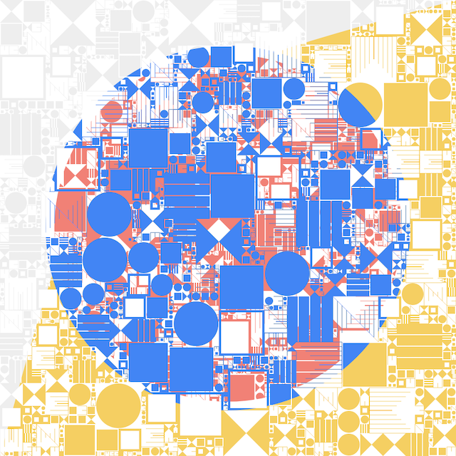

Happy Pi Day!

### [Happy Pi Day!]()

Congratulations to [Emma Haruka Iwao](https://twitter.com/Yuryu) for breaking the Pi digits world record by calculating 31,415,926,535,897 (31.4+ trillion) digits on Google Cloud Platform! Read Emma’s [Calculating a record-breaking 31.4 trillion digits](https://cloud.google.com/blog/products/compute/calculating-31-4-trillion-digits-of-archimedes-constant-on-google-cloud) blog to learn more.

The Pi API is now serving all 31,415,926,535,897 digits! The Pi API can be used to build some fun demos, including listening and visualizing Pi digits.

### [Art]()

In anticipation of [Google Cloud Next 2019 in San Francisco](https://cloud.withgoogle.com/next/sf), a team created the [Pi Experiment Showcase](https://showcase.withgoogle.com/experiment-detail/pi), and uses the Pi API & generative algorithm to generate unique art pieces for each of the 31.4 trillion digits of Pi.

Here is an art piece to the first 11 digits of [e](https://en.wikipedia.org/wiki/E_(mathematical_constant)) (2.7182818284):

Learn more about the world record & generate your own unique art piece from the [Pi Experiment Showcase](https://showcase.withgoogle.com/experiment-detail/pi).

### [Listen]()

What does Pi sound like? Each Pi digit is converted to a musical note so you can get to know Pi via music! With 31.4 trillion digits and playing at 314BPM, it’ll play for ~100 billion minutes, or ~190,355 years.

 Starting Digit    BPM    Scale  C Major

Click Start to listen to Pi

-
-
-
-
-
-
-
-
-
-
-
-
-
-
-
-
-
-
-
-
-
-
-
-
-
-
-
-
-
-
-
-
-
-
-

### [Visualize]()

Visualize transitions from one digit to the next in Pi using D3.js. Each transition draws a line from a digit in the circle to another digit. Once you have a large amount of digits you can see which digits transition more often and which digits are more common.

'%3e%3cdefs id='transition-defs'%3e%3c/defs%3e%3cg class='digitArc'%3e%3cpath id='digitArc0' d='M1.4171612759733174e-14%2c-231.44000000000003A231.44000000000003%2c231.44000000000003 0 0%2c1 136.03701879057%2c-187.23889317813786L123.67001708233636%2c-170.21717561648896A210.4%2c210.4 0 0%2c0 1.2883284327030156e-14%2c-210.4Z' style='fill: rgb(31%2c 119%2c 180)%3b stroke: rgb(31%2c 119%2c 180)%3b'%3e%3c/path%3e%3ctext x='4' dy='16.83200000000002' font-size='16.83200000000002'%3e%3ctextPath xlink:href='%23digitArc0'%3e0%3c/textPath%3e%3c/text%3e%3c/g%3e%3cg class='digitArc'%3e%3cpath id='digitArc1' d='M136.03701879057%2c-187.23889317813786A231.44000000000003%2c231.44000000000003 0 0%2c1 220.11252013135035%2c-71.51889317813783L200.1022910285003%2c-65.01717561648893A210.4%2c210.4 0 0%2c0 123.67001708233636%2c-170.21717561648896Z' style='fill: rgb(174%2c 199%2c 232)%3b stroke: rgb(174%2c 199%2c 232)%3b'%3e%3c/path%3e%3ctext x='4' dy='16.83200000000002' font-size='16.83200000000002'%3e%3ctextPath xlink:href='%23digitArc1'%3e1%3c/textPath%3e%3c/text%3e%3c/g%3e%3cg class='digitArc'%3e%3cpath id='digitArc2' d='M220.11252013135035%2c-71.51889317813783A231.44000000000003%2c231.44000000000003 0 0%2c1 220.11252013135035%2c71.51889317813783L200.1022910285003%2c65.01717561648893A210.4%2c210.4 0 0%2c0 200.1022910285003%2c-65.01717561648893Z' style='fill: rgb(255%2c 127%2c 14)%3b stroke: rgb(255%2c 127%2c 14)%3b'%3e%3c/path%3e%3ctext x='4' dy='16.83200000000002' font-size='16.83200000000002'%3e%3ctextPath xlink:href='%23digitArc2'%3e2%3c/textPath%3e%3c/text%3e%3c/g%3e%3cg class='digitArc'%3e%3cpath id='digitArc3' d='M220.11252013135035%2c71.51889317813783A231.44000000000003%2c231.44000000000003 0 0%2c1 136.03701879057%2c187.23889317813786L123.67001708233636%2c170.21717561648896A210.4%2c210.4 0 0%2c0 200.1022910285003%2c65.01717561648893Z' style='fill: rgb(255%2c 187%2c 120)%3b stroke: rgb(255%2c 187%2c 120)%3b'%3e%3c/path%3e%3ctext x='4' dy='16.83200000000002' font-size='16.83200000000002'%3e%3ctextPath xlink:href='%23digitArc3'%3e3%3c/textPath%3e%3c/text%3e%3c/g%3e%3cg class='digitArc'%3e%3cpath id='digitArc4' d='M136.03701879057%2c187.23889317813786A231.44000000000003%2c231.44000000000003 0 0%2c1 1.4171612759733174e-14%2c231.44000000000003L1.2883284327030156e-14%2c210.4A210.4%2c210.4 0 0%2c0 123.67001708233636%2c170.21717561648896Z' style='fill: rgb(44%2c 160%2c 44)%3b stroke: rgb(44%2c 160%2c 44)%3b'%3e%3c/path%3e%3ctext x='4' dy='16.83200000000002' font-size='16.83200000000002'%3e%3ctextPath xlink:href='%23digitArc4'%3e4%3c/textPath%3e%3c/text%3e%3c/g%3e%3cg class='digitArc'%3e%3cpath id='digitArc5' d='M1.4171612759733174e-14%2c231.44000000000003A231.44000000000003%2c231.44000000000003 0 0%2c1 -136.03701879056996%2c187.23889317813786L-123.67001708233633%2c170.21717561648896A210.4%2c210.4 0 0%2c0 1.2883284327030156e-14%2c210.4Z' style='fill: rgb(152%2c 223%2c 138)%3b stroke: rgb(152%2c 223%2c 138)%3b'%3e%3c/path%3e%3ctext x='4' dy='16.83200000000002' font-size='16.83200000000002'%3e%3ctextPath xlink:href='%23digitArc5'%3e5%3c/textPath%3e%3c/text%3e%3c/g%3e%3cg class='digitArc'%3e%3cpath id='digitArc6' d='M-136.03701879056996%2c187.23889317813786A231.44000000000003%2c231.44000000000003 0 0%2c1 -220.11252013135035%2c71.51889317813786L-200.1022910285003%2c65.01717561648896A210.4%2c210.4 0 0%2c0 -123.67001708233633%2c170.21717561648896Z' style='fill: rgb(214%2c 39%2c 40)%3b stroke: rgb(214%2c 39%2c 40)%3b'%3e%3c/path%3e%3ctext x='4' dy='16.83200000000002' font-size='16.83200000000002'%3e%3ctextPath xlink:href='%23digitArc6'%3e6%3c/textPath%3e%3c/text%3e%3c/g%3e%3cg class='digitArc'%3e%3cpath id='digitArc7' d='M-220.11252013135035%2c71.51889317813786A231.44000000000003%2c231.44000000000003 0 0%2c1 -220.11252013135038%2c-71.5188931781378L-200.10229102850033%2c-65.01717561648891A210.4%2c210.4 0 0%2c0 -200.1022910285003%2c65.01717561648896Z' style='fill: rgb(255%2c 152%2c 150)%3b stroke: rgb(255%2c 152%2c 150)%3b'%3e%3c/path%3e%3ctext x='4' dy='16.83200000000002' font-size='16.83200000000002'%3e%3ctextPath xlink:href='%23digitArc7'%3e7%3c/textPath%3e%3c/text%3e%3c/g%3e%3cg class='digitArc'%3e%3cpath id='digitArc8' d='M-220.11252013135038%2c-71.5188931781378A231.44000000000003%2c231.44000000000003 0 0%2c1 -136.03701879057002%2c-187.23889317813783L-123.67001708233637%2c-170.21717561648893A210.4%2c210.4 0 0%2c0 -200.10229102850033%2c-65.01717561648891Z' style='fill: rgb(148%2c 103%2c 189)%3b stroke: rgb(148%2c 103%2c 189)%3b'%3e%3c/path%3e%3ctext x='4' dy='16.83200000000002' font-size='16.83200000000002'%3e%3ctextPath xlink:href='%23digitArc8'%3e8%3c/textPath%3e%3c/text%3e%3c/g%3e%3cg class='digitArc'%3e%3cpath id='digitArc9' d='M-136.03701879057002%2c-187.23889317813783A231.44000000000003%2c231.44000000000003 0 0%2c1 -4.2514838279199514e-14%2c-231.44000000000003L-3.864985298109047e-14%2c-210.4A210.4%2c210.4 0 0%2c0 -123.67001708233637%2c-170.21717561648893Z' style='fill: rgb(197%2c 176%2c 213)%3b stroke: rgb(197%2c 176%2c 213)%3b'%3e%3c/path%3e%3ctext x='4' dy='16.83200000000002' font-size='16.83200000000002'%3e%3ctextPath xlink:href='%23digitArc9'%3e9%3c/textPath%3e%3c/text%3e%3c/g%3e%3cg class='transition' fill='none'%3e%3c/g%3e%3c/g%3e%3c/svg%3e)

 Starting Digit

### [/v1/piGET]()

Get Pi Digits
Returns digits of Pi based on the `start` digit position and `numberOfDigits`.

There is no SLA on this service. We may require an API key in the future & or turn off the service. If you really want to use it, let us know!

- [curl](https://pi.delivery/#)
- [jQuery](https://pi.delivery/#)
- [Pi.js](https://pi.delivery/#)
- [Streaming](https://pi.delivery/#)

	$ curl 'https://api.pi.delivery/v1/pi?start=0&numberOfDigits=100'

### [Fetching Digits]()

This demo uses the REST API to fetch 100 digits of Pi from the specified starting point.

 Starting Digit
Press 'Fetch'

- [JavaScript](https://pi.delivery/#)
- [Request](https://pi.delivery/#)
- [Response](https://pi.delivery/#)

	var pi = new Pi();
	pi.get(0, 100, function(digits) {
	  ...
	});

### [Streaming Digit]()

This demo uses the streaming API to stream digits into the page.
 Starting Digit

- [JavaScript](https://pi.delivery/#)

	var streamer = new PiStream();
	streamer.listen(function(e) {
	  *// e.detail.position*
	  *// e.detail.digit*
	});
	*// optional (delay in milliseconds):*
	*// streamer.delay(314);*
	streamer.start();

### [Calculating Pi]()

In 2019, [Emma Haruka Iwao](https://twitter.com/Yuryu) broke the Pi digits world record by computing 31,415,926,535,897 digits of Pi using Google Cloud Platform! Learn more details from Emma’s [Calculating a record-breaking 31.4 trillion digits](https://cloud.google.com/blog/products/compute/calculating-31-4-trillion-digits-of-archimedes-constant-on-google-cloud) blog, and Alex Yee (creator of y-cruncher)’s [Google Cloud Topples the Pi record](http://www.numberworld.org/blogs/2019_3_14_pi_record/) article.

Back in 2017, we used [y-cruncher](http://www.numberworld.org/y-cruncher/) to calculate 750 billion digits of Pi on Google Compute Engine. We used a 64-core instance, with 416GB of RAM, and tons of Local SSD + Persistent SSD.

At its peak CPU utilization, it consumed all 64 cores, and 5+TB of SSD storage.
In 2018, we were able to recalculate 750 billion digits in just 10 hours!

We also calculated 1 trillion digits of Pi using a 96-core 14TB `n1-megamem-96` machine.

### [Serving the API]()

We developed the core backend using [gRPC](http://www.grpc.io/) and Go. The gRPC service has two methods - one is a unary request/response, and another that takes advantage of server side streaming.

We then use [grpc-gateway](https://github.com/grpc-ecosystem/grpc-gateway) to expose the unary request/response as RESTful service.

The service definition looks like this:

	syntax = "proto3";
	package piaas;
	import "google/api/annotations.proto";

	message Range {
	    int64 start = 1;
	    int64 numberOfDigits = 2;
	    int64 chunkSize = 3;
	}
	message ByteArray {
	    string content = 1;
	}
	service PiaaS {
	    rpc Get(Range) returns (ByteArray) {
	      option (google.api.http) = {
	        get: "/v1/pi"
	      };
	    }
	    rpc Stream(Range) returns (stream ByteArray);
	}

The RESTful API is also registered and managed by [Google Cloud Endpoint](https://cloud.google.com/endpoints/), so that we can easily monitor and manage service deployments.

The services are deployed into a [Google Container Engine](https://cloud.google.com/container-engine/) (managed Kubernetes) cluster. The API endpoint, `api.pi.delivery` is exposed via a [Kubernetes Ingress](https://kubernetes.io/docs/user-guide/ingress/) that’ll automatically create a [Global HTTP(s) Load Balancer](https://cloud.google.com/load-balancing/).

We used [kube-logo](https://github.com/jetstack/kube-lego) to automatically provision a SSL certificate from [Let’s Encrypt](https://letsencrypt.org/) for HTTPS.

### [Serving This Site]()

Finally, this site is hosted on [Firebase Hosting](https://firebase.google.com/docs/hosting/), which not only automatically serves the static content via a CDN, it also automatically provisions a SSL certificate for custom domain!

### [Who are We?]()

We are part of the [Google Cloud Platform Developer Advocacy team](https://twitter.com/googlecloud/lists/developer-advocates).

The Pi API and its demos were created in 2017 by[Francesc Campoy](https://twitter.com/francesc),[Guillaume Laforge](https://twitter.com/glaforge),[Ian Lewis](https://twitter.com/ianmlewis),[Ray Tsang](https://twitter.com/saturnism),[Sandeep Dinesh](https://twitter.com/SandeepDinesh)

In the past, different members of the team worked on different Pi Day demos!

In 2016, we calculated 500 billion digits of Pi and made it searchable. The indexing peaked at 2-million writes per second. You can learn more how we did that in the blog [Calculating and searching 500 billion digits of Pi](https://cloudplatform.googleblog.%20%20com/2016/03/calculating-and-searching-500-billion-digits-of-Pi.html), by [Francesc Campoy](https://twitter.com/francesc),[Jen Tong](https://twitter.com/MimmingCodes),[Ray Tsang](https://twitter.com/saturnism),[Sara Robinson](https://twitter.com/SRobTweets)

In 2015, we calculated [250 billion digits of Pi](https://twitter.com/gregsramblings/status/576783110899027969), by[Greg Wilson](https://twitter.com/gregsramblings),[Ray Tsang](https://twitter.com/saturnism)