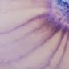
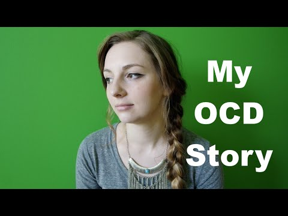

Harm OCD | Intrusive Thoughts

     

# Living with Harm OCD

## **What’s Going On?**

Harm OCD is a common subset of OCD in which sufferers are constantly worried about causing harm to others. These thoughts are so common that 85% of the non-OCD population admits to having unwanted violent thoughts, including thoughts about harming themselves and loved ones.

However, for Harm OCD sufferers, the presence and frequency of these thoughts is debilitating. They are far more upsetting than occasional images or thoughts of violence. They are repetitive, graphic and can get in the way of completing simple, day-to-day tasks.

 [Harm OCD](https://www.intrusivethoughts.org/ocd-symptoms/harm-ocd/#)

 

 [  ![](data:image/svg+xml,%3csvg class='svg-inline--fa js-evernote-checked' xmlns='http://www.w3.org/2000/svg' viewBox='0 0 512 512' data-evernote-id='294'%3e%3cpath d='M459.37 151.716c.325 4.548.325 9.097.325 13.645 0 138.72-105.583 298.558-298.558 298.558-59.452 0-114.68-17.219-161.137-47.106 8.447.974 16.568 1.299 25.34 1.299 49.055 0 94.213-16.568 130.274-44.832-46.132-.975-84.792-31.188-98.112-72.772 6.498.974 12.995 1.624 19.818 1.624 9.421 0 18.843-1.3 27.614-3.573-48.081-9.747-84.143-51.98-84.143-102.985v-1.299c13.969 7.797 30.214 12.67 47.431 13.319-28.264-18.843-46.781-51.005-46.781-87.391 0-19.492 5.197-37.36 14.294-52.954 51.655 63.675 129.3 105.258 216.365 109.807-1.624-7.797-2.599-15.918-2.599-24.04 0-57.828 46.782-104.934 104.934-104.934 30.213 0 57.502 12.67 76.67 33.137 23.715-4.548 46.456-13.32 66.599-25.34-7.798 24.366-24.366 44.833-46.132 57.827 21.117-2.273 41.584-8.122 60.426-16.243-14.292 20.791-32.161 39.308-52.628 54.253z' data-evernote-id='295' class='js-evernote-checked'%3e%3c/path%3e%3c/svg%3e)](https://twitter.com/intent/tweet?text=Harm%20OCD&url=https://www.intrusivethoughts.org/ocd-symptoms/harm-ocd/)

Professional Perspective

## What is Harm OCD?

### **Common Harm OCD obsessions:**

- Fear of harming yourself, a loved one or a stranger.
- Fear of losing consciousness and harming someone.
- Fear of accidentally poisoning someone.

* * *

### **Common Harm OCD compulsions:**

#### **Hiding everyday objects.**

The impulse to hide potentially harmful things. Kitchen knives. Ropes. Scissors. Forks.

#### **Checking.**

Making sure you didn’t accidentally put poison in someone’s food or drink.

#### **Reassurance. **

Constantly seeking reassurance from others.

#### **Research. **

Looking up convicted criminals who have harmed others online and creating profiles to prove that you don’t have the same characteristics.

* * *

### **Common misconceptions about Harm OCD:**

- OCD only comes in one, general type. Subsets like Harm OCD don’t exist.
- Having these thoughts is a reflection of your character and moral compass.
- Someone with Harm OCD is more likely to act on their thoughts than a non-sufferer.

#### Related Articles

 [Talking Harm OCD with Dr. Steven Phillipson](https://www.intrusivethoughts.org/blog/talking-harm-ocd-dr-stephen-phillipson/)

   [13 Signs That You Might Have Harm OCD](https://www.intrusivethoughts.org/blog/13-signs-might-harm-ocd/)

   [OCD and “Checking” our Emotions](https://www.intrusivethoughts.org/blog/ocd-checking-emotions/)

   [El TOC y “Chequear” Tus Emociones](https://www.intrusivethoughts.org/blog/el-toc-y-chequear-tus-emociones/)

 [See All](https://www.intrusivethoughts.org/blog/harm-ocd)

## From the Community

Harm OCD - My OCD Story

Harm OCD and Intrusive Thoughts

Extreme OCD Made Me Believe I Was A Murderer

### **How Do I Know it’s OCD?**

Thinking about hurting others or yourself is actually quite common. Most people are prone to violent thoughts or images popping into their heads. However, for people with Harm OCD, these thoughts can cause extreme anxiety and discomfort. No matter how hard you try to get rid of them, they won’t go away.

Having intrusive thoughts does not make you a bad person. They are a misfiring in the brain, not a reflection of your character.

#### **Everyday examples: **

- Pulling out a kitchen knife and immediately thinking about how it could be used to harm your partner.
- Thinking about pushing someone in front of an oncoming car.
- Considering all the ways you’d commit suicide.
- Fixating on strangling someone that you care deeply about.

### **How can my family help with my Harm OCD?**

Many sufferers feel extreme shame when disclosing their Harm OCD thoughts to loved ones. [Family](https://www.intrusivethoughts.org/topic/ocd-and-family/) members and friends must remember to be open minded and supportive. However, it’s important to not provide reassurance. Doing so can make things worse.

Saying things like “*You wouldn’t hurt a fly.” or  “I’ve known you my whole life, you’d never do anything violent.” *may provide momentary relief, but can strengthen intrusive thoughts long term. Getting used to this can take time. The support often comes from bringing up specific thoughts or associations, and lightheartedly joking about them. It may sound silly, but it can help the sufferer while they go through treatment.

### **Is Recovery Possible for Me?**

Yes! Recovery is possible and treatment can help. This subtype of OCD is best treated with [**Exposure Response Prevention Therapy (ERP)**](https://www.intrusivethoughts.org/ocd-treatment/ocd-therapy/). ERP is when you voluntarily expose yourself to the source of your fear over and over and over again, without acting out any compulsion to neutralize or stop the fear. By repeatedly facing something you’re afraid of, you force your brain to recognize how irrational it is.

A common misconception about Harm OCD [treatment](https://www.intrusivethoughts.org/ocd-treatment/) is that the goal is to prove you’re not a danger to yourself or others. It’s important to know that this isn’t a true goal, and no clinical psychologist should ever suggest it. You are NOT a threat. A Harm OCD sufferer is no more likely to act on a negative thought than a non-sufferer.

#### **Examples of ERP treatment:**

- To start, you may be asked carry a plastic fork or plastic knife in your pocket and create an association with that item.
- As time goes on, you’ll build on these items until you’re carrying more threatening objects like sharp kitchen knives or scissors.

There are other treatment options as well. [Mindfulness](https://www.intrusivethoughts.org/topic/mindfulness/)-based [**Cognitive Behavioral Therapy**](https://www.intrusivethoughts.org/ocd-treatment/ocd-therapy/), also known as CBT, teaches people to identify, understand and change negative thinking patterns and behaviors. Patients are taught problem-solving skills during therapy lessons and then instructed to practice them on their own time in order to build positive habits.

### **Can medication help?**

[Medication](https://www.intrusivethoughts.org/ocd-treatment/ocd-medication/) can help alongside ERP, but it shouldn’t replace it. Doctors should always be consulted before considering medicinal options.

The main family of medicines used to treat OCD are known as **Selective Serotonin Reuptake Inhibitors**, or **SSRIs**. SSRIs enhance your natural serotonin activity and are used to treat major depressive disorders and anxiety conditions. Examples include Lexapro, Prozac, Paxil and Zoloft.

### **What is the goal of therapy?**

In order for you to get better, you need to accept your intrusive thoughts and not assign them any meaning. Do not let them convince you that you’re a dangerous person. You’re not. Some people with Harm OCD recover completely through ERP. But for many, their obsessions never fully go away. OCD recovery has more to do with managing the condition, than it does with eliminating it. However, that doesn’t mean you can’t lead a healthy, happy life. By prioritizing treatment and positive lifestyle habits, sufferers often gain confidence and freedom. Even if some anxiety is still present by the end of therapy, you’ll no longer feel debilitated by the condition.

*If you suffer from OCD, you have a severe anxiety disorder that can be treated. Start by [**getting educated**](http://www.intrusivethoughts.org/ocd-treatment/) on the disorder and making healthy living choices. From there, find a clinical psychologist in your area that is an expert in OCD and [**Exposure Response Prevention (ERP)**](http://www.intrusivethoughts.org/ocd-treatment/ocd-therapy).*

Explore

 [Treatment](https://www.intrusivethoughts.org/ocd-treatment)

## Empower yourself with relatable stories, news and professional tips.

 Follow us on    [![](data:image/svg+xml,%3csvg class='svg-inline--fa js-evernote-checked' xmlns='http://www.w3.org/2000/svg' viewBox='0 0 512 512' data-evernote-id='500'%3e%3cpath d='M459.37 151.716c.325 4.548.325 9.097.325 13.645 0 138.72-105.583 298.558-298.558 298.558-59.452 0-114.68-17.219-161.137-47.106 8.447.974 16.568 1.299 25.34 1.299 49.055 0 94.213-16.568 130.274-44.832-46.132-.975-84.792-31.188-98.112-72.772 6.498.974 12.995 1.624 19.818 1.624 9.421 0 18.843-1.3 27.614-3.573-48.081-9.747-84.143-51.98-84.143-102.985v-1.299c13.969 7.797 30.214 12.67 47.431 13.319-28.264-18.843-46.781-51.005-46.781-87.391 0-19.492 5.197-37.36 14.294-52.954 51.655 63.675 129.3 105.258 216.365 109.807-1.624-7.797-2.599-15.918-2.599-24.04 0-57.828 46.782-104.934 104.934-104.934 30.213 0 57.502 12.67 76.67 33.137 23.715-4.548 46.456-13.32 66.599-25.34-7.798 24.366-24.366 44.833-46.132 57.827 21.117-2.273 41.584-8.122 60.426-16.243-14.292 20.791-32.161 39.308-52.628 54.253z' data-evernote-id='501' class='js-evernote-checked'%3e%3c/path%3e%3c/svg%3e)](https://twitter.com/lifebeyondocd)  [![](data:image/svg+xml,%3csvg class='svg-inline--fa js-evernote-checked' xmlns='http://www.w3.org/2000/svg' viewBox='0 0 448 512' data-evernote-id='503'%3e%3cpath d='M224.1 141c-63.6 0-114.9 51.3-114.9 114.9s51.3 114.9 114.9 114.9S339 319.5 339 255.9 287.7 141 224.1 141zm0 189.6c-41.1 0-74.7-33.5-74.7-74.7s33.5-74.7 74.7-74.7 74.7 33.5 74.7 74.7-33.6 74.7-74.7 74.7zm146.4-194.3c0 14.9-12 26.8-26.8 26.8-14.9 0-26.8-12-26.8-26.8s12-26.8 26.8-26.8 26.8 12 26.8 26.8zm76.1 27.2c-1.7-35.9-9.9-67.7-36.2-93.9-26.2-26.2-58-34.4-93.9-36.2-37-2.1-147.9-2.1-184.9 0-35.8 1.7-67.6 9.9-93.9 36.1s-34.4 58-36.2 93.9c-2.1 37-2.1 147.9 0 184.9 1.7 35.9 9.9 67.7 36.2 93.9s58 34.4 93.9 36.2c37 2.1 147.9 2.1 184.9 0 35.9-1.7 67.7-9.9 93.9-36.2 26.2-26.2 34.4-58 36.2-93.9 2.1-37 2.1-147.8 0-184.8zM398.8 388c-7.8 19.6-22.9 34.7-42.6 42.6-29.5 11.7-99.5 9-132.1 9s-102.7 2.6-132.1-9c-19.6-7.8-34.7-22.9-42.6-42.6-11.7-29.5-9-99.5-9-132.1s-2.6-102.7 9-132.1c7.8-19.6 22.9-34.7 42.6-42.6 29.5-11.7 99.5-9 132.1-9s102.7-2.6 132.1 9c19.6 7.8 34.7 22.9 42.6 42.6 11.7 29.5 9 99.5 9 132.1s2.7 102.7-9 132.1z' data-evernote-id='504' class='js-evernote-checked'%3e%3c/path%3e%3c/svg%3e)](https://www.instagram.com/lifebeyondocd/)  