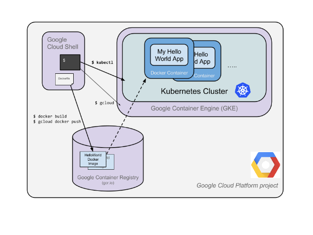

Hello Node Kubernetes Codelab

## 1. Introduction

The goal of this codelab is for you to turn your code (a simple Hello World node.js app here) into a replicated application running on [Kubernetes](http://kubernetes.io/). We will show you how to take code that you have developed on your machine, turn it into a Docker container image, and then run that image on [Google Container Engine](https://cloud.google.com/container-engine/).

Here's a diagram of the various parts in play in this codelab to help you understand how pieces fit with one another. Use this as a reference as we progress through the codelab; it should all make sense by the time we get to the end (but feel free to ignore this for now).

Kubernetes is an open source project (available on [kubernetes.io](http://kubernetes.io/)) which can run on many different environments, from laptops to high-availability multi-node clusters, from public clouds to on-premise deployments, from virtual machines to bare metal.

For the purpose of this codelab, using a managed environment such as Google Container Engine (a Google-hosted version of Kubernetes running on Compute Engine) will allow you to focus more on experiencing Kubernetes rather than setting up the underlying infrastructure.

If you are interested in running Kubernetes on your local machine, say a development laptop, you should probably look into **Minikube**: http://kubernetes.io/docs/getting-started-guides/minikube/. This offers a simple setup of a single node kubernetes cluster for development and testing purposes. You can use Minikube to go through this codelab if you wish.

# Hello Node Kubernetes Codelab

 59 min remaining

   *1*Introduction    *2*Setup and Requirements    *3*Create your Node.js application    *4*Create a Docker container image    *5*Create your cluster    *6*Create your pod    *7*Allow external traffic    *8*Scale up your service    *9*Roll out an upgrade to your service    *10*Observe the Kubernetes Graphical dashboard (optional)    *11*That's it! Time to tear it down    *12*What's next?

[(L)](https://codelabs.developers.google.com/codelabs/cloud-hello-kubernetes/index.html?index=#)Window size:  x

Viewport size:  x