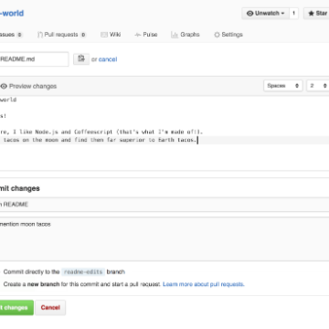

Hello World · GitHub Guides

Hello World · GitHub Guides

https://guides.github.com/activities/hello-world/

Hello World 10 minute read Intro What is GitHub? Create a Repository Create a Branch Make a Commit Open a Pull Request Merge Pull Request The Hello World project is a time-honored tradition in computer programming. It is a simple exercise that gets you started when learning something new. Let’s get started with GitHub! You’ll learn how to: Create and use a repository Start and manage a new branch Make changes to a file and push them to GitHub as commits Open and merge a pull request What is GitHub? GitHub is a code hosting platform for version control and collaboration. It lets you and others work together on projects from anywhere.