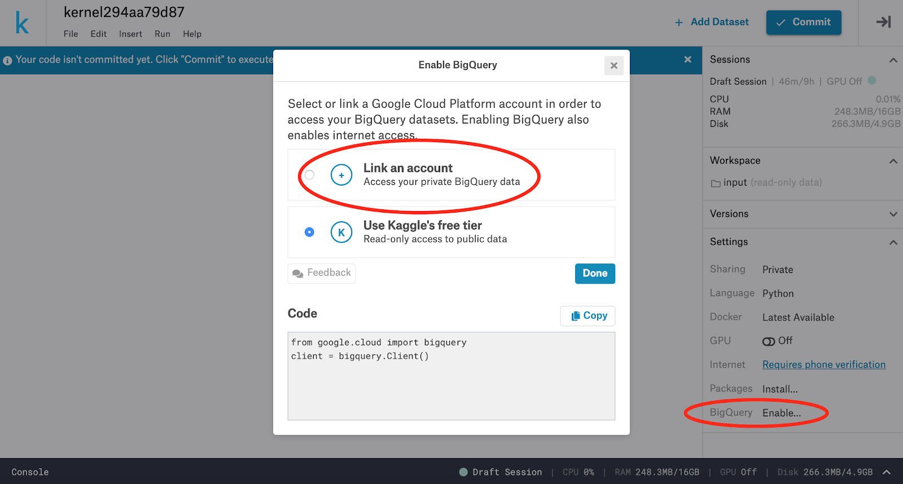
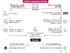
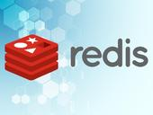

Here comes the analytics buying spree. Who's next?

    Must read:   [The Windows 10 misinformation machine fires up again](https://www.zdnet.com/article/the-windows-10-misinformation-machine-fires-up-again/)

# Google Cloud integrates Kaggle with BigQuery

The integration of data science community with BiqQuery will enable customers use SQL more with machine learning and share their work.

 

By [Larry Dignan](https://www.zdnet.com/meet-the-team/us/larry-dignan/) for [Between the Lines](https://www.zdnet.com/blog/btl/) | June 24, 2019 -- 17:00 GMT (18:00 BST) | Topic: [Cloud](https://www.zdnet.com/topic/cloud/)

- [0](https://www.zdnet.com/article/google-cloud-integrates-kaggle-with-bigquery/#comments-b2dad1cf-60ef-4d42-a13d-c8bf798d5f66)

- 

- 

- 

- 

- 

 ![](data:image/svg+xml,%3csvg xmlns='http://www.w3.org/2000/svg' class='svg-symbol playerControls js-evernote-checked' data-evernote-id='335'%3e%3csymbol id='play' viewBox='0 0 26.6 32' data-evernote-id='2414' class='js-evernote-checked'%3e%3cpath d='M0%2c2.6c0-2.4%2c1.6-3.3%2c3.7-2L25%2c13.7c2%2c1.3%2c2%2c3.2%2c0%2c4.5L3.7%2c31.4c-2%2c1.3-3.7%2c0.3-3.7-2C0%2c29.4%2c0%2c2.6%2c0%2c2.6z' data-evernote-id='2415' class='js-evernote-checked'%3e%3c/path%3e%3c/symbol%3e%3csymbol id='pause' viewBox='0 0 26.6 32' data-evernote-id='2416' class='js-evernote-checked'%3e%3cg data-evernote-id='2417' class='js-evernote-checked'%3e%3cpolygon points='16%2c32 26.5%2c32 26.5%2c8.8 26.5%2c0 16%2c0' data-evernote-id='2418' class='js-evernote-checked'%3e%3c/polygon%3e%3crect x='0.1' y='0' width='10.6' height='32' data-evernote-id='2419' class='js-evernote-checked'%3e%3c/rect%3e%3c/g%3e%3c/symbol%3e%3csymbol id='playlist' viewBox='0 0 32 22.9' data-evernote-id='2420' class='js-evernote-checked'%3e%3cg data-evernote-id='2421' class='js-evernote-checked'%3e%3ccircle class='st11 js-evernote-checked' cx='2.3' cy='20.6' r='2.3' data-evernote-id='2422'%3e%3c/circle%3e%3ccircle class='st11 js-evernote-checked' cx='2.3' cy='11.4' r='2.3' data-evernote-id='2423'%3e%3c/circle%3e%3ccircle class='st11 js-evernote-checked' cx='2.3' cy='2.3' r='2.3' data-evernote-id='2424'%3e%3c/circle%3e%3cpath class='st11 js-evernote-checked' d='M32%2c1.1C32%2c0.5%2c31.5%2c0%2c30.9%2c0H10.3C9.7%2c0%2c9.1%2c0.5%2c9.1%2c1.1v2.3c0%2c0.6%2c0.5%2c1.1%2c1.1%2c1.1h20.6c0.6%2c0%2c1.1-0.5%2c1.1-1.1V1.1z' data-evernote-id='2425'%3e%3c/path%3e%3cpath class='st11 js-evernote-checked' d='M32%2c10.3c0-0.6-0.5-1.1-1.1-1.1H10.3c-0.6%2c0-1.1%2c0.5-1.1%2c1.1v2.3c0%2c0.6%2c0.5%2c1.1%2c1.1%2c1.1h20.6c0.6%2c0%2c1.1-0.5%2c1.1-1.1V10.3z' data-evernote-id='2426'%3e%3c/path%3e%3cpath class='st11 js-evernote-checked' d='M32%2c19.4c0-0.6-0.5-1.1-1.1-1.1H10.3c-0.6%2c0-1.1%2c0.5-1.1%2c1.1v2.3c0%2c0.6%2c0.5%2c1.1%2c1.1%2c1.1h20.6c0.6%2c0%2c1.1-0.5%2c1.1-1.1V19.4z' data-evernote-id='2427'%3e%3c/path%3e%3c/g%3e%3c/symbol%3e%3csymbol id='speaker-on' viewBox='0 0 32 28.1' data-evernote-id='2428' class='js-evernote-checked'%3e%3cg data-evernote-id='2429' class='js-evernote-checked'%3e%3cg data-evernote-id='2430' class='js-evernote-checked'%3e%3cpath d='M12.6%2c5L6.3%2c8.7H0.6C0.3%2c8.7%2c0%2c9%2c0%2c9.3V19c0%2c0.4%2c0.3%2c0.7%2c0.6%2c0.7h5.9l6.1%2c3.4c1.3%2c0.8%2c1.5%2c0.2%2c1.5-1.5V6.5C14.2%2c4.8%2c13.9%2c4.2%2c12.6%2c5z' data-evernote-id='2431' class='js-evernote-checked'%3e%3c/path%3e%3c/g%3e%3cpath d='M18%2c23.1v-2.8c2.6%2c0%2c4.7-2.8%2c4.7-6.2S20.6%2c7.8%2c18%2c7.8V5c4.2%2c0%2c7.5%2c4%2c7.5%2c9S22.1%2c23.1%2c18%2c23.1z' data-evernote-id='2432' class='js-evernote-checked'%3e%3c/path%3e%3cpath d='M21.3%2c28.1v-2.8c4.4%2c0%2c7.9-5%2c7.9-11.2S25.6%2c2.8%2c21.3%2c2.8V0C27.2%2c0%2c32%2c6.3%2c32%2c14C32%2c21.8%2c27.2%2c28.1%2c21.3%2c28.1z' data-evernote-id='2433' class='js-evernote-checked'%3e%3c/path%3e%3c/g%3e%3c/symbol%3e%3csymbol id='speaker-off' viewBox='0 0 32 18.8' data-evernote-id='2434' class='js-evernote-checked'%3e%3cg data-evernote-id='2435' class='js-evernote-checked'%3e%3cg data-evernote-id='2436' class='js-evernote-checked'%3e%3cpath d='M12.6%2c0.4L6.3%2c4H0.6C0.3%2c4%2c0%2c4.3%2c0%2c4.7v9.7c0%2c0.4%2c0.3%2c0.7%2c0.6%2c0.7h5.9l6.1%2c3.4c1.3%2c0.8%2c1.5%2c0.2%2c1.5-1.5V1.8C14.2%2c0.2%2c13.9-0.5%2c12.6%2c0.4z' data-evernote-id='2437' class='js-evernote-checked'%3e%3c/path%3e%3c/g%3e%3cpolygon points='32%2c4.5 30.2%2c2.7 25.3%2c7.6 20.4%2c2.7 18.6%2c4.5 23.5%2c9.4 18.6%2c14.3 20.4%2c16.1 25.3%2c11.2 30.2%2c16.1 32%2c14.3 27.1%2c9.4 ' data-evernote-id='2438' class='js-evernote-checked'%3e%3c/polygon%3e%3c/g%3e%3c/symbol%3e%3csymbol id='captions' viewBox='0 0 32 16.2' data-evernote-id='2439' class='js-evernote-checked'%3e%3cg data-evernote-id='2440' class='js-evernote-checked'%3e%3cpath d='M8.6%2c16.2c-1.2%2c0-2.4-0.2-3.4-0.6c-1.1-0.4-2-0.9-2.7-1.6c-0.8-0.7-1.4-1.6-1.8-2.6C0.2%2c10.4%2c0%2c9.3%2c0%2c8.1c0-1.2%2c0.2-2.3%2c0.7-3.3s1-1.8%2c1.8-2.6C3.2%2c1.5%2c4.1%2c1%2c5.2%2c0.6S7.4%2c0%2c8.6%2c0c1%2c0%2c1.9%2c0.1%2c2.7%2c0.4c0.8%2c0.3%2c1.4%2c0.6%2c2%2c1.1c0.6%2c0.4%2c1.1%2c0.9%2c1.4%2c1.5c0.4%2c0.5%2c0.7%2c1.1%2c0.9%2c1.6l-4.1%2c1.9c-0.1-0.3-0.2-0.6-0.4-0.9C11%2c5.3%2c10.8%2c5%2c10.5%2c4.8c-0.3-0.2-0.6-0.4-0.9-0.5c-0.3-0.1-0.7-0.2-1-0.2C8%2c4.2%2c7.5%2c4.3%2c7%2c4.5C6.6%2c4.7%2c6.2%2c5%2c5.8%2c5.3C5.5%2c5.7%2c5.2%2c6.1%2c5.1%2c6.5C4.9%2c7%2c4.8%2c7.5%2c4.8%2c8.1c0%2c0.5%2c0.1%2c1.1%2c0.3%2c1.5c0.2%2c0.5%2c0.4%2c0.9%2c0.8%2c1.2c0.3%2c0.4%2c0.7%2c0.6%2c1.2%2c0.8C7.5%2c11.9%2c8%2c12%2c8.6%2c12c0.3%2c0%2c0.7-0.1%2c1-0.2c0.3-0.1%2c0.6-0.3%2c0.9-0.5c0.3-0.2%2c0.5-0.4%2c0.7-0.7c0.2-0.3%2c0.3-0.6%2c0.4-0.9l4.1%2c1.9c-0.2%2c0.5-0.5%2c1-0.9%2c1.6c-0.4%2c0.5-0.9%2c1-1.4%2c1.5c-0.6%2c0.4-1.2%2c0.8-2%2c1.1C10.5%2c16%2c9.6%2c16.2%2c8.6%2c16.2z' data-evernote-id='2441' class='js-evernote-checked'%3e%3c/path%3e%3cpath d='M24.9%2c16.2c-1.2%2c0-2.4-0.2-3.4-0.6c-1.1-0.4-2-0.9-2.7-1.6c-0.8-0.7-1.4-1.6-1.8-2.6c-0.4-1-0.7-2.1-0.7-3.3c0-1.2%2c0.2-2.3%2c0.7-3.3c0.4-1%2c1-1.8%2c1.8-2.6c0.8-0.7%2c1.7-1.3%2c2.7-1.7C22.6%2c0.2%2c23.7%2c0%2c24.9%2c0c1%2c0%2c1.9%2c0.1%2c2.7%2c0.4c0.8%2c0.3%2c1.4%2c0.6%2c2%2c1.1c0.6%2c0.4%2c1.1%2c0.9%2c1.4%2c1.5C31.5%2c3.5%2c31.8%2c4%2c32%2c4.5l-4.1%2c1.9c-0.1-0.3-0.2-0.6-0.4-0.9c-0.2-0.3-0.4-0.5-0.7-0.7c-0.3-0.2-0.6-0.4-0.9-0.5c-0.3-0.1-0.7-0.2-1-0.2c-0.6%2c0-1.1%2c0.1-1.5%2c0.3c-0.5%2c0.2-0.9%2c0.5-1.2%2c0.8c-0.3%2c0.4-0.6%2c0.8-0.8%2c1.2c-0.2%2c0.5-0.3%2c1-0.3%2c1.5c0%2c0.5%2c0.1%2c1.1%2c0.3%2c1.5c0.2%2c0.5%2c0.4%2c0.9%2c0.8%2c1.2c0.3%2c0.4%2c0.7%2c0.6%2c1.2%2c0.8c0.5%2c0.2%2c1%2c0.3%2c1.5%2c0.3c0.3%2c0%2c0.7-0.1%2c1-0.2c0.3-0.1%2c0.6-0.3%2c0.9-0.5c0.3-0.2%2c0.5-0.4%2c0.7-0.7c0.2-0.3%2c0.3-0.6%2c0.4-0.9l4.1%2c1.9c-0.2%2c0.5-0.5%2c1-0.9%2c1.6c-0.4%2c0.5-0.9%2c1-1.4%2c1.5c-0.6%2c0.4-1.2%2c0.8-2%2c1.1C26.8%2c16%2c25.9%2c16.2%2c24.9%2c16.2z' data-evernote-id='2442' class='js-evernote-checked'%3e%3c/path%3e%3c/g%3e%3c/symbol%3e%3csymbol id='share' viewBox='0 0 32 20' data-evernote-id='2443' class='js-evernote-checked'%3e%3cpath d='M20%2c6c0%2c0-7.9-0.1-13.2%2c3.3C1.6%2c12.7%2c0%2c20%2c0%2c20s5.1-5.4%2c9.8-7.2C14.9%2c10.9%2c20%2c12%2c20%2c12v6l12-8L20%2c0V6z' data-evernote-id='2444' class='js-evernote-checked'%3e%3c/path%3e%3c/symbol%3e%3csymbol id='fullscreen' viewBox='0 0 32 32' data-evernote-id='2445' class='js-evernote-checked'%3e%3cg data-evernote-id='2446' class='js-evernote-checked'%3e%3cg data-evernote-id='2447' class='js-evernote-checked'%3e%3cpolygon class='st11 js-evernote-checked' points='11.4%2c0 0%2c0 0%2c11.4 3.4%2c8 9.1%2c13.7 13.7%2c9.1 8%2c3.4 ' data-evernote-id='2448'%3e%3c/polygon%3e%3c/g%3e%3cg data-evernote-id='2449' class='js-evernote-checked'%3e%3cpolygon class='st11 js-evernote-checked' points='20.6%2c32 32%2c32 32%2c20.6 28.6%2c24 22.9%2c18.3 18.3%2c22.9 24%2c28.6 ' data-evernote-id='2450'%3e%3c/polygon%3e%3c/g%3e%3cg data-evernote-id='2451' class='js-evernote-checked'%3e%3cpolygon class='st11 js-evernote-checked' points='32%2c11.4 32%2c0 20.6%2c0 24%2c3.4 18.3%2c9.1 22.9%2c13.7 28.6%2c8 ' data-evernote-id='2452'%3e%3c/polygon%3e%3c/g%3e%3cg data-evernote-id='2453' class='js-evernote-checked'%3e%3cpolygon class='st11 js-evernote-checked' points='0%2c20.6 0%2c32 11.4%2c32 8%2c28.6 13.7%2c22.9 9.1%2c18.3 3.4%2c24 ' data-evernote-id='2454'%3e%3c/polygon%3e%3c/g%3e%3c/g%3e%3c/symbol%3e%3csymbol id='video' viewBox='0 0 32 22' data-evernote-id='2455' class='js-evernote-checked'%3e%3cg data-evernote-id='2456' class='js-evernote-checked'%3e%3cpath d='M29%2c2.2c-0.7%2c0.2-4.6%2c3-7.9%2c5.3V2.1C21.1%2c1%2c20.1%2c0%2c19%2c0H2.1C1%2c0%2c0%2c1%2c0%2c2.1v17.7C0%2c21%2c1%2c22%2c2.1%2c22H19c1.2%2c0%2c2.1-1%2c2.1-2.1v-5.9c3.3%2c2.4%2c7.4%2c5.4%2c8.2%2c5.6c1.4%2c0.4%2c2.7-0.1%2c2.7-0.1V2.2C32%2c2.2%2c30.1%2c1.8%2c29%2c2.2z' data-evernote-id='2457' class='js-evernote-checked'%3e%3c/path%3e%3c/g%3e%3c/symbol%3e%3c/svg%3e)

none

Play Sound

### must read

 

 [Top cloud providers 2019: AWS, Microsoft Azure, Google Cloud](https://www.zdnet.com/article/top-cloud-providers-2019-aws-microsoft-azure-google-cloud-ibm-makes-hybrid-move-salesforce-dominates-saas/)

The cloud computing race in 2019 will have a definite multi-cloud spin.

 [Read More](https://www.zdnet.com/article/top-cloud-providers-2019-aws-microsoft-azure-google-cloud-ibm-makes-hybrid-move-salesforce-dominates-saas/)

Google Cloud said it has integrated Kaggle with its BigQuery, enterprise data warehouse. Kaggle, which was acquired by Google in March 2017, specializes in Jupyter notebooks used by data scientists.

The integration allows BigQuery customers use fast SQL queries, train machine learning models in SQL and analyze in Kaggle's [Jupyter notebook environment](https://www.zdnet.com/article/can-data-science-notebooks-get-real-jupyter-lab-releases-to-users/) called Kernels.

**Google Cloud Whitepapers: **[**Inside the API Product Mindset**](https://www.techrepublic.com/resource-library/whitepapers/inside-the-api-product-mindset/?ftag=CMG-01-10aaa1b)** | **[**Guide to Data Analytics and Machine Learning **](https://www.techrepublic.com/resource-library/whitepapers/cio-s-guide-to-data-analytics-and-machine-learning-copy1/?ftag=CMG-01-10aaa1b)**| **[**The Future of Cloud Computing**](https://www.techrepublic.com/resource-library/whitepapers/the-future-of-cloud-computing/?ftag=CMG-01-10aaa1b)** | **[**A Faster Path to the Cloud**](https://www.techrepublic.com/resource-library/whitepapers/a-faster-smarter-path-to-the-cloud/?ftag=CMG-01-10aaa1b)

[Google Cloud's Kaggle](https://www.zdnet.com/article/google-confirms-acquisition-of-data-science-firm-kaggle/) integration[follows the acquisition of Looker](https://www.zdnet.com/article/google-buys-looker-for-2-6-billion-aims-to-extend-its-analytics-reach-support-multiple-clouds/). [Large cloud providers](https://www.zdnet.com/article/top-cloud-providers-2019-aws-microsoft-azure-google-cloud-ibm-makes-hybrid-move-salesforce-dominates-saas/) are increasingly layering analytics and looking to court data scientists as well of line of business data consumers. For instance, [Salesforce acquired Tableau](https://www.zdnet.com/article/salesforces-15-7-billion-tableau-acquisition-everything-you-need-to-know/) and [consolidation in the analytics and data science space](https://www.zdnet.com/article/salesforce-tableau-other-bi-deals-flow-the-tallys-now-five-in-a-row/) has accelerated.

* * *

###  Must read

- [Enterprise AI and machine learning: Comparing the companies and applications](https://www.zdnet.com/article/guide-to-enterprise-ai-and-machine-learning-companies-and-applications/)
- [Executive's guide to prescriptive analytics](https://www.zdnet.com/article/executives-guide-to-prescriptive-analytics/)
- [Research: Tech leaders are eager to implement prescriptive analytics](https://www.zdnet.com/article/research-tech-leaders-are-eager-to-implement-prescriptive-analytics/)

* * *

### Special Feature

 

 [Special Report: How to Win with Prescriptive Analytics (free PDF)](https://www.techrepublic.com/resource-library/whitepapers/special-report-how-to-win-with-prescriptive-analytics-free-pdf/)

This ebook, based on the latest ZDNet / TechRepublic special feature, explores how you set up an analytics infrastructure that sees around corners and gives you options to avoid a head-on crash.

 [Read More](https://www.techrepublic.com/resource-library/whitepapers/special-report-how-to-win-with-prescriptive-analytics-free-pdf/)

Other perks of the BigQuery integration with Kaggle include:

- Kaggle Kernels access and ability to use an integrated development environment to hold data querying and analysis in one place.
- Google Cloud and Kernels notebooks and scripts are linked via the BigQuery API Client library.
- Kaggle's sharing platform.
- Access to the Kaggle community of more than 3 million users to share data science and open source work.

[Google Cloud](https://www.zdnet.com/article/what-google-cloud-platform-is-and-why-youd-use-it/) customers can get started by enabling their BigQuery accounts in its sandbox and then signing up for a Kaggle account and using notebooks as an option. [**Google Cloud Next: Everything you need to know about the new strategy**](https://www.zdnet.com/article/google-cloud-next-everything-you-need-to-know-about-the-new-strategy/)

###  Related stories

- [Descriptive, predictive, and prescriptive analytics: How are they different?](https://www.zdnet.com/article/descriptive-predictive-and-prescriptive-analytics-how-are-they-different/)
- [Your guide to prescriptive analytics](https://www.zdnet.com/article/your-guide-to-prescriptive-analytics/)
- [A guide for prescriptive analytics: The art and science of choosing and applying the right techniques](https://www.zdnet.com/article/a-guide-for-prescriptive-analytics-the-art-and-science-of-choosing-and-applying-the-right-techniques/)
- [5 myths about prescriptive analytics](https://www.zdnet.com/article/5-myths-about-prescriptive-analytics/)
- [How the NHL is planning on using data analytics to change the game for everyone](https://www.zdnet.com/article/how-the-nhl-is-planning-on-using-data-analytics-to-change-the-game-for-everyone/)
- [CIO Jury: Two-thirds of tech leaders are using prescriptive analytics](https://www.zdnet.com/article/cio-jury-two-thirds-of-tech-leaders-are-using-prescriptive-analytics/)

### Related Topics:

 [Big Data Analytics](https://www.zdnet.com/topic/big-data/)  [Digital Transformation](https://www.zdnet.com/topic/digital-transformation/)  [Data Centers](https://www.zdnet.com/topic/data-centers/)  [CXO](https://www.zdnet.com/topic/cxo/)  [Innovation](https://www.zdnet.com/topic/innovation/)  [Storage](https://www.zdnet.com/topic/storage/)

- [0](https://www.zdnet.com/article/google-cloud-integrates-kaggle-with-bigquery/#comments-b2dad1cf-60ef-4d42-a13d-c8bf798d5f66)

- 

- 

- 

- 

- 

[by Taboola](https://popup.taboola.com/en/?template=colorbox&utm_source=cbsinteractive-zdnet&utm_medium=referral&utm_content=alternating-thumbnails-a:ZDNETarticleDesktop/Tablet-Below%20Article%20Thumbnails:)

[Sponsored Links](https://popup.taboola.com/en/?template=colorbox&utm_source=cbsinteractive-zdnet&utm_medium=referral&utm_content=alternating-thumbnails-a:ZDNETarticleDesktop/Tablet-Below%20Article%20Thumbnails:)

Recommended For You

[(L)](https://responsiblelife.co.uk/rms/lifetime-mortgage.php?source=TB&medium=RMS-LM&term=rms-rll-native-desktop-myths&utm_source=taboola&utm_medium=referral&utm_campaign=1921874)[Homeowner Over 60? Don't Fall For The Equity Release MythsRetirement Mortgage Service](https://responsiblelife.co.uk/rms/lifetime-mortgage.php?source=TB&medium=RMS-LM&term=rms-rll-native-desktop-myths&utm_source=taboola&utm_medium=referral&utm_campaign=1921874)

Undo

[(L)](http://www.comparehearingaids.org/news/?code=NATO&utm_source=Taboola&utm_medium=Native&utm_campaign=Taboola_Desktop_NewCreatives&utm_term=cbsinteractive-zdnet)[Pensioners Are Snapping Up New Totally Automatic Hearing AidsCompare Hearing Aids](http://www.comparehearingaids.org/news/?code=NATO&utm_source=Taboola&utm_medium=Native&utm_campaign=Taboola_Desktop_NewCreatives&utm_term=cbsinteractive-zdnet)

Undo

[(L)](http://clickster.io/api/visitors/57ac89e0a38746122f4af882/5c9ce06e85c65534073b3c46/incoming?adi=birthcert&adh=200kdothis&addet=birthcert-200kdothis&cadid=1MB40jzftP2&appr=lo117_06272019&utm_source=cbsinteractive-zdnet&plcid=1039694&adid=244749097&taboolaclickid=CjA5MjViODE0MS04NGFlLTRlNzQtYjY5NC1jYTFlZTE2MTM1OWItdHVjdDQxY2I0ZTUSDHNvaG9tZWRpYS1zYw)[Brits With No Life Insurance Can Get £200k By Doing ThisFinance Daily](http://clickster.io/api/visitors/57ac89e0a38746122f4af882/5c9ce06e85c65534073b3c46/incoming?adi=birthcert&adh=200kdothis&addet=birthcert-200kdothis&cadid=1MB40jzftP2&appr=lo117_06272019&utm_source=cbsinteractive-zdnet&plcid=1039694&adid=244749097&taboolaclickid=CjA5MjViODE0MS04NGFlLTRlNzQtYjY5NC1jYTFlZTE2MTM1OWItdHVjdDQxY2I0ZTUSDHNvaG9tZWRpYS1zYw)

Undo

[(L)](https://otty.com/products/the-otty-hybrid-mattress?variant=7683067609139&utm_source=taboola&utm_medium=native&utm_campaign=Otty+-+Nov+2018+-+Broad+-+Desktop&adid=138910939&adplacement=cbsinteractive-zdnet&adname=Want+The+Best+Nights+Sleep+You%E2%80%99ve+Ever+Had%3F+Try+This..)[Want The Best Nights Sleep You’ve Ever Had? Try This..The Otty Mattress](https://otty.com/products/the-otty-hybrid-mattress?variant=7683067609139&utm_source=taboola&utm_medium=native&utm_campaign=Otty+-+Nov+2018+-+Broad+-+Desktop&adid=138910939&adplacement=cbsinteractive-zdnet&adname=Want+The+Best+Nights+Sleep+You%E2%80%99ve+Ever+Had%3F+Try+This..)

Undo

[(L)](http://click.clktraker.com/aff_ad?campaign_id=5969&aff_id=7729&hostNameId=2951&utm_source=cpc&aff_sub2=cbsinteractive-zdnet&aff_sub=162204920&aff_sub3=How+Cruise+Ships+Fill+Their+Unsold+Cabins&aff_sub4=http%3A%2F%2Fcdn.taboola.com%2Flibtrc%2Fstatic%2Fthumbnails%2F27624fbf502bee243c2d5de3968412cc.jpg)[How Cruise Ships Fill Their Unsold CabinsCruise Deals](http://click.clktraker.com/aff_ad?campaign_id=5969&aff_id=7729&hostNameId=2951&utm_source=cpc&aff_sub2=cbsinteractive-zdnet&aff_sub=162204920&aff_sub3=How+Cruise+Ships+Fill+Their+Unsold+Cabins&aff_sub4=http%3A%2F%2Fcdn.taboola.com%2Flibtrc%2Fstatic%2Fthumbnails%2F27624fbf502bee243c2d5de3968412cc.jpg)

Undo

[(L)](https://www.top10bestdatingsites.co.uk/?utm_source=taboola&utm_medium=cbsinteractive-zdnet&utm_campaign=T438&a=T438&ts=tabdat&taboola_campaign=1723152&c=238725919&taboolaclickid=CjA5MjViODE0MS04NGFlLTRlNzQtYjY5NC1jYTFlZTE2MTM1OWItdHVjdDQxY2I0ZTUSFm5hdHVyYWxpbnRlbGxpZ2VuY2Utc2M&campaign_id=1723152&ad_id=238725919&publisher_id=cbsinteractive-zdnet)[These Online Dating Sites Are for Serious RelationshipsTOP UK Dating Sites](https://www.top10bestdatingsites.co.uk/?utm_source=taboola&utm_medium=cbsinteractive-zdnet&utm_campaign=T438&a=T438&ts=tabdat&taboola_campaign=1723152&c=238725919&taboolaclickid=CjA5MjViODE0MS04NGFlLTRlNzQtYjY5NC1jYTFlZTE2MTM1OWItdHVjdDQxY2I0ZTUSFm5hdHVyYWxpbnRlbGxpZ2VuY2Utc2M&campaign_id=1723152&ad_id=238725919&publisher_id=cbsinteractive-zdnet)

Undo

[(L)](http://opticalexpress.perfect-sight.co.uk/amazing-new-laser-eye-surgery?utm_campaign=1460070&utm_content=202945752&cid=59ce5c72e3736&utm_source=taboola&utm_medium=cbsinteractive-zdnet&campaign=59ce5c72e3736-B2C-LE-UK-OE-Oct-D&platform=Desktop&utm_term=Born+before+1965%3F+You%E2%80%99re+Eligible+For+Revolutionary+New+Laser+Eye+Surgery&utm_content=https%3A%2F%2Fconsole.brax-cdn.com%2Fcreatives%2F44dd7285-cd6a-4a0f-9085-8137587509a3%2F8D7A3641_1000x600_206fcbf57dac123bb8aa1ce33629b069.png&network=cbsinteractive-zdnet&title=Born+before+1965%3F+You%E2%80%99re+Eligible+For+Revolutionary+New+Laser+Eye+Surgery)[Born before 1965? You’re Eligible For Revolutionary New Laser Eye SurgeryOptical Express](http://opticalexpress.perfect-sight.co.uk/amazing-new-laser-eye-surgery?utm_campaign=1460070&utm_content=202945752&cid=59ce5c72e3736&utm_source=taboola&utm_medium=cbsinteractive-zdnet&campaign=59ce5c72e3736-B2C-LE-UK-OE-Oct-D&platform=Desktop&utm_term=Born+before+1965%3F+You%E2%80%99re+Eligible+For+Revolutionary+New+Laser+Eye+Surgery&utm_content=https%3A%2F%2Fconsole.brax-cdn.com%2Fcreatives%2F44dd7285-cd6a-4a0f-9085-8137587509a3%2F8D7A3641_1000x600_206fcbf57dac123bb8aa1ce33629b069.png&network=cbsinteractive-zdnet&title=Born+before+1965%3F+You%E2%80%99re+Eligible+For+Revolutionary+New+Laser+Eye+Surgery)

Undo

[(L)](https://www.holzkern.com/en/blog/post/seven-reasons-why-our-watches-are-so-special/?utm_source=taboola&utm_medium=cbsinteractive-zdnet&utm_campaign=2318865)[Thousands Are Switching To Holzkern Watches (Here’s Why).Holzkern Watches](https://www.holzkern.com/en/blog/post/seven-reasons-why-our-watches-are-so-special/?utm_source=taboola&utm_medium=cbsinteractive-zdnet&utm_campaign=2318865)

Undo

 [Show Comments](https://www.zdnet.com/article/google-cloud-integrates-kaggle-with-bigquery/#comments-b2dad1cf-60ef-4d42-a13d-c8bf798d5f66)

[](https://insight.adsrvr.org/track/clk?imp=71be731e-4c17-4d15-a80f-9b58b16494a8&ag=huv6acl&sfe=f5b04bc&sig=zeq1SuzDhNaZhTIVJgvJfBpclduHdVDJeC-CIMxPQdk.&crid=zke4ohxn&cf=951302&fq=0&td_s=www.zdnet.com&rcats=7d3&mcat=&mste=zdnet.com&mfld=2&mssi=None&mfsi=hxr3152s5q&sv=casale&uhow=43&agsa=&rgco=United%20Kingdom&rgre=Camden&rgme=&rgci=Camden&rgz=NW1&dt=PC&osf=OSX&os=Other&br=Chrome&svpid=184819&rlangs=01&mlang=&did=&rcxt=Other&tmpc=20.14&vrtd=&osi=&osv=&daid=&dnr=0&vpb=&c=OAA.&dur=CmYKB3hjOTNvMmYQthIiGAiC5uVQEhFBbGxpYW5jZUJvbWJvcmFMUiIQCILm5VASCWxyNzk4Ym9tYiIVCOS673ASDnR0ZGF1ZGllbmNlcGN0IhUI1bvvcBIOdHRkYXVkaWVuY2VwY3QKMAoMY2hhcmdlLWFsbC0xIiAI____________ARITdHRkX2RhdGFfZXhjbHVzaW9ucxC2Eg..&crrelr=&npt=&svscid=193013&mk=Apple&mdl=Chrome%20-%20OS%20X&fpa=817&pcm=3&ict=Unknown&said=577A5F0444CE15CF&grdc=CAEYASABKAE.&r=https://www.nutanix.com/go/gartner-magic-quadrant-for-hyperconverged-systems.php?utm_source=tradedesk_md&utm_medium=brand_display&utm_campaign=gartner_english)

## More from Larry Dignan

- 

Apple

[Apple's design chief Jony Ive to depart, form new company](https://www.zdnet.com/article/apples-design-chief-jony-ive-to-depart-form-new-company/)

- 

Security

[Ransomware attacks: Why and when it makes sense to pay the ransom](https://www.zdnet.com/article/why-and-when-it-makes-sense-to-pay-the-ransom-in-ransomware-attacks/)

- 

E-Commerce

[Amazon adds Counter pickup service in US, partners with Rite Aid](https://www.zdnet.com/article/amazon-adds-counter-pickup-service-in-us-partners-with-rite-aid/)

- 

Cloud

[Micron Technology sees rebound in cloud, data center spending](https://www.zdnet.com/article/micron-technology-sees-rebound-in-cloud-data-center-spending/)

## Newsletters

   **ZDNet Cloud** Stay up to date on the evolving Internet ecosystem of software and hardware services known as the Cloud.

   [ SeeAll](https://www.zdnet.com/newsletters/)

[](https://insight.adsrvr.org/track/clk?imp=5265afdc-1598-469f-9d9f-e476cab72084&ag=ctj251o&sfe=f5b04bc&sig=41-O49mr6nhO0KVWi0Xt_yxK0Yt8lwQ9HvgBX8bBS0c.&crid=feobg6kv&cf=951302&fq=0&td_s=www.zdnet.com&rcats=7d3&mcat=&mste=zdnet.com&mfld=2&mssi=None&mfsi=evshx5nc2t&sv=casale&uhow=43&agsa=&rgco=United%20Kingdom&rgre=Camden&rgme=&rgci=Camden&rgz=NW1&dt=PC&osf=OSX&os=Other&br=Chrome&svpid=184819&rlangs=01&mlang=&did=&rcxt=Other&tmpc=20.14&vrtd=&osi=&osv=&daid=&dnr=0&vpb=&c=OAA.&dur=CmYKBzVrOTk1Z3YQthIiGAiC5uVQEhFBbGxpYW5jZUJvbWJvcmFMUiIQCILm5VASCWxyNzk4Ym9tYiIVCOS673ASDnR0ZGF1ZGllbmNlcGN0IhUI1bvvcBIOdHRkYXVkaWVuY2VwY3QKMAoMY2hhcmdlLWFsbC0xIiAI____________ARITdHRkX2RhdGFfZXhjbHVzaW9ucxC2Eg..&crrelr=&npt=&svscid=193013&mk=Apple&mdl=Chrome%20-%20OS%20X&fpa=809&pcm=3&ict=Unknown&said=577A5F068F1CAF5E&grdc=CAEYASABKAE.&r=https://www.nutanix.com/go/next-magazine?utm_source=tradedesk_md&utm_medium=brand_display&utm_campaign=next_mag_spring_sum)

## More Resources

- [A Three Phase Approach To Cloud Migration](https://leadgen-cbslnk.cnet.com/redir?edition=en&ursuid=&devicetype=desktop&pagetype=article&assettitle=google+cloud+integrates+kaggle+with+bigquery&assettype=content_article&topicguid=&viewguid=bf83a5ce-8f2f-41f9-96aa-1f0f6a2d794f&docid=33166981&promo=2150&ftag_cd=LGN22ef1e6&spotname=right-rail&destUrl=https%3A%2F%2Fwww.techrepublic.com%2Fresource-library%2Fwhitepapers%2Fa-three-phase-approach-to-cloud-migration%2F%3Fpromo%3D2150%26ftag%3DLGN22ef1e6%26cval%3Dright-rail%26source%3Dzdnet&ctag=medc-right-rail&siteId=2&rsid=cnetzdnetglobalsite&sl=en&sc=uk&assetguid=b2dad1cf-60ef-4d42-a13d-c8bf798d5f66&q=&cval=33166981;2150&ttag=&bhid=)

###   White Papers from   [AWS](https://www.techrepublic.com/resource-library/company/aws-copy1/)

 [Read Now](https://leadgen-cbslnk.cnet.com/redir?edition=en&ursuid=&devicetype=desktop&pagetype=article&assettitle=google+cloud+integrates+kaggle+with+bigquery&assettype=content_article&topicguid=&viewguid=bf83a5ce-8f2f-41f9-96aa-1f0f6a2d794f&docid=33166981&promo=2150&ftag_cd=LGN22ef1e6&spotname=right-rail&destUrl=https%3A%2F%2Fwww.techrepublic.com%2Fresource-library%2Fwhitepapers%2Fa-three-phase-approach-to-cloud-migration%2F%3Fpromo%3D2150%26ftag%3DLGN22ef1e6%26cval%3Dright-rail%26source%3Dzdnet&ctag=medc-right-rail&siteId=2&rsid=cnetzdnetglobalsite&sl=en&sc=uk&assetguid=b2dad1cf-60ef-4d42-a13d-c8bf798d5f66&q=&cval=33166981;2150&ttag=&bhid=)

- [Securing Students’ Safety Everywhere](https://leadgen-cbslnk.cnet.com/redir?edition=en&ursuid=&devicetype=desktop&pagetype=article&assettitle=google+cloud+integrates+kaggle+with+bigquery&assettype=content_article&topicguid=&viewguid=bf83a5ce-8f2f-41f9-96aa-1f0f6a2d794f&docid=33166646&promo=2150&ftag_cd=LGN22ef1e6&spotname=right-rail&destUrl=https%3A%2F%2Fwww.techrepublic.com%2Fresource-library%2Fwhitepapers%2Fsecuring-students-safety-everywhere%2F%3Fpromo%3D2150%26ftag%3DLGN22ef1e6%26cval%3Dright-rail%26source%3Dzdnet&ctag=medc-right-rail&siteId=2&rsid=cnetzdnetglobalsite&sl=en&sc=uk&assetguid=b2dad1cf-60ef-4d42-a13d-c8bf798d5f66&q=&cval=33166646;2150&ttag=&bhid=)

###   White Papers from   [Cisco](https://www.techrepublic.com/resource-library/company/cisco/)

 [Read Now](https://leadgen-cbslnk.cnet.com/redir?edition=en&ursuid=&devicetype=desktop&pagetype=article&assettitle=google+cloud+integrates+kaggle+with+bigquery&assettype=content_article&topicguid=&viewguid=bf83a5ce-8f2f-41f9-96aa-1f0f6a2d794f&docid=33166646&promo=2150&ftag_cd=LGN22ef1e6&spotname=right-rail&destUrl=https%3A%2F%2Fwww.techrepublic.com%2Fresource-library%2Fwhitepapers%2Fsecuring-students-safety-everywhere%2F%3Fpromo%3D2150%26ftag%3DLGN22ef1e6%26cval%3Dright-rail%26source%3Dzdnet&ctag=medc-right-rail&siteId=2&rsid=cnetzdnetglobalsite&sl=en&sc=uk&assetguid=b2dad1cf-60ef-4d42-a13d-c8bf798d5f66&q=&cval=33166646;2150&ttag=&bhid=)

- [Tech Pro Research: Using Tech to Make Shopping Easier and More Enjoyable](https://leadgen-cbslnk.cnet.com/redir?edition=en&ursuid=&devicetype=desktop&pagetype=article&assettitle=google+cloud+integrates+kaggle+with+bigquery&assettype=content_article&topicguid=&viewguid=bf83a5ce-8f2f-41f9-96aa-1f0f6a2d794f&docid=33165151&promo=2150&ftag_cd=LGN22ef1e6&spotname=right-rail&destUrl=https%3A%2F%2Fwww.techrepublic.com%2Fresource-library%2Fwhitepapers%2Ftechproresearch-digital-transformation-in-retail%2F%3Fpromo%3D2150%26ftag%3DLGN22ef1e6%26cval%3Dright-rail%26source%3Dzdnet&ctag=medc-right-rail&siteId=2&rsid=cnetzdnetglobalsite&sl=en&sc=uk&assetguid=b2dad1cf-60ef-4d42-a13d-c8bf798d5f66&q=&cval=33165151;2150&ttag=&bhid=)

###   Downloads from   [TechRepublic.com](https://www.techrepublic.com/resource-library/company/techrepublic-com/)

 [Download Now](https://leadgen-cbslnk.cnet.com/redir?edition=en&ursuid=&devicetype=desktop&pagetype=article&assettitle=google+cloud+integrates+kaggle+with+bigquery&assettype=content_article&topicguid=&viewguid=bf83a5ce-8f2f-41f9-96aa-1f0f6a2d794f&docid=33165151&promo=2150&ftag_cd=LGN22ef1e6&spotname=right-rail&destUrl=https%3A%2F%2Fwww.techrepublic.com%2Fresource-library%2Fwhitepapers%2Ftechproresearch-digital-transformation-in-retail%2F%3Fpromo%3D2150%26ftag%3DLGN22ef1e6%26cval%3Dright-rail%26source%3Dzdnet&ctag=medc-right-rail&siteId=2&rsid=cnetzdnetglobalsite&sl=en&sc=uk&assetguid=b2dad1cf-60ef-4d42-a13d-c8bf798d5f66&q=&cval=33165151;2150&ttag=&bhid=)

## Related Stories

- 

1of3

- 
- 

[Google goes for verticals, scale in APAC cloud push](https://www.zdnet.com/article/google-goes-for-verticals-scale-in-apac-cloud-push/)

Cloud vendor has identified health and life sciences as well as retail amongst key growth sectors and is looking to triple its headcount in the Asia-Pacific region over the next 18 ...

- 

[iCloud goes down: Apple joins the Google, Facebook, Cloudflare cloud outage club](https://www.zdnet.com/article/icloud-goes-down-apple-joins-the-google-facebook-cloudflare-cloud-outage-club/)

What's going on? It's cloud outage month, and there's nothing users can do about it.

- 

[Tech news roundup: Amazon Prime Day, EA gaming service’s vulnerabilities, and the basics of multicloud](https://www.zdnet.com/article/tech-news-roundup-amazon-prime-day-ea-gaming-services-vulnerabilities-and-the-basics-of-multicloud/)

This week’s TechRepublic and ZDNet news stories include the brand battle between Apple and Microsoft, Word documents containing malicious links, and the future of on-premises ...

- 

[Google Cloud trips up on 'physical damage' to network fiber - but it's not an outage](https://www.zdnet.com/article/google-cloud-trips-up-on-physical-damage-to-network-fiber-but-its-not-an-outage/)

Google Cloud Platform has been hit by more disruptions, which have caused some users a spike in latency.

- 

[Microsoft wants to start marketing Microsoft 365 as a single product in its new fiscal year](https://www.zdnet.com/article/microsoft-wants-to-start-marketing-microsoft-365-as-a-single-product-in-its-new-fiscal-year/)

Microsoft is stepping up its efforts to market Microsoft 365 -- its subscription bundle of Windows 10, Office 365 and Enterprise Mobility + Security -- in a more integrated way. And ...

- 

[Redis wants more than cache](https://www.zdnet.com/article/redis-wants-more-than-cache/)

Redis may be ubiquitous as a persistent caching tier, but the company behind it wants you to think about it as an operational database that is extensible. ...

- 

[No developers required: Why this company chose no-code over software devs](https://www.zdnet.com/article/no-developers-required-why-this-company-chose-no-code-over-software-devs/)

A Dutch insurer has decided no-code development lets it create new services faster.

- 

[HCL now fully controls IBM software including Notes and Domino](https://www.zdnet.com/article/hcl-now-fully-controls-ibm-software-including-notes-and-domino/)

A new division, called HCL Software, has also been created by the company to push out the software products.

- 

[IBM's Watson Marketing breaks off into separate company](https://www.zdnet.com/article/ibms-watson-marketing-breaks-off-into-separate-company/)

On its first day as a standalone business, the new company says it's mature yet agile enough to take on major competitors like Adobe, Oracle and Salesforce. ...