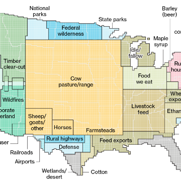

Here's How America Uses Its Land

Here's How America Uses Its Land

https://www.bloomberg.com/graphics/2018-us-land-use/

The 48 contiguous states alone are a 1.9 billion-acre jigsaw puzzle of cities, farms, forests and pastures.