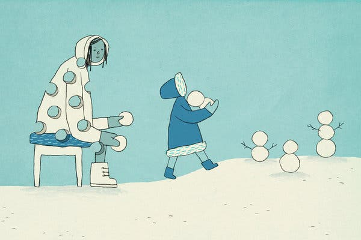

Here’s What’s Happening in the American Teenage Bedroom - The New York Times

Credit...Eva O'Leary for The New York Times

[Skip to content](https://www.nytimes.com/2019/11/29/style/the-clout.html?action=click&module=Editors%20Picks&pgtype=Homepage#site-content)[Skip to site index](https://www.nytimes.com/2019/11/29/style/the-clout.html?action=click&module=Editors%20Picks&pgtype=Homepage#site-index)

[![](data:image/svg+xml,%3csvg xmlns='http://www.w3.org/2000/svg' class='' viewBox='0 0 184 25' fill='%23000'%3e%3cpath d='M13.8 2.9c0-2-1.9-2.5-3.4-2.5v.3c.9 0 1.6.3 1.6 1 0 .4-.3 1-1.2 1-.7 0-2.2-.4-3.3-.8C6.2 1.4 5 1 4 1 2 1 .6 2.5.6 4.2c0 1.5 1.1 2 1.5 2.2l.1-.2c-.2-.2-.5-.4-.5-1 0-.4.4-1.1 1.4-1.1.9 0 2.1.4 3.7.9 1.4.4 2.9.7 3.7.8v3.1L9 10.2v.1l1.5 1.3v4.3c-.8.5-1.7.6-2.5.6-1.5 0-2.8-.4-3.9-1.6l4.1-2V6l-5 2.2C3.6 6.9 4.7 6 5.8 5.4l-.1-.3c-3 .8-5.7 3.6-5.7 7 0 4 3.3 7 7 7 4 0 6.6-3.2 6.6-6.5h-.2c-.6 1.3-1.5 2.5-2.6 3.1v-4.1l1.6-1.3v-.1l-1.6-1.3V5.8c1.5 0 3-1 3-2.9zm-8.7 11l-1.2.6c-.7-.9-1.1-2.1-1.1-3.8 0-.7 0-1.5.2-2.1l2.1-.9v6.2zm10.6 2.3l-1.3 1 .2.2.6-.5 2.2 2 3-2-.1-.2-.8.5-1-1V9.4l.8-.6 1.7 1.4v6.1c0 3.8-.8 4.4-2.5 5v.3c2.8.1 5.4-.8 5.4-5.7V9.3l.9-.7-.2-.2-.8.6-2.5-2.1L18.5 9V.8h-.2l-3.5 2.4v.2c.4.2 1 .4 1 1.5l-.1 11.3zM34 15.1L31.5 17 29 15v-1.2l4.7-3.2v-.1l-2.4-3.6-5.2 2.8v6.6l-1 .8.2.2.9-.7 3.4 2.5 4.5-3.6-.1-.4zm-5-1.7V8.5l.2-.1 2.2 3.5-2.4 1.5zM53.1 2c0-.3-.1-.6-.2-.9h-.2c-.3.8-.7 1.2-1.7 1.2-.9 0-1.5-.5-1.9-.9l-2.9 3.3.2.2 1-.9c.6.5 1.1.9 2.5 1v8.3L44 3.2c-.5-.8-1.2-1.9-2.6-1.9-1.6 0-3 1.4-2.8 3.6h.3c.1-.6.4-1.3 1.1-1.3.5 0 1 .5 1.3 1v3.3c-1.8 0-3 .8-3 2.3 0 .8.4 2 1.6 2.3v-.2c-.2-.2-.3-.4-.3-.7 0-.5.4-.9 1.1-.9h.5v4.2c-2.1 0-3.8 1.2-3.8 3.2 0 1.9 1.6 2.8 3.4 2.7v-.2c-1.1-.1-1.6-.6-1.6-1.3 0-.9.6-1.3 1.4-1.3.8 0 1.5.5 2 1.1l2.9-3.2-.2-.2-.7.8c-1.1-1-1.7-1.3-3-1.5V5l8 14h.6V5c1.5-.1 2.9-1.3 2.9-3zm7.3 13.1L57.9 17l-2.5-2v-1.2l4.7-3.2v-.1l-2.4-3.6-5.2 2.8v6.6l-1 .8.2.2.9-.7 3.4 2.5 4.5-3.6-.1-.4zm-5-1.7V8.5l.2-.1 2.2 3.5-2.4 1.5zM76.7 8l-.7.5-1.9-1.6-2.2 2 .9.9v7.5l-2.4-1.5V9.6l.8-.5-2.3-2.2-2.2 2 .9.9V17l-.3.2-2.1-1.5v-6c0-1.4-.7-1.8-1.5-2.3-.7-.5-1.1-.8-1.1-1.5 0-.6.6-.9.9-1.1v-.2c-.8 0-2.9.8-2.9 2.7 0 1 .5 1.4 1 1.9s1 .9 1 1.8v5.8l-1.1.8.2.2 1-.8 2.3 2 2.5-1.7 2.8 1.7 5.3-3.1V9.2l1.3-1-.2-.2zm18.6-5.5l-1 .9-2.2-2-3.3 2.4V1.6h-.3l.1 16.2c-.3 0-1.2-.2-1.9-.4l-.2-13.5c0-1-.7-2.4-2.5-2.4s-3 1.4-3 2.8h.3c.1-.6.4-1.1 1-1.1s1.1.4 1.1 1.7v3.9c-1.8.1-2.9 1.1-2.9 2.4 0 .8.4 2 1.6 2V13c-.4-.2-.5-.5-.5-.7 0-.6.5-.8 1.3-.8h.4v6.2c-1.5.5-2.1 1.6-2.1 2.8 0 1.7 1.3 2.9 3.3 2.9 1.4 0 2.6-.2 3.8-.5 1-.2 2.3-.5 2.9-.5.8 0 1.1.4 1.1.9 0 .7-.3 1-.7 1.1v.2c1.6-.3 2.6-1.3 2.6-2.8s-1.5-2.4-3.1-2.4c-.8 0-2.5.3-3.7.5-1.4.3-2.8.5-3.2.5-.7 0-1.5-.3-1.5-1.3 0-.8.7-1.5 2.4-1.5.9 0 2 .1 3.1.4 1.2.3 2.3.6 3.3.6 1.5 0 2.8-.5 2.8-2.6V3.7l1.2-1-.2-.2zm-4.1 6.1c-.3.3-.7.6-1.2.6s-1-.3-1.2-.6V4.2l1-.7 1.4 1.3v3.8zm0 3c-.2-.2-.7-.5-1.2-.5s-1 .3-1.2.5V9c.2.2.7.5 1.2.5s1-.3 1.2-.5v2.6zm0 4.7c0 .8-.5 1.6-1.6 1.6h-.8V12c.2-.2.7-.5 1.2-.5s.9.3 1.2.5v4.3zm13.7-7.1l-3.2-2.3-4.9 2.8v6.5l-1 .8.1.2.8-.6 3.2 2.4 5-3V9.2zm-5.4 6.3V8.3l2.5 1.8v7.1l-2.5-1.7zm14.9-8.4h-.2c-.3.2-.6.4-.9.4-.4 0-.9-.2-1.1-.5h-.2l-1.7 1.9-1.7-1.9-3 2 .1.2.8-.5 1 1.1v6.3l-1.3 1 .2.2.6-.5 2.4 2 3.1-2.1-.1-.2-.9.5-1.2-1V9c.5.5 1.1 1 1.8 1 1.4.1 2.2-1.3 2.3-2.9zm12 9.6L123 19l-4.6-7 3.3-5.1h.2c.4.4 1 .8 1.7.8s1.2-.4 1.5-.8h.2c-.1 2-1.5 3.2-2.5 3.2s-1.5-.5-2.1-.8l-.3.5 5 7.4 1-.6v.1zm-11-.5l-1.3 1 .2.2.6-.5 2.2 2 3-2-.2-.2-.8.5-1-1V.8h-.1l-3.6 2.4v.2c.4.2 1 .3 1 1.5v11.3zM143 2.9c0-2-1.9-2.5-3.4-2.5v.3c.9 0 1.6.3 1.6 1 0 .4-.3 1-1.2 1-.7 0-2.2-.4-3.3-.8-1.3-.4-2.5-.8-3.5-.8-2 0-3.4 1.5-3.4 3.2 0 1.5 1.1 2 1.5 2.2l.1-.2c-.3-.2-.6-.4-.6-1 0-.4.4-1.1 1.4-1.1.9 0 2.1.4 3.7.9 1.4.4 2.9.7 3.7.8V9l-1.5 1.3v.1l1.5 1.3V16c-.8.5-1.7.6-2.5.6-1.5 0-2.8-.4-3.9-1.6l4.1-2V6l-5 2.2c.5-1.3 1.6-2.2 2.6-2.9l-.1-.2c-3 .8-5.7 3.5-5.7 6.9 0 4 3.3 7 7 7 4 0 6.6-3.2 6.6-6.5h-.2c-.6 1.3-1.5 2.5-2.6 3.1v-4.1l1.6-1.3v-.1L140 8.8v-3c1.5 0 3-1 3-2.9zm-8.7 11l-1.2.6c-.7-.9-1.1-2.1-1.1-3.8 0-.7.1-1.5.3-2.1l2.1-.9-.1 6.2zm12.2-12h-.1l-2 1.7v.1l1.7 1.9h.2l2-1.7v-.1l-1.8-1.9zm3 14.8l-.8.5-1-1V9.3l1-.7-.2-.2-.7.6-1.8-2.1-2.9 2 .2.3.7-.5.9 1.1v6.5l-1.3 1 .1.2.7-.5 2.2 2 3-2-.1-.3zm16.7-.1l-.7.5-1.1-1V9.3l1-.8-.2-.2-.8.7-2.3-2.1-3 2.1-2.3-2.1L154 9l-1.8-2.1-2.9 2 .1.3.7-.5 1 1.1v6.5l-.8.8 2.3 1.9 2.2-2-.9-.9V9.3l.9-.6 1.5 1.4v6l-.8.8 2.3 1.9 2.2-2-.9-.9V9.3l.8-.5 1.6 1.4v6l-.7.7 2.3 2.1 3.1-2.1v-.3zm8.7-1.5l-2.5 1.9-2.5-2v-1.2l4.7-3.2v-.1l-2.4-3.6-5.2 2.8v6.8l3.5 2.5 4.5-3.6-.1-.3zm-5-1.7V8.5l.2-.1 2.2 3.5-2.4 1.5zm14.1-.9l-1.9-1.5c1.3-1.1 1.8-2.6 1.8-3.6v-.6h-.2c-.2.5-.6 1-1.4 1-.8 0-1.3-.4-1.8-1L176 9.3v3.6l1.7 1.3c-1.7 1.5-2 2.5-2 3.3 0 1 .5 1.7 1.3 2l.1-.2c-.2-.2-.4-.3-.4-.8 0-.3.4-.8 1.2-.8 1 0 1.6.7 1.9 1l4.3-2.6v-3.6h-.1zm-1.1-3c-.7 1.2-2.2 2.4-3.1 3l-1.1-.9V8.1c.4 1 1.5 1.8 2.6 1.8.7 0 1.1-.1 1.6-.4zm-1.7 8c-.5-1.1-1.7-1.9-2.9-1.9-.3 0-1.1 0-1.9.5.5-.8 1.8-2.2 3.5-3.2l1.2 1 .1 3.6z'%3e%3c/path%3e%3c/svg%3e)](https://www.nytimes.com/)

# Here’s What’s Happening in the American Teenage BedroomHere’s What’s Happening in the American Teenage Bedroom

Rowan Winch is 15. He’s a businessman.
By [Taylor Lorenz](https://www.nytimes.com/by/taylor-lorenz)

- Nov. 29, 2019

-

    - 
    - 
    - 

    -
    -

For years, Rowan Winch was nothing if not online. Each day his alarm went off at 6 a.m. and he would roll over in his twin bed, grab his iPhone and start looking for memes — viral images and videos — to share on Instagram. He’d repost a handful to his suite of popular accounts before getting into the shower. Afterward, he would keep searching, and posting, until it was time to board the bus for school.

On the way to his high school in suburban Pennsylvania, Rowan would curl up in a seat, mining the internet for content. The point was not always quality but quantity. Between classes, at lunch, during study hall, he would keep his social media empire running with new images and videos. (His school has a relatively relaxed cellphone policy.) Rowan’s target, at the time, was 100 posts a day. (By comparison, The New York Times publishes around 250 pieces of original journalism each day, though some of those posts take longer to make.)

When he got home, Rowan would turn on his laptop and sit in front of the glowing screen for hours, or flop onto his bed, his phone hovering above his face. His Instagram feed flashed before him like a slot machine. His most popular account, @Zuccccccccccc, taking its name from Facebook’s chief executive, had 1.2 million followers. If his posts were good, his account would keeping growing. If he took some time off, growth would stall. Rowan, like most teenagers on the internet, wasn’t after fame or money, though he made a decent amount — at one point $10,000 a month and more, he said. What Rowan wanted was clout.

On the internet, clout is a social currency that can be used to obtain just about anything. Rack up enough while you’re young, and doors everywhere begin to open. College recruiters notice you. Job opportunities and internships come your way. Your social status among peers rises, money flows in. Even fame becomes a possibility, if that’s what you’re after.

“I want to have enough clout to be recognized for who I am, but I don’t ever want to see myself like a famous person,” Rowan said one day in his bedroom. “I just want to be able to have connections everywhere and be financially secure and monetize what I like doing.”

Image

Credit...Eva O'Leary for The New York Times

Rowan’s economy was a primarily teenage one. Mostly he sold ads on his Instagram to other teenagers looking to promote their own pages, apps or online storefronts. He negotiated deals through direct messages on Instagram and posted about 10 ads per day — some in the form of comments, links and images — on his various accounts. The profits supported his lifestyle; he bought Saint Laurent sneakers, an iPhone XR, a Gucci wallet. He planned to purchase a Tesla next year, when he’s eligible to get his driver’s license.

Rowan’s meme account was not his first business. Like many teenagers, Rowan had begun leveraging the internet early for financial and social gain. In middle school he’d order stickers in bulk on Amazon, then sell them at a markup to his classmates by promoting them on Snapchat.

By the time he reached high school, Rowan had entered the apparel resale market. He would purchase designer clothes and accessories from brands like Supreme on websites like Letgo, OfferUp and Craigslist, then resell them on Grailed, an app for consigning luxury items.

Rowan also experimented with dropshipping. This entails setting up an online storefront that ships products from third-party retailers to customers, profiting on the difference. Before he monetized his meme account, Rowan also sold shout-out videos on Fiverr. His followers could pay a small fee to receive a video of Rowan delivering a personalized message.

All of these are popular ways for teenagers to make money on the internet. Rowan, however, was unusually successful.

As his meme accounts grew in popularity, so did his status. Rowan became a popular figure in online communities. He founded his own Discord server with more than 33,600 members, nearly all of them between the ages of 14 and 18. (Discord is a social network and chat interface that is [popular with gamers, YouTube stars and internet celebrities](https://www.theatlantic.com/technology/archive/2019/03/how-discord-went-mainstream-influencers/584671/) who use it to connect with their audiences.) Some high-profile artists and influencers followed Rowan on Instagram, and they struck up friendships. Ski Mask the Slump God, a SoundCloud rapper, invited Rowan backstage at a show.

Rowan met his girlfriend on Instagram, too.

“My meme account has definitely made me more independent,” Rowan said. “It’s made me more mature in a sense, because I get a lot of crap from people daily. I developed a thick skin from that. I’ve learned what’s appropriate for something, what’s a little too far. I’ve learned what people like and don’t like. I’ve learned to put other people’s interests kind of ahead of mine. It’s more responsibility as well. If I don’t post for a day, people will start asking questions and I’ll start feeling bad. I could have gained a lot of followers that day. I could have gotten money that day.”

On July 26, 2019, Rowan’s world turned upside down. He was lying in bed around 11 p.m., refreshing Instagram, [when he got a notification](https://www.theatlantic.com/technology/archive/2019/08/instagram-hiring-meme-liaison/595552/): @Zuccccccccccc had been disabled.

He figured it had happened by mistake. His page had been wrongly penalized before; he’d regained access through appeals to the company. That wasn’t the case this time, and he wasn’t alone: Instagram had [shut down dozens of popular meme pages](https://www.insider.com/instagram-meme-page-purge-suspends-accounts-2019-7) without warning or reasoning.

Three months later, the aftershocks were still palpable.

“A lot of my friends think I’ve become depressed, and I think that’s right,” Rowan said. “I’ve been feeling insecure about a lot of things, like how I look and act and talk. I talk a lot less than I used to. I’m a lot less confident. Losing my account is the main reason I feel like this. With @Zuccccccccccc, it felt like I had a purpose and was doing something that benefited a lot of people, and now I kind of just feel — I feel lost.”

Image

Credit...Eva O'Leary for The New York Times

“He’s not in a healthy state, in my opinion,” said his mother, Naomi Winch, who once became so frustrated with his phone use she threw his phone out a car window. His parents have tried to get him to engage with life offline. They’ve urged him to get an hourly job at the hot dog shop by their house, just for social connection. “Any extracurricular activity, sports or a physical job, not selling something on the internet,” Ms. Winch said.

But he loves the internet. He created a Discord server called The Fallen with over 200 other teenagers whose meme accounts were also deactivated, mostly [in two](https://www.theatlantic.com/technology/archive/2018/12/instagrams-christmas-crackdown-meme-accounts/579055/)  [major waves](https://www.theatlantic.com/technology/archive/2019/08/instagram-hiring-meme-liaison/595552/) over the last 12 months. He started a podcast. He still posts to his [personal Instagram account](https://www.instagram.com/yslrowan/), with 60,000 followers, and two other meme pages with [120,000 followers](https://www.instagram.com/satanostrils/) and [197,000 followers](https://www.instagram.com/demonostrils/). But losing @Zuccccccccccc was like suddenly getting fired from a big job. Rowan’s identity was so intertwined with the page, he’s still trying to figure out who he is without it.

Lately, he’s been thinking he might become a YouTuber. He is inspired by creators like CallMeCarson and [PewDiePie](https://www.nytimes.com/interactive/2019/10/09/magazine/PewDiePie-interview.html), whose specialty is commentary. He has posted four 20-minute videos to his own channel so far. But programming for YouTube is a lot different than Instagram. “My main issue is coming up with ideas of what to talk about,” he said. So far, he’s tackled Instagram and mental health; both videos received positive responses.

What he most misses about @Zuccccccccccc is the feeling of helping others on a daily basis. His mother said that when she would try to restrict Rowan’s phone use, his followers would send DMs protesting her parenting decisions.

“I got all these messages from kids saying, ‘You can’t let him not be online, he’s the reason I didn’t kill myself last week, he gives me the ability to laugh every day,’” Ms. Winch said. “I thought, ‘Oh my God, this is a lot of responsibility, it’s a little scary.’ But I was glad he was able to connect to kids.”

His followers haven’t abandoned him. He wants to be there for them, too. Because at the end of the day, his work isn’t about jokes, or money, or fame, or even clout. It’s about connecting. “It’s made me understand people much more,” Rowan said of his meme account. “It’s made me a lot more exposed to what’s going on in the world.”

In the meantime, he’s focused on rebuilding his online influence. “With YouTube I want to get big enough so the people that inspired me are my friends. It was like that with my meme pages,” he said.

“The more followers you have, the more voice you have,” he said. “The more clout you have, the more power you have.”

A version of this article appears in print on Dec. 1, 2019, Section ST, Page 1 of the New York edition with the headline: Boy, Disconnected. [Order Reprints](http://www.nytreprints.com/) | [Today’s Paper](https://www.nytimes.com/section/todayspaper) | [Subscribe](https://www.nytimes.com/subscriptions/Multiproduct/lp8HYKU.html?campaignId=48JQY)

- 
- 
- 

-

## [More in Style](https://www.nytimes.com/section/style?action=click&module=MoreInSection&pgtype=Article&region=Footer&contentCollection=Style)

[   Photographs via Wildlife Resources and Education Network](https://www.nytimes.com/2019/11/30/style/suburbs-animals.html?action=click&module=MoreInSection&pgtype=Article&region=Footer&contentCollection=Style)

[### The Suburbs Are Kicking the Animals Out. Enter the Animal Rescue Squad.](https://www.nytimes.com/2019/11/30/style/suburbs-animals.html?action=click&module=MoreInSection&pgtype=Article&region=Footer&contentCollection=Style)Nov. 30

[Continue reading the main story](https://www.nytimes.com/2019/11/29/style/the-clout.html?action=click&module=Editors%20Picks&pgtype=Homepage&action=click&module=MoreInSection&pgtype=Article&region=Footer&contentCollection=Style#after-pp_morein)

 [   PAID POST: AUDEMARS PIGUET](https://adclick.g.doubleclick.net/pcs/click?xai=AKAOjssaF2RlpDeGQ2wj1ToI-nbLIG8sSngKPXC_wtb4SMKe4Mo84GeJmhFaaRhP-bLym71KuZboKHOAzQtYU1iXmBbvjebGjpqR2o3nY18Xndb0Ts8T3sCIjS8qsq8Ug-H5wfBNTYbP75Bs54kmV7V_Y34IqOeWhJdrsM-I3M1PQZslA09Gn1j6CpxWlycC-SNCkDN1kv67VQmsONXFIvMyTzZ1-0CKiduskjkDc0JrqSX_2SGLHsJHjoMQHPclkRKx_Qk&sig=Cg0ArKJSzPBC8zLUK3tgEAE&urlfix=1&adurl=https://www.nytimes.com/paidpost/audemars-piguet/beyond-watchmaking.html%3Fcpv_ap_id%3D50035063%26sr_source%3Dlift_morein%26tbs_nyt%3D2019-Nov-nytnative_morein)  [We Travel to Tokyo for a Peek Behind the Scenes of the “Beyond Watchmaking” Show](https://adclick.g.doubleclick.net/pcs/click?xai=AKAOjssaF2RlpDeGQ2wj1ToI-nbLIG8sSngKPXC_wtb4SMKe4Mo84GeJmhFaaRhP-bLym71KuZboKHOAzQtYU1iXmBbvjebGjpqR2o3nY18Xndb0Ts8T3sCIjS8qsq8Ug-H5wfBNTYbP75Bs54kmV7V_Y34IqOeWhJdrsM-I3M1PQZslA09Gn1j6CpxWlycC-SNCkDN1kv67VQmsONXFIvMyTzZ1-0CKiduskjkDc0JrqSX_2SGLHsJHjoMQHPclkRKx_Qk&sig=Cg0ArKJSzPBC8zLUK3tgEAE&urlfix=1&adurl=https://www.nytimes.com/paidpost/audemars-piguet/beyond-watchmaking.html%3Fcpv_ap_id%3D50035063%26sr_source%3Dlift_morein%26tbs_nyt%3D2019-Nov-nytnative_morein)

[](https://adclick.g.doubleclick.net/pcs/click?xai=AKAOjssaF2RlpDeGQ2wj1ToI-nbLIG8sSngKPXC_wtb4SMKe4Mo84GeJmhFaaRhP-bLym71KuZboKHOAzQtYU1iXmBbvjebGjpqR2o3nY18Xndb0Ts8T3sCIjS8qsq8Ug-H5wfBNTYbP75Bs54kmV7V_Y34IqOeWhJdrsM-I3M1PQZslA09Gn1j6CpxWlycC-SNCkDN1kv67VQmsONXFIvMyTzZ1-0CKiduskjkDc0JrqSX_2SGLHsJHjoMQHPclkRKx_Qk&sig=Cg0ArKJSzPBC8zLUK3tgEAE&urlfix=1&adurl=https://www.nytimes.com/paidpost/audemars-piguet/beyond-watchmaking.html%3Fcpv_ap_id%3D50035063%26sr_source%3Dlift_morein%26tbs_nyt%3D2019-Nov-nytnative_morein)

[   Christopher Lee for The New York Times](https://www.nytimes.com/2019/11/29/fashion/weddings/Virginia-McEnerney-and-John-Schreiber-marry-in-Newark.html?action=click&module=MoreInSection&pgtype=Article&region=Footer&contentCollection=Style)

[### She Sang. So Did His Heart.](https://www.nytimes.com/2019/11/29/fashion/weddings/Virginia-McEnerney-and-John-Schreiber-marry-in-Newark.html?action=click&module=MoreInSection&pgtype=Article&region=Footer&contentCollection=Style)Nov. 29

[   Brian Rea](https://www.nytimes.com/2019/11/29/style/modern-love-a-family-isnt-a-number.html?action=click&module=MoreInSection&pgtype=Article&region=Footer&contentCollection=Style)

[### A Simple Question That’s Too Hard to Answer](https://www.nytimes.com/2019/11/29/style/modern-love-a-family-isnt-a-number.html?action=click&module=MoreInSection&pgtype=Article&region=Footer&contentCollection=Style)Nov. 29

## Editors’ Picks

[### Does Who You Are at 7 Determine Who You Are at 63?](https://www.nytimes.com/2019/11/27/magazine/63-up-michael-apted.html?fallback=false&recId=501801745&locked=0&geoContinent=EU&geoRegion=CMD&recAlloc=story&geoCountry=GB&blockId=home-featured&imp_id=327497009&action=click&module=editorsPicks&pgtype=Article&region=Footer)Nov. 27

[   Brad Gobright](https://www.nytimes.com/2019/11/29/sports/gobright-climind-death.html?fallback=false&recId=501801745&locked=0&geoContinent=EU&geoRegion=CMD&recAlloc=story&geoCountry=GB&blockId=home-featured&imp_id=664972203&action=click&module=editorsPicks&pgtype=Article&region=Footer)

[### Brad Gobright, a Throwback Climber on the Fringes of a Sport](https://www.nytimes.com/2019/11/29/sports/gobright-climind-death.html?fallback=false&recId=501801745&locked=0&geoContinent=EU&geoRegion=CMD&recAlloc=story&geoCountry=GB&blockId=home-featured&imp_id=664972203&action=click&module=editorsPicks&pgtype=Article&region=Footer)Nov. 29

## Most Popular

### [The 10 Most Influential Films of the Decade (and 20 Other Favorites)](https://www.nytimes.com/2019/11/24/movies/best-movies-2010s-decade.html?algo=top_conversion&fellback=false&imp_id=886142214&imp_id=364518419&action=click&module=trending&pgtype=Article&region=Footer)

### [Opinion: How to Survive as a Woman at a Chinese Banquet](https://www.nytimes.com/2019/11/30/opinion/sunday/women-chinese-banquets.html?algo=top_conversion&fellback=false&imp_id=388516416&imp_id=516979582&action=click&module=trending&pgtype=Article&region=Footer)

### [Pete Hamill ‘Ain’t Done Yet’](https://www.nytimes.com/2019/11/26/style/pete-hamill-brooklyn-book.html?algo=top_conversion&fellback=false&imp_id=768151370&imp_id=20118458&action=click&module=trending&pgtype=Article&region=Footer)

### [Alanis Morissette Isn’t Angry Anymore. But ‘Jagged Little Pill’ Rages On.](https://www.nytimes.com/2019/11/26/magazine/alanis-morissette-jagged-little-pill-musical.html?algo=top_conversion&fellback=false&imp_id=698410145&imp_id=778933200&action=click&module=trending&pgtype=Article&region=Footer)

### [Prime Mover: How Amazon Wove Itself Into the Life of an American City](https://www.nytimes.com/2019/11/30/business/amazon-baltimore.html?algo=top_conversion&fellback=false&imp_id=845577984&imp_id=279936733&action=click&module=trending&pgtype=Article&region=Footer)

### [Opinion: The Case for Bernie](https://www.nytimes.com/2019/11/30/opinion/sunday/bernie-sanders.html?algo=top_conversion&fellback=false&imp_id=287509746&imp_id=47474688&action=click&module=trending&pgtype=Article&region=Footer)

### [Brad Gobright, a Throwback Climber on the Fringes of a Sport](https://www.nytimes.com/2019/11/29/sports/gobright-climind-death.html?algo=top_conversion&fellback=false&imp_id=753050568&imp_id=355602987&action=click&module=trending&pgtype=Article&region=Footer)

### [2020 Democratic Candidates Wage Escalating Fight (on the Merits of Fighting)](https://www.nytimes.com/2019/11/30/us/politics/2020-democratic-candidates.html?algo=top_conversion&fellback=false&imp_id=850932275&imp_id=496957678&action=click&module=trending&pgtype=Article&region=Footer)

### [A Pennsylvania County’s Election Day Nightmare Underscores Voting Machine Concerns](https://www.nytimes.com/2019/11/30/us/politics/pennsylvania-voting-machines.html?algo=top_conversion&fellback=false&imp_id=721781343&imp_id=674178187&action=click&module=trending&pgtype=Article&region=Footer)

### [Opinion: The Wisdom Your Body Knows](https://www.nytimes.com/2019/11/28/opinion/brain-body-thinking.html?algo=top_conversion&fellback=false&imp_id=231964864&imp_id=185649251&action=click&module=trending&pgtype=Article&region=Footer)

Advertisement

[Continue reading the main story](https://www.nytimes.com/2019/11/29/style/the-clout.html?action=click&module=Editors%20Picks&pgtype=Homepage#after-bottom)