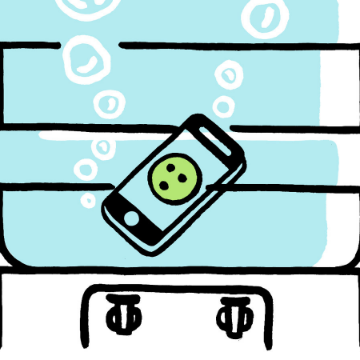

Hide Your Phone When You’re Trying to Work. Seriously.

Hide Your Phone When You’re Trying to Work. Seriously.

https://www.nytimes.com/2018/12/02/smarter-living/be-more-productive-hide-your-phone.html?utm_medium=email&utm_source=other&utm_campaign=opencourse.GdeNrll1EeSROyIACtiVvg.announcements~opencourse.GdeNrll1EeSROyIACtiVvg.dFbFfPoZEeiBtQql6y8GOA

The biggest roadblock to your productivity is the smartphone on your desk.