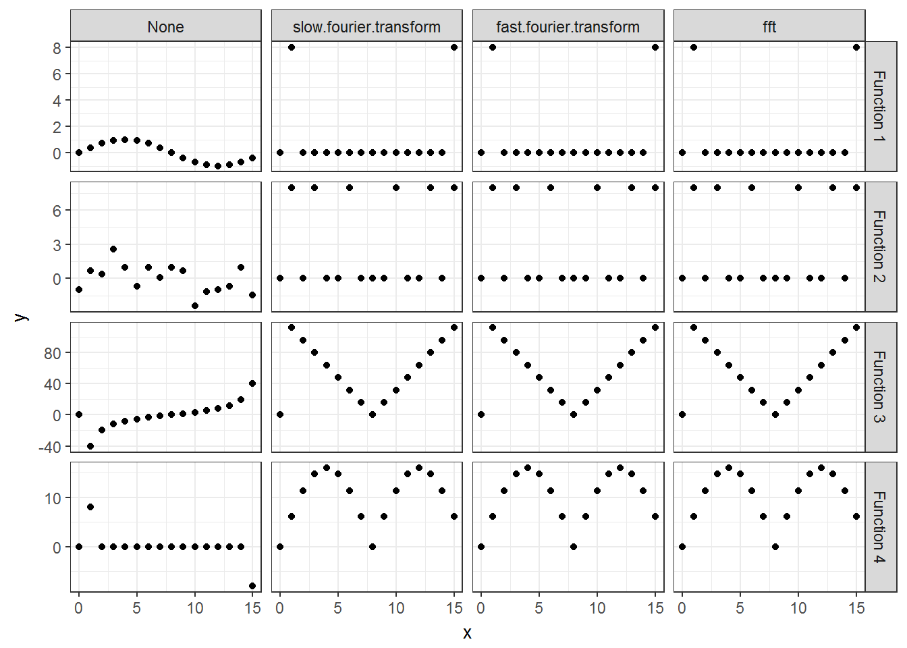
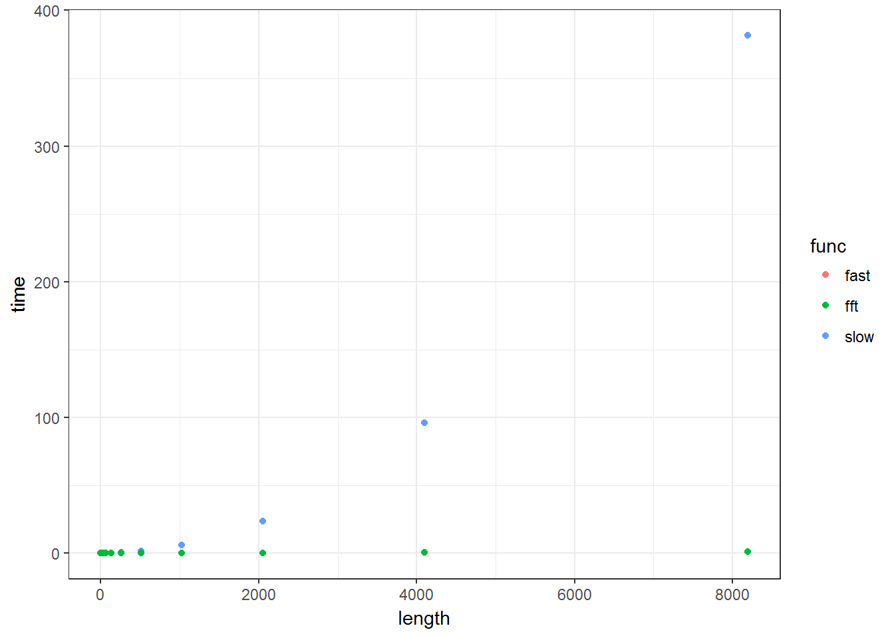
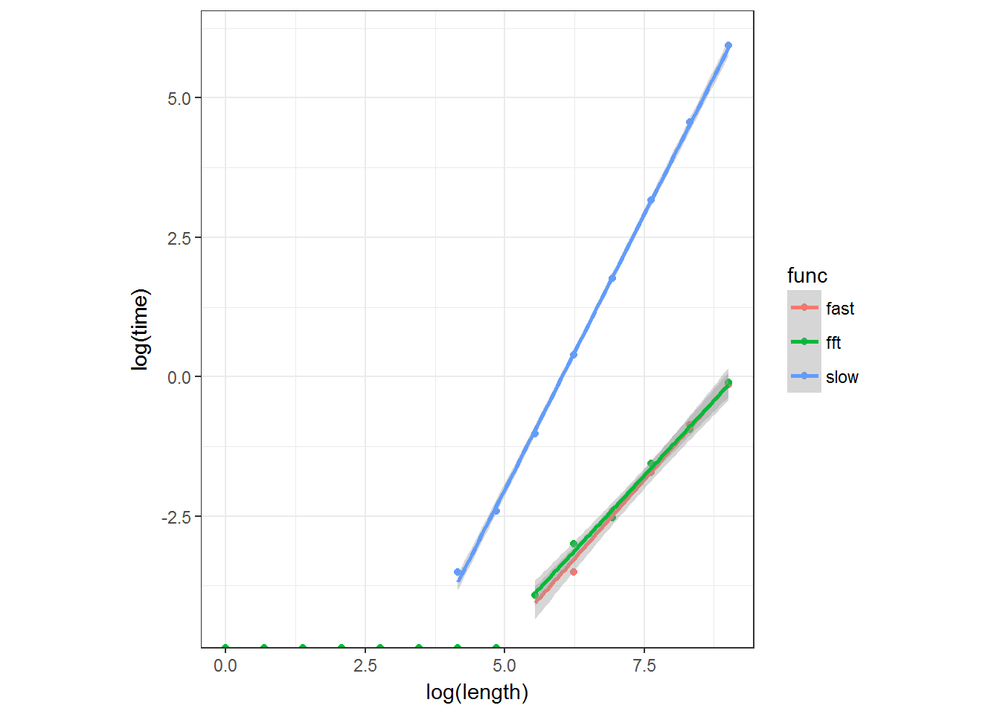

History and Derivation of the Fast Fourier Transform

# History and Derivation of the Fast Fourier Transform

March 20, 2017 / [3 Comments](http://michaeljflynn.net/2017/03/20/history-and-derivation-of-the-fast-fourier-transform/#comments)

*If you enjoy this post, subscribe using the form to the left! I try to make new posts every weekend, though sometimes life gets in the way (this one took 6 weekends).*

This is the second post in my series on great algorithms. My last post was on the [Metropolis-Hastings algorithm](http://michaeljflynn.net/2015/06/01/my-favorite-algorithm-metropolis-hastings/).

## History and Motivation

The Fourier transform is a fundamental operation in applied math. The original Fourier transform is attributed to [Joseph Fourier](https://en.wikipedia.org/wiki/Joseph_Fourier), a French mathematician and physicist, for solving partial differential equations involved in the transfer of heat [1]. Since then, the revelation that any function can be approximated by a series of sines and cosines has exploded far beyond the original application. The technique is used in applications from digital signal processing to medical imaging to detecting nuclear tests. Until the FFT, all applications used an algorithm that summed NN terms for each of NN output terms, and therefore had an asymptotic runtime of O(N2)O(N2). The O(NlogN)O(Nlog⁡N) algorithm was first presented in a complete, packaged form in the 1965 paper by [John Tukey](https://en.wikipedia.org/wiki/John_Tukey) and [James Cooley](https://en.wikipedia.org/wiki/James_Cooley): “An algorithm for the machine calculation of complex fourier series” [2]. There is evidence that the FFT had been discovered before. Gauss used the algorithm in the early 1800s to interpolate the trajectory of the asteroid Pallas but never published his results (aymptotic runtime matters when you’re doing all the computation by hand). The Ex Libris blog gives an interesting analysis of Gauss’s approach [here](http://nonagon.org/ExLibris/gauss-fast-fourier-transform). Others claim to have discovered the fundamental principle behind the FFT first, but no one got it in a form that made users realize they could perform their O(N2)O(N2) computations in O(NlogN)O(Nlog⁡N) until Tukey and Cooley and for that they deserve credit.

The motivation behind the development of the FFT was not academic. This was the case for many algorithmic improvements of the 50’s and 60’s. In a time where business-scale mainframe computers like the [IBM System/360](https://en.wikipedia.org/wiki/IBM_System/360) only had processing speeds of 35 kilohertz and memory sizes of 512 kilobytes, optimizing algorithms for memory and time performance had material economic benefits for companies. For the FFT there were national security reasons as well. James Cooley gives an interesting account of his development of the algorithm in a 1988 issue of *Mikrochmica Acta*: “The Re-Discovery of the Fast Fourier Transform Algorithm” [3]. The way he tells it, the (hydrogen-bomb) physicist [Richard Garwin](https://en.wikipedia.org/wiki/Richard_Garwin) had a huge part in putting the effort together, for Cold-War purposes:

> “

> I was working on a research project of my own when Richard Garwin came to the computing center of the laboratory with some notes he made while with John Tukey at a meeting of President Kennedy’s Scientific Advisory Committee, of which they were both members. John Tukey showed that if > N> N> , is a composite, > N> => a> b> N> => a> b> , then the Fourier series can be expressed as an a-term series of subseries of b terms each. If one were computing all values of the series, this would reduce the number of operations from > N> 2> N> 2>  to > N> (> a> +> b> )> N> (> a> +> b> )> . Tukey also said that if this were iterated, the number of operations would be proportional to > N> log> (> N> )> N> log> ⁡> (> N> )>  instead of > N> 2> N> 2> . Garwin knew that this was a very important calculation and he wanted to have this idea developed and applied.

> “

> Garwin described his problem of determining the periodicities of the spin orientations in a 3-D crystal of He> 3> 3> . Later, I found out that he was far more interested in improving the ability to do remote seismic monitoring of nuclear explosions since the Russians would not agree to inspections within their borders thereby hindering efforts at obtaining a nuclear test ban treaty. He also saw a need for the capability of long range acoustical detection of submarines. Like many others, I did not see the significance in this improvement and gave the job a little less priority than my own research. However, I was told of Garwin’s reputation and, prodded by his occasional telephone calls (some of them to my manager), I produced a 3-dimensional FFT program. I put some effort into designing the algorithm so as to save storage and addressing by over-writing data and I spent some time working out a 3-dimensional indexing scheme that was combined with the indexing within the algorithm.

> “

> Garwin publicized the program at first through his many personal contacts, producing a small but increasing stream of requests for copies of it.

This is not to say that Garwin came up with the idea or wrote the code or paper, but his presence here is indisputable. I am impressed that Garwin was able to pose a dummy physics problem for Cooley to solve that he could then use to detect nuclear tests and track nuclear submarines – but that is the immense power of the FFT.

Cooley’s article has lots of historical tidbits in it, including notes about the computational limits of the day. One detail is the “record” Fourier transform on a dataset with 2048 samples:

> “

> Another member of our department, Lee Alsop, who was a geophysicist and adjunct professor at the Lamont Geophysical Laboratory of Columbia University decided to try the new algorithm on a record of 2048 samples of a strain seismograph of the Rat Island earthquake.

Another is an example of computation that was *still* infeasible, even with the algorithmic speedups. When approached by a colleague with spectrum data to analyze he recounts:

> “

> One extraordinary thing about this was that a single record of data was about 512 000 points and all values of the spectrum were needed. This was beyond the capacity of the high speed memory of existing machines.

He also mentions that the FFT does give a theoretical speedup by a factor of 12,800 in this case. Finally the collaboration with Tukey was very limited (as well as the editing):

> “

> Thus, the paper made only one round trip between me and Tukey and our only collaboration was in a few telephone conversations.

Perhaps that explains why it is not very easy to read…

Since then, there have been too many applications of the FFT to count. The algorithm goes so far as to be one of the [fundamental operations](https://en.wikipedia.org/wiki/Quantum_Fourier_transform) in gate-based [quantum computing](https://en.wikipedia.org/wiki/Quantum_computing). Therefore, it’s probably worth a look.

## Introduction

The idea is to take advantage of symmetries in the complex exponential to “factor” the problem into several smaller problems recursively, yeilding standard “divide and conquer” speedups. While the algorithm has been generalized to work for any composite number of datapoints, the presentation is easiest when the number of points is a power of 2, so that is a fundamental assumption I will make throughout this post.

I’m going to assume that readers are familiar with the [Fourier series](http://mathworld.wolfram.com/FourierSeries.html) and it’s generalization, the [Fourier transform](http://mathworld.wolfram.com/FourierTransform.html) at a superficial level. To review, you can approximate any function over an interval of length LL with sines and cosines with period equal to LL:

f(x)=12a0+∑n=1∞ansin(2πLnx)+∑n=1∞bncos(2πLnx).f(x)=12a0+∑n=1∞ansin⁡(2πLnx)+∑n=1∞bncos⁡(2πLnx).

Using the identities eiθ=cosθ+isinθeiθ=cos⁡θ+isin⁡θ, sinθ=i2(eiθ+e−iθ)sin⁡θ=i2(eiθ+e−iθ), and cosθ=12(eiθ–e−iθ)cos⁡θ=12(eiθ–e−iθ), these terms can be represented as complex exponentials:

f(x)===12a0+∑n=1∞ansin(2πLnx)+∑n=1∞bncos(2πLnx)12a0+12∑n=1∞ian(e2πinx/L–e−2πinx/L)+12∑n=1∞bn(e2πinx/L+e−2πinx/L)12a0e2πi0x/L+12∑n=1∞(bn+ian)e2πinx/L+12∑n=1∞(bn–ian)e−2πinx/Lf(x)=12a0+∑n=1∞ansin⁡(2πLnx)+∑n=1∞bncos⁡(2πLnx)=12a0+12∑n=1∞ian(e2πinx/L–e−2πinx/L)+12∑n=1∞bn(e2πinx/L+e−2πinx/L)=12a0e2πi0x/L+12∑n=1∞(bn+ian)e2πinx/L+12∑n=1∞(bn–ian)e−2πinx/L

Notice that that if we define c0=12a0c0=12a0, cn=12(bn+sign(n)ian)cn=12(bn+sign(n)ian), we can simplify the above to the final form:

f(x)=∑n=−∞∞cne2πinx/L.f(x)=∑n=−∞∞cne2πinx/L.

The coefficients can be found by taking advantage of an indentity of the complex exponential: it integrates to zero over one full period, i.e. ∫L0e2πi(m−n)x/L=L∫0Le2πi(m−n)x/L=L if m=nm=n and 00 of m≠nm≠n. This can be used to isolate cmcm:

∫L0f(x)e−2πimxdx=∑n=−∞∞cn∫L0e2πinx/Le2πimx/Ldx=∑n=−∞∞cn∫L0e2πi(n–m)x/L=Lcm∫0Lf(x)e−2πimxdx=∑n=−∞∞cn∫0Le2πinx/Le2πimx/Ldx=∑n=−∞∞cn∫0Le2πi(n–m)x/L=Lcm

Therefore
cm=1L∫L0f(x)e−2πimx/Ldx.cm=1L∫0Lf(x)e−2πimx/Ldx.

This is the basis of the complex Fourier series. The output of the Fourier transform is the set of cmcm‘s.

## The Discrete Fourier Series

In practice, we cannot compute each of the infinite cmcm, and it turns out we do not have enough information to do so. In almost all applications, we do not have f(x)f(x), rather we have NN evenly-spaced samples from f(x)f(x) stored in a computer. Unfortunately, this limits how far out in frequency space we can get.

For example, consider what happens when analyzing the coefficient of the frequency NN. The function goes through one full period before it reaches the next point, so you are effectively applying a constant displacement to each point, the same effect as the frequency n=0n=0. In general, each of the points will be effected in the same way for frequency nn as the frequency n+Nn+N, and we get no new information from analyzing beyond n=N−1n=N−1.

Therefore, in our output we are only looking for frequencies 00 through N−1N−1. If we have NN points, we are looking for NN frequencies, each computed via the discrete integral:

c(n)=1N∑x=0N−1f(x)e−2πinx/Nc(n)=1N∑x=0N−1f(x)e−2πinx/N

This is effectively computing the integral with a rectangular approximation 1L∫L0f(x)e−2πinx/Ldx≈1LLN∑N−1x′=0f(x′)e−2πinx′/N.1L∫0Lf(x)e−2πinx/Ldx≈1LLN∑x′=0N−1f(x′)e−2πinx′/N. where x=L/Nx′x=L/Nx′.

From here, I’m going to drop the normalizing term 1N1N and assume it will be applied at the end. Also, it’s much easier from this point to look at the Fourier transform using a picture. We can imagine the discrete Fourier transform as a circuit taking in the NN samples as input and giving the NN Fourier coefficients as output. This is depicted below, with the inputs f(x)f(x) coming in from the left, and the outputs c(n)c(n) coming out to the right. Notice that each of the NN terms of the output needs to compute a sum of NN terms, and therefore the runtime of this circuit is O(N2)O(N2).

f(0)f(1)f(2)f(3)f(4)f(5)f(6)f(7)→→→→→→→→Discrete Fouirer Transform→→→→→→→→18∑x=07f(x)18∑x=07f(x)e−2πix/818∑x=07f(x)e−2πi2x/818∑x=07f(x)e−2πi3x/818∑x=07f(x)e−2πi4x/818∑x=07f(x)e−2πi5x/818∑x=07f(x)e−2πi6x/818∑x=07f(x)e−2πi7x/8========c(0)c(1)c(2)c(3)c(4)c(5)c(6)c(7)f(0)→→18∑x=07f(x)=c(0)f(1)→→18∑x=07f(x)e−2πix/8=c(1)f(2)→→18∑x=07f(x)e−2πi2x/8=c(2)f(3)→Discrete Fouirer Transform→18∑x=07f(x)e−2πi3x/8=c(3)f(4)→→18∑x=07f(x)e−2πi4x/8=c(4)f(5)→→18∑x=07f(x)e−2πi5x/8=c(5)f(6)→→18∑x=07f(x)e−2πi6x/8=c(6)f(7)→→18∑x=07f(x)e−2πi7x/8=c(7)

However, there seems to be redundancy here. Each of these terms is a sum of the f(x)f(x) terms, each with a complex exponential slapped on, but the complex exponential is *periodic*. Take c(0)c(0) and c(4)c(4) for example.

c(0)=∑x=07f(x)c(0)=∑x=07f(x)
.
c(n)=∑x=07f(x)e−2πi4x/8=∑x=07f(x)e−πixc(n)=∑x=07f(x)e−2πi4x/8=∑x=07f(x)e−πix

They are the same sum, except each term of c(4)c(4) has an extra term of e−πixe−πix slapped on. This term is going to be equal to 1 for even numbers of xx and equal to −1−1 for odd number of xx. This behavior is independant of nn: if we pair up any Fourier coefficient with the coefficient that is N/2N/2 indices up from it (for example 1 and 5, 2 and 6, and 3 and 7), we will find the same relationship since

e−2πi(n+N/2)x/N=e−2πinx/Neπix.e−2πi(n+N/2)x/N=e−2πinx/Neπix.

This suggests a strategy: there are really only NN terms to work out between c(n)c(n) and c(n+N/2)c(n+N/2) (instead of 2N2N), we just need to remember to slap a -1 onto the odd terms for c(n+N/2)c(n+N/2). This leads us to the next symmetry we can exploit. We can divide these two sums into 2 sums of the form “full sum” = “even terms” + “odd terms”. I will do this out for the N=8N=8 case but you will see how it can easily generalize.

For c(n)c(n) this looks like:

c(n)=∑x=07f(x)e−2πinx/8=∑x=04f(2x)e−2πin(2x)/8even terms+∑x=04f(2x+1)e−2πin(2x+1)/8odd terms=∑x=04f(2x)e−2πinx/4+∑x=04f(2x+1)e−2πinx/4e−πin/4.c(n)=∑x=07f(x)e−2πinx/8=∑x=04f(2x)e−2πin(2x)/8⏞even terms+∑x=04f(2x+1)e−2πin(2x+1)/8⏞odd terms=∑x=04f(2x)e−2πinx/4+∑x=04f(2x+1)e−2πinx/4e−πin/4.

For c(n+N/2)c(n+N/2) this looks like:

c(n+N/2)=∑x=07f(x)e−2πinx/8e−πix=∑x=04f(2x)e−2πin(2x)/8even terms–∑x=04f(2x+1)e−2πin(2x+1)/8odd terms=∑x=04f(2x)e−2πinx/4–∑x=04f(2x+1)e−2πinx/4e−πin/4.c(n+N/2)=∑x=07f(x)e−2πinx/8e−πix=∑x=04f(2x)e−2πin(2x)/8⏞even terms–∑x=04f(2x+1)e−2πin(2x+1)/8⏞odd terms=∑x=04f(2x)e−2πinx/4–∑x=04f(2x+1)e−2πinx/4e−πin/4.

The two terms in the resulting equation have remarkable symmetries to the original problem: they are the Fourier transform of the function using only N/2N/2 samples, one using the even indexed samples, the other using the odd indexed samples. Define two new variables for each nn accordingly:

ce(n)co(n)=∑x=04f(2x)e−2πinx/4=∑x=04f(2x+1)e−2πinx/4,ce(n)=∑x=04f(2x)e−2πinx/4co(n)=∑x=04f(2x+1)e−2πinx/4,

we immediately see that

c(n)c(n+N/2)=ce(n)+co(n)e−πin/4 and=ce(n)–co(n)e−πin/4.c(n)=ce(n)+co(n)e−πin/4 andc(n+N/2)=ce(n)–co(n)e−πin/4.

This relationship underlies the “butterfly diagram” that the FFT algorithm is known for. Updating our circuit with fe(x)=f(2x)fe(x)=f(2x) and fo(e)=f(2x+1)fo(e)=f(2x+1):

f(0)f(2)f(4)f(6)f(1)f(3)f(5)f(7)========fe(0)fe(1)fe(2)fe(3)fo(0)fo(1)fo(2)fo(3)→→→→→→→→Discrete Fouirer TransformDiscrete Fouirer Transform→→→→→→→→∑x=03fe(x)∑x=03fe(x)e−2πix/4∑x=03fe(x)e−2πi2x/4∑x=03fe(x)e−2πi3x/4∑x=03fo(x)∑x=03fo(x)e−2πix/4∑x=03fo(x)e−2πi2x/4∑x=03fo(x)e−2πi3x/4========ce(0)ce(1)ce(2)ce(3)co(0)co(1)co(2)co(3)c(0)=ce(0)+co(0)c(1)=ce(1)+co(1)e−πi/4c(2)=ce(2)+co(2)e−2πi/4c(3)=ce(3)+co(3)e−3πi/4c(4)=ce(0)–co(0)c(5)=ce(1)–co(1)e−πi/4c(6)=ce(2)–co(2)e−2πi/4c(7)=ce(3)–co(3)e−3πi/4f(0)=fe(0)→→∑x=03fe(x)=ce(0)c(0)=ce(0)+co(0)f(2)=fe(1)→Discrete Fouirer Transform→∑x=03fe(x)e−2πix/4=ce(1)c(1)=ce(1)+co(1)e−πi/4f(4)=fe(2)→→∑x=03fe(x)e−2πi2x/4=ce(2)c(2)=ce(2)+co(2)e−2πi/4f(6)=fe(3)→→∑x=03fe(x)e−2πi3x/4=ce(3)c(3)=ce(3)+co(3)e−3πi/4f(1)=fo(0)→→∑x=03fo(x)=co(0)c(4)=ce(0)–co(0)f(3)=fo(1)→Discrete Fouirer Transform→∑x=03fo(x)e−2πix/4=co(1)c(5)=ce(1)–co(1)e−πi/4f(5)=fo(2)→→∑x=03fo(x)e−2πi2x/4=co(2)c(6)=ce(2)–co(2)e−2πi/4f(7)=fo(3)→→∑x=03fo(x)e−2πi3x/4=co(3)c(7)=ce(3)–co(3)e−3πi/4

We can do this process recursively until we hit the trivial case of a Fourier transfom with one sample. The number of times we will recursively call the algorithm is equal to logNlog⁡N, because each time the number of terms left in each gets divided by two. At each level of the division, we do NN constant-time recombinations of the terms in the previous level. Therefore the asymptotic performance of this algorithm should be O(NlogN)O(Nlog⁡N), much faster than O(N2)O(N2).

Let’s code this up and compare runtimes. Again we are going to assume that our input is always going to be a power of two in length. At level ll back, there are going to be 2l2l Fourier transforms to compute, each with N/2lN/2l samples. Indexing the output is a lot of fun, in the dwarf fortress sense, as you can see by the following table:

| Level | x   | Indices |
| --- | --- | --- |
| 0   | 0:7 | {x}{x} |
| 1   | 0:3 | {2x}{2x}, {2x+1}{2x+1} |
| 2   | 0:1 | {2(2x)}{2(2x)}, {2(2x)+1}{2(2x)+1}, {2(2x+1)}{2(2x+1)}, {2(2x+1)+1}{2(2x+1)+1} |

In general the set of indices at any level of the recursion are going to be {2lx+n}{2lx+n}. Each seperate Fourier transform has a different value of nn, and for it xx ranges between 00 and N/2lN/2l. I suggest working this out yourself to truly grok it.

## Implementation

|     |     |
| --- | --- |
| 1 2 3 4 5 6 7 8 9 10 11 12 13 14 15 16 17 18 19 20 21 22 23 24 25 26 27 28 29 30 31 32 33 34 35 36 | fast.fourier.transform  <-  function(f)  {  N  <-  length(f)  levels  <-  log(N,  2)  prev.level  <-  f  level  <-  complex(real  =  numeric(length(f)))  for(l  in  (levels-1):0)  {   for(n  in  0:(2^l  -  1))  {    half.num.indices  <-  2^(levels  -  l  -  1)    for(x  in  0:(half.num.indices  -  1))  {     ##     One catch here to be aware of: in the circuit diagram above, the two     ## seperate Fourier transforms have been placed as if their indices are     ## together, for ease of reading. In the implementation, these indices     ## are going to be interleaved, i.e. $c_e(0)$ at $i=0$, $c_o(0)$ at $i=1$     ## and so on. Therefore we vary x up to half of the indices, with evens=2x     ## and odds=2x+1.     level[2^l *  x  +  n  +  1]  =  prev.level[2^(l)  *  (2*x)  +  n  +  1]  +  prev.level[2^l *  (2*x+1)  +  n  +  1]  *  exp(complex(imaginary  =  -pi*x/half.num.indices))     level[2^l *  (x  +  half.num.indices)  +  n  +  1]  =  prev.level[2^l *  (2*x)  +  n  +  1]  -  prev.level[2^l *  (2*x  +  1)  +  n  +  1]  *  exp(complex(imaginary  =  -pi*x/half.num.indices))    }   }   prev.level  <-  level  }  level } slow.fourier.transform  <-  function(f){  N  <-  length(f)  result  <-  numeric(N)  for(n  in  0:(N-1))  {   for(x  in  0:(N-1))  {    result[n+1]  =  result[n+1]  +  f[x+1]  *  exp(complex(imaginary  =  -2*pi *  x *  n  /  N))   }  }  result } |

## Testing

Let’s test these two functions. Do they give the correct result? Is the fast Fourier transform really faster? For the first question, I’m going to test out the two new series against very simple Fourier series compositions, and also against `R`’s `fft` function. For the second question I will test the runtimes with several different length transforms and then compute the relationship between log time and log length. The slow Fourier transform should have a slope of 2, the fast Fourier transform should have a slope that is only slightly higher than 1.

What are 4 simple series to test. How about, for x=0..15x=0..15:
1. **Function 1:**  f(x)=sin(2π16x)f(x)=sin⁡(2π16x)

2. **Function 2:**  f(x)=sin(2π16x)–cos(2π163x)+sin(2π166x)f(x)=sin⁡(2π16x)–cos⁡(2π163x)+sin⁡(2π166x)

3. **Function 3:**  f(x)=∑15n=0nsin(2π16nx)f(x)=∑n=015nsin⁡(2π16nx)

4. **Function 4:**  f(x)=∑15n=0sin(2π16n)sin(2π16nx)f(x)=∑n=015sin⁡(2π16n)sin⁡(2π16nx)

|     |     |
| --- | --- |
| 1 2 3 4 5 6 7 8 9 10 11 12 13 14 15 16 17 18 19 20 21 22 23 24 25 26 27 28 29 30 31 32 33 34 35 36 37 | library(ggplot2) library(dplyr) library(tidyr) plot_theme  <-  theme(panel.background  =  element_blank(),                     panel.grid.major  =  element_line(color  =  "grey90",  size  =  0.2),                     panel.grid.minor  =  element_line(color  =  "grey95",  size  =  0.5),                     strip.text.x  =  element_text(color  =  "white"),                     strip.background  =  element_rect(fill  =  "black"),                     axis.text  =  element_text(color  =  "black"),                     axis.title  =  element_text(face  =  "bold"),                     title  =  element_text(face  =  "bold")) ## Here are the functions we want to test, they should have very clear Fourier transforms function.1  <-  function(x)  sin(2*pi*x/16) function.2  <-  function(x)  sin(2*pi*x/16)  -  cos(2*pi*3*x/16)  +  sin(2*pi*6  *  x/16) function.3  <-  function(x)  sapply(x,  function(s)  sum(sapply(0:15,  function(n)  n*  sin(2*pi*n*s/16)))) function.4  <-  function(x)  sapply(x,  function(s)  sum(sapply(0:15,  function(n)  sin(2*pi*n/16)*  sin(2*pi*n*s/16)))) tests  <-  list("Function 1"  =  function.1,  "Function 2"  =  function.2,  "Function 3"  =  function.3,  "Function 4"  =  function.4) ## for each of these function, we want to apply the function test.data  <-  bind_rows(lapply(1:length(tests),  function(i)  {  fun  <-  tests[[i]]  name  <-  names(tests)[[i]]  x  <-  0:15  bind_rows(   data.frame(x  =  x,  y  =  fun(x),  func  =  name,  transform  =  "None"),   data.frame(x  =  x,  y  =  abs(fft(fun(x))),  func  =  name,  transform  =  "fft"),   data.frame(x  =  x,  y  =  abs(slow.fourier.transform(fun(x))),  func  =  name,  transform  =  "slow.fourier.transform"),   data.frame(x  =  x,  y  =  abs(fast.fourier.transform(fun(x))),  func  =  name,  transform  =  "fast.fourier.transform")) })) test.data$transform  <-  factor(test.data$transform,  levels  =  c("None",  "slow.fourier.transform",  "fast.fourier.transform",  "fft")) ggplot(data  =  test.data,  aes(x=x,  y  =  y))  +  geom_point()  +  facet_grid(func~transform,  scale  =  "free")  +  theme_bw() |

As you can see via the above plot, the code that we’ve written agrees with R’s built in `fft` function, which is good. Also good is that it gives the output that we expect.

You might be wondering why the first row of plots contain two non-zero dots each – wasn’t there just one frequency included in function 1? Remember that to put in this function, we used sin(x)=(eix–e−ix)/2isin⁡(x)=(eix–e−ix)/2i, the other point that shows up is the “negative” frequency which has show up on the other side due to the periodic symmetry of the complex exponential.

## Timing

Now let’s time the functions against several different length inputs and see how they behave as the length of the sequences get large.

|     |     |
| --- | --- |
| 1 2 3 4 5 6 7 8 | sequence.lengths  <-  sapply(0:13,  function(x)  2^x) timing.test  <-  data.frame(  length  =  sequence.lengths,  slow  =  sapply(sequence.lengths,  function(l)  {  dat  <-  0:l;  system.time({slow.fourier.transform(dat)})[["elapsed"]]}),  fast  =  sapply(sequence.lengths,  function(l)  {  dat  <-  0:l;  system.time({fast.fourier.transform(dat)})[["elapsed"]]}),  fft  =  sapply(sequence.lengths,  function(l)  {  dat  <-  0:l;  system.time({fast.fourier.transform(dat)})[["elapsed"]]})) timing.test  <-  gather(timing.test,  func,  time,  slow,  fast,  fft) |

Normal plot:

|     |     |
| --- | --- |
| 1   | ggplot(data  =  timing.test,  aes(x  =  length,  y  =  time,  color  =  func))  +  geom_point()  +  theme_bw() |

Log-Log-plot:

|     |     |
| --- | --- |
| 1   | ggplot(data  =  timing.test,  aes(x  =  log(length),  y=  log(time),  color  =  func))  +  geom_point()  +  theme_bw()  +  geom_smooth(method  =  "lm")  +  coord_fixed(ratio  =  1) |

|     |     |
| --- | --- |
| 1   | ## Warning: Removed 22 rows containing non-finite values (stat_smooth). |

Linear models on the log-log data

|     |     |
| --- | --- |
| 1 2 3 4 5 6 | slow  <-  subset(timing.test,  func  %in%  "slow"  &  time  !=  0) fast  <-  subset(timing.test,  func  %in%  "fast"  &  time  !=  0) fft  <-  subset(timing.test,  func  %in%  "fft"  &  time  !=  0) lm.slow  <-  lm(log(time)  ~  log(length),  data  =  slow) lm.slow |

|     |     |
| --- | --- |
| 1 2 3 4 5 6 7 | ## ## Call: ## lm(formula = log(time) ~ log(length), data = slow) ## ## Coefficients: ## (Intercept)  log(length) ##     -11.889        1.974 |

|     |     |
| --- | --- |
| 1 2 | lm.fast  <-  lm(log(time)  ~  log(length),  data  =  fast) lm.fast |

|     |     |
| --- | --- |
| 1 2 3 4 5 6 7 | ## ## Call: ## lm(formula = log(time) ~ log(length), data = fast) ## ## Coefficients: ## (Intercept)  log(length) ##     -10.334        1.132 |

|     |     |
| --- | --- |
| 1 2 | lm.fft  <-  lm(log(time)  ~  log(length),  data  =  fft) lm.fft |

|     |     |
| --- | --- |
| 1 2 3 4 5 6 7 | ## ## Call: ## lm(formula = log(time) ~ log(length), data = fft) ## ## Coefficients: ## (Intercept)  log(length) ##      -9.855        1.078 |

Via the coefficient on `log(length)` we see that the slow version has slope approximately equal to 2, and the fast version has slope slightly greater than one. I’m especially suprised that my version in plain R seems to perform nearly as fast as R’s native `fft` function, which I had assumed was programmed in optimized C. Thus we have derived the a way in which the discrete Fourier transform can be computed O(NlogN)O(Nlog⁡N).

## Further Reading

Gilbert Strang gives a really good lecture on FFT, using matrix factorization which I didn’t cover here. (Unfortunately lost me around 37:25). [link](https://www.youtube.com/watch?v=M0Sa8fLOajA)

## Citations

[1] Fourier, Joseph (1822). Théorie analytique de la chaleur (in French). Paris: Firmin Didot Père et Fils. OCLC 2688081. [link](http://www3.nd.edu/~powers/ame.20231/fourier1878.pdf)

[2] Cooley, James W.; Tukey, John W. (1965). “An algorithm for the machine calculation of complex Fourier series”. Math. Comput. 19: 297–301. [doi:10.2307/2003354](http://michaeljflynn.net/2017/03/20/history-and-derivation-of-the-fast-fourier-transform/doi:10.2307/2003354). [link](https://web.njit.edu/~jiang/math614/cooley-tukey.pdf)

[3] Cooley, J. W. (1987). The re-discovery of the fast Fourier transform algorithm. Microchimica Acta, 93(1-6), 33-45. [link](https://carma.newcastle.edu.au/jon/Preprints/Talks/CARMA-CE/FFT.pdf)

### Share this:

- [Click to share on Twitter (Opens in new window)](http://michaeljflynn.net/2017/03/20/history-and-derivation-of-the-fast-fourier-transform/?share=twitter&nb=1)
- [16Click to share on Facebook (Opens in new window)16](http://michaeljflynn.net/2017/03/20/history-and-derivation-of-the-fast-fourier-transform/?share=facebook&nb=1)
- [Click to share on Google+ (Opens in new window)](http://michaeljflynn.net/2017/03/20/history-and-derivation-of-the-fast-fourier-transform/?share=google-plus-1&nb=1)

-

### *Related*

[My Favorite Algorithm: Metropolis-Hastings](http://michaeljflynn.net/2015/06/01/my-favorite-algorithm-metropolis-hastings/)June 1, 2015In "Computational Physics"

[Simple RNA folding in 130 lines of Haskell](http://michaeljflynn.net/2017/01/09/simple-rna-folding-in-130-lines-of-haskell/)January 9, 2017In "Computational Physics"

[A Tutorial on Principal Component Analysis](http://michaeljflynn.net/2017/02/06/a-tutorial-on-principal-component-analysis/)February 6, 2017In "Machine Learning"

Posted in: [Uncategorized](http://michaeljflynn.net/category/uncategorized/)