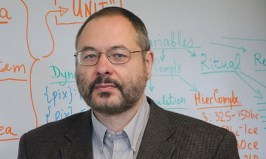
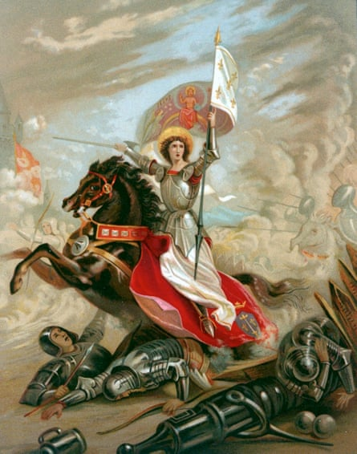

History as a giant data set: how analysing the past could help save the future | Technology | The Guardian

[The long read](https://www.theguardian.com/news/series/the-long-read)

# History as a giant data set: how analysing the past could help save the future

Photograph: enot-poloskun/Getty Images

Calculating the patterns and cycles of the past could lead us to a better understanding of history. Could it also help us prevent a looming crisis? By   [Laura Spinney](https://www.theguardian.com/profile/lauraspinney)

Tue 12 Nov 2019 06.00 GMTLast modified on Tue 12 Nov 2019 12.06 GMT

- 
- 
- 

Shares

1756

In its first issue of 2010, the scientific journal Nature looked forward to a dazzling decade of progress. By 2020, experimental devices connected to the internet would deduce our search queries by directly monitoring our brain signals. Crops would exist that doubled their biomass in three hours. Humanity would be well on the way to ending its dependency on fossil fuels.

A few weeks later, a letter in the same journal cast a shadow over this bright future. It warned that all these advances could be derailed by mounting political instability, which was due to peak in the US and western Europe around 2020. Human societies go through predictable periods of growth, the letter explained, during which the population increases and prosperity rises. Then come equally predictable periods of decline. These “secular cycles” last two or three centuries and culminate in widespread unrest – from worker uprisings to revolution.

 

##   [Lose yourself in a great story: Sign up for the long read email]()

   

Read more

 [(L)](https://www.theguardian.com/info/ng-interactive/2017/may/05/sign-up-for-the-long-read-email)

In recent decades, the letter went on, a number of worrying social indicators – such as wealth inequality and public debt – had started to climb in western nations, indicating that these societies were approaching a period of upheaval. The letter-writer would go on to predict that the turmoil in the US in 2020 would be less severe than the American civil war, but worse than the violence of the late 1960s and early 70s, when the murder rate spiked, civil rights and anti-Vietnam war protests intensified and domestic terrorists carried out thousands of bombings across the country.

The author of this stark warning was not a historian, but a biologist. For the first few decades of his career, Peter Turchin had used sophisticated maths to show how the interactions of predators and prey produce oscillations in animal populations in the wild. He had published in the journals Nature and Science and become respected in his field, but by the late 1990s he had answered all the ecological questions that interested him. He found himself drawn to history instead: could the rise and fall of human societies also be captured by a handful of variables and some differential equations?

Turchin set out to determine whether history, like physics, follows certain laws. In 2003, he published a book called Historical Dynamics, in which he discerned secular cycles in France and Russia from their origins to the end of the 18th century. That same year, he founded a new field of academic study, called cliodynamics, which seeks to discover the underlying reasons for these historical patterns, and to model them using mathematics, the way one might model changes to the planet’s climate. Seven years later, he started the field’s [first official journal](https://escholarship.org/uc/irows_cliodynamics) and co-founded a database of historical and archaeological information, which now contains data on more than 450 historical societies. The database can be used to compare societies across large stretches of time and space, as well as to make predictions about coming political instability. In 2017, Turchin founded a working group of historians, semioticians, physicists and others to help anticipate the future of human societies based on historical evidence.

[  Facebook](https://www.facebook.com/dialog/share?app_id=180444840287&href=https%3A%2F%2Fwww.theguardian.com%2Ftechnology%2F2019%2Fnov%2F12%2Fhistory-as-a-giant-data-set-how-analysing-the-past-could-help-save-the-future%3FCMP%3Dshare_btn_fb%26page%3Dwith%3Aimg-2%23img-2&picture=https%3A%2F%2Fmedia.guim.co.uk%2F61dc31a449fabf45c51c22d740d1f2e59018aba6%2F0_243_3206_1924%2F3206.jpg)[  Twitter](https://twitter.com/intent/tweet?text=History%20as%20a%20giant%20data%20set%3A%20how%20analysing%20the%20past%20could%20help%20save%20the%20future&url=https%3A%2F%2Fwww.theguardian.com%2Ftechnology%2F2019%2Fnov%2F12%2Fhistory-as-a-giant-data-set-how-analysing-the-past-could-help-save-the-future%3FCMP%3Dshare_btn_tw%26page%3Dwith%3Aimg-2%23img-2)[  Pinterest](http://www.pinterest.com/pin/create/button/?description=History%20as%20a%20giant%20data%20set%3A%20how%20analysing%20the%20past%20could%20help%20save%20the%20future&url=https%3A%2F%2Fwww.theguardian.com%2Ftechnology%2F2019%2Fnov%2F12%2Fhistory-as-a-giant-data-set-how-analysing-the-past-could-help-save-the-future%3Fpage%3Dwith%3Aimg-2%23img-2&media=https%3A%2F%2Fmedia.guim.co.uk%2F61dc31a449fabf45c51c22d740d1f2e59018aba6%2F0_243_3206_1924%2F3206.jpg)

   Peter Turchin, a professor of ecology and evolutionary biology, anthropology and mathematics at the University of Connecticut. Photograph: Peter Turchin

Turchin’s approach to history, which uses software to find patterns in massive amounts of historical data, has only become possible recently, thanks to the growth in cheap computing power and the development of large historical datasets. This “big data” approach is now becoming increasingly popular in historical disciplines. Tim Kohler, an archaeologist at Washington State University, believes we are living through “the glory days” of his field, because scholars can pool their research findings with unprecedented ease and extract real knowledge from them. In the future, Turchin believes, historical theories will be tested against large databases, and the ones that do not fit – many of them long-cherished – will be discarded. Our understanding of the past will converge on something approaching an objective truth.

Advertisement

To some, the prediction that [Turchin made](https://www.nature.com/articles/463608a) in Nature in 2010 now seems remarkably prescient. Barring any last-minute surprises, the search engine that decodes your brainwaves won’t exist by 2020. Nor will crops that double their biomass in three hours, or an energy budget that is mostly supplied by renewables. But an imminent upheaval in the political order of the US or UK seems increasingly plausible. The [Fragile States Index](https://fragilestatesindex.org/), calculated by the US non-profit The Fund for Peace, reveals a worsening trend toward instability in those two countries, in contrast to steady improvement in much of the rest of the world.

“We are in an age of considerable turbulence, matched only by the great age of Atlantic revolutions,” says George Lawson, who studies political conflict at the London School of Economics, referring to the period from the 1770s to the 1870s, when violent uprisings overthrew monarchies from France to the New World.

Turchin sees his prediction for 2020 not just as a test of one controversial theory. It could also be a taste of things to come: a world in which scholars generate the equivalent of extreme weather warnings for the social and political conditions of the future – along with advice on how to survive them.

* * *

For most academics who study the past, explaining why something happened once is very different from predicting how and when it will happen again. “We cannot produce laws,” says Timur Kuran, an economist and political scientist at Duke University.

Advertisement

It is no accident that this view is being challenged by mathematicians and biologists such as Turchin. What their disciplines have in common is the science of complexity, which teaches that a system composed of even just a few moving parts can produce complex patterns of behaviour because of the different ways in which those parts interact. The sun, the Earth’s surface and the Earth’s atmosphere interact to produce weather, for example. Those interactions can be captured mathematically, in sets of equations, or laws, that predict the system’s behaviour under different conditions. This is essentially what the weather forecast does.

Complexity science had its origins in physics, in the study of the behaviour of elementary particles, but over the course of the past century it slowly spread to other disciplines. As late as the 1950s, few cell biologists would have conceded that cell division could be described mathematically; they assumed it was random. Now they take that fact for granted, and their mathematical models of cell division have led to better cancer treatments. In ecology, too, it is accepted that patterns exist in nature that can be described mathematically. Lemmings do not commit mass suicide, as Walt Disney would have [had us believe](https://www.youtube.com/watch?v=xMZlr5Gf9yY), but they do go through predictable four-year boom-and-bust cycles driven by their interactions with predators, and possibly also with their own food supply. In 2008, the Nobel-prize winning physicist Murray Gell-Mann declared it was only a matter of time before laws of history would be found, too. It would not happen, however, until all those who study the past – historians, demographers, economists and others – realised that working in their specialist siloes, while necessary, was not sufficient. “We have neglected the crucial supplementary discipline of taking a crude look at the whole,” said Gell-Mann.

Many historians consider this mathematical approach to history to be problematic. They tend to believe that lessons can be drawn from the past, but only in a very limited way – the history of the Troubles in Northern Ireland might shed light on current tensions there, for example. These days, few historians search for general laws that apply across centuries and societies, or that can be used to predict the future in any meaningful way. That was the goal of the scientific historians of the 19th century, many of whom were inspired by social Darwinism, and it is an approach now regarded as deeply flawed, as well as fatally connected to narratives of empire.

Get the Guardian’s award-winning long reads sent direct to you every Saturday morning

“We as a community of modern social scientists have invested 60 years of concerted effort in stripping away the racism and sexism and general Eurocentrism inclusive in those narratives,” says historian Jo Guldi of the Southern Methodist University in Texas, adding that there is a fear among historians that mathematical approaches will drag them backwards. There is also the old mistrust between the sciences and the humanities. When Guldi and Harvard historian David Armitage called for their discipline to embrace big data and take a longer view of the past, in their 2014 book The History Manifesto, they were slammed in the leading US journal in their field, The American Historical Review. “It was probably one of the bloodiest attacks of the last 30 years,” says Guldi. There is a visceral feeling, not only among historians but also among many ordinary people, that humans cannot be reduced to data points and equations. How can an equation predict a Joan of Arc, or an Oliver Cromwell? “History is not a science,” says Diarmaid MacCulloch, a historian at the University of Oxford, summing up that view. “At the bottom of it is human behaviour, and that is terrifyingly unpredictable.”

Advertisement

“This argument gets it exactly wrong,” argues Turchin, who since the early 1990s has been a professor in the [department of](https://eeb.uconn.edu/faculty/#)[ecology and](https://eeb.uconn.edu/faculty/#)[evolutionary](https://eeb.uconn.edu/faculty/#)[biology](https://eeb.uconn.edu/faculty/#) at the University of Connecticut, and is now also affiliated with the [Complexity Science Hub](https://www.csh.ac.at/) in Vienna. “It is because social systems are so complex that we need mathematical models.” Importantly, the resulting laws are probabilistic, not deterministic, meaning that they accommodate the element of chance. But this does not mean they are hollow: if a weather forecast tells you there is an 80% chance of rain, you pack your umbrella. Peter J Richerson, a leading scholar of cultural evolution at the University of California in Davis, says that historical patterns such as secular cycles do exist, and that Turchin has “the only sensible causal account” of them. (It is also, Richeson points out, the only such account for now; the field is young, and different theories may follow.)

Other historians believe that Turchin’s work – which incorporates not just history and maths, but also the research of economists, other social scientists, and environmental scientists – provides a much-needed corrective to decades of specialisation within these disciplines. “We in historical and social scientific fields desperately need this kind of overarching, cooperative, comparative effort,” wrote Gary Feinman, an archaeologist at the Field Museum of Natural History in Chicago, after a 2016 workshop with Turchin and his colleagues. Still, others are excited about the new insights that might emerge from studying human societies in the same way as complex biological systems. Several Silicon Valley executives have also taken a keen interest in Turchin’s forecasting. “They get it,” Turchin says. “But then they have two questions. How can they make money out of the situation? And when should they [buy their plot in New Zealand](https://www.theguardian.com/news/2018/feb/15/why-silicon-valley-billionaires-are-prepping-for-the-apocalypse-in-new-zealand)?”

* * *

When Turchin began looking for mathematical descriptions of history in the late 1990s, he found that another scholar had laid much of the groundwork for him, two decades earlier. Jack Goldstone was a mathematician-turned-historian who, as a Harvard student, once used maths to codify Alexis de Tocqueville’s ideas about democracy. “I tried to produce De Tocqueville’s argument as a set of equations,” he told me recently. “I did not get a good grade.” Goldstone went on to become the first person to apply complexity science to human history, and to conclude that political instability was cyclical. The result was a mathematical description of revolution – one half of a model of societal change that Turchin has gone on to complete.

At the time Goldstone began his research, in the mid-70s, the prevailing view of revolution was best understood as a form of class conflict. But Goldstone made two observations that did not fit that view. First, individuals from the same classes, or even the same families, often ended up fighting on opposite sides. And second, revolutions had clustered in certain periods of history – the 14th and 17th centuries, the late 18th-to-early 19th centuries – but there was no obvious reason why class tensions should have boiled over in those periods and not in others. He suspected there were deeper forces at work, and he wanted to know what they were.

Advertisement

Serendipitously, and because he was short of cash, Goldstone ended up working as a teaching assistant for a Harvard demographer named George Masnick, who showed him the deep social, political and economic impact of the baby boom in the US, following the second world war. That youth bulge was accompanied by new tensions in society, including pressure on the labour market and a hunger for radical ideologies. Goldstone wondered if booms such as this might have contributed to other societies’ periods of upheaval, and in the 80s he began combing the archives for information on population growth in the decades prior to European revolutions.

Only a few years earlier, the level of detail he needed would not have been available, but the Cambridge Group for the History of Population and Social Structure in the UK, along with similar groups across Europe, had begun painstakingly reconstructing population histories based on sources such as parish records. Goldstone was also encouraged by the publication in 1978 of Colin McEvedy and Richard Jones’s Atlas of World Population History, in which they highlighted an “astonishing synchronicity” in population booms and busts across Eurasia over millennia. A few months into his number-crunching, he had his eureka moment: “It was astounding: there really was a three-generation surge in population growth before every major revolution or rebellion in history.”

In the 18th century, the Rev Thomas Malthus argued that a population eventually outgrows its resources, imploding in a toxic cloud of conflict and disease until, reduced once again to manageable proportions, it enters a new phase of growth. The theory Goldstone went on to construct borrowed from Malthus, but importantly, it removed the dismal inevitability of that cycle. It claimed that population growth exerts pressure on societies, which they channel in complex and idiosyncratic ways. The analogy he uses is that of an earthquake. Seismic forces accumulate beneath a plateau until it starts to shake, but whether the buildings on the plateau stand, fall or sustain some intermediate level of damage depends on how they were constructed. That is why revolutions cluster in history, but within a given period of turbulence not all societies succumb.

   Belfast during the Troubles: ‘Many historians consider this mathematical approach to history to be problematic. They tend to believe that lessons can be drawn from the past, but only in a very limited way ...’ Photograph: Bettmann Archive

Advertisement

Goldstone recognised that the different components of a society – state, elites, masses – would respond differently to strain, but that they would also interact. In other words, he was dealing with a complex system whose behaviour was best captured mathematically. His model of why revolutions occur consists of a set of equations, but a crude verbal description goes something like this: as the population grows there comes a point where it outstrips the ability of the land to support it. The standard of living of the masses falls, increasing their potential for violent mobilisation. The state tries to counteract this – for example, by capping rents – but such measures alienate the elite whose financial interests they hurt. Since the elite has also been expanding, and competing ever more fiercely for a finite pool of high-status jobs and trappings, the class as a whole is less willing to accept further losses. So the state must tap its own coffers to quell the masses, driving up national debt. The more indebted it becomes, the less flexibility it has to respond to further strains. Eventually, marginalised members of the elite side with the masses against the state, violence breaks out and the government is too weak to contain it.

Goldstone suggested ways of measuring mass mobilisation potential, elite competition and state solvency, and defined something he called the political stress indicator (psi or Ψ), which was the product of all three. He showed that Ψ spiked prior to the French Revolution, the English civil war and two other major 17th-century conflicts – the Ottoman crisis in Asia Minor, and the Ming-Qing transition in China. In each case, however, there had been one more factor in the mix: chance. Some tiny rupture – a harvest failure, say, or a foreign aggression – that in other circumstances might have been absorbed easily, against a backdrop of rising Ψ caused conflict to erupt. Although you could not predict the trigger – meaning you could not know precisely when the crisis would occur – you could measure the structural pressures and hence, the risk of such a crisis.

It was a simple model, and Goldstone acknowledged as much. Although he could show that high Ψ predicted historical revolutions, he had no way of predicting what came next. That depended on the precise combination of the three components of Ψ, and on how they interacted with a given society’s institutions. Incomplete as they were, his efforts led him to see revolution in a depressing new light: not as a democratic correction to an inflexible and corrupt ancien regime, but as a response to an ecological crisis – the inability of a society to absorb rapid population growth – that rarely resolved that crisis.

Nor were these patterns confined to the past. As Goldstone was putting the finishing touches to his magnum opus, Revolution and Rebellion in the Early Modern World, the Soviet Union was unravelling. He pointed out that Ψ had risen dramatically across the Soviet bloc in the two decades prior to 1989, and that it was persistently high in developing countries. He also wrote that: “It is quite astonishing the degree to which the United States today is, in respect of its state finances and its elites’ attitudes, following the path that led early modern states to crisis.”

* * *

Advertisement

When Goldstone’s book came out in 1991, historians were scathing. The British historian Lawrence Stone, writing in The New York Review of Books, described Goldstone’s work as “far too bold and vague in constructing a thing called a political stress indicator, which is about as real as a unicorn”. Goldstone admits that it did not have the impact he had hoped. “Both the book and I fell a little bit between the cracks,” he recalls. Then one day in 1997 he got a call from Peter Turchin.

At the time, Turchin was going through what he jokingly calls his “mid-life crisis” – when, aged 40, he ditched biology and ran off with history. Part of what attracted him to the question of why societies implode is that he had personally witnessed one self-destruct. He was born in Russia, but his family defected to the US in 1978, and he did not return to Moscow until 1992. “That was the year things collapsed completely,” he recalls. It was December – “dark, horrible. There were drunk people lying everywhere.” He and his wife passed a blown-up car on the way to the market and watched mafiosi extort cash from terrified stallholders while the police looked on. These were images that stayed with him.

When Turchin came across Goldstone’s book, he found it “remarkable”, he says. But the model was incomplete: “He described how societies got into crisis, not how they got out of it.” So Turchin decided to complete the model, and to find out whether it applied to human societies over a much greater swathe of time and space. Goldstone had focused on the early modern period – roughly the four centuries from 1500; Turchin would push the survey’s start date back nearly 8,000 years, to the Neolithic. That meant collecting vast quantities of data, and in this he was lucky: history’s quantitative turn, which had begun with the plundering of those parish registers in the 1970s, had only accelerated in the decades since.

[  Facebook](https://www.facebook.com/dialog/share?app_id=180444840287&href=https%3A%2F%2Fwww.theguardian.com%2Ftechnology%2F2019%2Fnov%2F12%2Fhistory-as-a-giant-data-set-how-analysing-the-past-could-help-save-the-future%3FCMP%3Dshare_btn_fb%26page%3Dwith%3Aimg-4%23img-4&picture=https%3A%2F%2Fmedia.guim.co.uk%2F457b197ec0f73e6cf32310af7221e67298fafd81%2F0_0_1833_2333%2F1833.jpg)[  Twitter](https://twitter.com/intent/tweet?text=History%20as%20a%20giant%20data%20set%3A%20how%20analysing%20the%20past%20could%20help%20save%20the%20future&url=https%3A%2F%2Fwww.theguardian.com%2Ftechnology%2F2019%2Fnov%2F12%2Fhistory-as-a-giant-data-set-how-analysing-the-past-could-help-save-the-future%3FCMP%3Dshare_btn_tw%26page%3Dwith%3Aimg-4%23img-4)[  Pinterest](http://www.pinterest.com/pin/create/button/?description=History%20as%20a%20giant%20data%20set%3A%20how%20analysing%20the%20past%20could%20help%20save%20the%20future&url=https%3A%2F%2Fwww.theguardian.com%2Ftechnology%2F2019%2Fnov%2F12%2Fhistory-as-a-giant-data-set-how-analysing-the-past-could-help-save-the-future%3Fpage%3Dwith%3Aimg-4%23img-4&media=https%3A%2F%2Fmedia.guim.co.uk%2F457b197ec0f73e6cf32310af7221e67298fafd81%2F0_0_1833_2333%2F1833.jpg)

   ‘How can an equation predict a Joan of Arc, or an Oliver Cromwell?’ Photograph: Time & Life Pictures/Getty Image

Though the historical record remained fragmented and patchy, it was now possible to say novel things about how extinct people lived even when there was no written trace of them – and better still, from a mathematician’s point of view, to put numbers on them. Ice cores from Greenland turn out to be an exquisite proxy for economic activity in Europe, for example, because the permafrost traps pollution and tracks its fluctuations over centuries. The size and construction of aristocrats’ villas speak to elite competition, and coin hoards to anxieties about looming strife, while skeletal malformations reveal malnutrition – a proxy for standard of living. The informational value of these proxies had long been recognised, but now there was quantitative data on them spanning decades and sometimes centuries, meaning that you could discern trends over time. The more proxies you had for a given variable, the more accurate a picture of the past you could paint.

Advertisement

In Historical Dynamics, in 2003, Turchin demonstrated a pattern of secular cycles in the societies that evolved into modern-day France and Russia from the first millennium BC until roughly 1800. He also showed that there were shorter oscillations in the stability of these societies, lasting about 50 years, which he called “fathers-and-sons cycles”: perceiving a social injustice, one generation set out to redress it violently, the next shrank from violence having grown up with its aftermath, the third started all over again.

Many scholars were as sceptical of Turchin as they had been of Goldstone a dozen years before. “Serious historians,” Joseph Tainter, a historian and anthropologist at Utah State University, wrote in Nature, “have long held cyclical theories in disrepute.” But Turchin had only just got started. He poured his energy into data collection, and in 2010 – as a way of better organising those data to support comparison across societies – he and two anthropologists at the University of Oxford launched [Seshat](http://seshatdatabank.info/seshat-about-us/seshat-who-we-are/), a database of historical and archaeological information named after the ancient Egyptian goddess of record-keeping.

Seshat has come in for criticism of the kind that has been directed at big data more generally. Just because there is lots of it, critics say, does not mean that the data is more reliable. On the contrary, such a database risks amplifying the interpretative biases of those who initially recorded the information, while stripping it of its context. Seshat’s founders counter that bias is a problem in history generally, and only the analysis of large quantities of data allows a signal – something approaching the truth – to detach itself from that noise.

To date, Seshat’s founders and their 90-odd “expert collaborators” – including eminent historians, archaeologists and anthropologists – have gathered data on societies from the lowland Andes to the Cambodian basin and Iceland to Upper Egypt. Analysing these, Turchin showed that the same two interacting cycles – secular and fathers-and-sons – fit patterns of instability across Europe and Asia going back as far as the first farmers. They were there in ancient Egypt, China and Rome – in every pre-industrial society he looked at.

The next question was obvious: were these cycles also at play in modern, industrial societies? Turchin updated Ψ to reflect the forces shaping a modern labour market, and chose new proxies appropriate to an industrialised world. These included real wages for the mobilisation potential of the masses; filibustering rates in the Senate and the cost of tuition at Yale for elite competition; and interest rates for state solvency. Then he calculated Ψ in the US from 1780 to the present day. It was low in the so-called Era of Good Feelings around 1820, high in the 1860s – around the American civil war – and low again in the years after the second world war. Since 1970 it had risen steadily. This did not mean we were doomed to crisis, though. Many societies had avoided disaster – and Turchin was building a model to find out how they had done it.

* * *

Advertisement

In the late 1980s, Turchin had travelled to the forests of Louisiana, where the timber industry funded his research into periodic and costly infestations of a pest called the southern pine beetle. At the time, the standard procedure for controlling the beetle was to spray pesticide at the site of an infestation. Turchin showed that this only prolonged an attack, because it killed off another beetle that was a natural predator of the pest. A better strategy was to fell and remove affected trees. More broadly, he had shown that it was possible to intervene in a complex ecological system to make its crises less severe and maximise its chances of recovery.

Turchin hopes to discover similar strategies for easing crises in human societies. If the approach that he and Goldstone take to modelling history is right, it means that they can meaningfully ask not only what 2020 has in store for us, but also what the future holds stretching forward over centuries. We should not expect any prophecies from this new science of history, but it could help us to identify structural threats to our societies’ stability and to act to mitigate them.

While societies tend to enter crisis via the path that Goldstone charted, Turchin has found that they leave it via a range of possible trajectories, from rapid recovery to total collapse. That is because crisis renders a society exquisitely sensitive to external perturbation. If no other destabilising thing happens, it could recover – as England did after the almost bloodless Glorious Revolution of 1688. But one small extra shock could push it towards a worse outcome, even to collapse. The Soviet Union was already in decline before the Chernobyl nuclear disaster of 1986, but Mikhail Gorbachev may not have been entirely wrong when he blamed its downfall on [that event](https://www.theguardian.com/environment/2019/jun/16/chernobyl-was-even-worse-than-tv-series-kim-willsher).

To understand this phase of the cycle better, Turchin and others plan to build computer-simulated societies composed of thousands or millions of individuals – so-called agent-based models – and programme them to behave according to the laws they have deduced from real societies. They can subject those simulated societies to stress, for example by injecting a virtual youth bulge, and observe the downstream effects on state, elites and masses. Once Ψ has reached dangerously high levels, they can add a shock – in the form of a foreign invasion, say – or increase resilience by strengthening the society’s infrastructure, and see how it responds. They can ask such questions as: what does it take to nudge a society in crisis toward total collapse? What interventions would divert it towards a less bloody outcome? Why are some societies more resilient than others?

   ‘Turchin points to the US New Deal of the 1930s, which he sees as a time when American elites consented to share their growing wealth more equitably ...’ Photograph: John Vachon/ Library of Congress/Courtesy of Taschen

Advertisement

Of course, our experience with the climate crisis suggests that even if we can predict the future the way we can forecast the weather, and come up with a set of preventative measures to stave off social collapse, that does not mean we will be able to muster the political will to act on such recommendations. But while it is true that human societies have in general been far better at reconstruction after disasters than preventing them in the first place, there are exceptions. Turchin points to the US New Deal of the 1930s, which he sees as a time when American elites consented to share their growing wealth more equitably, in return for the implicit agreement that “the fundamentals of the political-economic system would not be challenged”. This pact, Turchin argues, enabled American society to exit a potentially revolutionary situation.

Goldstone continues to spread the message that such pacts can work again. Now a professor of public policy at George Mason University in Virginia, he advises the National Intelligence Council – the US intelligence body responsible for long-term strategy – but says his ideas have had little impact so far. At a workshop on societal collapse at Princeton University last April, someone asked him why historical societies had so often failed to act even when the signs of a looming crisis were impossible to ignore. He suggested it was because elites continue to live the high life for some time after things start falling apart, buffered from the upheaval by their wealth and privileges.

Turchin believes that historians will soon embrace complexity science, just as biologists did half a century ago. They will come to realise that it allows them to see deeper and further, to discern patterns that are not visible to the human eye. In fact, it is already happening. In the last few years, a handful of institutions have been created, such as the [Centre for the Study of Existential Risk](https://www.cser.ac.uk/) at the University of Cambridge, whose goal is to encourage policymakers to think about the long-term lessons of history. The Princeton meeting was attended by a risk analyst employed by the US Army Engineer Research and Development Center, who thinks about how to make the US more resilient to future threats by reference to the past.

 

##   [How statistics lost their power – and why we should fear what comes next]()

   

Read more

 [(L)](https://www.theguardian.com/politics/2017/jan/19/crisis-of-statistics-big-data-democracy)

To Turchin, these are all encouraging developments, but 2020 is nearly upon us, and lawmaking institutions in both the US and the UK are now so divided along ideological lines that they can barely function. In both countries, disgruntled members of the elite have taken power in the name of the people, while failing to address the underlying causes of the malaise: widening inequality, a swollen elite, a fragile state.

Goldstone offers what consolation he can. “Nobody in the 1930s could have imagined how rich Europe would be by the 1960s, or that the entire continent would become unified,” he says. “Bad as things may get for a decade or two, they’re liable to be much better once you get through the crisis.” It’s the consolation inherent in a cyclic view of history: that beyond every fall there is another rise, just as beyond every rise there is another fall. Things will be good once again, for those of us who are still around to see it.

• Follow the Long Read on Twitter at [@gdnlongread](https://twitter.com/@gdnlongread), and sign up to the long read weekly email [here](https://www.theguardian.com/info/ng-interactive/2017/may/05/sign-up-for-the-long-read-email).

Topics

- [The long read/](https://www.theguardian.com/news/series/the-long-read)
- [History books/](https://www.theguardian.com/books/history)
- [features/](https://www.theguardian.com/tone/features)
- 
- 
- 
- [Share on LinkedIn](http://www.linkedin.com/shareArticle?mini=true&title=History%20as%20a%20giant%20data%20set%3A%20how%20analysing%20the%20past%20could%20help%20save%20the%20future&url=https%3A%2F%2Fwww.theguardian.com%2Ftechnology%2F2019%2Fnov%2F12%2Fhistory-as-a-giant-data-set-how-analysing-the-past-could-help-save-the-future)
- [Share on Pinterest](http://www.pinterest.com/pin/find/?url=https%3A%2F%2Fwww.theguardian.com%2Ftechnology%2F2019%2Fnov%2F12%2Fhistory-as-a-giant-data-set-how-analysing-the-past-could-help-save-the-future)
- [Reuse this content](https://syndication.theguardian.com/automation/?url=https%3A%2F%2Fwww.theguardian.com%2Ftechnology%2F2019%2Fnov%2F12%2Fhistory-as-a-giant-data-set-how-analysing-the-past-could-help-save-the-future&type=article&internalpagecode=6794818)

Advertisement

##  Read The

Guardian without
interruption on all
your devices

 [Subscribe now](https://support.theguardian.com/uk/subscribe/digital?acquisitionData=%7B%22componentType%22%3A%22ACQUISITIONS_OTHER%22%2C%22source%22%3A%22GUARDIAN_WEB%22%2C%22campaignCode%22%3A%22shady_pie_open_2019%22%2C%22componentId%22%3A%22shady_pie_open_2019%22%7D&INTCMP=shady_pie_open_2019)  