History of Berlin - Wikipedia

# History of Berlin

From Wikipedia, the free encyclopedia

Jump to:[navigation](https://en.wikipedia.org/wiki/History_of_Berlin#mw-head),[search](https://en.wikipedia.org/wiki/History_of_Berlin#p-search)

[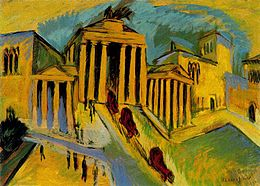](https://en.wikipedia.org/wiki/File:Ernst_Ludwig_Kirchner_-_Brandenburger_Tor.jpg)

[(L)](https://en.wikipedia.org/wiki/File:Ernst_Ludwig_Kirchner_-_Brandenburger_Tor.jpg)

The [Brandenburg Gate](https://en.wikipedia.org/wiki/Brandenburg_Gate) depicted by [Ernst Ludwig Kirchner](https://en.wikipedia.org/wiki/Ernst_Ludwig_Kirchner) in 1912

| Part of [**a series**](https://en.wikipedia.org/wiki/Category:History_of_Berlin) on the |
| --- |
| [History of Berlin]() |
| [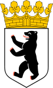](https://en.wikipedia.org/wiki/File:Coat_of_arms_of_Berlin.svg) |
| [Margraviate of Brandenburg](https://en.wikipedia.org/wiki/Margraviate_of_Brandenburg)  (1157–1806) |
| [Kingdom of Prussia](https://en.wikipedia.org/wiki/Kingdom_of_Prussia)  (1701–1918) |
| [German Empire](https://en.wikipedia.org/wiki/German_Empire)  (1871–1918) |
| [Weimar Republic](https://en.wikipedia.org/wiki/Weimar_Republic)  (1919–33) |
| - [1920s Berlin](https://en.wikipedia.org/wiki/1920s_Berlin) - [Greater Berlin Act](https://en.wikipedia.org/wiki/Greater_Berlin_Act) |
| [Nazi Germany](https://en.wikipedia.org/wiki/Nazi_Germany)  (1933–45) |
| - [Welthauptstadt Germania](https://en.wikipedia.org/wiki/Welthauptstadt_Germania) - [Bombing of Berlin in World War II](https://en.wikipedia.org/wiki/Bombing_of_Berlin_in_World_War_II) - [Battle of Berlin](https://en.wikipedia.org/wiki/Battle_of_Berlin) |
| [West Germany](https://en.wikipedia.org/wiki/West_Germany) and [East Germany](https://en.wikipedia.org/wiki/East_Germany)  (1945–90) |
| - [West Berlin](https://en.wikipedia.org/wiki/West_Berlin) and [East Berlin](https://en.wikipedia.org/wiki/East_Berlin) - [Berlin Wall](https://en.wikipedia.org/wiki/Berlin_Wall) - [Berlin Blockade](https://en.wikipedia.org/wiki/Berlin_Blockade) (1948–49) - [Berlin Crisis of 1961](https://en.wikipedia.org/wiki/Berlin_Crisis_of_1961) - "[Ich bin ein Berliner](https://en.wikipedia.org/wiki/Ich_bin_ein_Berliner)" (1963) - "[Tear Down This Wall](https://en.wikipedia.org/wiki/Tear_down_this_wall!)" (1987) |
| [Federal Republic of Germany](https://en.wikipedia.org/wiki/Germany)  (1990–present) |
| - [History of Germany](https://en.wikipedia.org/wiki/History_of_Germany) and [History of Europe](https://en.wikipedia.org/wiki/History_of_Europe) |
| See also |
| - [Timeline of Berlin](https://en.wikipedia.org/wiki/Timeline_of_Berlin) |
| - [v](https://en.wikipedia.org/wiki/Template:History_of_Berlin) · - [t](https://en.wikipedia.org/wiki/Template_talk:History_of_Berlin) · - [e](https://en.wikipedia.org/w/index.php?title=Template:History_of_Berlin&action=edit) |

The **history of Berlin** starts with its foundation in the 13th century, and later became the capital of the small country of [Prussia](https://en.wikipedia.org/wiki/Prussia). Prussia grew rapidly in the 18th and 19th century, and formed the basis of the [German Empire](https://en.wikipedia.org/wiki/German_Empire) in 1871. After 1900 [Berlin](https://en.wikipedia.org/wiki/Berlin) became a major world city, known for its leadership roles in science, the humanities, music, museums, higher education, government, diplomacy and military affairs. It also had a role in manufacturing and finance. During World War II, it was virtually destroyed by bombing, artillery, and ferocious street-by-street fighting. It was split between the victors, and lost its world leadership roles. With the reunification of Germany in 1990, Berlin was restored as a capital and as a major world city.

## Contents

 [[hide]()]

- [1  Etymology](https://en.wikipedia.org/wiki/History_of_Berlin#Etymology)
- [2  Prehistory](https://en.wikipedia.org/wiki/History_of_Berlin#Prehistory)
- [3  Emerging city (1100 – 1400)](https://en.wikipedia.org/wiki/History_of_Berlin#Emerging_city_.281100_.E2.80.93_1400.29)
- [4  Margraviate of Brandenburg (1400 – 1700)](https://en.wikipedia.org/wiki/History_of_Berlin#Margraviate_of_Brandenburg_.281400_.E2.80.93_1700.29)
- [5  Kingdom of Prussia (1701–1871)](https://en.wikipedia.org/wiki/History_of_Berlin#Kingdom_of_Prussia_.281701.E2.80.931871.29)
    - [5.1  Prussian capital](https://en.wikipedia.org/wiki/History_of_Berlin#Prussian_capital)
    - [5.2  Economic growth](https://en.wikipedia.org/wiki/History_of_Berlin#Economic_growth)
    - [5.3  Religion](https://en.wikipedia.org/wiki/History_of_Berlin#Religion)
    - [5.4  Berlin Romanticism](https://en.wikipedia.org/wiki/History_of_Berlin#Berlin_Romanticism)
- [6  German Empire (1871–1918)](https://en.wikipedia.org/wiki/History_of_Berlin#German_Empire_.281871.E2.80.931918.29)
    - [6.1  Imperial capital](https://en.wikipedia.org/wiki/History_of_Berlin#Imperial_capital)
    - [6.2  Labour unions](https://en.wikipedia.org/wiki/History_of_Berlin#Labour_unions)
    - [6.3  First World War](https://en.wikipedia.org/wiki/History_of_Berlin#First_World_War)
- [7  Weimar Republic (1918–1933)](https://en.wikipedia.org/wiki/History_of_Berlin#Weimar_Republic_.281918.E2.80.931933.29)
- [8  Third Reich (1933–1945)](https://en.wikipedia.org/wiki/History_of_Berlin#Third_Reich_.281933.E2.80.931945.29)
    - [8.1  Nazi plans](https://en.wikipedia.org/wiki/History_of_Berlin#Nazi_plans)
    - [8.2  Second World War](https://en.wikipedia.org/wiki/History_of_Berlin#Second_World_War)
- [9  West and East Germany (1945–1990)](https://en.wikipedia.org/wiki/History_of_Berlin#West_and_East_Germany_.281945.E2.80.931990.29)
    - [9.1  Blockade and airlift](https://en.wikipedia.org/wiki/History_of_Berlin#Blockade_and_airlift)
    - [9.2  The June 17 Uprising](https://en.wikipedia.org/wiki/History_of_Berlin#The_June_17_Uprising)
    - [9.3  Berlin Wall](https://en.wikipedia.org/wiki/History_of_Berlin#Berlin_Wall)
    - [9.4  Student movement](https://en.wikipedia.org/wiki/History_of_Berlin#Student_movement)
    - [9.5  750th anniversary](https://en.wikipedia.org/wiki/History_of_Berlin#750th_anniversary)
- [10  Federal Republic of Germany (1990–today)](https://en.wikipedia.org/wiki/History_of_Berlin#Federal_Republic_of_Germany_.281990.E2.80.93today.29)
    - [10.1  Reunification](https://en.wikipedia.org/wiki/History_of_Berlin#Reunification)
    - [10.2  Capital and world city](https://en.wikipedia.org/wiki/History_of_Berlin#Capital_and_world_city)
- [11  Historical population](https://en.wikipedia.org/wiki/History_of_Berlin#Historical_population)
- [12  See also](https://en.wikipedia.org/wiki/History_of_Berlin#See_also)
- [13  References](https://en.wikipedia.org/wiki/History_of_Berlin#References)
- [14  Bibliography](https://en.wikipedia.org/wiki/History_of_Berlin#Bibliography)
- [15  External links](https://en.wikipedia.org/wiki/History_of_Berlin#External_links)

## Etymology[[edit](https://en.wikipedia.org/w/index.php?title=History_of_Berlin&action=edit&section=1)]

[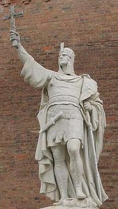](https://en.wikipedia.org/wiki/File:Albert_I_of_Brandenburg.jpg)

[(L)](https://en.wikipedia.org/wiki/File:Albert_I_of_Brandenburg.jpg)

Statue of [Albert the Bear](https://en.wikipedia.org/wiki/Albert_the_Bear) (c.1100-1170)

The origin of the name *Berlin* is uncertain. It may have roots in the language of [West Slavic](https://en.wikipedia.org/wiki/West_Slavs) inhabitants of the area of today's Berlin, and may be related to the Old [Polabian](https://en.wikipedia.org/wiki/Polabian_language) stem *berl-*/*birl-* ("swamp").[[1]](https://en.wikipedia.org/wiki/History_of_Berlin#cite_note-1)  [Folk etymology](https://en.wikipedia.org/wiki/Folk_etymology) connects the name to the German word for bear, *Bär*. A bear also appears in the [coat of arms of the city](https://en.wikipedia.org/wiki/Coat_of_arms_of_Berlin).[[2]](https://en.wikipedia.org/wiki/History_of_Berlin#cite_note-Somers2008-2)

## Prehistory[[edit](https://en.wikipedia.org/w/index.php?title=History_of_Berlin&action=edit&section=2)]

The oldest human traces, mainly arrowheads, in the area of later Berlin are dating to the 9th millennium BC. During neolithic times a large number of villages existed in the area. During Bronze Age it belonged to the [Lusatian culture](https://en.wikipedia.org/wiki/Lusatian_culture). For the time around 500 BC the presence of Germanic tribes can be evidenced for the first time in form of a number of villages in the higher situated areas of today's Berlin. After the [Semnones](https://en.wikipedia.org/wiki/Semnones) left around 200 AD, the [Burgundians](https://en.wikipedia.org/wiki/Burgundians) followed. A large part of the Germanic tribes left the region around 500 AD.

In the 6th century Slavic tribes, the later known [Hevelli](https://en.wikipedia.org/wiki/Hevelli) and [Sprevane](https://en.wikipedia.org/wiki/Sprevane), reached the region. Today their traces can mainly be found at plateaus or next to waters. Their main settlements were today's [Spandau](https://en.wikipedia.org/wiki/Spandau) and [Köpenick](https://en.wikipedia.org/wiki/K%C3%B6penick). No Slavic traces could be found in the city center of Berlin.[[3]](https://en.wikipedia.org/wiki/History_of_Berlin#cite_note-3)

## Emerging city (1100 – 1400)[[edit](https://en.wikipedia.org/w/index.php?title=History_of_Berlin&action=edit&section=3)]

In the 12th century the region came under German rule as part of the [Margraviate of Brandenburg](https://en.wikipedia.org/wiki/Margraviate_of_Brandenburg), founded by [Albert the Bear](https://en.wikipedia.org/wiki/Albert_the_Bear) in 1157. At the end of the 12th century German merchants founded the first settlements in today's city center, called [Berlin](https://en.wikipedia.org/wiki/Alt-Berlin) around modern [Nikolaiviertel](https://en.wikipedia.org/wiki/Nikolaiviertel) and [Cölln](https://en.wikipedia.org/wiki/C%C3%B6lln), on the island in the Spree now known as the Spreeinsel or [Museum Island](https://en.wikipedia.org/wiki/Museum_Island). It is not clear which settlement is older and when they got [German town rights](https://en.wikipedia.org/wiki/German_town_rights). Berlin is mentioned as a town for the first time in 1251 and Cölln in 1261.

The year 1237 was later taken as the year of founding. Afterwards the two settlements merged into the town of Berlin-Cölln; they formally merged in 1432.[[4]](https://en.wikipedia.org/wiki/History_of_Berlin#cite_note-4) Albert the Bear also bequeathed to Berlin the emblem of the bear, which has appeared on its [coat of arms](https://en.wikipedia.org/wiki/Coat_of_arms_of_Berlin) ever since. By the year 1400 Berlin and Cölln had 8,000 inhabitants. A great town center fire in 1380 damaged most written records of those early years, as did the great devastation of the [Thirty Years War](https://en.wikipedia.org/wiki/Thirty_Years_War) 1618-1648.[[5]](https://en.wikipedia.org/wiki/History_of_Berlin#cite_note-5)

## Margraviate of Brandenburg (1400 – 1700)[[edit](https://en.wikipedia.org/w/index.php?title=History_of_Berlin&action=edit&section=4)]

.jpg)

[(L)](https://en.wikipedia.org/wiki/File:Memhardt_Grundri%C3%9F_der_Beyden_Churf._Residentz_St%C3%A4tte_Berlin_und_C%C3%B6lln_1652_(1888).jpg)

Map of Berlin and Cölln (1652, East on top)

[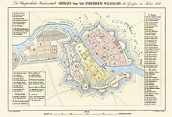](https://en.wikipedia.org/wiki/File:ZLB-Berliner_Ansichten-Januar.jpg)

[(L)](https://en.wikipedia.org/wiki/File:ZLB-Berliner_Ansichten-Januar.jpg)
Berlin around 1688 (Drawing of 1835)

[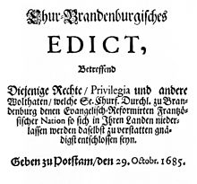](https://en.wikipedia.org/wiki/File:EdiktPotsdam.jpg)

[(L)](https://en.wikipedia.org/wiki/File:EdiktPotsdam.jpg)
The [Edict of Potsdam](https://en.wikipedia.org/wiki/Edict_of_Potsdam)

In 1415, [Frederick I](https://en.wikipedia.org/wiki/Frederick_I,_Margrave_of_Brandenburg) became the [elector](https://en.wikipedia.org/wiki/Prince-elector) of the [Margraviate of Brandenburg](https://en.wikipedia.org/wiki/Margraviate_of_Brandenburg), which he ruled until 1440. Subsequent members of the [Hohenzollern family](https://en.wikipedia.org/wiki/House_of_Hohenzollern) ruled until 1918 in Berlin, first as electors of Brandenburg, then as kings of [Prussia](https://en.wikipedia.org/wiki/Kingdom_of_Prussia), and finally as German emperors. When Berlin became the residence of the Hohenzollerns, it had to give up its [Hanseatic League](https://en.wikipedia.org/wiki/Hanseatic_League) free city status. Its main economical activity changed from trade to the production of luxurious goods for the court.

- 1443 to 1451: The first [Berliner Stadtschloss](https://en.wikipedia.org/wiki/Berliner_Stadtschloss) was built on the embankment of the river Spree.
    - At that time Berlin-Cölln had about 8,000 inhabitants. Population figures rose fast, leading to poverty.
- 1448: The inhabitants of Berlin rebelled in the "Berlin Indignation" against the construction of a new royal palace by Elector [Frederick II Irontooth](https://en.wikipedia.org/wiki/Frederick_II,_Elector_of_Brandenburg). This protest was not successful, however, and the citizenry lost many of its political and economic privileges.
- 1451: Berlin became the royal residence of the Brandenburg electors, and Berlin had to give up its status as a free [Hanseatic](https://en.wikipedia.org/wiki/Hanseatic_League) city.
- In 1510 100 [Jews](https://en.wikipedia.org/wiki/Jew) were accused of stealing and desecrating hosts. 38 of them were burned to death; others were banished, losing their possessions, only to be returned by later [margraves](https://en.wikipedia.org/wiki/Margrave).
- 1530: The Tiergarten park began when Elector Joachim I donated the property for use as a royal game preserve; it was opened to the public in the mid-17th century; it ceased being a hunting park in 1740 when the job of redesigning it in the English landscape style began.[[6]](https://en.wikipedia.org/wiki/History_of_Berlin#cite_note-6)
- 1539: The electors and Berlin officially became [Lutheran](https://en.wikipedia.org/wiki/Lutheranism).
- 1540: [Joachim II](https://en.wikipedia.org/wiki/Joachim_II,_Elector_of_Brandenburg) introduced the [Protestant Reformation](https://en.wikipedia.org/wiki/Protestant_Reformation) in Brandenburg and secularized church possessions. He used the money to pay for his projects, like building an avenue, the [Kurfürstendamm](https://en.wikipedia.org/wiki/Kurf%C3%BCrstendamm), between his hunting castle Grunewald and his palace, the [Berliner Stadtschloss](https://en.wikipedia.org/wiki/Berliner_Stadtschloss).
- 1576, [Bubonic plague](https://en.wikipedia.org/wiki/Bubonic_plague) killed about 6,000 people in the city.
- Around 1600: Berlin-Cölln had 12,000 inhabitants.
- 1618 to 1648: The [Thirty Years' War](https://en.wikipedia.org/wiki/Thirty_Years%27_War) had devastating consequences for Berlin. A third of the houses were damaged, and the city lost half of its population.
- 1640: [Frederick William](https://en.wikipedia.org/wiki/Frederick_William,_Elector_of_Brandenburg), known as the “Great Elector”, succeeded his father [George William](https://en.wikipedia.org/wiki/George_William,_Elector_of_Brandenburg) as Elector of Brandenburg. Later he initiated a policy of promoting [immigration](https://en.wikipedia.org/wiki/Immigration) and [religious toleration](https://en.wikipedia.org/wiki/Religious_toleration). Over the following decades, Berlin expanded greatly in area and population with the founding of the new suburbs of Friedrichswerder and [Dorotheenstadt](https://en.wikipedia.org/wiki/Dorotheenstadt). During his government Berlin reached 20,000 inhabitants and became significant among the cities in [Central Europe](https://en.wikipedia.org/wiki/Central_Europe) for the first time. He also developed a [standing army](https://en.wikipedia.org/wiki/Prussian_Army)
- 1647: The boulevard [Unter den Linden](https://en.wikipedia.org/wiki/Unter_den_Linden) with six rows of trees was laid down between the *[Tiergarten](https://en.wikipedia.org/wiki/Gro%C3%9Fer_Tiergarten)* park and the Palace.
- 1671: Fifty Jewish families from [Austria](https://en.wikipedia.org/wiki/Austria) were given a home in Berlin. With the [Edict of Potsdam](https://en.wikipedia.org/wiki/Edict_of_Potsdam) in 1685, Frederick William invited the French [Calvinist](https://en.wikipedia.org/wiki/Calvinism)  [Huguenots](https://en.wikipedia.org/wiki/Huguenot) to Brandenburg. More than 15,000 Huguenots came, of whom 6,000 settled in Berlin. By 1687 they comprise 20% of the population, and many were bankers, industrialists and investors.[[7]](https://en.wikipedia.org/wiki/History_of_Berlin#cite_note-7)
- 1674 and after: The *[Dorotheenstadt](https://en.wikipedia.org/wiki/Dorotheenstadt)* was built in a bow of the river Spree, north-west of the Spreeinsel (Spree Island), where the Palace was situated.
- 1688 and after: The *[Friedrichstadt](https://en.wikipedia.org/wiki/Friedrichstadt_(Berlin))* was built and settled.
- Around 1700: Many refugees from [Bohemia](https://en.wikipedia.org/wiki/Bohemia), [Poland](https://en.wikipedia.org/wiki/Poland), and [Salzburg](https://en.wikipedia.org/wiki/Archbishopric_of_Salzburg) had arrived.

## Kingdom of Prussia (1701–1871)[[edit](https://en.wikipedia.org/w/index.php?title=History_of_Berlin&action=edit&section=5)]

[(L)](https://en.wikipedia.org/wiki/File:Coat_of_arms_Berlin_1839.png)
Large coat of arms of Berlin, 1839.

In 1701, Elector Frederick III (1688–1701) crowned himself as [Frederick I](https://en.wikipedia.org/wiki/Frederick_I_of_Prussia) (1701–1713), [King in Prussia](https://en.wikipedia.org/wiki/King_in_Prussia). He was mostly interested in [decorum](https://en.wikipedia.org/wiki/Decorum): he ordered the building of the castle [Charlottenburg](https://en.wikipedia.org/wiki/Charlottenburg) in the west of the city.[[8]](https://en.wikipedia.org/wiki/History_of_Berlin#cite_note-8) He made Berlin the capital of the new kingdom of Prussia.

- 1709: Berlin counted 55,000 inhabitants, of whom 5,000 served in the [Prussian Army](https://en.wikipedia.org/wiki/Prussian_Army). Cölln and Berlin were finally unified under the name of Berlin, including the suburbs of Friedrichswerder, Dorotheenstadt, and Friedrichstadt, with 60,000 inhabitants. Berlin and Cölln are on both sides of the river [Spree](https://en.wikipedia.org/wiki/Spree), in today's [Mitte](https://en.wikipedia.org/wiki/Mitte) borough.

On 1 January 1710, the cities of Berlin, Cölln, Friedrichswerder, Dorotheenstadt, and Friedrichstadt were united as the “Royal Capital and Residence of Berlin”.

### Prussian capital[[edit](https://en.wikipedia.org/w/index.php?title=History_of_Berlin&action=edit&section=6)]

As Prussia grew, so too did Berlin, and the Kings made it the centerpiece of culture and the arts, as well as the Army. Under King Friedrich Wilhelm I (reigned 1713–40), Berlin’s growth was encouraged by his determination to build a great military power. More men were needed, so he promoted immigration of Protestants from across Germany as well as France and Switzerland. He introduced universal primary education so that his soldiers could read and write. In 1720 he built the city’s first major hospital and medical school, the [Charité](https://en.wikipedia.org/wiki/Charit%C3%A9), now the largest teaching hospital in Europe. The city was now mainly a garrison and an armoury, for the crown heavily subsidised arms manufacturers in the capital, laying the foundations for the mechanics, engineers, technicians, and entrepreneurs who were to turn Berlin into an industrial powerhouse. The old defensive walls and moats were now useless, so they were turned down. A new customs wall (the [Zoll- und Akzisemauer](https://en.wikipedia.org/wiki/Berlin_Customs_Wall)) was built further out, punctuated by 14 ornate gates. Inside the gates were parade grounds for Friedrich Wilhelm’s soldiers: the Karree at the Brandenburg gate (now Pariserplatz), the Oktagon at the Potsdam gate (now Leipzigerplatz), the Wilhelmplatz on Wilhelmstrasse (abolished in the 1980s) and several others.

In 1740, [Frederick the Great](https://en.wikipedia.org/wiki/Frederick_the_Great) (Frederick II) began his 46-year reign. He was an enlightened monarch, who patronized [Enlightenment](https://en.wikipedia.org/wiki/Age_of_Enlightenment) thinkers like [Moses Mendelssohn](https://en.wikipedia.org/wiki/Moses_Mendelssohn). By 1755 the population reached 100,000, including 26,000 soldiers. Stagnation followed under the rule of [Frederick William II](https://en.wikipedia.org/wiki/Frederick_William_II_of_Prussia), 1786-97 He had no use for the Enlightenment, but did develop innovative techniques of censorship and repression of political enemies.

[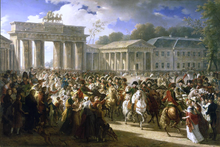](https://en.wikipedia.org/wiki/File:Charles_Meynier_-_Napoleon_in_Berlin.png)

[(L)](https://en.wikipedia.org/wiki/File:Charles_Meynier_-_Napoleon_in_Berlin.png)

Napoleon captures Berlin in 1806

- 1806: French troops marched into Berlin. Berlin was granted self-government and a far reaching military reform was started.
- 1809: The first elections for the Berlin parliament took place, in which only the well-to-do could vote.
- 1810: The Berlin University (now the [Humboldt University](https://en.wikipedia.org/wiki/Humboldt_University_of_Berlin)) was founded. Its first rector was the philosopher [Johann Gottlieb Fichte](https://en.wikipedia.org/wiki/Johann_Gottlieb_Fichte).
- 1812: Jews were allowed to practice all occupations.
- 1814: The French were defeated in the [Sixth Coalition](https://en.wikipedia.org/wiki/Sixth_Coalition). Economically the city was in good shape. The population grew from 200,000 to 400,000 in the first half of the 19th century, making Berlin the fourth-largest city in Europe.
- 1815: [Battle of Waterloo](https://en.wikipedia.org/wiki/Battle_of_Waterloo) with Prussian troops from Potsdam and Berlin participating. Berlin becomes part of the [Province of Brandenburg](https://en.wikipedia.org/wiki/Province_of_Brandenburg).
- 1827: Berlin is the capital of the Province of Brandenburg from 1827-1843.
- 1848: As in other European cities, 1848 was a [revolutionary year](https://en.wikipedia.org/wiki/Revolutions_of_1848_in_the_German_states) in Berlin. [Frederick William IV](https://en.wikipedia.org/wiki/Frederick_William_IV_of_Prussia) (1840–1861) managed to suppress the revolution. One of his reactions was to raise the income condition to partake in the elections, with the result that only 5% of the citizens could vote. This system would stay in place until 1918.
- 1861: [Wilhelm I](https://en.wikipedia.org/wiki/Wilhelm_I,_German_Emperor) (1861–1888) became the new king. In the beginning of his reign there was hope for liberalization. He appointed liberal ministers and built the city hall, Das [Rote Rathaus](https://en.wikipedia.org/wiki/Rotes_Rathaus). The appointment of [Otto von Bismarck](https://en.wikipedia.org/wiki/Otto_von_Bismarck) ended these hopes.

### Economic growth[[edit](https://en.wikipedia.org/w/index.php?title=History_of_Berlin&action=edit&section=7)]

[(L)](https://en.wikipedia.org/wiki/File:Borsig_1847.jpg)

Train factory of [August Borsig](https://en.wikipedia.org/wiki/August_Borsig) in 1847.

Prussian mercantilist policies supported manufacturing enterprises and Berlin had numerous small workshops. Lacking waterpower, Berlin entrepreneurs were early pioneers in the use of steam engines after 1815. Textiles, clothing, farm equipment, railway gear, chemicals and machinery were especially important; electrical machinery became important after 1880.

Berlin's central position after 1850 in the fast-growing German railway network facilitated the supply of raw materials and distribution of manufactures. As the administrative role of the Prussian state grew, so did the highly efficient, well-trained civil service. The bureaucracy and military expanded even faster when Berlin became the capital of unified Germany in 1871. the population grew rapidly, from 172,000 in 1800, to 826,000 in 1870. In 1861, outlying industrial suburbs such as [Wedding](https://en.wikipedia.org/wiki/Wedding_(Berlin)), [Moabit](https://en.wikipedia.org/wiki/Moabit), and several others were incorporated into the city.

### Religion[[edit](https://en.wikipedia.org/w/index.php?title=History_of_Berlin&action=edit&section=8)]

By 1900 about 85% of the people were classified as Protestants, 10% as Roman Catholics and 5% as Jews. Berlin's middle and upper classes were generally devout Protestants. The working classes increasingly became secularized. When workers moved to Berlin the Protestants among them largely abandoned the religious practices of their old villages. The labor unions promoted anticlericalism, and denounced the Protestant churches as aloof from the needs of the working class. However, the Catholic workers remained somewhat closer to their traditional churches, which featured liturgies that were more appealing to workers than worthy intellectual sermons at the Protestant churches. Adult attendance at Sunday church services in the early 20th century was 6% in Berlin, compared to 22% in London and 37% in New York.[[9]](https://en.wikipedia.org/wiki/History_of_Berlin#cite_note-9)

### Berlin Romanticism[[edit](https://en.wikipedia.org/w/index.php?title=History_of_Berlin&action=edit&section=9)]

The phase of [German Romanticism](https://en.wikipedia.org/wiki/German_Romanticism) after [Jena Romanticism](https://en.wikipedia.org/wiki/Jena_Romanticism) is often called **Berlin Romanticism** (see also [Heidelberg Romanticism](https://en.wikipedia.org/wiki/Heidelberg_Romanticism)). Notable representatives of the movement include [Friedrich Schleiermacher](https://en.wikipedia.org/wiki/Friedrich_Schleiermacher), [Wilhelm von Humboldt](https://en.wikipedia.org/wiki/Wilhelm_von_Humboldt) and [Alexander von Humboldt](https://en.wikipedia.org/wiki/Alexander_von_Humboldt).[[10]](https://en.wikipedia.org/wiki/History_of_Berlin#cite_note-10)

## German Empire (1871–1918)[[edit](https://en.wikipedia.org/w/index.php?title=History_of_Berlin&action=edit&section=10)]

### Imperial capital[[edit](https://en.wikipedia.org/w/index.php?title=History_of_Berlin&action=edit&section=11)]

After the quick victory of an alliance of German states over France in the [1870 war](https://en.wikipedia.org/wiki/Franco-Prussian_War), the [German Empire](https://en.wikipedia.org/wiki/German_Empire) was established in 1871. Bismarck had fought and succeeded in leaving out Austria, Prussia's long standing competitor, and Prussia became the largest and by far most influential state in the new German Empire, and in turn Germany became the most powerful nation in Europe. Wilhelm I became emperor ("Kaiser"). Bismarck became Chancellor and made Berlin the center of European power politics. The imperial government and the military establishment expanded dramatically, bringing together the landed junker nobility, the rich bankers and industrialists, and the most talented scientists and scholars. In 1884 came the parliament building, the [Reichstag](https://en.wikipedia.org/wiki/Reichstag_(building)).[[11]](https://en.wikipedia.org/wiki/History_of_Berlin#cite_note-11) Municipal government was handled in two parts. The ministry of police reported to the Prussian government and took control of crime, markets, and fire fighting. The civil government had a mayor appointed by the city council. It comprised 144 members elected in 48 wards by universal manhood suffrage. It handled the water supply and sanitation, streets, hospitals and charitable operations and schools.[[12]](https://en.wikipedia.org/wiki/History_of_Berlin#cite_note-12)

[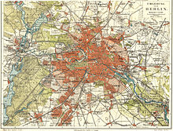](https://en.wikipedia.org/wiki/File:Berlin_1905_Meyers_Konversationslexikon_6._Auflage.jpg)

[(L)](https://en.wikipedia.org/wiki/File:Berlin_1905_Meyers_Konversationslexikon_6._Auflage.jpg)

Berlin in 1905 click 3x to enlarge

In 1870, the sanitary conditions in Berlin were among the worst in Europe. [August Bebel](https://en.wikipedia.org/wiki/August_Bebel) recalled conditions before a modern [sewer](https://en.wikipedia.org/wiki/Sewerage) system was built in the late 1870s:

"Waste-water from the houses collected in the gutters running alongside the curbs and emitted a truly fearsome smell. There were no public toilets in the streets or squares. Visitors, especially women, often became desperate when nature called. In the public buildings the sanitary facilities were unbelievably primitive....As a metropolis, Berlin did not emerge from a state of barbarism into civilization until after 1870."[[13]](https://en.wikipedia.org/wiki/History_of_Berlin#cite_note-13)

[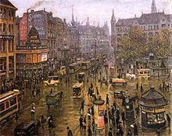](https://en.wikipedia.org/wiki/File:Paul_Hoeniger_Spittelmarkt_1912.jpg)

[(L)](https://en.wikipedia.org/wiki/File:Paul_Hoeniger_Spittelmarkt_1912.jpg)
Berlin in 1912.

The primitive conditions were intolerable for a world national capital, and the Imperial government brought in its scientists, engineers and urban planners to not only solve the deficiencies but to forge the world's model city. A British expert in 1906 concluded that Berlin represented "the most complete application of science, order and method of public life," adding "it is a marvel of civic administration, the most modern and most perfectly organized city that there is."[[14]](https://en.wikipedia.org/wiki/History_of_Berlin#cite_note-14)

In the meantime, Berlin had become an industrial city with 800,000 inhabitants. Improvements to the infrastructure were needed; in 1896 the construction of the subway (*[U-Bahn](https://en.wikipedia.org/wiki/Berlin_U-Bahn)*) began and was completed in 1902. The neighborhoods around the city center (including [Kreuzberg](https://en.wikipedia.org/wiki/Kreuzberg), [Prenzlauer Berg](https://en.wikipedia.org/wiki/Prenzlauer_Berg), [Friedrichshain](https://en.wikipedia.org/wiki/Friedrichshain) and [Wedding](https://en.wikipedia.org/wiki/Wedding_(Germany))) were filled with tenement blocks. The surroundings saw extensive development of industrial areas East of Berlin and wealthy residential areas in the South-West.

In terms of high culture, museums were being built and enlarged, and Berlin was on the verge of becoming a major musical city. Berlin dominated the German theater scene, with the government-supported Opernhaus and Schauspielhaus, as well as numerous private playhouses included the Lessing and the Deutsches theatres. They featured the modern plays of [Ernst von Wildenbruch](https://en.wikipedia.org/wiki/Ernst_von_Wildenbruch), [Hermann Sudermann](https://en.wikipedia.org/wiki/Hermann_Sudermann), and [Gerhart Hauptmann](https://en.wikipedia.org/wiki/Gerhart_Hauptmann). who managed to work around the puritanical censorship imposed by the Berlin police.[[15]](https://en.wikipedia.org/wiki/History_of_Berlin#cite_note-15)

### Labour unions[[edit](https://en.wikipedia.org/w/index.php?title=History_of_Berlin&action=edit&section=12)]

Berlin, with its large numbers of industrial workers by 1871 became the headquarters for most of the national labor organizations, and the favorite meeting place for labor intellectuals. inside the city, the unions had a turbulent history. The conservative aftermath of the Revolution of 1848 drained their strength, and internal bickering was characteristic of the 1850s and 1860s. Many locals were under the control of reformist, bourgeois leaders who competed with each other and had a negative view of Marxism and socialist internationalist. They concentrated on wages, hours and control the workplace, and gave little support to nationalist organizations such as the Allgemeine Deutsche Arbeiterverein (ADAV) founded in 1863. By the 1870s, however, the Lassallean ADAV finally gained strength; it joined together with the Social Democratic Worker's Party (SDAP) in 1874. Henceforth the city's labor movement supported radical socialism and gained preeminence within the German labor movement. Germany had universal manhood suffrage after 1871, but the government was controlled by hostile forces, and Chancellor [Otto von Bismarck](https://en.wikipedia.org/wiki/Otto_von_Bismarck) tried to undermine or destroy the union movement.[[16]](https://en.wikipedia.org/wiki/History_of_Berlin#cite_note-16)

### First World War[[edit](https://en.wikipedia.org/w/index.php?title=History_of_Berlin&action=edit&section=13)]

The "spirit of 1914" was the overwhelming, enthusiastic support of all elements of the population for war in 1914. In the Reichstag, the vote for credits was unanimous, with all the Socialists joining in. One professor testified to a "great single feeling of moral elevation of soaring of religious sentiment, in short, the ascent of a whole people to the heights."[[17]](https://en.wikipedia.org/wiki/History_of_Berlin#cite_note-17) At the same time, there was a level of anxiety; most commentators predicted the short victorious war – but that hope was dashed in a matter of weeks, as the invasion of Belgium bogged down and the French Army held in front of Paris. The Western Front became a killing machine, as neither army moved more than a ten thousand yards at a time. There had been no preparations before the war, and no stockpiles of essential goods. Industry was in chaos, unemployment soared while it took months to reconvert to munitions productions. In 1916, the Hindenburg Program called for the mobilization of all economic resources to produce artillery, shells, and machine guns. Church bells and copper roofs were ripped out and melted down.[[18]](https://en.wikipedia.org/wiki/History_of_Berlin#cite_note-18)

Conditions on the homefront worsened month by month, for the British [blockade of Germany](https://en.wikipedia.org/wiki/Blockade_of_Germany) cut off supplies of essential raw materials and foodstuffs, while the conscription of so many farmers (and horses) reduced the food supply. Likewise, the drafting of miners reduced the main energy source, coal. the textile factories produced Army uniforms, and warm clothing for civilians ran short. The device of using ersatz materials, such as paper and cardboard for cloth and leather proved unsatisfactory. Soap was in short supply, as was hot water.

Morale of both civilians and soldiers continued to sink but using the slogan of "sharing scarcity" the Berlin bureaucracy ran an efficient rationing system nevertheless.[[19]](https://en.wikipedia.org/wiki/History_of_Berlin#cite_note-19) The food supply increasingly focused on potatoes and bread as it was harder and harder to buy meat. Rationing was installed, and soup kitchens were opened. The meat ration in late 1916 was only 31% of peacetime, and it fell to 12% in late 1918. The fish ration was 51% in 1916, and none at all by late 1917. The rations for cheese, butter, rice, cereals, eggs and lard were less than 20% of peacetime levels.[[20]](https://en.wikipedia.org/wiki/History_of_Berlin#cite_note-20) In 1917 the harvest was poor, and the potato supply ran short, and Germans substituted almost inedible turnips; the "turnip winter" of 1917-18 was remembered with bitter distaste for generations.[[21]](https://en.wikipedia.org/wiki/History_of_Berlin#cite_note-21)

German women were not employed in the Army, but large numbers took paid employment in industry and factories, and even larger numbers engaged in volunteer services. Housewives were taught how to cook without milk, eggs or fat; agencies helped widows find work. Banks, insurance companies and government offices for the first time hired women for clerical positions. Factories hired them for unskilled labor – by December 1917, half the workers in chemicals, metals, and machine tools were women. Laws protecting women in the workplace were relaxed, and factories set up canteens to provide food for their workers, lest their productivity fall off. The food situation in 1918 was better, because the harvest was better, but serious shortages continued, with high prices, and a complete lack of condiments and fresh fruit. Many migrants had flocked into Berlin to work in industry and the government ministries, which made for overcrowded housing. Reduced coal supplies left everyone in the cold. Daily life involved long working hours, poor health, and little or no recreation, as well as increasing anxiety for the safety of loved ones in the Army and in prisoner of war camps. The men who returned from the front were those who had been permanently crippled; wounded soldiers who recovered were sent back to the trenches.[[22]](https://en.wikipedia.org/wiki/History_of_Berlin#cite_note-22)

## Weimar Republic (1918–1933)[[edit](https://en.wikipedia.org/w/index.php?title=History_of_Berlin&action=edit&section=14)]

Main article: [1920s Berlin](https://en.wikipedia.org/wiki/1920s_Berlin)

[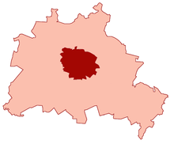](https://en.wikipedia.org/wiki/File:Gro%C3%9F-Berlin.png)

[(L)](https://en.wikipedia.org/wiki/File:Gro%C3%9F-Berlin.png)

Pre-1920 municipal limits of the City of Berlin (dark red) within the extended city area of Greater Berlin (light red)

At the end of [World War I](https://en.wikipedia.org/wiki/World_War_I), monarchy and aristocracy was overthrown and Germany became a republic, known as the [Weimar Republic](https://en.wikipedia.org/wiki/Weimar_Republic). Berlin remained the capital, but faced a series of threats from the far left and far right.

In late 1918 politicians inspired by the Communist Revolution in Russia founded the [Communist Party of Germany](https://en.wikipedia.org/wiki/Communist_Party_of_Germany) (*Kommunistische Partei Deutschlands*, KPD). In January 1919 it tried to seize power in the [Spartacist revolt](https://en.wikipedia.org/wiki/Spartacist_revolt)). The coup failed and at the end of the month right-wing *[Freikorps](https://en.wikipedia.org/wiki/Freikorps)* forces killed the Communist leaders [Rosa Luxemburg](https://en.wikipedia.org/wiki/Rosa_Luxemburg) and [Karl Liebknecht](https://en.wikipedia.org/wiki/Karl_Liebknecht).

In March 1920 [Wolfgang Kapp](https://en.wikipedia.org/wiki/Wolfgang_Kapp), founder of the right wing [German Fatherland Party](https://en.wikipedia.org/wiki/German_Fatherland_Party) (*Deutsche Vaterlands-Partei*), tried to bring down the government. The Berlin garrison chose his side, and the government buildings were occupied (the government had already left Berlin). A general strike stopped the [putsch](https://en.wikipedia.org/wiki/Putsch) being successful.

In October 1, 1920: The [Greater Berlin Act](https://en.wikipedia.org/wiki/Greater_Berlin_Act) created "Greater Berlin" (*Groß-Berlin*) by incorporating several neighboring towns and villages like [Charlottenburg](https://en.wikipedia.org/wiki/Charlottenburg), [Köpenick](https://en.wikipedia.org/wiki/K%C3%B6penick) or [Spandau](https://en.wikipedia.org/wiki/Spandau) from the Province of Brandenburg into the city; Berlin's population doubled overnight from about 2 to nearly 4 million inhabitants.

In 1922: The foreign minister [Walther Rathenau](https://en.wikipedia.org/wiki/Walther_Rathenau) was murdered in Berlin, and half a million people attended his funeral.

The economic situation was bad. Germany owed reparation money after the [Treaty of Versailles](https://en.wikipedia.org/wiki/Treaty_of_Versailles). The sums were reduced and paid using loans from New York banks. In response to French occupation, the government reacted by printing so much money that inflation was enormous. Especially pensioners lost their savings; everyone else lost their debts. At the worst point of the inflation one dollar was worth about 4.2 trillion marks. From 1924 onwards the situation became better because of newly arranged agreements with the allied forces, American help, and a sounder fiscal policy. The heyday of Berlin began. It became the largest industrial city of the continent. People like the architect [Walter Gropius](https://en.wikipedia.org/wiki/Walter_Gropius), physicist [Albert Einstein](https://en.wikipedia.org/wiki/Albert_Einstein), painter [George Grosz](https://en.wikipedia.org/wiki/George_Grosz) and writers [Arnold Zweig](https://en.wikipedia.org/wiki/Arnold_Zweig), [Bertolt Brecht](https://en.wikipedia.org/wiki/Bertolt_Brecht) and [Kurt Tucholsky](https://en.wikipedia.org/wiki/Kurt_Tucholsky) made Berlin one of the major cultural centers of Europe. Brecht spent his last years in the Weimar-era Berlin (1930–1933) working with his ‘collective’ on the Lehrstücke. Night life bloomed in 1920s Berlin.

In 1922, the railway system, that connected Berlin to its neighboring cities and villages was electrified and transformed into the S-Bahn, and a year later [Tempelhof airport](https://en.wikipedia.org/wiki/Tempelhof_International_Airport) was opened. Berlin was the second biggest inland harbor of the country. All this infrastructure was needed to transport and feed the over 4 million Berliners.

Before the 1929 crash, 450,000 people were unemployed. In the same year [Adolf Hitler](https://en.wikipedia.org/wiki/Adolf_Hitler)'s [Nazi Party](https://en.wikipedia.org/wiki/Nazi_Party) won its first seats in the city parliament. Nazi Propaganda chief [Joseph Goebbels](https://en.wikipedia.org/wiki/Joseph_Goebbels) became [Gauleiter](https://en.wikipedia.org/wiki/Gauleiter) (party district leader) of Berlin in 1926. On July 20, 1932, the [Prussian](https://en.wikipedia.org/wiki/Prussia) government under [Otto Braun](https://en.wikipedia.org/wiki/Otto_Braun) in Berlin was dismissed by presidential decree. The republic was nearing its breakdown, under attack by extreme forces from the right and the left. On January 30, 1933, Hitler became [Chancellor of Germany](https://en.wikipedia.org/wiki/Chancellor_of_Germany_(German_Reich)).

## Third Reich (1933–1945)[[edit](https://en.wikipedia.org/w/index.php?title=History_of_Berlin&action=edit&section=15)]

By 1931, the Great Depression had severely damaged the city's economy. Politics were in chaos, as militias controlled by the Nazis and the Communists fought for control of the streets. President Hindenburg made Hitler Chancellor in January 1933, and the Nazis quickly moved to take complete control of the entire nation. On February 27, 1933 a left-wing radical was alleged to have set afire the Reichstag building (a fire which was later believed to have been set by the Nazis themselves); the [fire gave Hitler the opportunity](https://en.wikipedia.org/wiki/Reichstag_fire) to set aside the constitution. Tens of thousands of the political opponents fled into exile, or were imprisoned. All civic organizations, except the churches, came under Nazi control.

Around 1933, some 160,000 Jews were living in Berlin: one third of all German Jews, 4% of the Berlin population. A third of them were poor immigrants from Eastern Europe, who lived mainly in the *Scheunenviertel* near [Alexanderplatz](https://en.wikipedia.org/wiki/Alexanderplatz). The Jews were persecuted from the beginning of the Nazi regime. In March, all Jewish doctors had to leave the Charité hospital. In the first week of April, Nazi officials ordered the German population not to buy from Jewish shops.

The [1936 Summer Olympics](https://en.wikipedia.org/wiki/1936_Summer_Olympics) were held in Berlin and used as a showcase for Nazi Germany (though the Games had been given to Germany before 1933). In order to not alienate the foreign visitors, the "forbidden for Jews" signs were temporarily removed.

Nazi rule destroyed Berlin's Jewish community, which numbered 160,000 before the Nazis came to power. After the pogrom of [Kristallnacht](https://en.wikipedia.org/wiki/Kristallnacht) in 1938, thousands of the city's Jews were imprisoned. Around 1939, there were still 75,000 Jews living in Berlin. The majority of German Jews in Berlin were taken to the Grunewald railway station in early 1943 and shipped in [stock cars](https://en.wikipedia.org/wiki/Stock_car_(rail)) to death camps such as the [Auschwitz](https://en.wikipedia.org/wiki/Auschwitz_concentration_camp), where most were murdered in the [Holocaust](https://en.wikipedia.org/wiki/Holocaust). Only some 1200 Jews survived in Berlin by hiding.

Thirty kilometers (19 mi) northwest of Berlin, near [Oranienburg](https://en.wikipedia.org/wiki/Oranienburg), was [Sachsenhausen concentration camp](https://en.wikipedia.org/wiki/Sachsenhausen_concentration_camp), where mainly political opponents and Russian prisoners of war were incarcerated. Tens of thousands died there. Sachsenhausen had subcamps near industries, where the prisoners had to work. Many of these camps were in Berlin.

### Nazi plans[[edit](https://en.wikipedia.org/w/index.php?title=History_of_Berlin&action=edit&section=16)]

Main article: [Welthauptstadt Germania](https://en.wikipedia.org/wiki/Welthauptstadt_Germania)

In the late 1930s Hitler and his architect [Albert Speer](https://en.wikipedia.org/wiki/Albert_Speer) made plans for the new Berlin—a world city or *[Welthauptstadt Germania](https://en.wikipedia.org/wiki/Welthauptstadt_Germania)*.[[23]](https://en.wikipedia.org/wiki/History_of_Berlin#cite_note-23) All the projects were to be of gigantic size. Adjacent to the Reichstag, [Speer](https://en.wikipedia.org/wiki/Albert_Speer) planned to construct the *[Volkshalle](https://en.wikipedia.org/wiki/Volkshalle)* (The People's Hall), 250 m high, with an enormous copper dome. It would be large enough to hold 170,000 people. From the People's Hall, a southbound avenue was planned, the Avenue of Victory, 23 m wide and 5.6 kilometers (3.5 mi) long. At the other end there would have been the new railway station, and next to it [Tempelhof Airport](https://en.wikipedia.org/wiki/Tempelhof_Airport). Halfway down the avenue there would have been a huge arch 117 m high, commemorating those fallen during the world wars. With the completion of these projects (planned for 1950), Berlin was to be renamed "Germania."[[24]](https://en.wikipedia.org/wiki/History_of_Berlin#cite_note-24)

The war postponed all construction, as the city instead built giant concrete towers as bases for anti-aircraft guns. Today only a few structures remain from the Nazi era, such as the *Reichsluftfahrtministerium* (National Ministry of Aviation), [Tempelhof International Airport](https://en.wikipedia.org/wiki/Tempelhof_International_Airport), [Olympiastadion](https://en.wikipedia.org/wiki/Olympiastadion). Hitler's [Reich Chancellery](https://en.wikipedia.org/wiki/Reich_Chancellery) was demolished by Soviet occupation authorities.

### Second World War[[edit](https://en.wikipedia.org/w/index.php?title=History_of_Berlin&action=edit&section=17)]

See also: [Bombing of Berlin in World War II](https://en.wikipedia.org/wiki/Bombing_of_Berlin_in_World_War_II), [Battle of Berlin (RAF campaign)](https://en.wikipedia.org/wiki/Battle_of_Berlin_(RAF_campaign)), and [Battle of Berlin](https://en.wikipedia.org/wiki/Battle_of_Berlin)

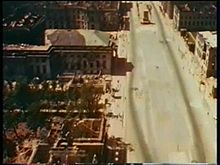[Play media](https://upload.wikimedia.org/wikipedia/commons/2/23/SFP_186_-_Flug_ueber_Berlin.ogv)

[(L)](https://en.wikipedia.org/wiki/File:SFP_186_-_Flug_ueber_Berlin.ogv)
US Air Force photographs the destruction in central Berlin in July 1945

Initially Berlin was at the extreme range of British bombers and attacks had to be made in clear skies during summer, increasing the risk to the attackers. Better bombers came into service in 1942 but most of the British bombing effort that year was spent in support of the [Battle of the Atlantic](https://en.wikipedia.org/wiki/Battle_of_the_Atlantic) against German submarines.

- 1940: A token British air-raid on Berlin; Hitler responds by ordering [the Blitz](https://en.wikipedia.org/wiki/The_Blitz) on London.
- 1943: Polish resistance group *[Zagra-Lin](https://en.wikipedia.org/w/index.php?title=Zagra-Lin&action=edit&redlink=1) ([pl](https://pl.wikipedia.org/wiki/Zagra-Lin))* successfully carries out a series of small bomb attacks.[[25]](https://en.wikipedia.org/wiki/History_of_Berlin#cite_note-25)
- 1943: The [USAAF](https://en.wikipedia.org/wiki/USAAF) strategic bombing force began operations against Berlin. The RAF focused their strategic bombing efforts on Berlin in their ["Battle of Berlin"](https://en.wikipedia.org/wiki/Battle_of_Berlin_(air)) from November. It was halted at the end of March 1944, after 16 mass bombing raids on the capital, due to unacceptable losses of aircraft and crew. By that point about half a million had been made homeless but morale and production was unaffected. About a quarter of the city's population was evacuated. Raids on major German cities grew in scope and raids of over 1,000 4-engined bombers were not uncommon by 1944. (On March 18, 1945 alone, for example, 1,250 American bombers attacked the city).
- 1944: USAAF bombing switched to forcing encounters with the German air force so that it could be defeated by the bombers' fighter escorts. Attacks on Berlin ensured a response from the [Luftwaffe](https://en.wikipedia.org/wiki/Luftwaffe), drawing it into a battle where their losses could not be replaced at the same rate as the Allies. RAF focus switched to preparations for the [invasion of France](https://en.wikipedia.org/wiki/Battle_of_France) but Berlin was still subjected to regular nuisance and diversionary raids by the RAF.
- March 1945: The RAF begins 36 consecutive nights of bombing by its fast [de Havilland Mosquito](https://en.wikipedia.org/wiki/De_Havilland_Mosquito) medium bombers (from around 40 to 80 each night). British bombers dropped 46,000 tons of bombs; the Americans dropped 23,000 tons. By May 1945, 1.7 million people (40%) had fled.[[26]](https://en.wikipedia.org/wiki/History_of_Berlin#cite_note-26)
- April 1945: Berlin was the main objective for Allied armies. The [Race to Berlin](https://en.wikipedia.org/wiki/Race_to_Berlin) refers to the competition of Allied generals during the final months of World War II to enter Berlin first. U.S. General [Dwight D. Eisenhower](https://en.wikipedia.org/wiki/Dwight_D._Eisenhower) halted Anglo-American troops on the [Elbe](https://en.wikipedia.org/wiki/Elbe) River, primarily because the Soviets made their capture of the city a high national priority in terms of prestige and revenge. The [Red Army](https://en.wikipedia.org/wiki/Red_Army) converged on Berlin with several Fronts (Army Groups). [Hitler](https://en.wikipedia.org/wiki/Hitler) remained in supreme command and imagined that rescue armies were on the way; he refused to consider surrender.

The [Battle of Berlin](https://en.wikipedia.org/wiki/Battle_of_Berlin) itself has been well chronicled.[[27]](https://en.wikipedia.org/wiki/History_of_Berlin#cite_note-27)

- April 30, 1945: [Hitler committed suicide](https://en.wikipedia.org/wiki/Hitler_committed_suicide) in the *[Führerbunker](https://en.wikipedia.org/wiki/F%C3%BChrerbunker)* underneath the [Reich Chancellery](https://en.wikipedia.org/wiki/Reich_Chancellery). Resistance continued, though most of the city was in Soviet hands by that point.
- May 2, 1945: Berlin finally capitulated.
- Hundreds of thousands of women were subjected to [rape by Soviet soldiers](https://en.wikipedia.org/wiki/Red_Army_atrocities#Mass_rapes).[[28]](https://en.wikipedia.org/wiki/History_of_Berlin#cite_note-28)

Destruction of buildings and infrastructure was nearly total in parts of the inner city business and residential sectors. The outlying sections suffered relatively little damage. This averages to one fifth of all buildings, and 50% in the inner city.

## West and East Germany (1945–1990)[[edit](https://en.wikipedia.org/w/index.php?title=History_of_Berlin&action=edit&section=18)]

By war's end up to a third of Berlin had been destroyed by concerted Allied air raids, Soviet artillery and street fighting. The so-called *[Stunde Null](https://en.wikipedia.org/wiki/Stunde_Null)*—zero hour—marked a new beginning for the city. Greater Berlin was divided into four sectors by the Allies under the [London Protocol](https://en.wikipedia.org/wiki/London_Protocol_(1944)) of 1944, as follows:

[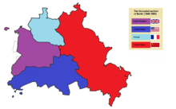](https://en.wikipedia.org/wiki/File:Allied_occupation_in_Berlin_(1945-1990).png)

[(L)](https://en.wikipedia.org/wiki/File:Allied_occupation_in_Berlin_(1945-1990).png)

The occupied sectors of Berlin

- the [American](https://en.wikipedia.org/wiki/United_States) sector, consisting of the Boroughs of [Neukölln](https://en.wikipedia.org/wiki/Neuk%C3%B6lln), [Kreuzberg](https://en.wikipedia.org/wiki/Kreuzberg), [Tempelhof](https://en.wikipedia.org/wiki/Tempelhof), [Schöneberg](https://en.wikipedia.org/wiki/Sch%C3%B6neberg), [Steglitz](https://en.wikipedia.org/wiki/Steglitz-Zehlendorf) and [Zehlendorf](https://en.wikipedia.org/wiki/Zehlendorf,_Berlin); (see: [commandants of Berlin American Sector](https://en.wikipedia.org/wiki/Commandants_of_Berlin_American_Zone))
- the [British](https://en.wikipedia.org/wiki/United_Kingdom) sector, consisting of the Boroughs of [Tiergarten](https://en.wikipedia.org/wiki/Tiergarten_(Berlin)), [Charlottenburg](https://en.wikipedia.org/wiki/Charlottenburg), [Wilmersdorf](https://en.wikipedia.org/wiki/Wilmersdorf) and [Spandau](https://en.wikipedia.org/wiki/Spandau); (see: [commandants of Berlin British Sector](https://en.wikipedia.org/wiki/Commandants_of_Berlin_British_Zone))
- the [French](https://en.wikipedia.org/wiki/France) sector, consisting of the Boroughs of [Wedding](https://en.wikipedia.org/wiki/Wedding,_Berlin) and [Reinickendorf](https://en.wikipedia.org/wiki/Reinickendorf); (See: [commandants of Berlin French Sector](https://en.wikipedia.org/wiki/Commandants_of_Berlin_French_Zone))
- the [Soviet](https://en.wikipedia.org/wiki/Soviet_Union) sector, consisting of the Boroughs of [Mitte](https://en.wikipedia.org/wiki/Mitte), [Prenzlauer Berg](https://en.wikipedia.org/wiki/Prenzlauer_Berg), [Pankow](https://en.wikipedia.org/wiki/Pankow), [Weißensee](https://en.wikipedia.org/wiki/Berlin-Wei%C3%9Fensee), [Friedrichshain](https://en.wikipedia.org/wiki/Friedrichshain), [Lichtenberg](https://en.wikipedia.org/wiki/Lichtenberg), [Treptow](https://en.wikipedia.org/wiki/Treptow), and [Köpenick](https://en.wikipedia.org/wiki/K%C3%B6penick); (see: [commandants of Berlin Soviet Sector](https://en.wikipedia.org/wiki/Commandants_of_Berlin_Soviet_Zone)).

The Soviet victors of the [Battle of Berlin](https://en.wikipedia.org/wiki/Battle_of_Berlin) immediately occupied all of Berlin. They handed the American, British and French sectors (later known as [West Berlin](https://en.wikipedia.org/wiki/West_Berlin)) to the American and British Forces in July 1945: the French occupied their sector later. Berlin remained divided until reunification in 1990.[[29]](https://en.wikipedia.org/wiki/History_of_Berlin#cite_note-29)

The Soviets used the period from May 1945 to July 1945 to dismantle industry, transport and other facilities in West Berlin, including removing railway tracks, as reparations for German war damage in the Soviet Union. This practice continued in [East Berlin](https://en.wikipedia.org/wiki/East_Berlin) and the Soviet occupation zone after 1945. Conditions were harsh, and hundreds of thousands of refugees from the East kept pouring in. Residents depended heavily on the black market for food and other necessities.[[30]](https://en.wikipedia.org/wiki/History_of_Berlin#cite_note-30)

Berlin's unique situation as a city half-controlled by Western forces in the middle of the Soviet Occupation Zone of Germany made it a natural focal point in the [Cold War](https://en.wikipedia.org/wiki/Cold_War) after 1947. Though the city was initially governed by a [Four Power Allied Control Council](https://en.wikipedia.org/wiki/Four_Power_Allied_Control_Council) with a leadership that rotated monthly, the Soviets withdrew from the council as East-West relations deteriorated and began governing their sector independently. The council continued to govern West Berlin, with the same rotating leadership policy, though now only involving France, Great Britain, and the United States.

[East Germany](https://en.wikipedia.org/wiki/East_Germany) chose [East Berlin](https://en.wikipedia.org/wiki/East_Berlin) as its capital when the country was formed out of the Soviet occupation zone in October 1949; however, this was rejected by Western allies, who continued to regard Berlin as an occupied city that was not legally part of any German state. In practice, the government of East Germany treated East Berlin as an integral part of the nation. Although half the size and population of West Berlin, it included most of the historic center.

[West Germany](https://en.wikipedia.org/wiki/West_Germany), formed on 23 May 1949 from the American, British, and French zones, had its [seat of government](https://en.wikipedia.org/wiki/Seat_of_government) and *[de facto](https://en.wikipedia.org/wiki/De_facto)*  [capital](https://en.wikipedia.org/wiki/Capital_(political)) in [Bonn](https://en.wikipedia.org/wiki/Bonn), although Berlin was symbolically named the *[de jure](https://en.wikipedia.org/wiki/De_jure)* West German capital in West German Basic Law ([Grundgesetz](https://en.wikipedia.org/wiki/Grundgesetz)).

[West Berlin](https://en.wikipedia.org/wiki/West_Berlin)  *[de jure](https://en.wikipedia.org/wiki/De_jure)* remained under the rule of the Western Allies, but for most practical purposes was treated as a part of [West Germany](https://en.wikipedia.org/wiki/West_Germany); the residents held West German passports.

### Blockade and airlift[[edit](https://en.wikipedia.org/w/index.php?title=History_of_Berlin&action=edit&section=19)]

Main article: [Berlin Blockade](https://en.wikipedia.org/wiki/Berlin_Blockade)

[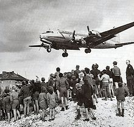](https://en.wikipedia.org/wiki/File:C-54landingattemplehof.jpg)

[(L)](https://en.wikipedia.org/wiki/File:C-54landingattemplehof.jpg)
Berliners watching a C-54 land at Tempelhof Airport (1948)

In response to Allied efforts to fuse the American, French, and British sectors of western Germany into a federal state, and to a currency reform undertaken by Western powers without Soviet approval, the Soviets blocked ground access to [West Berlin](https://en.wikipedia.org/wiki/West_Berlin) on 26 June 1948, in what became known as the "[Berlin Blockade](https://en.wikipedia.org/wiki/Berlin_Blockade)". The Soviet goal was to gain control of the whole of Berlin. The American and British air forces engaged in a massive logistical effort to supply the western sectors of the city through the Berlin Airlift, known by West Berliners as "die Luftbrücke" (the Air Bridge). The blockade lasted almost a year, ending when the Soviets once again allowed ground access to West Berlin on 11 May 1949. The Blockade and Airlift were iconic events in the early history of the [Cold War](https://en.wikipedia.org/wiki/Cold_War), and made a profound impression on Berliners as to who their friends and their enemies were.[[31]](https://en.wikipedia.org/wiki/History_of_Berlin#cite_note-31)

As part of this project, US Army engineers expanded [Tempelhof Airport](https://en.wikipedia.org/wiki/Tempelhof_International_Airport). Because sometimes the deliveries contained sweets and candy for children, the planes were also nicknamed "[Candy Bombers](https://en.wikipedia.org/wiki/Raisin_bombers)".[[32]](https://en.wikipedia.org/wiki/History_of_Berlin#cite_note-32)

### The June 17 Uprising[[edit](https://en.wikipedia.org/w/index.php?title=History_of_Berlin&action=edit&section=20)]

Main article: [Uprising of 1953 in East Germany](https://en.wikipedia.org/wiki/Uprising_of_1953_in_East_Germany)

With Stalin dead, the KGB chief [Lavrenti Beria](https://en.wikipedia.org/wiki/Lavrenti_Beria) jockeyed for power in the Kremlin, putting forth the goal of German reunification. His plan was to set up a workers' demonstration that would allow the Kremlin to remove hardliner [Walter Ulbricht](https://en.wikipedia.org/wiki/Walter_Ulbricht) and begin a program of economic concessions to the workers. The plan failed when the demonstrations assumed a mass character. The strike against poor wages and working conditions overnight became a workers' revolution for democratic rights. On 17 June, Soviet tanks had to restore order. This failure delayed German unification and contributed to the fall of Beria. It started when 60 construction workers building the showpiece [Stalin-Allee](https://en.wikipedia.org/wiki/Stalin-Allee) in East Berlin went on strike on 16 June 1953, to demand a reduction in recent work-quota increases. They called for a [general strike](https://en.wikipedia.org/wiki/General_strike) the next day, 17 June. The general strike and protest marches turned into rioting and spread throughout East Germany. The East German police failed to quell the unrest. It had to be suppressed by Soviet troops, who encountered stiff resistance from angry crowds across East Germany, and responded with live ammunition. At least 153 people were killed in the suppression of the uprising.[[33]](https://en.wikipedia.org/wiki/History_of_Berlin#cite_note-33)[[34]](https://en.wikipedia.org/wiki/History_of_Berlin#cite_note-34)

The continuation of the street "[Unter den Linden](https://en.wikipedia.org/wiki/Unter_den_Linden)" on the western side of the [Brandenburg Gate](https://en.wikipedia.org/wiki/Brandenburg_Gate) was renamed *[Straße des 17. Juni](https://en.wikipedia.org/wiki/Stra%C3%9Fe_des_17._Juni)* in honor of the uprising, and 17 June was proclaimed a national holiday in West Germany. The 50th anniversary of 17 June 1953 in 2003 was marked by reflection on the role of memory in creating a national identity for a unified Germany.

### Berlin Wall[[edit](https://en.wikipedia.org/w/index.php?title=History_of_Berlin&action=edit&section=21)]

Main article: [Berlin Wall](https://en.wikipedia.org/wiki/Berlin_Wall)

[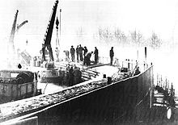](https://en.wikipedia.org/wiki/File:Berlin_Wall_1961-11-20.jpg)

[(L)](https://en.wikipedia.org/wiki/File:Berlin_Wall_1961-11-20.jpg)

East German construction workers building the [Berlin Wall](https://en.wikipedia.org/wiki/Berlin_Wall), 1961-11-20. Those trying to cross the so-called death strip on the eastern side could be shot.

Loshitzky depicts the role of the Berlin Wall as a symbol of the Cold War, détente, and the collapse of the Communist regimes in Eastern Europe. She divides the history of the Wall into six major stages: the erection of the Wall (1961); the period of the "geography of fear" from the Cold War; the period of détente; the short period of glasnost and perestroika; the fall of the Wall (1989); and after the Wall.[[35]](https://en.wikipedia.org/wiki/History_of_Berlin#cite_note-35)

On August 13, 1961 the Communist East German government started to build a wall, physically separating [West Berlin](https://en.wikipedia.org/wiki/West_Berlin) from [East Berlin](https://en.wikipedia.org/wiki/East_Berlin) and the rest of East Germany, as a response to massive numbers of East German citizens fleeing into West Berlin as a way to escape. The wall was built overnight with no warning. This separated families for as long as the wall was up. The East German government called the Wall the "anti-fascist protection wall". The tensions between east and west were exacerbated by a tank standoff at [Checkpoint Charlie](https://en.wikipedia.org/wiki/Checkpoint_Charlie) on 27 October 1961. West Berlin was now a de facto part of West Germany, but with a unique legal status, while East Berlin was a de facto part of East Germany.

[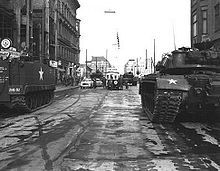](https://en.wikipedia.org/wiki/File:Checkpoint_Charlie_1961-10-27.jpg)

[(L)](https://en.wikipedia.org/wiki/File:Checkpoint_Charlie_1961-10-27.jpg)
Soviet tanks face U.S. tanks at Checkpoint Charlie

The eastern and western sectors of Berlin were now completely separated. It was possible for Westerners to pass from one to the other only through strictly controlled checkpoints. For most Easterners, travel to West Berlin or West Germany was no longer possible. During the Wall's existence there were around 5,000 successful escapes into West Berlin; 136 people were officially killed trying to cross (see *[Deaths at the Berlin Wall](https://en.wikipedia.org/wiki/Deaths_at_the_Berlin_Wall)*) and around 200 were seriously injured. The sandy soil under the Wall was both a blessing and a curse for those who attempted to tunnel their way to West Berlin and freedom. Although it was easy to dig through quickly, it was also more prone to collapse.

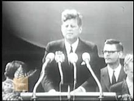[Play media](https://upload.wikimedia.org/wikipedia/commons/1/15/Ich_bin_ein_Berliner_Speech_%28June_26%2C_1963%29_John_Fitzgerald_Kennedy_trimmed.theora.ogv)

[(L)](https://en.wikipedia.org/wiki/File:Ich_bin_ein_Berliner_Speech_(June_26,_1963)_John_Fitzgerald_Kennedy_trimmed.theora.ogv)

*[Ich bin ein Berliner](https://en.wikipedia.org/wiki/Ich_bin_ein_Berliner)* speech from the [Rathaus Schöneberg](https://en.wikipedia.org/wiki/Rathaus_Sch%C3%B6neberg) by John F. Kennedy, June 26, 1963

When the first stone blocks were laid down at [Potsdamer Platz](https://en.wikipedia.org/wiki/Potsdamer_Platz) in the early hours of August 13, US troops stood ready with ammunition and watched the wall being built, stone by stone. The US Military with West Berlin police kept Berliners 300 meters away from the border. President Kennedy and the [United States Congress](https://en.wikipedia.org/wiki/United_States_Congress) decided not to interfere and risk armed conflict, but sent protest notes to [Moscow](https://en.wikipedia.org/wiki/Moscow). Massive demonstrations took place in West Berlin.

[John F. Kennedy](https://en.wikipedia.org/wiki/John_F._Kennedy) gave a speech about the [Berlin Wall](https://en.wikipedia.org/wiki/Berlin_Wall) in which he said, "*[Ich bin ein Berliner](https://en.wikipedia.org/wiki/Ich_bin_ein_Berliner)*" – "I am a Berliner" – which meant much to a city that was a Western island in Soviet [satellite](https://en.wikipedia.org/wiki/Satellite) territory.

Much [Cold War](https://en.wikipedia.org/wiki/Cold_War)  [espionage](https://en.wikipedia.org/wiki/Espionage) and counter-espionage took place in Berlin, against a backdrop of potential superpower confrontation in which both sides had nuclear weapons set for a range that could hit Germany. In 1971, the [Four-Power Agreement on Berlin](https://en.wikipedia.org/wiki/Four_Power_Agreement_on_Berlin) was signed. While the Soviet Union applied the oversight of the four powers only to West Berlin, the Western Allies emphasized in a 1975 note to the [United Nations](https://en.wikipedia.org/wiki/United_Nations) their position that four-power oversight apply to Berlin as a whole. The agreement guaranteed access across East Germany to West Berlin and ended the potential for harassment or closure of the routes.

As many businesses did not want to operate in [West Berlin](https://en.wikipedia.org/wiki/West_Berlin) due to its physical and economic isolation from the outside, the West German government subsidized any businesses that did operate in West Berlin.

### Student movement[[edit](https://en.wikipedia.org/w/index.php?title=History_of_Berlin&action=edit&section=22)]

[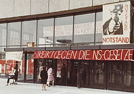](https://en.wikipedia.org/wiki/File:TU_Berlin_1968a.jpg)

[(L)](https://en.wikipedia.org/wiki/File:TU_Berlin_1968a.jpg)

May 1968 student protest at the Architecture Building at [Berlin Institute of Technology](https://en.wikipedia.org/wiki/Berlin_Institute_of_Technology), in protest against the adoption of the [German Emergency Acts](https://en.wikipedia.org/wiki/German_Emergency_Acts).

In the 1960s, West Berlin became one of the centers of the [German student movement](https://en.wikipedia.org/wiki/German_student_movement). West Berlin was especially popular with young German left-wing radicals, as young men living in West Berlin were exempted from the obligatory military service required in West Germany proper: the [Kreuzberg](https://en.wikipedia.org/wiki/Kreuzberg) district became especially well known for its high concentration of young radicals.

The Wall afforded unique opportunities for social gatherings. The physical wall was set some distance behind the actual sector border, up to several meters behind in some places. The West Berlin police were not legally allowed to enter the space between the border and the wall, as it was technically in East Berlin and outside their jurisdiction: many people took the opportunity to throw loud parties in this space, with the West Berlin authorities powerless to intervene. In 1968 and after, West Berlin became one of the centers of the student revolt; in particular, the Kreuzberg borough was the center of many riots.[[36]](https://en.wikipedia.org/wiki/History_of_Berlin#cite_note-36)

### 750th anniversary[[edit](https://en.wikipedia.org/w/index.php?title=History_of_Berlin&action=edit&section=23)]

- [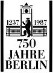](https://en.wikipedia.org/wiki/File:Bundesarchiv_Bild_183-1986-0926-040,_Berlin,_750-Jahr-Feier,_Logo.jpg)

Logo commemorating Berlin's 750th anniversary.

- [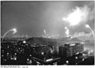](https://en.wikipedia.org/wiki/File:Bundesarchiv_Bild_183-1987-0101-007,_Berlin,_750-Jahr-Feier,_Silvesterfeuerwerk.jpg)

Fireworks over Berlin on January 1, 1987, in recognition of the city's 750th anniversary.

- [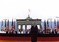](https://en.wikipedia.org/wiki/File:ReaganBerlinWall.jpg)

[U.S. President Ronald Reagan](https://en.wikipedia.org/wiki/Presidency_of_Ronald_Reagan), speaking before Brandenburg Gate on June 12, 1987, demands the Kremlin free Berlin and "[Tear down this wall!](https://en.wikipedia.org/wiki/Tear_down_this_wall!)"

- [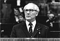](https://en.wikipedia.org/wiki/File:Bundesarchiv_Bild_183-1987-1023-036,_Berlin,_750-Jahr-Feier,_Staatsakt,_Rede_Honecker.jpg)

Communist leader [Erich Honecker](https://en.wikipedia.org/wiki/Erich_Honecker) speaks on October 23, 1987, in commemoration of the city's 750th anniversary.

## Federal Republic of Germany (1990–today)[[edit](https://en.wikipedia.org/w/index.php?title=History_of_Berlin&action=edit&section=24)]

[(L)](https://en.wikipedia.org/wiki/File:Thefalloftheberlinwall1989.JPG)
Germans standing on top of the wall, days before it was torn down.

### Reunification[[edit](https://en.wikipedia.org/w/index.php?title=History_of_Berlin&action=edit&section=25)]

The Fall of the [Berlin Wall](https://en.wikipedia.org/wiki/Berlin_Wall) in November 1989 marks the end of the [Cold War](https://en.wikipedia.org/wiki/Cold_War). On 9 November 1989, border guards allowed crowds from East Berlin to cross the frontier at the Bösebrücke. The guards believed that the authorities had decided to open the wall, but in reality no firm decision was taken and events gathered steam on their own. People of East and West Berlin climbed up and danced on the wall at the [Brandenburg Gate](https://en.wikipedia.org/wiki/Brandenburg_Gate) in scenes of wild celebration broadcast worldwide. This time no Soviet tanks rolled through Berlin. The wall never closed again, and was soon on its way to demolition, with countless Berliners and tourists wielding hammers and chisels to secure souvenir chunks.

On Christmas Day December 25, 1989, the American conductor [Leonard Bernstein](https://en.wikipedia.org/wiki/Leonard_Bernstein) shared with East and West Berliners and the world his Berlin Celebration Concert in order to celebrate the Fall of the [Berlin Wall](https://en.wikipedia.org/wiki/Berlin_Wall). "[Ode to Joy](https://en.wikipedia.org/wiki/Ode_to_Joy)", which Bernstein had reworded "Ode to Freedom", was performed.

### Capital and world city[[edit](https://en.wikipedia.org/w/index.php?title=History_of_Berlin&action=edit&section=26)]

After the fall of Communism in Europe, on 3 October 1990 [Germany and Berlin were both reunited](https://en.wikipedia.org/wiki/German_reunification). By then the Wall had been almost completely demolished, with only small sections remaining.

In June 1991 the German Parliament, the [Bundestag](https://en.wikipedia.org/wiki/Bundestag), voted to move the (West) German capital back from [Bonn](https://en.wikipedia.org/wiki/Bonn) to Berlin. The decision was reached after 10 hours of debate. In the voting Berlin won by a narrow margin: 338 for, 320 against. Berlin once more became the capital of a unified Germany.

In 1999 federal ministries and government offices moved back from Bonn to Berlin, but most employees in the ministries still work in Bonn. Also in 1999, about 20 government authorities moved from Bonn to Berlin, as planned in the compensation agreement of 1994, the [Berlin/Bonn Act](https://en.wikipedia.org/wiki/Berlin/Bonn_Act).

In the 21st century Berlin has become a global city for international affairs, young business founders, creative industries, higher education services, corporate research, popular media and diverse cultural tourism.[[37]](https://en.wikipedia.org/wiki/History_of_Berlin#cite_note-37) Population-wise, Berlin became one of the most rapidly growing urban centers in Europe after 2010.

- [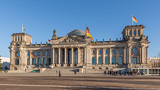](https://en.wikipedia.org/wiki/File:Reichstagsgeb%C3%A4ude_November_2013_01.jpg)

Reconstructed Reichstag becomes seat of Bundestag in 1999

- [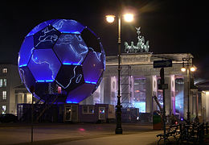](https://en.wikipedia.org/wiki/File:Berlin_Football_Globe-night1.JPG)

The [2006 FIFA World Cup Final](https://en.wikipedia.org/wiki/2006_FIFA_World_Cup_Final) was held in Berlin.

- [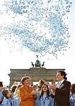](https://en.wikipedia.org/wiki/File:Angela_Merkel_und_Jos%C3%A9_Barroso_vor_dem_Brandenburger_Tor.jpg)

[A. Merkel](https://en.wikipedia.org/wiki/Angela_Merkel) & [J. Barroso](https://en.wikipedia.org/wiki/Jos%C3%A9_Barroso) in 2007

- [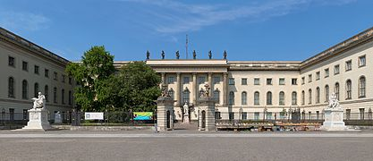](https://en.wikipedia.org/wiki/File:Frontansicht_des_Hauptgeb%C3%A4udes_der_Humboldt-Universit%C3%A4t_in_Berlin.jpg)

[Humboldt University](https://en.wikipedia.org/wiki/Humboldt_University) wins the German Excellence Initiative in 2012

- [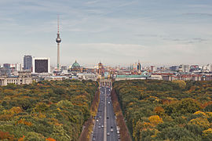](https://en.wikipedia.org/wiki/File:Siegessaeule_Aussicht_10-13_img4_Tiergarten.jpg)

Skyline of the global city in 2013

## Historical population[[edit](https://en.wikipedia.org/w/index.php?title=History_of_Berlin&action=edit&section=27)]

Population since 1400:[*[needs update](https://en.wikipedia.org/wiki/Wikipedia:Manual_of_Style/Dates_and_numbers#Precise_language)*]

- 1400: 8,000 inhabitants (Berlin and Kölln)
- 1600: 16,000
- 1618: 10,000
- 1648: 6,000
- 1709: 60,000 (union with Friedrichswerder, Dorotheenstadt and Friedrichstadt)
- 1755: 100,000
- 1800: 172,100
- 1830: 247,500
- 1850: 418,700
- 1880: 1,124,000
- 1900: 1,888,000
- 1925: 4,036,000 (1920 enlargement of the territory)
- 1942: 4,478,102
- 2003: 3,388,477
- 2007: 3,402,312
- 2012: 3,543,000

## See also[[edit](https://en.wikipedia.org/w/index.php?title=History_of_Berlin&action=edit&section=28)]

- [Timeline of Berlin](https://en.wikipedia.org/wiki/Timeline_of_Berlin)
- [History of Germany](https://en.wikipedia.org/wiki/History_of_Germany)
- [List of Commandants of Berlin Sectors](https://en.wikipedia.org/wiki/List_of_Commandants_of_Berlin_Sectors)
- [List of films set in Berlin](https://en.wikipedia.org/wiki/List_of_films_set_in_Berlin)
- [List of people from Berlin](https://en.wikipedia.org/wiki/List_of_people_from_Berlin)

## References[[edit](https://en.wikipedia.org/w/index.php?title=History_of_Berlin&action=edit&section=29)]

1. **[Jump up ^](https://en.wikipedia.org/wiki/History_of_Berlin#cite_ref-1)**  Berger, Dieter (1999). *Geographische Namen in Deutschland*. Bibliographisches Institut. [ISBN](https://en.wikipedia.org/wiki/International_Standard_Book_Number) [3-411-06252-5](https://en.wikipedia.org/wiki/Special:BookSources/3-411-06252-5).

2. **[Jump up ^](https://en.wikipedia.org/wiki/History_of_Berlin#cite_ref-Somers2008_2-0)**  Steven Somers (14 July 2008). [*Those Crazy Germans!: A Lighthearted Guide to Germany*](https://books.google.com/books?id=1h8NE0iud1IC&pg=PA12). Xlibris Corporation. p. 12. [ISBN](https://en.wikipedia.org/wiki/International_Standard_Book_Number) [978-1-4535-6595-7](https://en.wikipedia.org/wiki/Special:BookSources/978-1-4535-6595-7).

3. **[Jump up ^](https://en.wikipedia.org/wiki/History_of_Berlin#cite_ref-3)**  Horst Ulrich et. al., Besiedlung des Berliner Raums, in: Berlin Handbuch (Berlin 1992), pp. 127–128.

4. **[Jump up ^](https://en.wikipedia.org/wiki/History_of_Berlin#cite_ref-4)**  Bernd Stöver (2013). [*Berlin: A Short History*](https://books.google.com/books?id=LVA8AQAAQBAJ&pg=PT98). C.H.Beck. p. 98.

5. **[Jump up ^](https://en.wikipedia.org/wiki/History_of_Berlin#cite_ref-5)**  Richie, *Faust's Metropolis* pp 41-50

6. **[Jump up ^](https://en.wikipedia.org/wiki/History_of_Berlin#cite_ref-6)**  Elizabeth Heekin Bartels, "Berlin's Tiergarten: Evolution of an Urban Park," *Journal of Garden History* (1982) 2#2 p143+

7. **[Jump up ^](https://en.wikipedia.org/wiki/History_of_Berlin#cite_ref-7)**  Alexandra Richie, *Faust's Metropolis* (1998) p 55

8. **[Jump up ^](https://en.wikipedia.org/wiki/History_of_Berlin#cite_ref-8)**  Rudolf G. Scharmann, *Charlottenburg Palace: Royal Prussia in Berlin* (2005)

9. **[Jump up ^](https://en.wikipedia.org/wiki/History_of_Berlin#cite_ref-9)**  Hugh McLeod, *Piety and Poverty: Working-class Religion in Berlin, London and New York 1870-1914* (1996)

10. **[Jump up ^](https://en.wikipedia.org/wiki/History_of_Berlin#cite_ref-10)**  Helmut Thielicke, *Modern Faith and Thought*, William B. Eerdmans Publishing, 1990, p. 174.

11. **[Jump up ^](https://en.wikipedia.org/wiki/History_of_Berlin#cite_ref-11)**  Gerhard Masur, *Imperial Berlin* (1990)

12. **[Jump up ^](https://en.wikipedia.org/wiki/History_of_Berlin#cite_ref-12)**  "Berlin" in *Encyclopædia Britannica " (1910)*

13. **[Jump up ^](https://en.wikipedia.org/wiki/History_of_Berlin#cite_ref-13)**  Cited in David Clay Large, *Berlin* (2000) pp 17-18

14. **[Jump up ^](https://en.wikipedia.org/wiki/History_of_Berlin#cite_ref-14)**  Hugh Chisholm (1910). [*The Encyclopædia Britannica: A Dictionary of Arts, Sciences, Literature and General Information*](https://books.google.com/books?id=-nKcLszEKdUC&pg=PA786). Encyclopædia Britannica, 11th edition. p. 786.

15. **[Jump up ^](https://en.wikipedia.org/wiki/History_of_Berlin#cite_ref-15)**  William Grange (2006). [*Historical Dictionary of German Theater*](https://books.google.com/books?id=WetnNgbRXDoC&pg=PA63). Scarecrow Press. pp. 63–4.

16. **[Jump up ^](https://en.wikipedia.org/wiki/History_of_Berlin#cite_ref-16)**  Carl E. Schorske, *German social democracy, 1905-1917: The development of the Great Schism* (1955)

17. **[Jump up ^](https://en.wikipedia.org/wiki/History_of_Berlin#cite_ref-17)**  Roger Chickening, *Imperial Germany and the World War, 1914–1918* (1998) p. 14

18. **[Jump up ^](https://en.wikipedia.org/wiki/History_of_Berlin#cite_ref-18)**  Richie, *Faust's Metropolis* pp 272-75

19. **[Jump up ^](https://en.wikipedia.org/wiki/History_of_Berlin#cite_ref-19)**  Keith Allen, "Sharing scarcity: Bread rationing and the First World War in Berlin, 1914-1923," *Journal of Social History,* (Winter 1998) 32#2 pp 371-93 [in JSTOR](http://www.jstor.org/stable/3789666)

20. **[Jump up ^](https://en.wikipedia.org/wiki/History_of_Berlin#cite_ref-20)**  David Welch, *Germany, Propaganda and Total War, 1914-1918* (2000) p.122

21. **[Jump up ^](https://en.wikipedia.org/wiki/History_of_Berlin#cite_ref-21)**  Chickering, Imperial Germany *pp 140-145*

22. **[Jump up ^](https://en.wikipedia.org/wiki/History_of_Berlin#cite_ref-22)**  Richie, *Faust's Metropolis* pp 277-80

23. **[Jump up ^](https://en.wikipedia.org/wiki/History_of_Berlin#cite_ref-23)**  Roger Moorhouse, "Germania," *History Today* (March 2012), 62#3 pp 20-25

24. **[Jump up ^](https://en.wikipedia.org/wiki/History_of_Berlin#cite_ref-24)**  Richie, *Faust's Metropolis,* pp 470-73

25. **[Jump up ^](https://en.wikipedia.org/wiki/History_of_Berlin#cite_ref-25)**  *Dunkle Welten: Bunker, Tunnel und Gewölbe unter Berlin*, Dietmar Arnold, Frieder Salm, page 120, 2007

26. **[Jump up ^](https://en.wikipedia.org/wiki/History_of_Berlin#cite_ref-26)**  [Richard Overy](https://en.wikipedia.org/wiki/Richard_Overy), *The Bombers and the Bombed: Allied Air War Over Europe 1940-1945* (2014) pp 301, 304

27. **[Jump up ^](https://en.wikipedia.org/wiki/History_of_Berlin#cite_ref-27)**  Richie, *Faust's Metropolis,* pp 547-603; [A. Beevor](https://en.wikipedia.org/wiki/A._Beevor), *[The Fall of Berlin](https://en.wikipedia.org/wiki/The_Fall_of_Berlin)* (2003) [excerpt](http://www.amazon.com/Fall-Berlin-1945-Antony-Beevor/dp/0142002801/); [Cornelius Ryan](https://en.wikipedia.org/wiki/Cornelius_Ryan), *[The Last Battle](https://en.wikipedia.org/wiki/The_Last_Battle)* (1966) [excerpt](http://www.amazon.com/Last-Battle-Classic-History-Berlin/dp/0684803291/); [Earl Ziemke](https://en.wikipedia.org/wiki/Earl_Ziemke)  *Battle for Berlin: End of the Third Reich* (1968); Karl Bahm *Berlin 1945: The Final Reckoning* (2001) [excerpt](http://www.amazon.com/Berlin-1945-The-Final-Reckoning/dp/0760312400/); Peter Antill and Peter Dennis, *Berlin 1945: End of the Thousand Year Reich* (2005) [excerpt](http://www.amazon.com/Berlin-1945-Thousand-Reich-Campaign/dp/1841769150/)

28. **[Jump up ^](https://en.wikipedia.org/wiki/History_of_Berlin#cite_ref-28)**  The anonymous (revealed in 2003 to be journalist [Marta Hillers](https://en.wikipedia.org/wiki/Marta_Hillers)) *[A Woman in Berlin](https://en.wikipedia.org/wiki/A_Woman_in_Berlin)* ([ISBN 1-84408-111-7](https://en.wikipedia.org/wiki/Special:BookSources/1844081117)) is a harrowing personal account of survival.

29. **[Jump up ^](https://en.wikipedia.org/wiki/History_of_Berlin#cite_ref-29)**  Philip Broadbent and Sabine Hake, eds. *Berlin: Divided City, 1945-1989* (Berghahn Books; 2010)

30. **[Jump up ^](https://en.wikipedia.org/wiki/History_of_Berlin#cite_ref-30)**  Paul Steege, *Black Market, Cold War: Everyday Life in Berlin, 1946-1949* (2008)

31. **[Jump up ^](https://en.wikipedia.org/wiki/History_of_Berlin#cite_ref-31)**  Daniel F. Harrington, *Berlin on the Brink: The Blockade, the Airlift, and the Early Cold War* (2012)

32. **[Jump up ^](https://en.wikipedia.org/wiki/History_of_Berlin#cite_ref-32)**  Andrei Cherny, *Candy Bombers: The Untold Story of the Berlin Airlift and America's Finest Hour* (2008)

33. **[Jump up ^](https://en.wikipedia.org/wiki/History_of_Berlin#cite_ref-33)**  Christian F. Ostermann; Malcolm Byrne. [*Uprising in East Germany, 1953*](https://books.google.com/books?id=j_ci_N3-vAUC&pg=PR35). Central European University Press. pp. 35–45.

34. **[Jump up ^](https://en.wikipedia.org/wiki/History_of_Berlin#cite_ref-34)**  Jonathan Sperber, "17 June 1953: Revisiting a German Revolution" *German History* (2004) 22#4 pp 619-643.

35. **[Jump up ^](https://en.wikipedia.org/wiki/History_of_Berlin#cite_ref-35)**  Yosefa Loshitzky, "Constructing and deconstructing the wall," *Clio* (1997) 26#3 pp 275-296

36. **[Jump up ^](https://en.wikipedia.org/wiki/History_of_Berlin#cite_ref-36)**  Richie, *Faust's Metropolis* (1998) pp 777-80

37. **[Jump up ^](https://en.wikipedia.org/wiki/History_of_Berlin#cite_ref-37)**  ["Is Berlin an example for Australian capital cities?"](http://johnmenadue.com/blog/?p=7960l). *DAVID CHARLES*. Retrieved 8 October 2016.

## Bibliography[[edit](https://en.wikipedia.org/w/index.php?title=History_of_Berlin&action=edit&section=30)]

See also: [Timeline of Berlin § Bibliography](https://en.wikipedia.org/wiki/Timeline_of_Berlin#Bibliography)

Published before 1945

- Vizetelly, Henry. *Berlin Under the New Empire: Its Institutions, Inhabitants, Industry, Monuments, Museums, Social Life, Manners, and Amusements* (2 vol. London, 1879) [online volume 2](https://books.google.com/books?id=Yn4gAAAAMAAJ)
- "Berlin", [*Northern Germany*](https://archive.org/stream/northerngermanyh00inkarl#page/n31/mode/2up) (5th ed.), Coblenz: Karl Baedeker, 1873, [OCLC](https://en.wikipedia.org/wiki/OCLC) [5947482](https://www.worldcat.org/oclc/5947482); famous guidebook
    - "Berlin", [*Northern Germany as far as the Bavarian and Austrian frontiers*](https://archive.org/stream/northerngerma00karl#page/n41/mode/2up) (15th ed.), Leipzig: Karl Baedeker, 1910, [OCLC](https://en.wikipedia.org/wiki/OCLC) [78390379](https://www.worldcat.org/oclc/78390379)
- "Berlin", [*The Encyclopædia Britannica*](http://www.gutenberg.org/files/34612/34612-h/34612-h.htm#ar91) (11th ed.), New York: Encyclopædia Britannica, 1910, [OCLC](https://en.wikipedia.org/wiki/OCLC) [14782424](https://www.worldcat.org/oclc/14782424)
- Nathaniel Newnham Davis (1911), ["Berlin"](https://archive.org/stream/gourmetsguidetoe00daviuoft#page/214/mode/2up), *The Gourmet's Guide to Europe* (3rd ed.), London: Grant Richards

Published Since 1945

- Broadbent, Philip, and Sabine Hake, eds. *Berlin: Divided City, 1945-1989* (Berghahn Books; 2010), 211 pages. Essays by historians, art historians, literary scholars, and others on perceptions and representations of the city.
- Colomb, Claire. *Staging the New Berlin: Place Marketing and the Politics of Urban Reinvention Post-1989* (Abingdon: Routledge, 2011) 368 pp.
- Davis, Belinda J. *Home Fires Burning: Food, Politics, and Everyday Life in World War I Berlin* (2000) [online edition](http://www.questia.com/read/100891395/home-fires-burning-food-politics-and-everyday-life)
- Friedrich, Thomas. *Hitler's Berlin: Abused City* (2012) [excerpt and text search](http://www.amazon.com/Hitlers-Berlin-Abused-Thomas-Friedrich/dp/0300166702/)
- Gehler, Michael. *Three Germanies: West Germany, East Germany and the Berlin Republic* (2011) [excerpt and text search](http://www.amazon.com/Three-Germanies-Germany-Republic-Contemporary/dp/1861897782/)
- Hake, Sabine. *Topographies of Class: Modern Architecture and Mass Society in Weimar Berlin* (2008)
- Kellerhoff, Sven Felix. *Hitlers Berlin* (2005)
- Large, David Clay. *Berlin* (2000) 736pp [online](http://www.questia.com/library/100504396/berlin), general history since 1870
- Lees, Andrew. "Berlin and Modern Urbanity in German Discourse, 1845–1945," *Journal of Urban History* (1991) 17#2 pp 153–78.
- Moorhouse, Roger . *Berlin at War: Life and Death in Hitler's Capital 1939-1945* (2011)
- MacDonogh, Giles . *Berlin: A Portrait of Its History, Politics, Architecture, and Society* (1999)
- Richie, Alexandra. *Faust's Metropolis: A History of Berlin* (1998), 1168 pp by scholar; [excerpt and text search](http://www.amazon.com/Fausts-Metropolis-History-Alexandra-Richie/dp/0786706813/); emphasis on 20th century
- Stöver, Bernd (2013). [*Berlin: A Short History*](https://books.google.com/books?id=LVA8AQAAQBAJ&pg=PT98). C.H.Beck.
- Tusa, Ann. *The Last Division: A History of Berlin, 1945-1989* (1997)
- Winter, Jay, and Jean-Louis Robert, eds. *Capital Cities at War: Paris, London, Berlin 1914-1919* (2 vol. 1999, 2007), 30 chapters 1200pp; comprehensive coverage by scholars [vol 1 excerpt](http://www.amazon.com/Capital-Cities-War-1914-1919-Cultural/dp/052166814X/); [vol 2 excerpt and text search](http://www.amazon.com/gp/reader/0521870437/)

Guidebooks

- Maik Kopleck: *PastFinder Berlin 1933-1945. Traces of German History – A Guidebook (Pastfinder)*. Ch. Links Verlag; 2nd Ed. 2007, 978-3861533634 (Original title: Stadtführer zu den Spuren der Vergangenheit. Also available in French: Guide touristique sur les traces du passé)
- Maik Kopleck: *PastFinder Berlin 1945 - 1989*. 2011, 978-9889978839

## External links[[edit](https://en.wikipedia.org/w/index.php?title=History_of_Berlin&action=edit&section=31)]

- [Vintage Berlin: The Reunited City](http://www.life.com/image/first/in-gallery/44641/vintage-berlin-the-reunited-city) - slideshow by *[Life magazine](https://en.wikipedia.org/wiki/Life_magazine)*

| [[show](https://en.wikipedia.org/wiki/History_of_Berlin#)] - [v](https://en.wikipedia.org/wiki/Template:Berlin) · - [t](https://en.wikipedia.org/wiki/Template_talk:Berlin) · - [e](https://en.wikipedia.org/w/index.php?title=Template:Berlin&action=edit)   [Berlin](https://en.wikipedia.org/wiki/Berlin) topics |
| --- |

| [[hide](https://en.wikipedia.org/wiki/History_of_Berlin#)] - [v](https://en.wikipedia.org/wiki/Template:History_of_the_States_of_Germany) · - [t](https://en.wikipedia.org/wiki/Template_talk:History_of_the_States_of_Germany) · - [e](https://en.wikipedia.org/w/index.php?title=Template:History_of_the_States_of_Germany&action=edit)  History of the [States of Germany](https://en.wikipedia.org/wiki/States_of_Germany) |
| --- |
| States | -  [History of Baden-Württemberg](https://en.wikipedia.org/wiki/History_of_Baden-W%C3%BCrttemberg) · -  [History of Bavaria](https://en.wikipedia.org/wiki/History_of_Bavaria) · -  [History of Brandenburg](https://en.wikipedia.org/wiki/Category:History_of_Brandenburg) · -  [History of Hesse](https://en.wikipedia.org/wiki/History_of_Hesse) · -  [History of Lower Saxony](https://en.wikipedia.org/wiki/Lower_Saxony#History) · -  [History of Mecklenburg-Vorpommern](https://en.wikipedia.org/wiki/Category:History_of_Mecklenburg-Vorpommern) · -  [History of North Rhine-Westphalia](https://en.wikipedia.org/wiki/History_of_North_Rhine-Westphalia) · -  [History of Rhineland-Palatinate](https://en.wikipedia.org/wiki/Category:History_of_Rhineland-Palatinate) · -  [History of Saarland](https://en.wikipedia.org/wiki/Category:History_of_Saarland) · -  [History of Saxony](https://en.wikipedia.org/wiki/History_of_Saxony) · -  [History of Saxony-Anhalt](https://en.wikipedia.org/wiki/History_of_Saxony-Anhalt) · -  [History of Schleswig-Holstein](https://en.wikipedia.org/wiki/History_of_Schleswig-Holstein) · -  [History of Thuringia](https://en.wikipedia.org/wiki/Category:History_of_Thuringia) |  |
| [City-states](https://en.wikipedia.org/wiki/City-state) | -  [History of Berlin]() · -  [History of Bremen](https://en.wikipedia.org/wiki/History_of_Bremen) · - [History of Hamburg](https://en.wikipedia.org/wiki/History_of_Hamburg) |
| Related | - [Historic states of Germany](https://en.wikipedia.org/wiki/Historic_states_of_Germany) |

[Categories](https://en.wikipedia.org/wiki/Help:Category):

- [History of Berlin](https://en.wikipedia.org/wiki/Category:History_of_Berlin)
- [Holocaust locations in Germany](https://en.wikipedia.org/wiki/Category:Holocaust_locations_in_Germany)