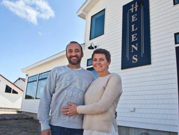

History spills from frame of film

# History spills from frame of film

Renowned photographer Arthur Rothstein had Rockland ties
January 21, 2016

LIBRARY OF CONGRESS COLLECTION
The young Arthur Rothstein sets up his camera.

 [](http://www.islandinstitute.org/working-waterfront/history-spills-frame-film#)  [](http://www.islandinstitute.org/working-waterfront/history-spills-frame-film#)  []()  [](http://www.islandinstitute.org/working-waterfront/history-spills-frame-film#)

By
 [Tom Groening](http://www.islandinstitute.org/staff/tom-groening)  ,
Posted January 21, 2016
Last modified February 1, 2016

 

The photo that prompted contact from Arthur Rothstein's family.

In each issue of *The Working Waterfront,* we feature a vintage photo from along the coast that reminds us of how our corner of the world has changed, or not changed, as the case may be. In the November issue, we published a photo on the OpEd page (page 11) of a man standing at the corner of Main and Winter streets in Rockland, circa-1937.

Then we received an email from Ted O'Meara (known to many as a one-time Congressional candidate and campaign manager for Eliot Cutler in the last two gubernatorial contests). O'Meara noticed that the photo, which came from the Library of Congress collection, was credited to Arthur Rothstein (1915-1985).

O'Meara said he lived next door to the Rothstein family for a time during his childhood in New Rochelle, N.Y. And he added an interesting tidbit: Rothstein's son, performing under the name Rob Stoner, played bass and was the band leader for Bob Dylan during much of the 1970s.

That led to email contact with Stoner, who confirmed the facts about his father, including that he shot photos for the federal government during the Great Depression. From a website devoted to the Ken Burns documentary *The Dust Bowl*:

"Arthur Rothstein arrived in the Dust Bowl in April of 1936. He was 21 years old, the son of Jewish immigrants, born and raised in New York City. Fresh from Columbia University, Rothstein had been the first photographer hired by Roy Stryker, his former professor, at the Resettlement Administration, a New Deal agency that, from 1935 to 1936, relocated struggling families to communities planned by the federal government. The photography unit … documented for the public not only the multitude of problems the nation was facing, but what the government was doing about them."

Annie Segan, Rothstein's daughter also wrote us:

"My father’s parents were from the same part of Europe, towns that had been once been Lithuanian, then Polish and then Russian. I asked Grandma what life was like back then and there and she replied in her thick Yiddish accent, 'You know *Fiddler on the Roof*? Like that! Two rooms, dirt floor and an outhouse in the back.'

"My father’s mom was Nettie Perlstein. Her father was Rabbi Isser (Israel) Perlstein. He was a cantor (he could chant the Torah), a mohel (he did circumcisions), and he was a shochet (trained to slaughter animals and birds in accordance with the laws of Judaism).

"When Rabbi Perlstein arrived in America in 1905, the Chief Rabbi of Boston sent him to serve Adas Yoshuron, an Orthodox congregation in Rockland. Back then, the congregation met in an upstairs room in the Berry Block, at 406 Main Street. In 1912, the congregation purchased their current shul, on Willow Street, from the Advent Christian Church.

"The rabbi’s wife, Chania and their seven children, followed Rabbi Perlstein to Rockland a year later, in 1906. The family lived in a house at 14 Holmes Street. Nettie, the oldest, was 14, but because she only spoke Polish, Yiddish and Hebrew, she was placed in the first grade. This was so humiliating that she talked her parents into letting her go to New York City where she could live with relatives, get a job, improve her English and send money home. Her parents made her wait till 1910, when she was 18.

"In December of 1911 the rabbi contracted an autoimmune skin disease after rejecting a cow for slaughter and died. His wife and the remaining six children soon joined Nettie in New York City.

"Nettie and her future husband, Isidore (my Grandpa Izzy) were introduced by landsleit, as was the custom. They married in 1913. Their first child, Israel (called Arthur) named for Nettie’s father, was born July 16, 1915. He grew up to be a famous photographer and my daddy!"

Rothstein later became a staff photographer for* Look* and *Parade* magazines. Segan added that her father loved Maine, as do she and her brother.

So the adage is true—a picture really is worth a thousand words.

   

Contributed by

####   [Tom Groening](http://www.islandinstitute.org/staff/tom-groening)

## Comments

- [0 comments]()
- [**The Working Waterfront**](https://disqus.com/home/forums/islandinstitute/)
- [Marc Cohen](https://disqus.com/embed/comments/?base=default&f=islandinstitute&t_i=node%2F1065&t_u=http%3A%2F%2Fwww.islandinstitute.org%2Fworking-waterfront%2Fhistory-spills-frame-film&t_e=History%20spills%20from%20frame%20of%20film&t_d=History%20spills%20from%20frame%20of%20film&t_t=History%20spills%20from%20frame%20of%20film&s_o=default#)
- [](https://disqus.com/home/inbox/)
- [ Recommend  1](https://disqus.com/embed/comments/?base=default&f=islandinstitute&t_i=node%2F1065&t_u=http%3A%2F%2Fwww.islandinstitute.org%2Fworking-waterfront%2Fhistory-spills-frame-film&t_e=History%20spills%20from%20frame%20of%20film&t_d=History%20spills%20from%20frame%20of%20film&t_t=History%20spills%20from%20frame%20of%20film&s_o=default#)
- tTweetfShare
- [Sort by Best](https://disqus.com/embed/comments/?base=default&f=islandinstitute&t_i=node%2F1065&t_u=http%3A%2F%2Fwww.islandinstitute.org%2Fworking-waterfront%2Fhistory-spills-frame-film&t_e=History%20spills%20from%20frame%20of%20film&t_d=History%20spills%20from%20frame%20of%20film&t_t=History%20spills%20from%20frame%20of%20film&s_o=default#)

Start the discussion…

GIF

Be the first to comment.

## Also on **The Working Waterfront**

- [

### Fellows Refelctions: Becoming part of a community

    - 1 comment •

    - 4 months ago

[Thomas Burns— I just replied to an article on Maine's need for seasonal workers under the J-1 Exchange Visitors visa as opposed to the H visa system It appears to me that while opening up a whole new sector of community development, i.e., filling temporary employment opportunities for Maine businesses while simultaneously providing meaningful cultural exchange opportunities for youth around the world, the Institute would be an excellent starting point. Your educational focus would make the Institute an eligible sponsor for such a program.](http://disq.us/?url=http%3A%2F%2Fwww.islandinstitute.org%2Fblog-post%2Ffellows-refelctions-becoming-part-community&key=UJsBZLeFpT1K4iFkg4aeAQ)](http://disq.us/?url=http%3A%2F%2Fwww.islandinstitute.org%2Fblog-post%2Ffellows-refelctions-becoming-part-community&key=UJsBZLeFpT1K4iFkg4aeAQ)

- [

### Ferry fare rationale challenged at hearing

    - 7 comments •

    - 3 months ago

[Daniel— It has nothing to do with the number of runs, it’s the amount of passengers. The Islesboro ferry has the same operating costs as the ferries that run fewer trips because they do so many. Additionally the crew size is bigger than the Curtis class boats. Islesboro only has a little over 500 people on it, with they summer population only hovering around 1,000. Vinalhaven by comparison has nearly 3 times the population both summer and winter. Do the 161 Islesboro families need 9 trips a day? Want to actually keep diesel costs down? Stop running the ferry back and forth like it’s a Disney shuttle.](http://disq.us/?url=http%3A%2F%2Fwww.islandinstitute.org%2Fworking-waterfront%2Fferry-fare-rationale-challenged-hearing&key=P2-jc0TkuJgwFcwIu9M_kw)](http://disq.us/?url=http%3A%2F%2Fwww.islandinstitute.org%2Fworking-waterfront%2Fferry-fare-rationale-challenged-hearing&key=P2-jc0TkuJgwFcwIu9M_kw)

- [

### When appliances fail on islands

    - 1 comment •

    - 3 months ago

[friarsbayinca— It is worse on Campobello Island, NB. No Canadian repairmen will come and no American appliance repairmen are allowed to come without a work permit and no one has ever gotten one. When our refrigerator broke I met an American appliance truck in Lubec and hauled the refrigerator over to Campobello in my own truck and got some help getting it into the house. Basically if you cannot fix an appliance yourself you have to throw it away.](http://disq.us/?url=http%3A%2F%2Fwww.islandinstitute.org%2Fworking-waterfront%2Fwhen-appliances-fail-islands&key=NA5TShsBGlQKmHyz9QShtg)](http://disq.us/?url=http%3A%2F%2Fwww.islandinstitute.org%2Fworking-waterfront%2Fwhen-appliances-fail-islands&key=NA5TShsBGlQKmHyz9QShtg)

- [

### What lies on the other side of recovery

    - 1 comment •

    - 3 months ago

[woodsnwater— Solid writing, Annie. Thanks for sharing and good luck to you and your son.](http://disq.us/?url=http%3A%2F%2Fwww.islandinstitute.org%2Fworking-waterfront%2Fwhat-lies-other-side-recovery&key=yXqX4H_a88dPSUzax2nNfg)](http://disq.us/?url=http%3A%2F%2Fwww.islandinstitute.org%2Fworking-waterfront%2Fwhat-lies-other-side-recovery&key=yXqX4H_a88dPSUzax2nNfg)

- [Powered by Disqus](https://disqus.com/)
- [*✉*Subscribe*✔*](https://disqus.com/embed/comments/?base=default&f=islandinstitute&t_i=node%2F1065&t_u=http%3A%2F%2Fwww.islandinstitute.org%2Fworking-waterfront%2Fhistory-spills-frame-film&t_e=History%20spills%20from%20frame%20of%20film&t_d=History%20spills%20from%20frame%20of%20film&t_t=History%20spills%20from%20frame%20of%20film&s_o=default#)
- [*d*Add Disqus to your site](https://publishers.disqus.com/engage?utm_source=islandinstitute&utm_medium=Disqus-Footer)
- [**Disqus' Privacy Policy](https://help.disqus.com/customer/portal/articles/466259-privacy-policy)

### Categories

- [People](http://www.islandinstitute.org/working-waterfront/people)
- [Community](http://www.islandinstitute.org/working-waterfront/community)

## Related Articles

-

May 19

### [Helen’s Restaurant rises from the ashes](http://www.islandinstitute.org/working-waterfront/helen%E2%80%99s-restaurant-rises-ashes)

MACHIAS—To Julie Barker, Helen's Restaurant is more than a building.

 [Laurie Schreiber](http://www.islandinstitute.org/staff/laurie-schreiber)  ,
Media,

-

April 7

### [Tall ships festival sails into Portland in July](http://www.islandinstitute.org/working-waterfront/tall-ships-festival-sails-portland-july)

Sailing Ships Portland has announced a new maritime festival expected to bring tens of thousands of people and a fleet of tall ships to Portland's waterfront this summer. The festival, "Iberdrola USA Tall Ships Portland 2015," will take place from July 18-20 on the Maine State Pier, Maine Wharf and at the Ocean Gateway Terminal.

 [Staff Writer](http://www.islandinstitute.org/staff/staff-writer)  ,
Media, Community Energy,

-

January 12

### [New Vinalhaven town manager on board](http://www.islandinstitute.org/working-waterfront/new-vinalhaven-town-manager-board)

Steve Eldridge began work as Vinalhaven's new town manager on Dec. 1.

 [Tom Groening](http://www.islandinstitute.org/staff/tom-groening)  ,
Media,