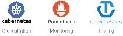
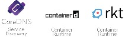

Home - Cloud Native Computing Foundation

## CLOUD NATIVE COMPUTING FOUNDATION

Sustaining and integrating open source technologies to orchestrate containers as part of a microservices architecture

## NOW AVAILABLE: SELF-PACED CLASS KUBERNETES FUNDAMENTALS

Learn how to deploy a containerized application and manipulate resources via the API.

 [Register Now](https://training.linuxfoundation.org/linux-courses/system-administration-training/kubernetes-fundamentals)

## CloudNativeCon+KubeCon Austin

Join CNCF December 6-8, 2017 in Austin, Texas

 [Register to Attend](https://www.cncf.io/event/cloudnativecon-north-america-2017/)

## CLOUD NATIVE COMPUTING FOUNDATION

Sustaining and integrating open source technologies to orchestrate containers as part of a microservices architecture

## NOW AVAILABLE: SELF-PACED CLASS KUBERNETES FUNDAMENTALS

Learn how to deploy a containerized application and manipulate resources via the API.

 [Register Now](https://training.linuxfoundation.org/linux-courses/system-administration-training/kubernetes-fundamentals)

#### CURRENTLY HOSTED PROJECTS

[VIEW ALL PROJECTS](https://www.cncf.io/projects)

[(L)](https://www.cncf.io/newsroom/)

#### LATEST CNCF NEWS AND UPDATES

### [GolfNow: Saving Time and Money with Cloud Native Infrastructure](https://www.cncf.io/blog/2017/07/11/golfnow-saving-time-money-cloud-native-infrastructure/)

[cncf](https://www.cncf.io/author/cncf/)     | [Blog](https://www.cncf.io/category/blog/)

It’s not every day that you can say you’ve slashed an operating expense by half. But Sheriff Mohamed and Josh Chandler did just that when they helped lead their company,…

### [The Linux Foundation, CNCF and edX.org Announce New, Free Intro to Kubernetes Course](https://www.cncf.io/announcement/2017/07/10/linux-foundation-cncf-edx-org-announce-new-free-intro-kubernetes-course/)

[cncf](https://www.cncf.io/author/cncf/)     | [Announcement](https://www.cncf.io/category/announcement/)

Massive Open Online Course (MOOC) to provide students with basic knowledge of the leading container orchestration software SAN FRANCISCO – July 10, 2017 – The Linux Foundation, the nonprofit advancing professional open…

### [Prometheus User Profile: JustWatch Discusses The Benefits of Whitebox Monitoring](https://www.cncf.io/blog/2017/07/10/prometheus-user-profile-justwatch-discusses-benefits-whitebox-monitoring/)

[cncf](https://www.cncf.io/author/cncf/)     | [Blog](https://www.cncf.io/category/blog/)

JustWatch is a streaming search engine that helps to find out where to watch movies and TV shows legally online and in theaters. You can search movie content across all…

[VIEW ALL NEWS](https://www.cncf.io/newsroom)

[(L)](https://www.cncf.io/event/webinar-introtocoredns/)

#### **CNCF Webinar Series – Intro To CoreDNS with John Belamaric**

#### July 20 @ 10:00 am – 11:00 am PST

###### Learn how CoreDNS is designed, and how the integration with Kubernetes works. You’ll find out how and why to use CoreDNS in place of the default kube-dns in Kubernetes deployments.

[ENROLL NOW](https://www.cncf.io/event/webinar-introtocoredns/)

[(L)](https://www.cncf.io/event/cloudnativecon-north-america-2017/)

#### Join CNCF at CloudNativeCon+KubeCon North America 2017 – December 6-8 – Austin, Texas

###### The Cloud Native Computing Foundation is hosting CloudNativeCon+KubeCon to bring together leading contributors in cloud native applications and computing, containers, microservices, central orchestration processing, and related projects to further cloud native education.

[LEARN MORE](https://www.cncf.io/event/cloudnativecon-north-america-2017/)

#### Join the Growing List of Companies Supporting CNCF

###### The success of CNCF is due to the contributions and support of our developer community and member companies. Learn how your organization can contribute to the project.

[Learn More](https://www.cncf.io/about/members/join)

#### Sign Up For Our Newsletter

Copyright © 2017 The Linux Foundation®. All rights reserved. The Linux Foundation has registered trademarks and uses trademarks. For a list of trademarks of The Linux Foundation, please see our [Trademark Usage](https://www.linuxfoundation.org/trademark-usage) page. Linux is a registered trademark of Linus Torvalds. [Privacy Policy](http://www.linuxfoundation.org/privacy) and [Terms of Use](http://www.linuxfoundation.org/terms)

- [**](https://twitter.com/cloudnativefdn)

- [**](https://www.youtube.com/channel/UCvqbFHwN-nwalWPjPUKpvTA)

- [**](https://github.com/cncf)