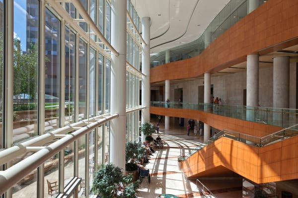
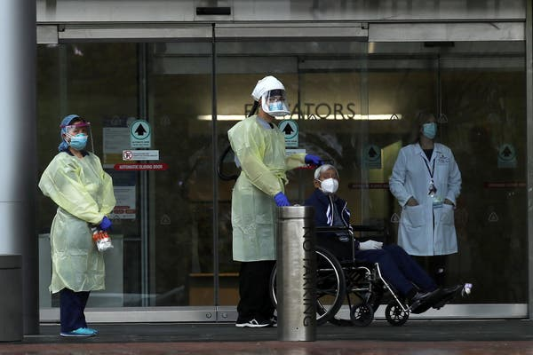
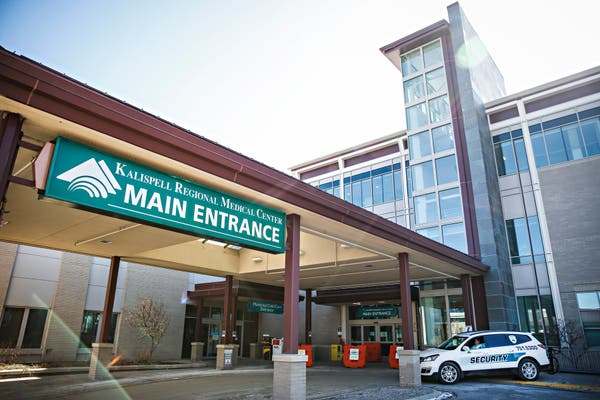

Hospitals Knew How to Make Money. Then Coronavirus Happened. - The New York Times

 [The Coronavirus Outbreak›](https://www.nytimes.com/news-event/coronavirus?action=click&pgtype=Article&state=default&module=styln-coronavirus-national&variant=show&region=TOP_BANNER&context=storylines_menu)

- LIVE

 [Latest Updates](https://www.nytimes.com/2020/05/15/us/coronavirus-updates.html?action=click&pgtype=Article&state=default&module=styln-coronavirus-national&variant=show&region=TOP_BANNER&context=storylines_menu)

- [Maps and Tracker](https://www.nytimes.com/interactive/2020/us/coronavirus-us-cases.html?action=click&pgtype=Article&state=default&module=styln-coronavirus-national&variant=show&region=TOP_BANNER&context=storylines_menu)

- [States Reopening](https://www.nytimes.com/interactive/2020/us/states-reopen-map-coronavirus.html?action=click&pgtype=Article&state=default&module=styln-coronavirus-national&variant=show&region=TOP_BANNER&context=storylines_menu)

- [Living at Home](https://www.nytimes.com/spotlight/at-home?action=click&pgtype=Article&state=default&module=styln-coronavirus-national&variant=show&region=TOP_BANNER&context=storylines_menu)

- [Newsletter](https://www.nytimes.com/newsletters/coronavirus-briefing?action=click&pgtype=Article&state=default&module=styln-coronavirus-national&variant=show&region=TOP_BANNER&context=storylines_menu)

# Hospitals Knew How to Make Money. Then Coronavirus Happened.

Surgeries are canceled. Business models are shifting. Some of the hardest-hit hospitals may close, leaving patients with fewer options for care.

The Mayo Clinic in Rochester, Minn., expects to lose $900 million this year.Credit...Alvis Upitis/Alamy Stock Photo

By [Sarah Kliff](https://www.nytimes.com/by/sarah-kliff)

- May 15, 2020, 5:00 a.m. ET

-

    - 
    - 
    - [](https://www.nytimes.com/2020/05/15/us/hospitals-revenue-coronavirus.html?action=click&module=Top%20Stories&pgtype=Homepagemailto:?subject=NYTimes.com%3A%20Hospitals%20Knew%20How%20to%20Make%20Money.%20Then%20Coronavirus%20Happened.&body=From%20The%20New%20York%20Times%3A%0A%0AHospitals%20Knew%20How%20to%20Make%20Money.%20Then%20Coronavirus%20Happened.%0A%0ASurgeries%20are%20canceled.%20Business%20models%20are%20shifting.%20Some%20of%20the%20hardest-hit%20hospitals%20may%20close%2C%20leaving%20patients%20with%20fewer%20options%20for%20care.%0A%0Ahttps%3A%2F%2Fwww.nytimes.com%2F2020%2F05%2F15%2Fus%2Fhospitals-revenue-coronavirus.html%3Fsmid%3Dem-share)

    -
    -
    -

When the top-ranked Mayo Clinic stopped all nonemergency medical care in late March, it began to lose millions of dollars a day.

The clinic, a Minnesota-based hospital system accustomed to treating [American presidents](https://www.latimes.com/archives/la-xpm-1989-09-15-mn-423-story.html) and[foreign dignitaries](https://www.upi.com/Top_News/2004/10/19/Mayo-Clinic-notes-big-gift-from-Arab-sheik/57981098208079/), saw revenue plummet as it postponed lucrative surgeries to make way for coronavirus victims. The hospital network produced $1 billion in net operating revenue last year, but now expects to lose $900 million in 2020 even after furloughing workers, cutting doctors’ pay and halting new construction projects.

The future offers little relief, at least until the pandemic subsides and the economy recovers. The Mayo Clinic will have to rely more heavily on low-income patients enrolled in the Medicaid program, as others will be hesitant to travel across the country, or the world, for care. “It’s uncontrollable,” said Dennis Dahlen, the clinic’s chief financial officer.

Image

Dennis Dahlen, the Mayo Clinic’s chief financial officer, describe a shift toward more local patients as foreign visitors drop. Credit...Gage Skidmore

The American health care system for years has provided many hospitals with a clear playbook**  **for turning a profit: Provide surgeries, scans and other well-reimbursed services to privately insured patients, whose plans pay higher prices than public programs like Medicare and Medicaid.

The Covid-19 outbreak has shown the vulnerabilities of this business model, with procedures canceled, tests postponed and millions of newly unemployed Americans expected to lose the health coverage they received at work.

“Health care has always been viewed as recession-proof, but it’s not pandemic-proof,” said Dr. David Blumenthal, president of the Commonwealth Fund, a health research organization. “The level of economic impact, plus the fear of coronavirus, will have a more dramatic impact than any event we’ve seen in the health care system weather in my lifetime.”

The disruption to hospital operations may ultimately leave Americans with less access to medical care, according to financial analysts**,** health economists and policy experts. Struggling hospitals may close or shut down unprofitable departments. Some may decide to merge with nearby competitors or sell to larger hospital chains. “There is a huge threat to our capability to provide basic services,” Dr. Blumenthal said.

Hospitals are losing an estimated $50 billion a month now, according to the American Hospital Association. And 134,000 hospital employees were among the**  **estimated 1.4 million health care workers who lost their jobs last month, data from the Bureau of Labor Statistics shows.**  **Across the country, hospitals reported seeing between 40 and 70 percent fewer patients from late March through early May, many of them scheduled for profitable services like orthopedic surgery and radiological scans.

The decline affects large, elite hospital systems like Mayo Clinic and Johns Hopkins — which estimates a loss of nearly $300 million into next year and has adopted cost reductions — as well as**  **suburban hospitals and small rural facilities that were already financially stressed.

Image

Health workers with a patient at the Johns Hopkins Hospital, which estimates a loss of nearly $300 million into 2021.Credit...Carlos Barria/Reuters

Lifespan Health, a five-hospital system in Rhode Island, has put off planned construction of a new spine health center. In rural Wyoming, the 12-bed Weston County Health Services hospital has only enough cash available to get through 16 days, half of what it typically kept, and executives are considering closing the emergency room.

Hospitals that treated high numbers of coronavirus patients say they have been hit especially hard, as they had to spend heavily on protective equipment and increased staffing just as their most profitable services were halted. These patients often had long stays in intensive care units, requiring expensive equipment like ventilators and treatment from multiple specialists.

“We began ordering everything at a feverish pace,” said Kenneth Raske, president of the Greater New York Hospital Association. “The costs were sometimes 10 or 20 times normal. We were scrounging all over the world for supplies.”

His organization estimates that, across New York City, large academic medical centers lost between $350 million and $450 million each last month. Unlike hospitals fighting smaller coronavirus outbreaks, they could not furlough workers to offset the decline.

“In terms of taking care of patients, our hospitals did the right thing,” Mr. Raske said. “But the right thing has challenged their ability to continue sustaining themselves.”

Advertisement

[Continue reading the main story](https://www.nytimes.com/2020/05/15/us/hospitals-revenue-coronavirus.html?action=click&module=Top%20Stories&pgtype=Homepage#after-story-ad-3)

The decline in revenue is expected to be especially high among hospitals that have commanded high prices from private health plans, like the Mayo Clinic. Though coronavirus patients make up a small fraction of its patients — about 1,500 in a health system that sees more than a million annually — the global pandemic is upending its finances.

Last year, the clinic generated 60 percent of its [$11.6 billion annual](https://cdn.prod-carehubs.net/n1/802899ec472ea3d8/uploads/2020/02/2002-3435886-Mayo-Clinic-Year-End-2019-Consolidated_FINAL-short-secured.pdf)patient revenue from privately insured patients and 3 percent from those on Medicaid, according to its annual financial statement. The rest were either were covered by Medicare or paid their own costs.

Other hospitals, including those in low-income areas or with less recognizable brands, rely more heavily on Medicaid funds. This includes many academic medical centers in large cities that see a high number of patients from their surrounding neighborhoods.

# [Latest Updates: Coronavirus Outbreak in the U.S.](https://www.nytimes.com/2020/05/15/us/coronavirus-updates.html?action=click&pgtype=Article&state=default&module=styln-coronavirus-national&variant=show&region=MAIN_CONTENT_2&context=storylines_live_updates)

- •[The White House threatens to veto a $3 trillion relief package being debated in Congress.](https://www.nytimes.com/2020/05/15/us/coronavirus-updates.html?action=click&pgtype=Article&state=default&module=styln-coronavirus-national&variant=show&region=MAIN_CONTENT_2&context=storylines_live_updates#link-12848dd6)

- •[The monthly retail report is expected to be dismal, with the pandemic compounding existing problems.](https://www.nytimes.com/2020/05/15/us/coronavirus-updates.html?action=click&pgtype=Article&state=default&module=styln-coronavirus-national&variant=show&region=MAIN_CONTENT_2&context=storylines_live_updates#link-3b0ca213)

- •[Stay-at-home order for N.Y.C. is extended to June 13, while some areas upstate are allowed to reopen.](https://www.nytimes.com/2020/05/15/us/coronavirus-updates.html?action=click&pgtype=Article&state=default&module=styln-coronavirus-national&variant=show&region=MAIN_CONTENT_2&context=storylines_live_updates#link-2509ec40)

 [See more updates](https://www.nytimes.com/2020/05/15/us/coronavirus-updates.html?action=click&pgtype=Article&state=default&module=styln-coronavirus-national&variant=show&region=MAIN_CONTENT_2&context=storylines_live_updates)

Updated 5m ago

 More live coverage:  [Global](https://www.nytimes.com/2020/05/15/world/coronavirus-news.html?action=click&pgtype=Article&state=default&module=styln-coronavirus-national&variant=show&region=MAIN_CONTENT_2&context=storylines_live_updates)  [Markets](https://www.nytimes.com/2020/05/15/business/stock-market-today-coronavirus.html?action=click&pgtype=Article&state=default&module=styln-coronavirus-national&variant=show&region=MAIN_CONTENT_2&context=storylines_live_updates)  [New York](https://www.nytimes.com/2020/05/14/nyregion/coronavirus-ny-nj-news.html?action=click&pgtype=Article&state=default&module=styln-coronavirus-national&variant=show&region=MAIN_CONTENT_2&context=storylines_live_updates)

At the Johns Hopkins Hospital, a quarter of patient revenue comes from the public program, according to data provided by the nonprofit RAND Corporation. At NewYork-Presbyterian, it accounts for 16 percent of insurer payments.

A nonprofit database shows that Minnesota’s private insurers pay the Mayo Clinic $566 for each obstetric ultrasound, approximately five times the Medicaid price. For an echocardiogram, the difference is tenfold. At Mayo Clinic centers in Florida and Wisconsin, according to RAND estimates, insurers pay three to four times the Medicare prices for outpatient care. Similar data for inpatient prices is not publicly available.

The Minnesota-based hospital system promotes its services to well-off patients, delivering quality health care alongside [luxury amenities](https://www.mayoclinic.org/patient-visitor-guide/minnesota/campus-buildings-maps/mayo-clinic-hospital-saint-marys-campus/suites)such as [hotel-like suites](https://www.mayoclinic.org/patient-visitor-guide/minnesota/campus-buildings-maps/mayo-clinic-hospital-saint-marys-campus/suites) with fluffy bathrobes, private dining rooms and access to chef-cooked meals.

“They’ve really made a conscious effort to bolster their commercial contracts, and it’s a survival strategy,” said Lynn Blewett, a professor of health policy and management at the University of Minnesota. “To maintain the quality and the research and the excellence they’re known for, they’ve got to bring in revenue. There isn’t a lot of margin, if any, with Medicaid.”

Advertisement

[Continue reading the main story](https://www.nytimes.com/2020/05/15/us/hospitals-revenue-coronavirus.html?action=click&module=Top%20Stories&pgtype=Homepage#after-story-ad-4)

More so than most other hospitals,**  **the 131-year-old Mayo Clinic sees a significant number of patients from afar. In a typical year, more than a million patients travel to the system’s 21 hospitals from all 50 states and 140 countries. Many are seen at its 2,000-bed Rochester, Minn. campus. International patients generally account for 1.3 percent of hospital patients but closer to 3 percent of revenue because of the complex care they receive, a spokeswoman said.

The clinic has used its past strong earnings to expand services abroad, opening a facility in London last fall, and now building a 741-bed [for-profit institution](https://www.bizjournals.com/twincities/news/2019/11/25/mayo-clinic-expands-out-of-u-s-with-abu-dhabi.html) in Abu Dhabi, in the United Arab Emirates.

During the last recession of 2008, nonprofit hospitals saw their Medicaid revenue increase 17 percent, according to the credit ratings firm Moody’s, a possible preview of the changes to come in the present downturn.

Minnesota expects to enroll an additional 100,000 residents in Medicaid next year. Nationally, the nonprofit Urban Institute projects between 8 and 15 million new Medicaid enrollments among those losing the private insurance they had through employers. An additional five to 10 million Americans who lose such plans are expected to become uninsured, and four to eight million will transition to the Affordable Care Act’s individual market plans or other sources of private insurance.

The Mayo Clinic expects to see more publicly insured patients in the second half of 2020, although it has not recorded an uptick yet. Mr. Dahlen, the chief financial officer, said, “We’ll probably see a richer mix of locals and people coming from within 100 miles.”

Like other large successful health systems, the clinic has strong cash reserves and access to credit markets. It plans to convert its shortfall by dipping into the $10.6 billion reserve of cash and investments it has built up over decades of profitability.

Independent hospitals that already teetered on the edge have less of a financial cushion and are at greater risk of shutting down services or closing altogether.

Advertisement

[Continue reading the main story](https://www.nytimes.com/2020/05/15/us/hospitals-revenue-coronavirus.html?action=click&module=Top%20Stories&pgtype=Homepage#after-story-ad-5)

Kalispell Regional Medical Center in northwest Montana has already seen a 1 percent increase in Medicaid enrollees as patients begin to trickle back into the hospital last month. That shift from private insurance to public insurance represents a loss of $600,000 because of lower reimbursements, said Craig Boyer, the hospital’s chief financial officer.

The hospital has experienced steep revenue declines after canceling most surgeries and seeing a 34 percent drop in emergency room visits. Kalispell treated a small number of coronavirus patients, including 37 who tested positive and four admitted to the hospital.

“If you are a patient who was scheduled for a total knee replacement, you might say, ‘My knee hurts but I’m still going to put it off while I see what happens,’” Mr. Boyer said. “We know there is a backlog, but we don’t know how many people are going to decide this isn’t the right time.”

Image

Kalispell Regional Medical Center in northwest Montana has seen revenues plummet after canceling surgeries.Credit...Hunter D’Antuono | Flathead Beacon

He also worries that a lull in summer travel will depress revenue. His hospital typically sees more patients then as visitors flock to Glacier National Park, 30 miles away. The hospital has received $10.3 million in federal stimulus plans but does not expect that to cover its losses.

In neighboring Wyoming, the 90-bed Campbell County Memorial Hospital, which treated 29 coronavirus cases with no deaths, has also been hit hard.

“The last six weeks have been disastrous for us,” said Andy Fitzgerald, the chief executive. “We’ve taken a 50 percent haircut on our revenue, and it’s the best 50 percent: elective surgery, radiology, all the outpatient care that pays for the other services we provide.”

Advertisement

[Continue reading the main story](https://www.nytimes.com/2020/05/15/us/hospitals-revenue-coronavirus.html?action=click&module=Top%20Stories&pgtype=Homepage#after-story-ad-6)

Local coal-mining companies, long a pillar of the economy, recently laid off hundreds of workers as global energy demands have declined. Mr. Fitzgerald expects that will mean a surge in the uninsured, who already account for 12 percent of the hospital’s patients. Wyoming is among 14 states that do not participate in the Affordable Care Act’s Medicaid expansion, which provides coverage to low-income Americans.

“My concern is that there is more of this in our future,” Mr. Fitzgerald said of the layoffs. “The global economy isn’t going to bounce back to full employment. The demand for what we produce here in northeastern Wyoming will probably be depressed for a while.”

His hospital has received $10.1 million from the $72 billion in federal stimulus funds distributed so far to hospitals across the country, which he estimates will offset losses from the past two months but not the higher number of uninsured patients he expects to see in the future.

The Trump administration has earmarked $12 billion in relief funds for hospitals that treated 100 or more coronavirus cases, meant to offset the high costs of caring for patients whose hospital stays could last weeks. Some of that funding will go to Providence Health Systems, which owns 51 hospitals, including the Seattle-area facility that treated the first confirmed coronavirus patient in the United States.

The hospital system has treated 1,200 coronavirus patients, and executives do not yet know whether it will break even on that care. They estimate that, even after accounting for federal stimulus dollars, Providence still lost $400 million in April.

“We have been in this situation much longer, because of Seattle being on the forefront of the pandemic,” said Ali Santore, the hospital system’s vice president for government affairs. “We canceled elective surgeries before there was a government order. We had to see so many patients who required more supplies, isolation and nursing. Our labor costs were through the roof.”

Advertisement

[Continue reading the main story](https://www.nytimes.com/2020/05/15/us/hospitals-revenue-coronavirus.html?action=click&module=Top%20Stories&pgtype=Homepage#after-bottom)