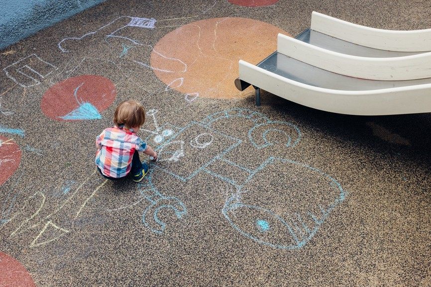

How ANYONE can make insanely better slides – Hacker Noon

# How ANYONE can make insanely better slides

My wife was showing me slides from a meeting she recently attended. I’m sure the material was great, but I didn’t read to find out. The slides literally made my eyes bleed.

Between my time as a partner at an [early stage venture fund](http://founderequity.com/) and a [digital consulting company](http://digintent.com/), I effectively live in Keynote. Creating proposals, reading pitch decks, making presentations.

#### Great slide-making is a tremendous skill to develop. It will make your internal presentations more persuasive. It will help you win more business or close that round of funding. It will accelerate your career.

You’ve no doubt seen gorgeous presentations at conferences and other events, but don’t know how to make them.

But you don’t *need* to know how to make those kinds of presentations for your day job. What you need are some simple tips for polishing up your decks. Making copy more readable. Making tables and charts more useful. Telling the story you’re trying to tell.

This deck is my attempt to help you with that.

I’d love to hear what you think — if you have other ideas for improving slides let me know. And if you found this useful, please recommend!