How Coronavirus Mutates and Spreads - The New York Times

# How Coronavirus Mutates and Spreads

By [Jonathan Corum](https://www.nytimes.com/by/jonathan-corum) and [Carl Zimmer](https://www.nytimes.com/by/carl-zimmer)April 30, 2020

[Leer en español](https://www.nytimes.com/es/interactive/2020/04/30/science/coronavirus-mutacion.html)

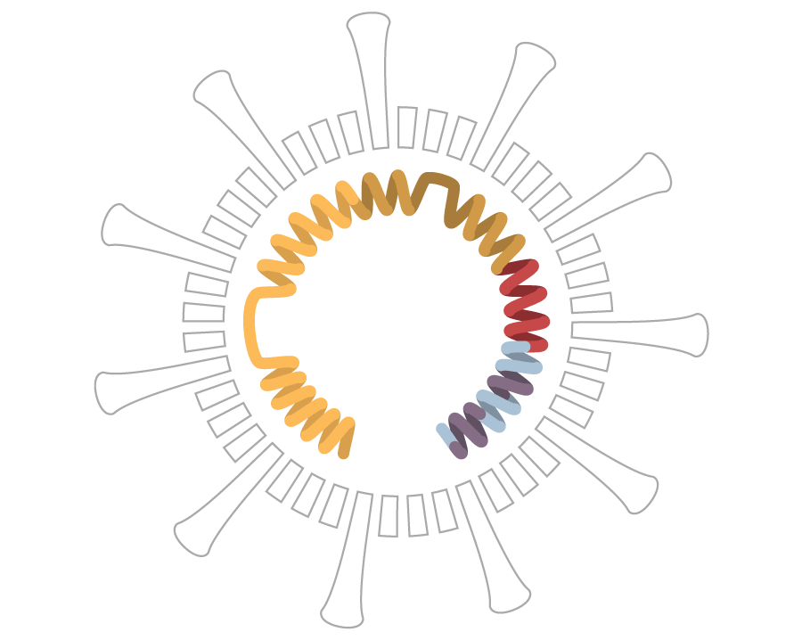

## The Coronavirus Genome

The coronavirus is an oily membrane packed with genetic instructions to [make millions of copies](https://www.nytimes.com/interactive/2020/03/11/science/how-coronavirus-hijacks-your-cells.html) of itself. The instructions are encoded in 30,000 “letters” of RNA — a, c, g and u — which the infected cell reads and translates into [many kinds of virus proteins](https://www.nytimes.com/interactive/2020/04/03/science/coronavirus-genome-bad-news-wrapped-in-protein.html).

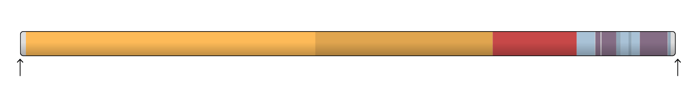
RNA instructions to make the ORF1a protein
ORF1b protein
Spike protein
E
M
N
Start of coronavirus genome
30,000 RNA letters

## A New Coronavirus · Dec. 26

In December, a cluster of mysterious pneumonia cases appeared around a [seafood market in Wuhan, China](https://www.nytimes.com/interactive/2020/03/22/world/coronavirus-spread.html). In early January, researchers sequenced the first genome of a new coronavirus, which they isolated from a man who worked at the market. That first genome became the baseline for scientists to track the SARS-CoV-2 virus as it spreads around the world.

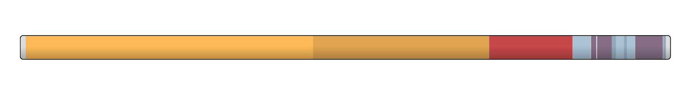
Genome Wuhan-Hu-1, collected on Dec. 26 from an early patient in Wuhan

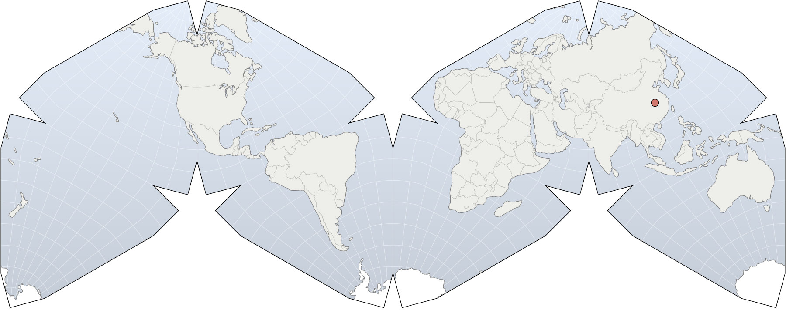
Wuhan

## A Typo in the RNA · Jan. 8

A cell infected by a coronavirus releases millions of new viruses, all carrying copies of the original genome. As the cell copies that genome, it sometimes makes mistakes, usually just a single wrong letter. These typos are called mutations. As coronaviruses spread from person to person, they randomly accumulate more mutations.

The genome below came from another early patient in Wuhan and was identical to the first case, except for one mutation. The 186th letter of RNA was u instead of c.

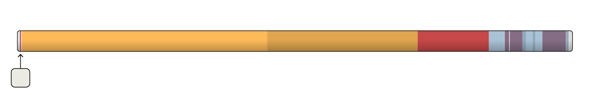
Genome WH-09, collected on Jan. 8 from another patient in Wuhan
u
◀ 186th RNA letter changed

When researchers compared several genomes from the Wuhan cluster of cases they found only a few new mutations, suggesting that the different genomes descended from a recent common ancestor. Viruses accumulate new mutations at a roughly regular rate, so the scientists were able to estimate that the origin of the outbreak was in China sometime around November 2019.

## One Descendent, Two More Mutations · Feb. 27

Outside of Wuhan, that same mutation in the 186th letter of RNA has been found in only one other sample, which was collected seven weeks later and 600 miles south in Guangzhou, China. The Guangzhou sample might be a direct descendent of the first Wuhan sample. Or they might be viral cousins, sharing a common ancestor.

During those seven weeks, the Guangzhou lineage jumped from person to person and went through several generations of new viruses. And along the way, it developed two new mutations: Two more letters of RNA changed to u.

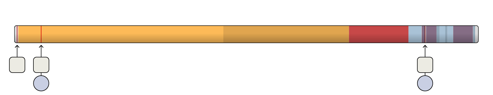
Genome GZMU0030, collected on Feb. 27 in Guangzhou
u
u
u
◀ Another RNA letter mutated
◀ This mutation also changed an amino acid
I
Y

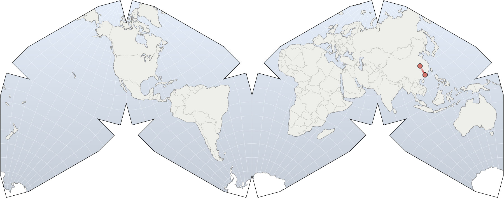
Wuhan
Guangzhou

## When Do Mutations Matter?

Mutations will often change a gene without changing the protein it encodes.

Proteins are long chains of amino acids folded into different shapes. Each amino acid is encoded by three genetic letters, but in many cases a mutation to the third letter of a trio will still encode the same amino acid. These so-called “silent mutations” don’t change the resulting protein.

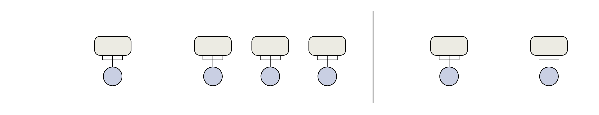
Silent mutation
Non-silent mutation
a
c
u
a
c
a
a
c
c
a
c
g
a
c
u
a
u
u
If the codon
mutates to
or
or
But if
mutates to
the amino acid
won’t change:
then
will change to
T
T
T
T
T
I
(Threonine)
(Isoleucine)

“Non-silent” mutations do change a protein’s sequence, and the Guangzhou sample of the coronavirus acquired two non-silent mutations.

ORF1a protein
E protein
u
u
u
◀ Amino acid change in the ORF1a protein
Amino acid change in the E protein ▶
I
Y

But proteins can be made of hundreds or thousands of amino acids. Changing a single amino acid often has no noticeable effect on their shape or how they work.

## Some Mutations Disappear, Others Spread

As the months have passed, parts of the coronavirus genome have gained many mutations. Others have gained few, or none at all. This striking variation may hold important clues to coronavirus biology.

The parts of the genome that have accumulated many mutations are more flexible. They can tolerate changes to their genetic sequence without causing harm to the virus. The parts with few mutations are more brittle. Mutations in those parts may destroy the coronavirus by causing catastrophic changes to its proteins. Those essential regions may be especially good targets for attacking the virus with antiviral drugs.

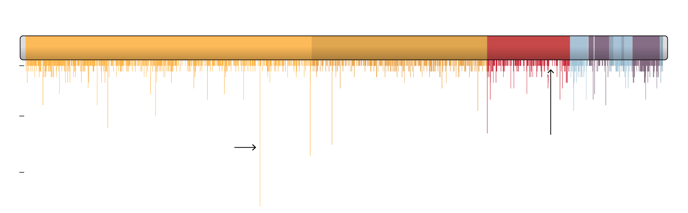

Total number of amino acid substitutions found in 4,400 coronavirus genomes from Dec. to April

1
10
Longer lines may show places where the genome is more tolerant of mutations.
Gaps may show critical spots in the genome that cannot tolerate mutations.
20

As mutations accumulate in coronavirus genomes, they allow scientists to track the spread of Covid-19 around the world.

## The First American Case · Jan. 15

On January 15, a man [flew home to the Seattle area](https://www.nytimes.com/2020/04/22/us/coronavirus-sequencing.html) after visiting family in Wuhan. After a few days of mild symptoms he tested positive for Covid-19. He became the first confirmed case of Covid-19 in the United States.

 A lung scan from the patient showed evidence of pneumonia.NEJM

The genome of his virus contained three single-letter mutations also found in viruses in China. They allowed scientists to trace the man’s infection to its source.

Genome WA1, collected on Jan. 19 from a man in the Seattle area who visited Wuhan

u
u
c
S

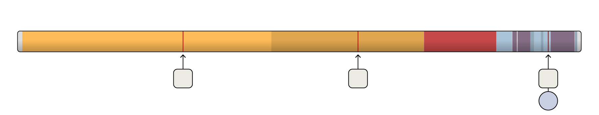
Identical genomes collected on Jan. 21 in Fujian and Guangdong provinces
u
u
c
S

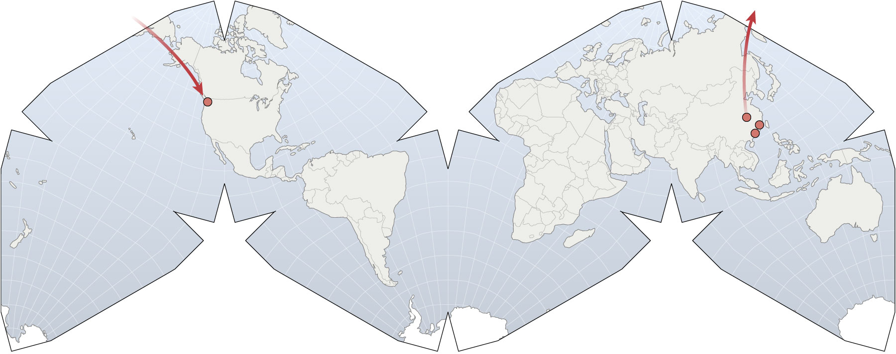
Seattle
Wuhan
Fujian
Guangdong

## Seattle’s Hidden Epidemic · Feb. 24

Five weeks later, a high school student in Snohomish County, Wash., developed flu-like symptoms. A nose swab revealed he had Covid-19. Scientists sequenced the genome of his coronavirus sample and found it shared the same distinctive mutations found in the first case in Washington, but also bore three additional mutations.

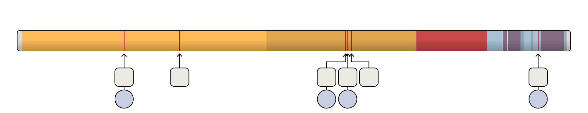
Genome WA2, collected on Feb. 24 from a high-school student in the Seattle area
u
u
u
g
u
c
I
L
C
S

That [combination of old and new mutations](https://bedford.io/blog/ncov-cryptic-transmission/) suggested that the student did not acquire the coronavirus from someone who had recently arrived from another country. Instead, the coronavirus was probably [circulating undetected](https://www.nytimes.com/2020/02/28/us/coronavirus-solano-county.html) in the Seattle area for about five weeks, since mid-January.

Since then, viruses with a genetic link to the Washington cluster have now [appeared in at least 14 states](https://www.nytimes.com/2020/04/22/us/coronavirus-sequencing.html) and several countries around the world, as well as nine cases on the [Grand Princess cruise ship](https://www.nytimes.com/2020/03/09/us/coronavirus-cruise-ship-oakland-grand-princess.html).

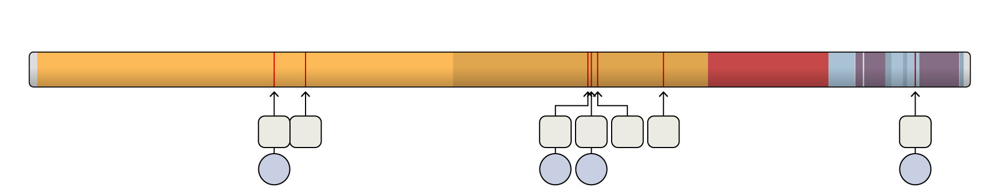

Genome collected on March 5 from two passengers on the Grand Princess cruise ship

u
g
u
u
u
u
c
L
C
N
S

## Early Transmission in California · Feb. 26

A different version of the coronavirus was also secretly circulating in California. On Feb. 26, the C.D.C. announced that a patient in Solano County with [no known ties to any previous case](https://www.nytimes.com/2020/02/26/health/coronavirus-cdc-usa.html) or overseas travel had tested positive.

A sample taken the next day revealed that the virus did not have the distinctive mutations found in Washington State. Instead, it only had a single mutation distinguishing it from the original Wuhan genome. That indicates that it got to California through a separate introduction from China.

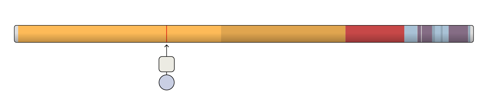
Genome UC4, collected on Feb. 27 from a patient in Solano County, Calif.
u
V

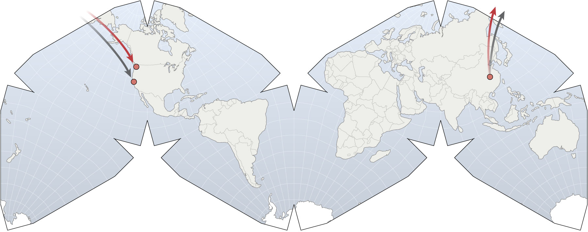
One known and one unknown introduction
Seattle
Wuhan
Solano County

Two healthcare workers who cared for the patient also became sick. Along with the patient’s mutation, their sample had additional mutations.

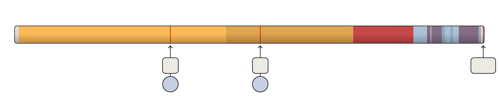

Genome UC2, collected on Feb. 27 from a healthcare worker who cared for the patient

u
c
ctg
V
T

## A Torrent of Viruses

In January and February, more people arrived in the United States carrying coronaviruses of their own. Some viruses carried mutations indicating they had arrived from China or other parts of Asia. But in New York City, the majority of viruses researchers isolated from patients were genetic matches to [viruses that had been circulating in Europe](https://www.nytimes.com/2020/04/08/science/new-york-coronavirus-cases-europe-genomes.html).

## Shanghai to Munich · Jan. 19

On Jan. 19 — the same day the first Washington patient tested positive for Covid-19 — a woman from Shanghai landed in Munich. Not long before the trip, her parents from Wuhan had paid her a visit. By the time she got to Munich she felt only mild symptoms, which she put down as jet lag.

The woman was employed by a German auto parts supplier. The day after she arrived, she went to a company meeting. Several other employees at the meeting got sick and tested positive for Covid-19. The coronavirus genome from a German man at the meeting had mutations linking it back to China.

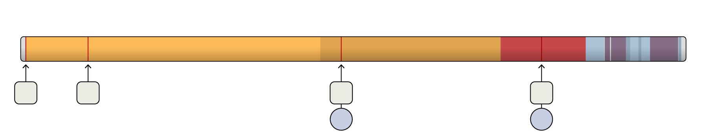

Genome BavPat1, collected on Jan. 28 from a German businessman in the Munich area

u
u
c
g
P
G

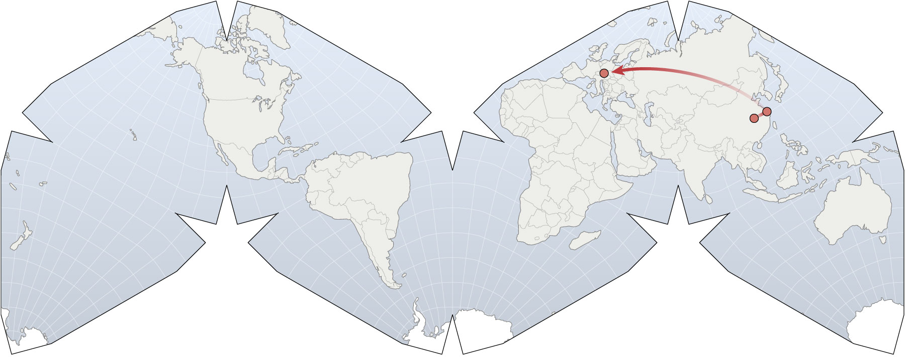
Munich
Shanghai
Wuhan

Genetically similar versions of the virus later spread into other parts of Europe, but it’s unclear if they came from this cluster of cases or from a different introduction.

## Welcome to New York · March 1

The first confirmed case of Covid-19 in New York was announced on March 1, after a woman living in Manhattan was infected while visiting Iran. Of all the viruses that scientists have studied in New York since then, none bears the mutations in her coronavirus genome. That indicates that her infection was not part of a continuing chain of transmissions.

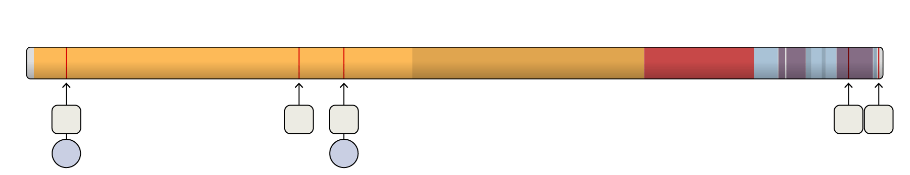

Genome NY1-PV08001, collected on Feb. 29 from a woman in NYC who had traveled to Iran

a
g
u
c
u
I
F

Instead, most of the New York coronaviruses that scientists have sequenced show [genetic links to coronaviruses in Europe](https://nextstrain.org/narratives/ncov/sit-rep/2020-04-17?n=4). Others came from Asia, and still others may have come from other parts of the United States.

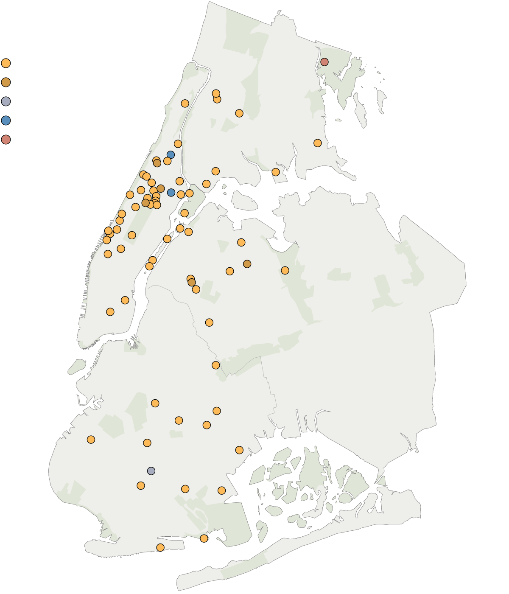
Coronavirus infections genetically similar to samples circulating in:
Europe and North America
Europe
Europe
Washington
BRONX
Asia and Oceania
MANHATTAN
QUEENS
BROOKLYN

## Reintroductions and Deportations · March and April

Soon, the United States and Europe became new sources for introductions to other countries. Dozens of Guatemalans sent on deportation flights from the U.S. later [tested positive](https://www.nytimes.com/2020/04/18/us/deportations-coronavirus-guatemala.html) for the virus, and coronaviruses carrying mutations that arose in Europe have been [reintroduced to Asia](https://nextstrain.org/narratives/ncov/sit-rep/2020-04-10?f_region=Asia&n=11).

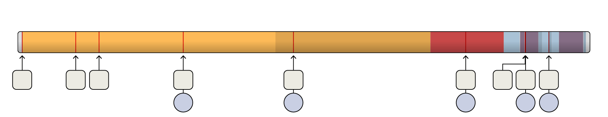
Genome BJ2460, one of three identical samples collected on March 14 in Beijing
u
u
u
u
u
g
u
g
u
I
L
G
G
I

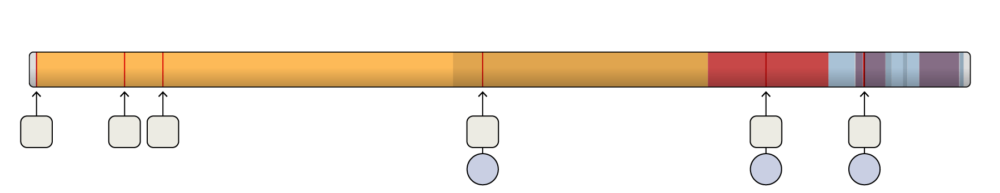

A nearly identical genome found in three people in Belgium, collected March 13–20

u
u
u
u
g
g
L
G
G

## A Slow-Mutating Virus

At this point in the pandemic, coronavirus genomes with 10 or fewer mutations are common, and only a small number have over 20 mutations — which is still less than a tenth of a percent of the genome.

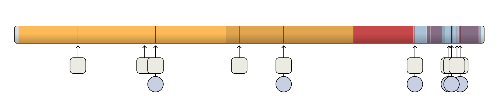
Genome VIC995, collected on March 31 from a woman in Victoria, Australia
u
u
a
u
a
u
u
Y
N
V
S
L

Over time, viruses can evolve into new strains — in other words, viral lineages that are significantly different from each other. Since January, researchers have sequenced many thousands of SARS-CoV-2 genomes and tracked all the mutations that have arisen. So far, they haven’t found compelling evidence that the mutations have had a significant change in how the virus affects us.

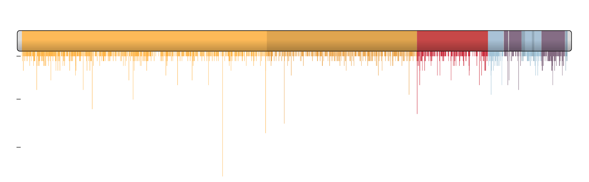

Total number of amino acid substitutions found in 4,400 coronavirus genomes from Dec. to April

1
10
20

In fact, researchers have found that the coronavirus is mutating relatively slowly compared to some other RNA viruses, in part because [virus proteins acting as proofreaders](https://www.nytimes.com/interactive/2020/04/03/science/coronavirus-genome-bad-news-wrapped-in-protein.html) are able to fix some mistakes. Each month, a lineage of coronaviruses might acquire only two single-letter mutations.

In the future, the coronavirus may pick up some mutations that help it evade our immune systems. But the slow mutation rate of the coronavirus means that these changes will emerge over the course of years.

That bodes well for vaccines currently in development for Covid-19. If people get vaccinated in 2021 against the new coronavirus, they may well enjoy a protection that lasts for years.

## What We Don’t Know

Researchers have only sequenced a tiny fraction of the coronaviruses that now infect [over three million people worldwide](https://www.nytimes.com/interactive/2020/world/coronavirus-maps.html).

[Sequencing more genomes](https://nextstrain.org/ncov/global) will uncover more chapters in the virus’s history, and scientists are particularly eager to study mutations from regions where few genomes have been sequenced, such as Africa and South America.

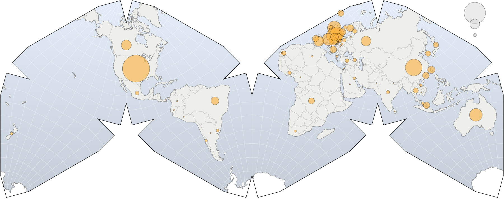
Genomes tracked by
Nextstrain.org,
per country
500
100
10

Note: The four letters of DNA are A, C, G and T. In RNA molecules like the coronavirus genome, the T (thymine) is replaced with U (uracil).

Sources: Trevor Bedford, Sidney Bell et al., [Nextstrain.org](https://nextstrain.org/); Vaughan Cooper; Ana S. Gonzalez-Reiche et al., medRxiv; Nature; New England Journal of Medicine. Cahill-Keyes World Map projection by Gene Keyes.