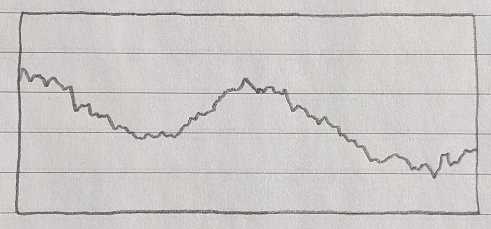
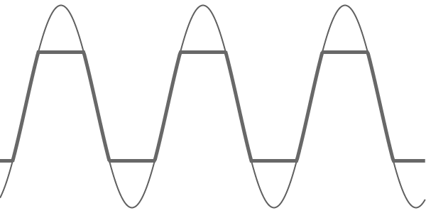
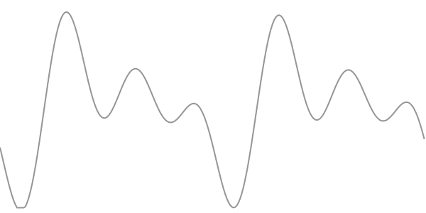
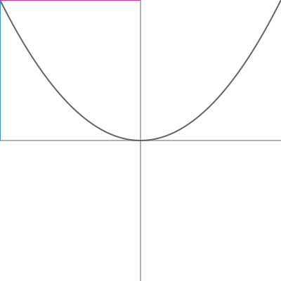
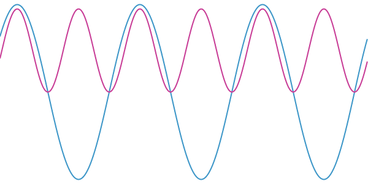

How Distortion Works in Music | Ben’s Blog

# How Distortion Works in Music

 Apr 26, 2020

Distortion is everywhere in music, especially when electric guitars are involved. It’s the crunchy, fuzzy sound that makes rock music sound rocky. It came into existence by accident when too much signal was fed into analogue components and people realised it made an interesting sound.

One of the reasons it sounds so cool is that it preserves the frequency of the note being played, while adding other frequencies on top. With analogue components, this (sort of) works by clipping the signal used to generate the sound. The end result depends on the circuits and components used, so there’s a lot of variety. The right distortion can add character to any sound.

In the digital world, distortion is commonly created using a technique called wave shaping, which is a cool concept that I thought deserved a blog post. You can use wave shaping to create a simple clipping distortion, but it can do a few more things as well.

# Housekeeping

Everything below this paragraph needs javascript enabled to run, the source code is [here](https://gitlab.com/benmosheron/blog/-/blob/master/_posts/2020-04-26-distortion.markdown) if you don’t trust me. I’m using some sound demos based on pure sine waves which sound utterly horrible, but the graphs are so much prettier. I’ve made sure things aren’t too loud but make sure your volume isn’t turned up super high. The sounds get better at the end.

I know some of you will be viewing this on a phone. Good luck, *technically* it should work.

# Master volume control

Use this to change the volume of every sound on this page. Click each graph to play its sound, and click again to stop.

# Pure Sine Wave

This is a basic sine wave playing at 440Hz (an A note) with clipping, you can fade between the clipped and not-clipped waves and adjust the clipping level using the sliders below.

 
Cross fade between pure sine wave and clipped:

Change the amount of clipping:

When the clipping value is outside the usual value of the wave, the clipped sine wave sounds exactly the same as the pure sine wave. I told you they sound horrible…

# Nicer Sounds

Groups of sine waves sound slightly less bad than single waves, mathematicians out there will know you can form any sound with a combination of sine waves, but I’m not going that far.

I’ll apply the same clipping to a group of seven sine waves which have frequencies close, but not exactly the same. This makes them interfere with each other in a way which causes a beating effect (it still doesn’t sound very nice).

A quirk of clipping is that quieter sounds will not hit the threshold, so only the louder sounds get changed. This is how you get “overdrive” effects on loud sounds.

Another side effect of clipping is that it limits the volume, so the distortion is often paired with a boost to the amplitude.

The waveform here (and above) is being drawn about 100x slower than the sound you can hear:

 

This slider changes the distortion amount, further to the right is more clipping coupled with a higher boost:

# Wave Shaping

Under the hood I’m using a technique called wave shaping to create the clipped signals. It’s often used to emulate more classic distortion sounds which are a bit more involved than clipping. And it can do quite a lot more.

It works by using a transfer function, which maps every input value (between -1 and 1) to an output value also between -1 and 1.

Here are a few examples of transfer functions, the axes on the graph both go from -1 to 1. The cursor position will show example values of the function:

|     |     |
| --- | --- |
|   | Input: -1.00 Output: 1.00 |

Below shows the result of applying the transfer function to a sine wave. Click the graph to play the sound, you can change the function by clicking the buttons while it’s playing to hear the difference.

 

Some info on the different functions (look at this page’s source and search “Hello!” to see the functions themselves):

- **Clipped** - exactly the same as the first example, with clip value of 0.5

- **Clip/Boost** - clips to 0.5 and doubles the amplitude to keep the volume the same

- **Exponential** - rounds the edges a bit, emulates an overdriven analogue system

- **Quadratic** - doubles the frequency

- **Noisy** - adds some random noise on top

- **Very Noisy** - replaces the signal with random noise, but you can still hear the original tone (I think this is due to aliasing)

- **Linear** - leaves the input unchanged, reproducing the original sound

- **Wave Fold** and **Wave Wrap** - emulate analogue circuits which use comparators

## These Sound So Much Better with Real Sounds

Why did I waste so much time on the sine waves?

Here are some audio recordings which will be run through the transfer function, I’ve copied the different distortion buttons below so you can mess about with the sound while it’s playing (remember, linear will play the sound unchanged). Have fun!

# Guitar with Reverb

*These might not work in some browsers, try playing one of the sine waves above first, then email me*

# Techno with Ring

# Some Final Quirks

The quadratic one sounds so odd. It’s because it’s an even function whereas most of the others are… odd. These are side effects of the symmetry of the function, they change the harmonics produced by the distortion.

The difference between clip/boost and exponential is subtle - these are the sorts of differences that become very important for high end audio equipment. People will spend lots of time and money looking for the exact right sound.

## The End

I hope you found that cool, I know it’s a random subject. I’m building a synthesiser in javascript at the moment, hence the weird topic. Stay tuned or get in touch if you’re interested.