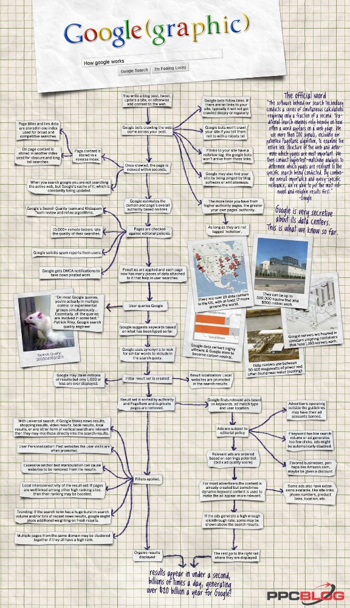

How Does Google Work? Learn How Google Works: Search Engine + AdWords

# Learn How Google Works: in Gory Detail

The following infographic was created years ago when Google had a *content-first* focus on search. In the years since then, the rise of mobile devices has caused Google to shift to a *user-first* approach to search. We created a newer infographic to reflect the modern search landscape [here](http://www.seobook.com/learn-seo/infographics/how-search-works.php).

[Vote on Hacker News](http://news.ycombinator.com/item?id=1472981), or   [Bookmark this on Delicious](http://delicious.com/save)

## FREE: add this infographic to your website!

### 600 Pixel Wide Version

### Large Version