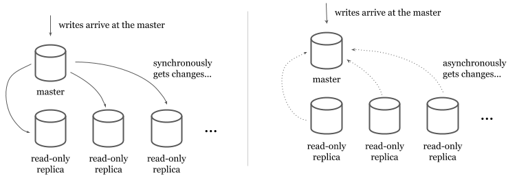
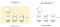
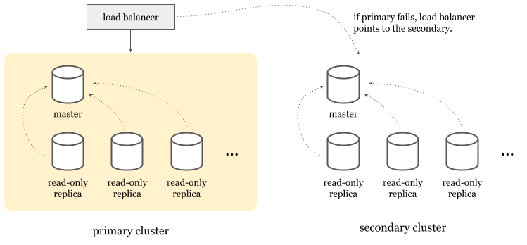
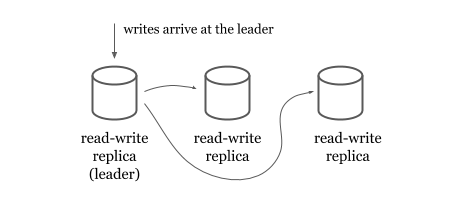
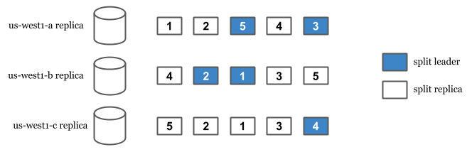
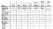
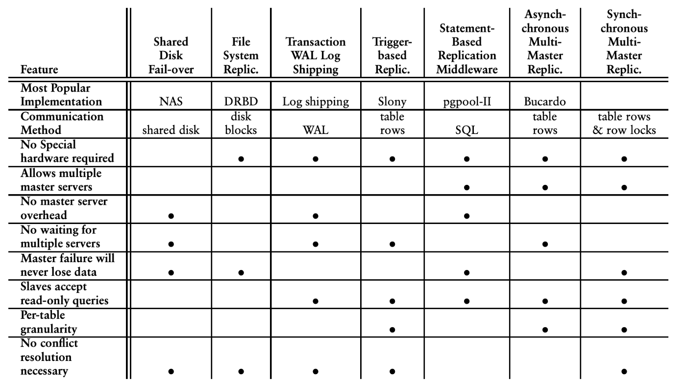
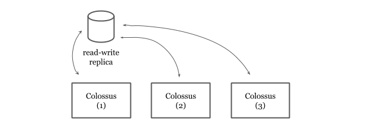

How Does Spanner Avoid Single Point of Failures in Writes?

# How Does Spanner Avoid Single Point of Failures in Writes?

[Jaana Dogan](https://medium.com/@rakyll?source=post_page-----4f7765cd894----------------------)

[May 19](https://medium.com/google-cloud/how-does-spanner-avoid-single-point-of-failures-in-writes-4f7765cd894?source=post_page-----4f7765cd894----------------------) · 7 min read

Google’s [Spanner](https://cloud.google.com/spanner) is a relational database with 99.999% availability which translates to 5 mins of downtime a year. Spanner is a distributed system and can span multiple machines, multiple datacenters (and even geographical regions when configured). It splits the records automatically among its replicas and provides automatic failover. Unlike traditional failover models, Spanner doesn’t failover to a secondary cluster but can elect an available read-write replica as the new leader.

In relational databases, providing both high availability and high consistency in writes is a very hard problem. Spanner’s synchronous replication, and the use dedicated networking and [Paxos](https://en.wikipedia.org/wiki/Paxos_(computer_science)) voting provides high availability without compromising consistency.

## High availability of reads vs writes

In traditional relational databases (e.g. MySQL or PostgreSQL), scaling and providing higher availability to reads is easier than writes. Read-only replicas provide a copy of the data read-only transactions can retrieve from. Data is replicated to the read-only replicas from a read-write master either synchronously or asynchronously.

In synchronous models, master synchronously writes to the read replicas at each write. Even though this model ensures that read-only replicas always have the latest data, it makes the writes quite expensive (and causes availability issues for writes) because the master has to write to all available replicas before it returns.

In asynchronous models, read-only replicas get the data from a stream or a replication log. Asynchronous models make writes faster but introduces a lag between the master and the read-only replicas. Users have to tolerate the lag and should be monitoring it to identify replication outages.

Synchronous vs asynchronous replication to read-only replicas.

While scaling reads can be addressed by having more read-only replicas, **scaling masters is a harder problem** without compromising data consistency. If a master fails, other(s) can provide data without users experiencing downtime but [multi-master replication](https://en.wikipedia.org/wiki/Multi-master_replication) is often implemented with asynchronous replication that negatively impacts the overall system by introducing:

- Looser consistency characteristics that violates ACID promises.
- Increased risk of timeouts and communication latency.
- Necessity for conflict resolution between two or more masters if conflicting updates happened but not communicated.

Due to the complexity and the fail modes multi-master replication introduces, it’s not a commonly preferred way of providing high availability in practice.

As an alternative, [high-availability clusters](https://en.wikipedia.org/wiki/High-availability_cluster) are a more popular choice. In this model, you’d have an entire cluster that can take over when the primary master goes down. Today, cloud providers implement this model to provide high availability features for their managed traditional relational database products.

An example model where secondary cluster can take over if primary has an outage, load balancer will point to the secondary and all writes and reads will be served from the secondary.

## Topology

Spanner doesn’t use high availability clusters but approaches to the problem from a different angle. A Spanner cluster* [contains](https://cloud.google.com/spanner/docs/replication#replica_types) multiple read-write, may contain some read-only and some witness replicas.

- Read-write replicas serve reads and writes.
- Read-only replicas serve reads.
- Witnesses don’t serve data but participate in leader election.

Read-only and witness replicas are only used for multi-regional Spanner clusters that can span across multiple geographical regions. Single region clusters only use read-write replicas. Each replica lives in a different zone in the region to avoid single point of failure due to zonal outages.

The write is routed to the leader**. Then the write is synchronously replicated to other replicas.

## Splits

Spanner’s replication and sharding capabilities come from its splits. Spanner splits data to replicate and distribute them among the replicas. Split happens [automatically](https://cloud.google.com/spanner/docs/schema-and-data-model#load-based_splitting) when Spanner detects high read or high write load among the records. Each split is replicated and has a **leader replica**.

When a write arrives, we find the split the row is in. Then, we look for the leader of that split and route the write to the leader. This is *true* even in multi-region setups where user is geographically closer to another non-leader read-write replica. In the case of an outage of the leader, an available read-write replica is elected as the leader and user’s write is served from there.

Each split is replicated three times and only one of the replicas is the split leader. Each split may be located in a different machine, see [https://cloud.google.com/spanner/docs/whitepapers/life-of-reads-and-writes](https://cloud.google.com/spanner/docs/whitepapers/life-of-reads-and-writes#practical_example).

In order for a write to succeed, a leader need to synchronously replicate the change to the other replicas. But isn’t this impacting the availability of the writes negatively? If writes need to wait for all replicas to succeed, a replica can be a single point of failure because writes wouldn’t succeed until all replicas replicate the change.

This is where Spanner does something better. Spanner only requires *a majority of the Paxos voters to successfully write*. This allows writes to succeed even when a read-write replica goes down. Only the majority of the voters are required not all of the read-write replicas.

## Synchronous replication

As mentioned above, synchronous replication is hard and impacts the availability of the writes negatively. On the other hand when replication happens asynchronously, they cause inconsistencies, conflicts and sometimes data loss. For example, when a master becomes unavailable due to a networking issue, it may still have committed changes but might have not delivered them to the secondary master. If the secondary master updates the same records after a failover, data loss can happen or conflict resolution may be required. PostgreSQL provides [a variety](https://momjian.us/main/writings/pgsql/replication.pdf) of replication models with different tradeoffs. The tradeoffs summary below can give you a very high level idea of how many different concerns to worry about when designing replication models.

A [summary](https://momjian.us/main/writings/pgsql/replication.pdf) of various PostgreSQL replication models and their tradeoffs.

Spanner’s [replication](https://cloud.google.com/spanner/docs/replication) is *synchronous*. Leaders have to synchronously communicate with other read/write replicas about the change and confirm it in order for a write to succeed.

## Two-phase commit (2PC)

While writes only affecting a single split uses a simpler and faster protocol, if two or more splits are required for a write transaction, [two-phase commit](https://en.wikipedia.org/wiki/Two-phase_commit_protocol) (2PC) is executed. 2PC is infamously known as “the anti-availability protocol” because it requires participation from all the replicas and any replica can be a single point of failure. Spanner still serves writes even if some of the replicas are unavailable, because only a majority of voting replicas are required in order to commit a write.

## Network

Spanner is a distributed system and is inherently affected by problems that are impacting distributed systems in general. Networking itself is a factor of outages in distributed systems. On the other hand, Google cites only [7.6%](https://storage.googleapis.com/pub-tools-public-publication-data/pdf/45855.pdf)of the Spanner failures were networking related. This is mostly because it runs on Google’s private network. Years of operational maturity, reserved resources, having control over upgrades and hardware makes networking not a significant source of outages. [Eric Brewer’s earlier article](https://cloud.google.com/blog/products/gcp/inside-cloud-spanner-and-the-cap-theorem) explains the role of networking in this case more in detail.

## Colossus

Spanner’s durability guarantees come from Google’s distributed file system, Colossus. Spanner also mitigates some more risk by depending on Colossus. The use of Colossus allows us to have the file storage decoupled from the database service. Spanner is a “shared nothing” architecture and because any server in a cluster can read from Colossus, replicas can recover quickly from whole-machine failures.

Colossus also provides replication and encryption. If a Colossus instance goes down, Spanner can still work on the data via the available Colossus instances. Colossus encrypts data and this is why Spanner provides encryption at rest by default out of the box.

Spanner read-write replicas hands off the data to Colossus where data is replicated for 3 times. Given there are three read-write replicas in a Spanner cluster, this means the data is replicated for 9 times.

## Automatic retries

As repeatedly mentioned above, Spanner is a distributed system and is not magic. It experiences more internal aborts and timeouts than traditional databases when writing. A common strategy in distributed systems in order to deal with partial and temporary failures is to retry. Spanner client libraries *provide automatic retries for read/write transactions*. In the following Go snippet, you see the APIs to create a read-write transaction. The client automatically retries the body if it fails due to aborts or conflicts:

import "cloud.google.com/go/spanner"_, err := client.ReadWriteTransaction(ctx, func(ctx context.Context, txn *spanner.ReadWriteTransaction) error {

 **// User code here.**
})

One of the challenges of developing ORM framework support for Google Cloud Spanner was the fact most ORMs didn’t have automatic retries, therefore their APIs didn’t give developers a sense that they shouldn’t maintain any application state in the scope of a transaction. In contrast, Spanner libraries cares a lot of retries and makes an effort to automatically deliver them without creating extra burden to the user.

—

Spanner approaches to sharding and replication differently than traditional relational databases. It utilizes Google’s infrastructure and fine-tunes several traditionally hard problems to provide high availability without compromising consistency.

**Footnotes:**

(*) Google Cloud Spanner’s terminology for a cluster is an instance. I avoided to use “instance” because it is an overloaded term and might mean “replica” for the majority of the readers of this article.

(**) The write is routed to the *split* leader. Read the Splits section for more.

This article is archived at [spanner.fyi/ha-writes](https://spanner.fyi/ha-writes/).