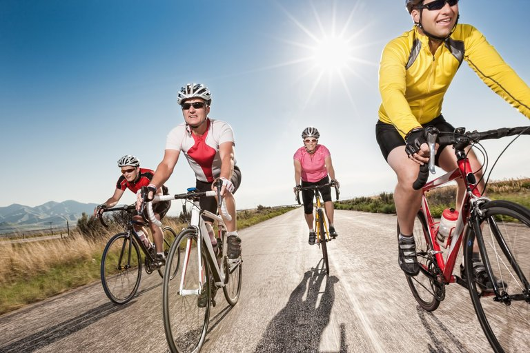

How Exercise Can Keep Aging Muscles and Immune Systems ‘Young’

# How Exercise Can Keep Aging Muscles and Immune Systems ‘Young’

Photo

Credit iStock

Remaining physically active as we grow older could help to keep our muscles and immune systems robust, according to two inspiring new studies of older recreational cyclists.

Together, the experiments add to growing evidence that some of our assumptions about aging may be outdated and we might have more control over the process than we think.

Aging often seems inexorable and unvarying, and, in chronological terms, it is. The years mount at the same pace for each of us.

But our bodies’ responses to the passage of time can differ. While most people become frail, a few remain spry.

These differences recently prompted a group of British scientists to wonder whether our beliefs about what is normal and inevitable with physical aging might be limited or incorrect, and in particular, whether we might be ignoring the role of exercise.

 [Continue reading the main story](https://www.nytimes.com/2018/03/14/well/move/how-exercise-can-keep-aging-muscles-and-immune-systems-young.html?emc=edit_ne_20180314&nl=evening-briefing&nlid=7298217820180314&te=1#story-continues-2)

Advertisement

[Continue reading the main story](https://www.nytimes.com/2018/03/14/well/move/how-exercise-can-keep-aging-muscles-and-immune-systems-young.html?emc=edit_ne_20180314&nl=evening-briefing&nlid=7298217820180314&te=1#story-continues-3)

Exercise among middle-aged and older adults in the Western world is rare. By most estimates, only about 10 percent of people past the age of 65 work out regularly.

So, our expectations about what is normal during aging are based on how growing older affects sedentary people.

But the British scientists, many of them recreational athletes, suspected that exercise might have an impact on the trajectory of physical aging and, if so, alter our beliefs about what “normal” aging means.

To test that possibility, they decided to seek out a group of older men and women who had remained physically active as they aged and found them among local recreational cyclists. The dozens of male and female riders they eventually recruited were between the ages of 55 and 79, had been cycling for decades, and still pedaled about 400 miles per month. None were competitive athletes.

For their [inaugural study of the riders](http://onlinelibrary.wiley.com/doi/10.1113/jphysiol.2014.282863/abstract), which was published in 2014, the scientists measured a broad range of the cyclists’ physical and cognitive abilities and compared them to those of sedentary older people and much younger men and women. The cyclists proved to have reflexes, memories, balance and metabolic profiles that more closely resembled those of 30-year-olds than of the sedentary older group.

That analysis had left many questions about exercise and physical activity unanswered, however. So for the two new studies, which were both published in Aging Cell this month, the researchers decided to refocus their inquiries and look closely at muscles and T cells, a key infection-fighting component of our immune system.

In most people, muscle health and immune response worsen after we arrive at middle age, with the effects accelerating decade by decade. But there had been hints in the first study’s data that the cyclists might be unusual in these regards.

## Newsletter Sign Up

 [Continue reading the main story](https://www.nytimes.com/2018/03/14/well/move/how-exercise-can-keep-aging-muscles-and-immune-systems-young.html?emc=edit_ne_20180314&nl=evening-briefing&nlid=7298217820180314&te=1#continues-post-newsletter)

### The Well Newsletter

Get the best of Well, with the latest on health, fitness and nutrition, delivered to your inbox every week.

 You agree to receive occasional updates and special offers for The New York Times's products and services.

So for [one of the new studies](https://www.ncbi.nlm.nih.gov/pubmed/29517834), the researchers turned to muscle tissue that already had been biopsied from the legs of 90 of the riders. They wanted to compare various markers of muscle health and function across the riders’ age span. If the muscles of riders in their 70s resembled those of riders in their 50s, the scientists reasoned, then their physical activity most likely had altered and slowed the supposedly “normal” arc of muscular decline.

At the same time, other [scientists delved into the riders’ immune systems](https://www.ncbi.nlm.nih.gov/pubmed/29517845), drawing blood from them, as well as from a group of sedentary older people and another of healthy young adults.

The two sets of scientists then dove into their data and both concluded that older cyclists are not like most of the rest of us. They are healthier. They are, biologically, younger.

Their muscles generally retained their size, fiber composition and other markers of good health across the decades, with those riders who covered the most mileage each month displaying the healthiest muscles, whatever their age.

The impacts on riders’ immune system also were marked. In the older sedentary people, the output of new T cells from the thymus glands was low. The inactive older peoples’ thymus glands also were atrophied, compared to those of the younger group.

The aging cyclists, on the other hand, had almost as many new T cells in their blood as did the young people. Those who exercised also showed high levels of other immune cells that help to prevent autoimmune reactions and of a hormone that protects the thymus against shrinkage.

The researchers theorize that the results of the two studies are interrelated. Muscles are one of the sources of the hormone that protects the thymus.

“So more muscle means more of that hormone,” says Janet Lord, the director of the Institute of Inflammation and Aging at the University of Birmingham, who was a co-author of both studies.

The older cyclists’ immune systems were not impervious to aging, of course. Many of their existing T cells showed signs of senescence, which means that they had grown feeble and were unlikely to fight infections well anymore.

The results also are limited to recreational British cyclists. They cannot tell us if other types and amounts of physical activity would necessarily have the same effects or whether someone could begin exercising at, say, age 60 and expect to benefit to the same extent as someone who has exercised lifelong.

But even with those caveats, Dr. Lord says, “the message of these studies is that much of what we previously thought of as inevitable in aging is in fact preventable.”

 [Continue reading the main story](https://www.nytimes.com/2018/03/14/well/move/how-exercise-can-keep-aging-muscles-and-immune-systems-young.html?emc=edit_ne_20180314&nl=evening-briefing&nlid=7298217820180314&te=1#whats-next)

## From Our Advertisers

## Recent Comments

## Catherine

11 hours ago

I used to bike all the time in my 20s, and loved it; but gave it up mostly because the position on a drop handle bike killed my neck. But...

## Pecos 45

13 hours ago

As someone who started triathlons in my 30s and is still bicycling in my mid-60s, I concur that bicycling is one of the best exercises for...

## Rebecca

13 hours ago

Still skiing at 64... I have thighs of steel ( no wait make that titanium) LOL Just bought my season pass at Pebble Creek for next year!!!

- See All Comments
- Write a comment