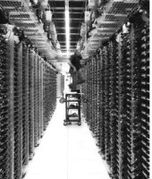
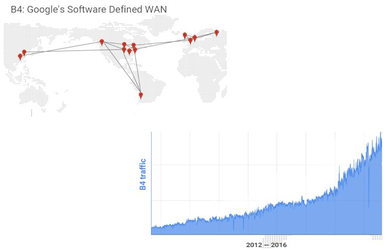
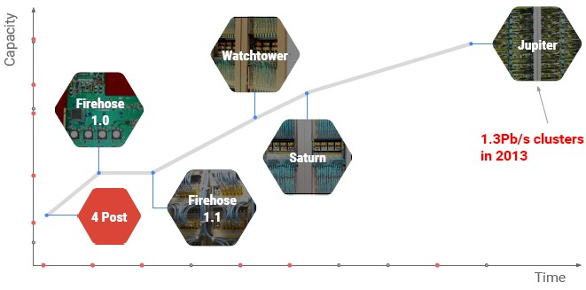
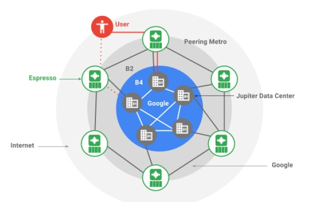
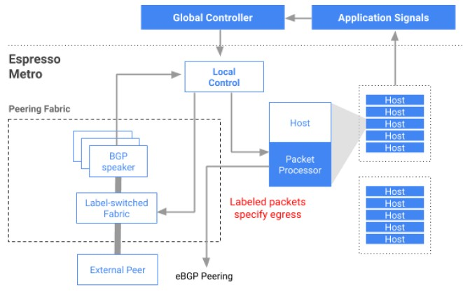
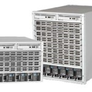

How Google Wants To Rewire The Internet

-

# How Google Wants To Rewire The Internet

July 17, 2017[Timothy Prickett Morgan](https://www.nextplatform.com/author/tpmn/)

When all of your business is driven by end users coming to use your applications over the Internet, the network is arguably the most critical part of the infrastructure. That is why search engine and ad serving giant Google, which has expanded out to media serving, hosted enterprise applications, and cloud computing, has put a tremendous amount of investment into creating its own network stack.

But running a fast, efficient, hyperscale network for internal datacenters is not sufficient for a good user experience, and that is why Google has created a software defined networking stack to do routing over the public Internet, called Espresso. Google believes that Espresso not only has the potential to change the way routing is done on the Internet for its users, but also has the potential to shape the way routing gets done on the Internet at large. This could be one of those defining moments where Google shows the way and the world follows.

Amin Vahdat, Google Fellow and technical lead for networking at the company, recently walked us through Google’s implementation of Espresso routing on the public Internet, the fourth pillar of networking that the company has divulged thus far. Vahdat also talked about how networking technology, in terms of both hardware and software, are starting to see the pace of innovation pick up again after a tough slog there in the past decade, [something we have mused upon](https://www.nextplatform.com/2017/07/10/ethernet-getting-back-moores-law-track/) recently.

All of the hypercalers have spent more than a decade building their own networks, including homemade switches and routers and a complete software stack that makes them malleable and scalable in the same manner as the compute and storage infrastructure that gives them a huge advantage in the IT sector and among application providers.

Back in 2013, Google revealed some of the details on its [B4 software defined wide area network](http://dl.acm.org/citation.cfm?id=2486019), which links its global datacenters together for data replication and workload sharing. This WAN, as shown below, has seen exponential traffic growth, particularly as Google and its cloud customers go more global and use replication to make applications and data highly available.

Back in 2014, before *The Next Platform* was launched, Vahdat unveiled details on the [Andromeda network virtualization stack](http://googlecloudplatform.blogspot.com/2014/04/enter-andromeda-zone-google-cloud-platforms-latest-networking-stack.html) that rides atop Google’s network fabric and exposes network functionality to customers using its Google Compute Platform public cloud, and back in June 2015, [Vahdat discussed why Google had to start building its own switches and routers to support its datacenter-scale networks](https://www.nextplatform.com/2015/06/19/inside-a-decade-of-google-homegrown-datacenter-networks/) and also unveiled the software that creates the network fabric that back in 2013 could span more than 100,000 servers and deliver more than 1.3 PB/sec of bi-sectional bandwidth across a Google datacenter. He also talked about the software that manages Andromeda and Jupiter, which bears more than a passing resemblance to the Borg cluster and container management system that is probably the second most important technology ever created by Google after the MapReduce data analytics technique that is embodied in Hadoop.

Conceptually, here is how Espresso plugs into the Google networking stack:

The peering network, as we said above, is vital to Google, and making it more malleable and controllable was a tricky bit of business because Google does not control the network even though it does generate about 25 percent of the traffic on the Internet across all of its sites as they hook out to service providers in more than 70 metropolitan areas and fan out to billions of users. (*Chew on that for a bit*. *Let it sink it.*) The Espresso routing network creates a pool of routing that breaks outside of individual boxes, much as Borg implements a container layer on bare metal and creates a pool of computing. Google is a big believer in centralized but disaggregated control, whether it is for compute, storage, and networking, that depends on a huge amount of telemetry from the underlying systems and applications to give a consistent experience to the end user from the end user’s point of view.

This last bit is the important one. Take a search engine query, for example. No one wants to hear an explanation as to why it was slow; they just want it to work, even if a query has to work through dozens of routers and applications scattered across thousands of servers worldwide, all with sub-second response time.

This is a tremendous engineering challenge – perhaps the biggest one in the world – and details about how Google and its peers do this are scarce. So when Vahdat talks, people listen.

**TPM**: My first question is a silly one, and I see there is B4, what is B2 and whatever happened to B3?

**Amin Vahdat**: Such a good question, and B3 did exist at one point and we retired it in favor of B4. The way to look at it is that B4 is our private datacenter network interconnect, and B2 is what connects our datacenter to the public Internet.

Google carries about 25 percent of Internet traffic today. In other words, one out of four bytes that are delivered to end users across the Internet originate from Google. Not all of it on the B2 network, because we also have a fairly large presence inside ISP networks with the Google global cache, but it’s the case that actually our B4 network – the one that connects our datacenters together – is bigger and growing faster than our B2 network.

**TPM:** Interesting. Do both networks run on the Jupiter gear? Or, is it different? How does it work?

**Amin Vahdat**: Further breaking it down, Jupiter is our datacenter network, and that has its own set of switches. B4 uses similar switch technology, which has run that separately in the past but it’s a different software system. We haven’t said anything publicly about what our B2 hardware gear looks like. But, we have said that B4 and Jupiter runs on our own hardware and software apps, all built in house.

**TPM**: Espresso is the next big reveal from Google with regard to networking, and we are all ears.

**Amin Vahdat**: The biggest point to make about Espresso is that, previously, our application of our in-house network technology was on an internal use basis. But this is very much used on the public Internet. So Jupiter, our datacenter network, is contained within the datacenter, and then before the network that connects our datacenters together again is a private network.

Let’s start with a little history. A problem that we were facing was that standard, existing routing protocols, primarily Border Gateway Protocol or BGP, which is used for all pairing among different networks, is focused on individual boxes, and essentially what this means is that they have to take a very local view about connectivity. As soon as they can find a path between a source and a destination, two computers that want to talk to each other across the network, then BGP is happy. It doesn’t try to find the *best* path, and it doesn’t try to do dynamic optimization.

The analogy I like to use is that it’s like a real-time road system – the path that you would use going from point A to point B changes dramatically over the course of a day, and of course you have many different options, potentially. So, for us, what we want to be able to do is for our services, whether they are running on our network or posting things for external customers in Google Cloud, we want to be able to use the richness of the Internet to be able to deliver the best quality of experience to users that are across the world. And basically what Espresso does is it actually pulls the routing intelligence outside of individual routers into a server pool, where we can do offline analysis of the data.

So, think of a router – it is making forwarding decisions on individual packets, typically at the granularity of hundreds of nanoseconds today, just a tiny amount of time. It has no idea and it doesn’t have enough time to think about which application this packet belongs to, or what it cares about bandwidth, latency, or otherwise. What we do with Espresso is that we actually use application signals to say, when I take this particular route to this user population right in this network, how well do I do? If I do well let me keep using it. If I’m not doing well, let me consider some of the alternatives that are available to me, either within a pairing location, maybe in, let’s say New York, or in a different pairing location, maybe it’s Washington DC or New Jersey or someplace close by. In other words, how do I balance my traffic among all the different places I can use to get to a net user to deliver the best performance?

What we have done is two things. One, we simplified the router design. In other words, the router that we need to use at the edge of our network has become much simpler, much more efficient, and it takes less space, uses less power, and has less cost. But, two, and more importantly, we have allowed our network to make much more intelligent decisions, much more real time decisions than was previously possible.

**TPM**: Did you have that router custom made for that, or do you still use off-the-shelf stuff? I assume you take all the intelligence and all the processing you normally do inside the ASIC and you move it into the software layer like other NFV and SDN approaches, you know you simply don’t need that device anymore, so I assume you could cut the cost dramatically by not having to buy an expensive router.

**Amin Vahdat**: Exactly. . . .

**TPM**: Or use a different router chip, even if it’s not custom it can be a simpler one.

**Amin Vahdat**: The way to look at it is that it is more like the latter than the former. You’re exactly right and it’s the simpler case. The other thing I should have mentioned is: There are typically a very small number of vendors, order of magnitude two, that can build an Internet scale router. I mean these are the most advanced of the advanced boxes, and for good reason, by the way. They are extremely well engineered, highly reliable, they need to have what’s called a query table entry for every guest to ensure they are on the Internet. What we have done is we really simplified our requirements for that Internet router, so that we have really opened up our choices, in terms of what we use.

**TPM**: Gotcha. I mean a lot of switch ASICs now have router functions. Soon it might be simple enough that you could use the same ASIC for the switching and routing.

**Amin Vahdat**: Yup, great observation.

In case you are interested in the technical detail, we have the hosts insert a label in every packet, and that label essentially makes the routing decision for the router. All the router has to do is look at that label, and the label tells it the forwarding decision for that packet. So we have put again the brains, the functionality on the servers, where they have lots and lots of cheap memory. So that decision again is made at the end of the hosts rather than on the router.

**TPM**: Now you run all of this software that controls Espresso on your own infrastructure. How much more oomph does this take? Does it take a whole server to manage a bunch of these edge routers? What’s the ratio of compute to routing? I don’t know even how to ask this question intelligently.

**Amin Vahdat**: I totally understand what you’re asking, it’s a great question. For redundancy, and for a variety of other reasons, it is more than one server we employ. The exact ratio isn’t important, but I guess what I can tell you is the server cost adder isn’t negligible

**TPM**: Espresso has been up for two years, and is serving what percent of Google’s traffic?

**Amin Vahdat**: 20 percent of the traffic, and the way to look at that is that value is increasing every day. So in other words, all of our new deployments are moving to Espresso. So, of course we have our big installed base, but the point is that as we refresh or expand our networks, it’s with Espresso. So every day we have a margin of our traffic that moves to Espresso, just naturally it’s increasing.

**TPM**: And what’s doing the other 80 percent of this traffic?
**Amin Vahdat**: Traditional vendor gear.

**TPM**: How long will it take to roll through it that gear and replace it? Like three or four years?

**Amin Vahdat**: I don’t know yet. That might be accurate. I don’t have the exact answer to that, but for us it doesn’t really matter in that all the benefits are there and increasing, and in terms of expenditure certainly it doesn’t matter because the existing stuff is all depreciated. Or almost all depreciated.

**TPM**: Does anybody have anything like this in the real world? Google isn’t the real world, you realize this, of course. . . .

**Amin Vahdat**: Well, we feel like we do live in the real world, but that is a good point. Let me put it this way, I’m not aware of anything anywhere close to this. That doesn’t mean it doesn’t exist.

**TPM**: Well if you are not aware of it, I am pretty sure it doesn’t exist because if you could buy it, you would.

**Amin Vahdat**: Yes. I think a way to look at this is that this really is a big departure from standard Internet protocol thinking. Because standard Internet router thinking really is box-centric. You really have two boxes, two routers establish a connection with one another and exchange protocol messages and give them all this data they need just to do packet forwarding. I mean this is how networking is done. This is the dogma. But we really are breaking this in a really substantial way. So that’s why perhaps it’s the case that no one else is doing this. It goes counter to traditional Internet protocol thinking.

**TPM**: Is it your desire to foster this kind of technology? I mean you guys do this all the time. You publish papers or you open source software. Is it your desire to donate Espresso to the world, or is this just something that is bragging rights and it helps you get particular kinds of hardware manufactured that you need for your particular needs? What is the plan for Espresso? Other than using it, obviously.

**Amin Vahdat**: It’s a good question, and it’s a big question. So, we are not in the business of selling networking gear and we would not go into the business of selling networking gear. We do believe that making the Internet better, whether it’s more available or faster, is core to our mission. So, part of the reason for publishing this and going public with this is we think that others should be adopting good ideas. And furthermore as we do adopt these ideas, actually it would make sense for us to be able to expand these Internet protocols between ISPs. Because right now, everything is done a particular way, it gives us benefits, but we are still speaking BGP to the outside world.

**TPM**: It would be beneficial then to have everybody using something like Espresso, I assume.

**Amin Vahdat**: Speaking just for myself, yes. I absolutely believe so. It would be much better than the current state of networking by taking a more holistic global view.

Here is one more bit, and this is just stuff that I get very excited about.

In terms of Internet history, we could only get the Internet to this scale by following the principles that we did. In other words, by using pairwise connectivity. I mean, imagine this network where all you have to do is find one member of the Internet, plug your device into it, and now all of a sudden you are a member of this global network. This is pretty incredible, pretty awesome. The protocols came up this way for a great reason, and I strongly believe that we could not have built the network that we did, collectively of course, without this property of the Internet. But now that we have gotten to this point, where the Internet is no longer about just finding a path, any path, between a pair of servers, but actually taking advantage of the rich connectivity to deliver the highest levels of availability, the best performance, the lowest latency. Knowing this, how you would design protocols is now qualitatively shifted away from pairwise decisions to more global views.

**TPM**: I am thinking ahead here, and I am just trying to draw a picture in my head: If everybody is optimizing all the time, it strikes me that it ends up being sort of a race, and you might end up with something like high frequency trading where everybody’s just messing with everybody all the time. I don’t know that anything productive gets done after a while once everybody starts doing that. Can networking get far more complicated by having everyone dynamically optimizing all the time?

**Amin Vahdat**: Yes, that is possible, though again you can aggregate. The other bit to keep in mind is that everyone is optimizing all the time right now, but they are doing it entirely based on their local view in their one box. So now imagine that we actually allow people to optimize a bit less, and aggregate over a larger view.

**TPM**: Or, if you could actually push traffic in certain directions intentionally, as opposed to, I guess it’s not really passive, you know, there’s a difference between finding the best route and actually having police officers tell you which way to go.

**Amin Vahdat**: Yup, pretty much traffic directors. Absolutely.

**TPM**: Interesting. So, what’s the plan for Espresso at this point? Have you published a paper on it?

**Amin Vahdat**: Not yet. But stay tuned.

**TPM**: I will ask you one more question, just for fun. You talked about the four key pieces of SDN. Are these it, are these the main things, or is there other stuff? I just want to know if there is other stuff, or is this the basic stuff?

**Amin Vahdat**: There for sure is. I mean what I expressed in the presentation though is I think we are, with this especially in my mind, where we have taken it all the way to public Internet, well past the tipping point. In other words, three or four years ago there was a big debate: is SDN a good idea? Is it the right way to do networking? I think again, for me, we are past the tipping point. Even internally at Google, a couple years back, it was a big debate. Now it’s not SDN anymore, it’s just N. In other words, soft refined networking is how we do networking. So the debate is closed, we’re past the tipping point, there’s a ton more to do.

So are these it? No, actually we are going to be telling you about the fifth pillar and the sixth pillar in the years ahead. But at this point we are also thinking in terms of where are the next other challenges. In other words if software defined networking is the way to do networking, what are the implications of that? Sort of, in the networking ecosystem if you think about, for example, management, or when we think about security of the network, or when we think about availability of the network.

**TPM**: Two years ago, you talked in a presentation about the Jupiter network and then you talked about the need for 5 Pb/sec switch fabrics. You walked through [a very logical explanation of why this is the case](https://www.nextplatform.com/2015/07/01/why-google-thinks-we-need-5-petabit-switching/). Has your opinion about this changed? Or are you still eager for more bandwidth as quickly as you can get it?

**Amin Vahdat**: Yes I am very eager for more bandwidth as soon as we can get it, and I think the other side of the bill is how do we break apart some of the assumptions in higher level software with respect to what bandwidth is available. Putting it differently, a lot of software has been written to assume slow networks. That means if you make the network a lot faster, in many cases the software can’t take advantage of it because the software becomes the bottleneck.

**TPM**: That’s a dumb way to write software. At the time it made sense, I’m sure.

**Amin Vahdat**: Yes. As a software person, I might disagree with you, but I totally understand what you’re saying. I feel that all the time myself.

**TPM**: Where is Google at in its transition, and just in general for the network? Is the internal stuff migrating up from 40 Gb/sec up to 100 Gb/sec? What do you think about 200 Gb/sec Ethernet? Innovium and Mellanox have 400 Gb/sec switching coming out and have a bunch of hyperscalers backing them, and Google is actually investing in Innovium, so I suspect you are interested.

**Amin Vahdat**: We are in a golden age of networking. I won’t tell you the specifics in terms of where we are in our transition plan, but it is an exciting time to be doing networking. For the first time in a long time we have startups in this space.

You know it’s funny though, at the same time though the processor speeds are slowing down, or improvements are slowing down, but networking is not really showing signs of slowing. And for me that actually points to a really big opportunity because I think that actually networking is going to be central to improving computing performance overall by enabling us, basically, to leverage more parallelism across servers.

**TPM**: I couldn’t agree more. Networking is finally catching up. It has been slacking for quite a while.

**Amin Vahdat**: Yes, and if you look at some of those transitions, the transition from 1 Gb/sec to 10 Gb/sec, for example, took an awfully long time. From 10 Gb/sec to 40 Gb/sec was better, and from 40 Gb/sec to 100 Gb/sec even better, and the rate, as you were pointing out, from to 200 Gb/sec to 400 Gb/sec and beyond is really moving quickly.

### Share this:

    - [Reddit](https://www.nextplatform.com/2017/07/17/google-wants-rewire-internet/?share=reddit&nb=1)
    - [Facebook163](https://www.nextplatform.com/2017/07/17/google-wants-rewire-internet/?share=facebook&nb=1)
    - [LinkedIn557](https://www.nextplatform.com/2017/07/17/google-wants-rewire-internet/?share=linkedin&nb=1)
    - [Twitter](https://www.nextplatform.com/2017/07/17/google-wants-rewire-internet/?share=twitter&nb=1)
    - [Google](https://www.nextplatform.com/2017/07/17/google-wants-rewire-internet/?share=google-plus-1&nb=1)
    - [Email](https://www.nextplatform.com/2017/07/17/google-wants-rewire-internet/?share=email&nb=1)

    -

### Similar Vein

    - [Inside A Decade Of Google Homegrown Datacenter Networks](https://www.nextplatform.com/2015/06/19/inside-a-decade-of-google-homegrown-datacenter-networks/)
    - [Google Will Do Anything To Beat Moore’s Law](https://www.nextplatform.com/2015/04/29/google-will-do-anything-to-beat-moores-law/)
    - [Datacenters To Get A High Fiber Bandwidth Diet](https://www.nextplatform.com/2016/03/18/datacenters-get-high-fiber-bandwidth-diet/)
    - [Why Google Thinks We Need 5 Petabit Switching](https://www.nextplatform.com/2015/07/01/why-google-thinks-we-need-5-petabit-switching/)
    - [Arista Wields Tomahawks In 25G Ethernet Price War](https://www.nextplatform.com/2015/09/14/arista-wields-tomahawks-in-25g-ethernet-price-war/)
    - [The Walls Come Down On The Last Bastion Of Proprietary](https://www.nextplatform.com/2016/06/14/walls-come-last-bastion-proprietary/)

Categories: [Connect](https://www.nextplatform.com/category/connect/), [Hyperscale](https://www.nextplatform.com/category/hyperscale/)

Tags: [Andromeda](https://www.nextplatform.com/tag/andromeda/), [B4](https://www.nextplatform.com/tag/b4/), [Espresso](https://www.nextplatform.com/tag/espresso/), [Google](https://www.nextplatform.com/tag/google/), [Jupiter](https://www.nextplatform.com/tag/jupiter/)