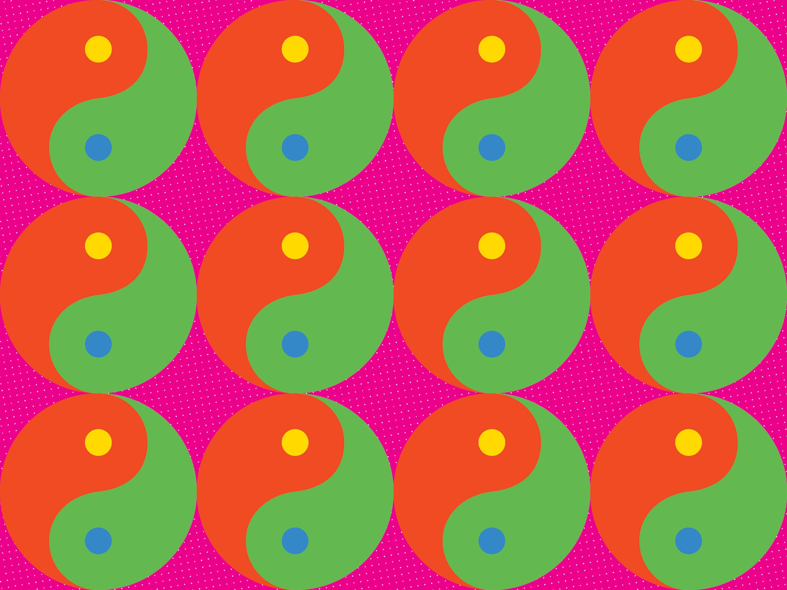
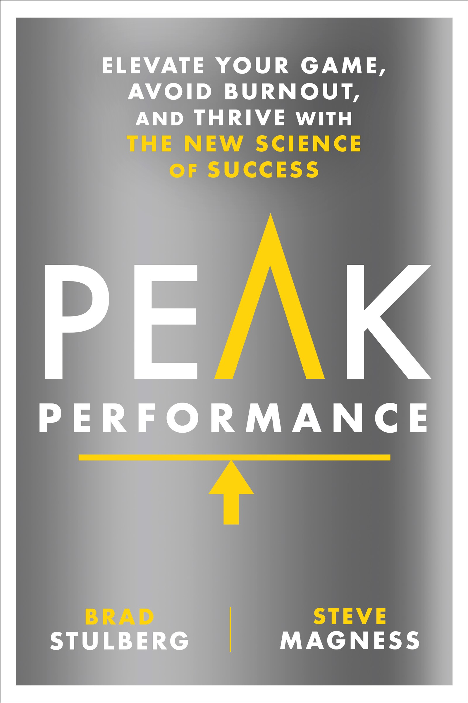

How Googlers Avoid Burnout (and Secretly Boost Creativity) | WIRED

- Author: Brad Stulberg, Steve Magness[Brad Stulberg](https://www.wired.com/author/brad-stulberg) and [Steve Magness](https://www.wired.com/author/steve-magness)
- business
- 06.11.17
- 07:00 am

# How Googlers Avoid Burnout (and Secretly Boost Creativity)

**Getty Images/WIRED

Adam*, is an engineer on Google’s self-driving car project (now its own division, called Waymo). He says the daily pace of work borders on fanatical. When he’s in the lab, the outside world disappears—we know this because he tells us so, and also because our text messages and emails to him almost always go unanswered. Adam works full tilt, wholly immersing himself in the brains and guts of a car that, if Google gets it right, will be a total game-changer. Adam, however, would never say that. He knows that he and his team must first figure out, among many other things, how to teach an inanimate object moving at 70 miles per hour to differentiate between a stray plastic bag and a stray deer. Talk about a just-manageable challenge.

Google is built upon projects like the self-driving car: endeavors that push at the point of resistance for growth, where struggle and productive failure aren’t consequences *of* the work, but rather the driving forces *behind* it. The company attracts the cream of the crop, top-notch creative thinkers who are passionate about what they do. Add to the mix the tight deadlines and the colleagues who aren’t scared to push the envelope, and it’s easy to see why employees like Adam become so absorbed in their work. Google has nailed the recipe for stress. But the company understands that’s only half the battle. Without rest, Google wouldn’t end up with innovation. Instead, it’d end up with a workforce that is broken down and burnt out.

**Rodale Inc

Burnout is undoubtedly one of Google’s gravest threats, and holding back passionate employees is often a far more formidable challenge than pushing them ahead. Fortunately, Google has brought the same innovative mindset to this dilemma as the company has to all its other projects. But unlike just about everything else that Google does, the company isn’t helping its employees rest by looking ahead to cutting-edge technologies. Rather, Google nails rest by looking back to an ancient Eastern practice.

### Search Inside Yourself

In the early days of Google, employee #107, Chade-Meng Tan, observed that while he and his colleagues had no problem “turning it on,” they struggled mightily to “turn it off.” Taking short breaks, let alone disconnecting from work in the evenings and on weekends, was impossible. Even if early Googlers wanted to rest, the pace and thrill of their work made it hard to do. Google was growing fast, but Tan had the wisdom to realize that this style of work—stress without rest—was unsustainable.

At Google, Tan was a software engineer. Outside of work, he was an avid practitioner of mindfulness meditation, a Buddhist style of sitting meditation in which the practitioner focuses solely on the breath. Tan’s mindfulness practice helped him to transition from the stress of intense work to a more restful state. He also found that it opened his mind to otherwise hidden insights. Mindfulness, Tan decided, was exactly what Google needed.

#### About the authors

##### About

Brad Stulberg ([@BStulberg](https://twitter.com/Bstulberg)) writes about health and the science of human performance. He is a columnist with *Outside* and *New York*. Steve Magness ([@stevemagness](https://twitter.com/stevemagness)) is a coach to some of the top distance runners in the world, having coached numerous athletes to top 15 at the World Championships and Olympic Games. He currently coaches at the University of Houston.

So, in 2007, Tan launched Search Inside Yourself, a 7-week mindfulness meditation course for Google employees. At first, his colleagues were reluctant. They questioned what, if anything, a mystical, new-age, candlelit, deep-chanting practice could do for them. But it wasn’t long before Tan’s colleagues learned that mindfulness—which of course is none of the things we just mentioned—had the power to change the way they worked and lived. Soon, Googlers who went through Tan’s class were raving about its benefits. They felt calmer, clear-headed, and more focused. They were able to unplug at the end of the day and even detach enough so that weekends and vacations became truly rejuvenating.

Word spread quickly through the halls of Google about Search Inside Yourself, and it wasn’t long before demand for the course surpassed Tan’s ability to teach it, something he was doing in addition to his engineering job. Google’s leadership team couldn’t help but notice the benefits of Search Inside Yourself, either. Their employees were healthier, happier, and more productive. They approached Tan and asked him if he’d be interested in teaching mindfulness meditation full-time and leading a new department, called Personal Growth.

Search Inside Yourself continued to grow, eventually beyond the walls of Google. Today, the independent Search Inside Yourself Leadership Institute (SIYLI) operates with an expanded mission and teaches mindfulness to individuals in a variety of organizations. Tan remains intimately involved as chairman of the board, where he leads a staff of 14 full-time employees who are dedicated to spreading the power of mindfulness.

### Creativity and the Brain at Rest

It turns out that meditation and other restful practices don’t just help workers disconnect—they may boost innovation, too.

In 2001, Marcus Raichle, MD, a neurologist at Washington University in St. Louis, used fMRI scans to look inside the brain. Raichle found that when people zone out and daydream, a particular part of the brain consistently became active. He called this the default-mode network. Interestingly, as soon as Raichle’s subjects started focusing again, the default-mode network went black and the task-positive network became active again.

Raichle’s work prompted more scientific inquiry on the brain at rest. This body of research shows that even when it feels like our brains are “off,” a powerful system, the default-mode network, is running in the background, completely unnoticed by our conscious awareness. And as we’re about to see, it’s this system— one that is “on” when we are “off”—that is often responsible for creative insight and breakthrough.

Reflect on the times when you are most creative. What are you doing when the answers to tough problems you’ve been grappling with suddenly pop into your head? Odds are, you aren’t trying to solve them. It’s more likely that you’re zoning out in the shower.

#### Turn it Off

So, what’s really going on here? Mindfulness is about being completely present in the moment, fully aware of yourself and your surroundings. It’s helpful to think of the meditation part as highly specific training for being more present at all times of your life. It’s a simple practice: • Sit in a comfortable position, ideally in a quiet space. • Breathe deeply for a few breaths, in and out through your nose. • Allow your breath to settle into its natural rhythm and focus on only the sensations of breathing; if thoughts arise, notice them, but then direct your focus back to your breath. • Set a timer. Start with just 1 minute and gradually increase the duration.

If not in the shower, maybe your best ideas come to you when you are on a run or a walk. Many esteemed philosophers, from Kierkegaard to Thoreau, held their daily walk as something sacred, the key to generating new ideas. “Methinks that the moment my legs begin to move, my thoughts begin to flow,” Thoreau famously penned in his journal.

Or perhaps your epiphany comes when you wake up to use the bathroom in the middle of the night, or when you first emerge from a nap. The best inventors often sleep with a notebook on their nightstands. Thomas Edison was an enthusiastic proponent of power naps. Not because they helped him catch up on sleep, but because he’d awake from them with new ideas.

Lin Manuel Miranda, creator of the blockbuster Broadway musical *Hamilton*, puts it like this: “A good idea doesn’t come when you’re doing a million things. The good idea comes in the moment of rest. It comes in the shower. It comes when you’re doodling or playing trains with your son. It’s when your mind is on the other side of things.”

Piece these interesting anecdotes together and a powerful theme emerges. Our most profound ideas often come from the small spaces in between otherwise deliberate thinking: when our brains are at rest. Science bears this out. Researchers have found that despite spending the vast majority of our waking hours in effortful thought, over 40 percent of our creative ideas manifest during breaks.

Plastische Chirurgie ab 2000€ - EKOL Krankenhäuser

Angebot anfordern

Urlaub & Schönheits Op zusammen in Izmir / Türkei

[(L)](https://googleads.g.doubleclick.net/aclk?sa=l&ai=C1FtODrk_WfmAFMKfbvmzs4gEx5ne3UnondTolATIi4WeCxABIPSDuRtglfrwgYwHoAHS47HJA8gBCakCymdu1mcWkz7gAgCoAwHIA5sEqgTkAU_QRUosBRFOWQWCakj31ARDV7RJETLn4kczDmCvH2t_alx3c6xkx7zhlQ5J6MW8PiCOAooSCsfm4riCWtUzTcozE5pkX_-9XG8PsSDfV0Gau3NPcaA-9QhSvdzWKf5lp9acwDc1cj_ssNrHYxIatYPNFUPi1nQRfBdCxiKFtrmrZvneE_sfOY3gxq8QCOYaWwxXYjd4kfqUQYa40GPUZpN8y_ZnkDyW7Q5VRdbdrmCr2Zfq3chSGsC_pS8PKa8ziQN68n3MWfqcE4dZykyUDbl-AhhTVNXKxVV7rvy2qetwX9tZ6-AEAaAGLoAHlpzONqgHpr4b2AcA0ggFCIxjEAGxCQ9qPA2M8Cur2BMC&num=1&sig=AOD64_31Jz3X6a02UBSvessAIOyUSYEsNw&client=ca-pub-3844877863303739&adurl=http://www.ekolhospitals.de/behandlungen/)

Ad closed by 

[Report this ad]()[Why this ad? ](https://www.google.com/ads/preferences/whythisad/en-US/syp99rob4eRGSnAn/#/AB3afGEAAAIMeyJ0YXJnZXRpbmdfcmVhc29ucyI6eyJvcHRfb3V0Ijp0cnVlLCJhZF9yZWFzb24iOlsyLDldLCJleHBsYW5hdGlvbiI6eyJpbnRyb2R1Y3Rpb24iOiJZb3UgaGF2ZSBvcHRlZCBvdXQgb2YgaW50ZXJlc3QgYmFzZWQgYWR2ZXJ0aXNpbmcuICBUaGlzIGFkIHdhcyBzaG93biB0byB5b3UgYmVjYXVzZSBvZiB0aGUgdGltZSBvZiBkYXksIHRoZSB3ZWJzaXRlIHlvdSB3ZXJlIHZpZXdpbmcgb3IgeW91ciBnZW5lcmFsIGxvY2F0aW9uIChmb3IgZXhhbXBsZSBjb3VudHJ5IG9yIGNpdHkpLiJ9fSwicHJldmlld191cmwiOiJodHRwczovL2Fkd29yZHMtZGlzcGxheWFkcy5nb29nbGV1c2VyY29udGVudC5jb20vZGEvYi9wcmV2aWV3LmpzP2NsaWVudD13dGFcdTAwMjZvYmZ1c2NhdGVkQ3VzdG9tZXJJZD02OTMzODE0Nzc0XHUwMDI2Y3JlYXRpdmVJZD0xNzE0Njc2MTk3NjJcdTAwMjZ2ZXJzaW9uSWQ9MFx1MDAyNmhlaWdodD0wXHUwMDI2d2lkdGg9MFx1MDAyNnNpZz1BQ2lWQl94WGl6WG8zZTNSY0ljNkYzS0NOY1oyZWw1cXBBIn1nFIhxYz4BXGNobl3YbetQl4PQ5bspbpExQ_UE7nCtX5MO2lhman1sk3Vg6BPK_CoN55G9nrzHkbb4HJKau8BjqmvhHiyhif3raw_Vm2ViRNmawcjOXLT7CWPE4nAdvxgThSKOO2vlDSX6hiu3ocKiUdpnqCVtmJ5lYNgleO-Bm_DN3st4dUwqSA5xJSpFn3eJ7PhD2A50y6g1KXyRXoGBvbsxp_45F8hPcxzzTxH6pXL9LgAQVcgN-Z4NVhZVqUvqOzbBIa1QMmEV0VmTrpgaJO784LbS_FZV9LYkWqlAQ3ijcj_cY70xVZx1Ez8xN_f-vMbFW9Tm4Q6bj56GqAlI,cIotEjrR47MuRBQw-zdyug&oq4q9vBf_LII6J3U6JQEENLCpKkCGKbbrTciKXd3dy5la29saG9zcGl0YWxzLmRlL1BsYXN0aXNjaGVfQ2hpcnVyZ2llMggIBRMYx_QHFEIXY2EtcHViLTM4NDQ4Nzc4NjMzMDM3MzlIBFguYMgDcAE&https://googleads.g.doubleclick.net/pagead/conversion/?ai=C1FtODrk_WfmAFMKfbvmzs4gEx5ne3UnondTolATIi4WeCxABIPSDuRtglfrwgYwHoAHS47HJA8gBCakCymdu1mcWkz7gAgCoAwHIA5sEqgTkAU_QRUosBRFOWQWCakj31ARDV7RJETLn4kczDmCvH2t_alx3c6xkx7zhlQ5J6MW8PiCOAooSCsfm4riCWtUzTcozE5pkX_-9XG8PsSDfV0Gau3NPcaA-9QhSvdzWKf5lp9acwDc1cj_ssNrHYxIatYPNFUPi1nQRfBdCxiKFtrmrZvneE_sfOY3gxq8QCOYaWwxXYjd4kfqUQYa40GPUZpN8y_ZnkDyW7Q5VRdbdrmCr2Zfq3chSGsC_pS8PKa8ziQN68n3MWfqcE4dZykyUDbl-AhhTVNXKxVV7rvy2qetwX9tZ6-AEAaAGLoAHlpzONqgHpr4b2AcA0ggFCIxjEAGxCQ9qPA2M8Cur2BMC&sigh=SwxOqBdCvUc)

[Ad was inappropriate]()[Seen this ad multiple times]()[Ad covered content]()[Not interested in this ad]()

We'll try not to show that ad again

Ad closed by 

Most creative discoveries adhere to a standard arc. First, we throw ourselves into the work, intensely deliberating on a topic. While our conscious mind gets us pretty far, every so often there is a missing piece we just can’t figure out no matter how hard we try. When we reach this point, though it seems counterintuitive, the best thing we can do is stop trying. Often, if we step away from intentional and active thinking and let our minds rest instead, the missing piece mysteriously appears. The magic of generating creative ideas lies in stepping away from effortful thinking.

When we are actively working on something, our conscious mind (the task-positive network) runs the show. It functions in a linear and logical “if-then” fashion: if this, then that; if not this, then probably not that. In the vast majority of activities, this sort of linear thinking serves us well. But every once in a while, we get stuck. We may sit and stare at the computer screen or the whiteboard trying to figure something out, but so long as we’re still trying, we’re likely to fail. It’s only when we stop trying that our conscious mind fades into the background and our subconscious mind (the default-mode network) takes over.

Our subconscious mind functions in an entirely different manner than our conscious mind. It breaks from the pattern of linear thinking and works much more randomly, pulling information from parts of our brain that are inaccessible when we’re consciously working on something. It is in these parts of the brain, in the vast forests bordering the narrow “if-then” highway that our conscious mind runs on, where our creative ideas lie. Neuroscientists have found that the subconscious mind is always working, dully running in the background. But like Raichle discovered, it’s only when we turn off the conscious mind, shifting into a state of rest, that insights from the subconscious mind surface.

In a society that glorifies grinding, short-term gains and pushing to extremes, it takes guts to rest. Perhaps we should all reframe rest. Rest isn’t lazily slothing around; it’s an active process in which physical and psychological growth occurs. To reap the benefits of stress, you need to rest.

*Name changed

*Excerpted from*  [Peak Performance: Elevate Your Game, Avoid Burnout, and Thrive with the new Science of Success](https://www.amazon.com/Peak-Performance-Advantage-Science-Success/dp/162336793X)  *by Brad Stulberg and Steve Magness. Copyright © 2017 by Brad Stulberg and Steve Magness With permission of the publisher, Rodale Books. All rights reserved.*

- [#google](https://www.wired.com/tag/google)
- [#work](https://www.wired.com/tag/work)
- [#creativity](https://www.wired.com/tag/creativity)