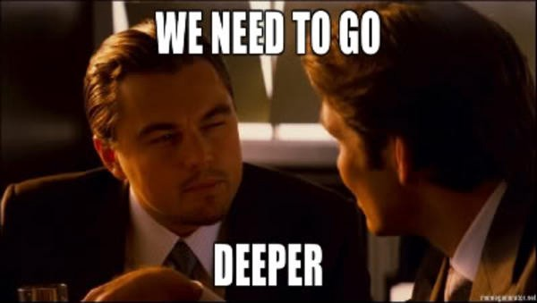
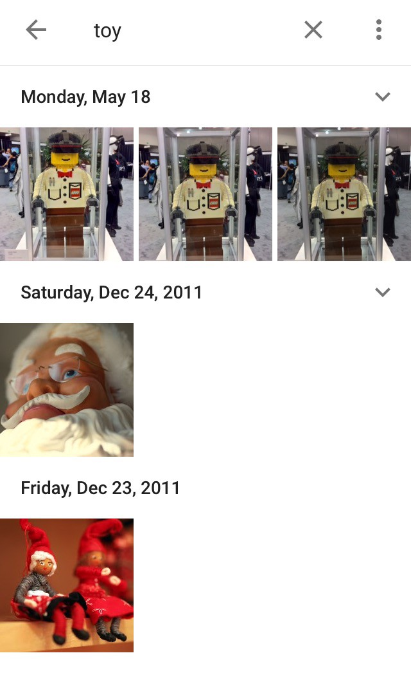

How Google’s New Photos App Can Tell Cats From Dogs

# How Google’s New Photos App Can Tell Cats From Dogs

## An exclusive look under the hood of the product that wants to be the world’s scrapbook

Google Photos product lead Dave Lieb and I are time traveling. He pinches out on his phone screen and then scrolls through tiled pictures, flying back through the ‘oughts, nineties and eighties in a second.

He clicks the search icon and types “ducklings.” Baby ducks fill the screen. Crisp, digital images give way to undersaturated scenes scanned in from film prints as he scrolls back in time.

“When I was a kid, I lived in Texas on this pond. My family would take duck eggs … and hatch the ducklings,” Lieb tells me. “If I go back here to the beginning of time, here’s me and my duckling.”

And there they were. Last week, Google [invited a powerful new mind](https://medium.com/backchannel/bradley-horowitz-says-that-google-photos-is-gmail-for-your-images-and-that-google-plus-is-not-dead-54be1d641526) into our lives: a searchable Photos app that puts the oomph of Google Image search behind our own private archives. Its secret is a new type of neural network — algorithms that can sort through vast amounts of information and learn to spot patterns and high-level concepts — that balances brawn with efficiency to recognize and sort images based on people, places, things and search terms.

“We’re at this perfect storm where an app like this needs to exist,” search software engineer Tom Duerig says. In 2015, everyone takes too many pictures. We live in the Time Hop era, when an app can delight us just by surfacing the snapshots that made it onto social media last year.

It’s time for something smarter, something that has been brewing for years as research inches forward on computer vision. Photos may look like an app, but it’s actually the latest drive in Google’s ongoing quest to apply artificial intelligence to search.

Every year, computer vision giants including Stanford and Google get together to run the [ImageNet large-scale visual recognition challenge](http://www.image-net.org/challenges/LSVRC/2014/), a competition seeking the best ways to detect objects in massive quantities of images. The contest is an excellent look into the state of the the field; in the 2014 competition, object detection and classification was twice as accurate as the previous year.

GoogLeNet, a Google researcher-dominated team that placed first in several categories in 2014, went on to [publish a paper](https://static.googleusercontent.com/media/research.google.com/en/us/pubs/archive/43022.pdf) that September describing a unique new neural network structure dubbed “Inception” because of its layered design.

Photos is the first major real-world project to make use of Inception. When you upload a picture to Photos, Google notes the date and location of the photo’s creation and feeds it through the neural network to get an estimate of its contents.

The Photos neural network is arranged in layers, with an input entering at the bottom and an output emerging at the top. One technique to build a smarter network is to add more layers. Inception has 22.

If the input is a picture of a cat (to borrow [from the biggest machine learning story of 2012](http://www.nytimes.com/2012/06/26/technology/in-a-big-network-of-computers-evidence-of-machine-learning.html), when a Google neural network learned the concept of a cat from 10 million YouTube video stills), then the first layer spots simple features such as lines or colors. The network then passes them up to the next layer, which might pick out eyes or ears. Each level gets more sophisticated, until the network detects and links enough indicators that it can conclude, “Yes, this is a cat.” The 22 layers are enough to tell the difference between, say, “wrestle” and “hug” — two abstract concepts with minute visual differences that might confuse a network with fewer layers. The app sometimes “cheats” by looking at place and time; for example, maybe the picture was taken on National Cat Day (October 29, if you were wondering).

Google could blast through 22 layers with the biggest, brawniest neural network it has, filtering for every color and shape and texture over dozens of layers to decide with near-100 percent certainty what is in an image. But it can get very close to that 100 percent mark and save a whole lot of storage space and computing power by being just a little bit clever — an attractive challenge considering Photos could categorize billions of images.

Google researchers partially credit “the famous ‘we need to go deeper’ internet meme” for the name of their neural network’s architecture.

The Photos neural network affordably packs in 22 layers by paring down the amount of information passed between layers. If it collects 10 lines that are slightly different colors of gray in the first layer, it may group them together into one chunk of information. Usually there is more and more data to handle as you move up in layers, but with Inception the amount stays flat.

In a world where the race is on to build the smartest neural network in existence, Inception is a play to ensure “they do not end up to be a purely academic curiosity, but could be put to real world use, even on large datasets, at a reasonable cost,” the Google researchers write in the paper. And what could be more real world than a photo app?

After the photos are all fed through the neural network, they sit there, waiting for you to call them up with a search. Type “cat” and you get cats. Type “Halloween” and you get a mix of pumpkins, costumes and possibly unrelated photos that happened to be taken on October 31.

When you think about it, an amazing leap has been made between a machine’s point of view and a person’s. While a neural network can look at 10 cat pictures and pick out a pattern among them, it can’t come up with the word for the animal on its own. Associating “cat” — a string of three letters — with clusters of pixels is a trained skill.

Here’s where Google Search makes an appearance. Google has spent the last 14 years linking images with words by trawling the web for pictures with nearby text. If the word “cat” is strongly linked to an image, the picture probably features a cat.

Using this humongous database of photos linked with terms, Google trained the Photos neural network to associate the word “cat” with strong cat indicators. The network learned that things called “cats” have pointy ears and vivid lines and dots on their faces. If a user types the word cat, the app knows what snapshots to surface.

Training is an ongoing process. While the basic version of Photos is free to use, anyone who downloads it becomes a virtual (unpaid) team member assisting in the improvement of the app. Users are invited to physically mark a search result as incorrect, but even passively deciding not to click on a photo in a search result improves the app by indicating the results probably weren’t very good.

“It’s not perfect, the same way that voice transcription five years ago was not perfect,” vice president of Streams, Photos, and Sharing Bradley Horowitz says. “The key to getting that last percentage which tips it over is really deploying at scale and getting the data that creates this virtuous cycle of getting better and better.”

Photos is starting from a strong place. The app can tell the difference between a Golden Retriever and a Yellow Lab. It often performs strongly with more abstract terms: search for “food,” and it surfaces everything from cheeseburgers to cocktails. It can pull up photos associated with holidays.

But its gaffes are revealing of its shortcomings. I tried searching for a Lego sculpture I saw at a recent virtual reality conference. “Legos” and “virtual reality” didn’t work, but the more abstract “toy” did. Neural networks are better at recognizing some things than others. If an object doesn’t have much texture or any strong lines, the network is more easily stumped. Aside from the yellow color, there aren’t many hints at all the Lego man is actually made of plastic blocks.

“Humans [identify an object] from the shape, from the outline of it and the way light plays off the curves,” Duerig says. “Computers aren’t good at that.” Yet.

Over time, Google will train the Photos neural network on the behaviors of more and more users, expanding the number and types of terms with which people can search. It will keep tweaking the network’s architecture to make it smarter without using more computing power.

There are more Photos features peeking over the horizon, though it’s not clear when, or even if, they will roll out to users. A paper [published by Google this year](https://research.google.com/pubs/pub43274.html) documents how to use artificial intelligence to automatically generate a caption for an image. [It is already impressive](https://medium.com/backchannel/google-search-will-be-your-next-brain-5207c26e4523) in its ability to output simple subject-verb-object sentences, but Duerig said the team is still improving the technology.

Last week was a step toward finding our photos. The next step is putting them to use, whether that may play out as images automatically captioned for Facebook sharing or Gmail knowing which photos to automatically attach when we type “childhood ducklings.”

Maybe it moves beyond photos into the Google Knowledge Graph, which is already offering up intelligence based on our searches, apps and email. Google Now can surface our travel reservations at exactly the right moment by crunching the contents of emails from Travelocity and Hotels.com. What if it could rely on the images in Google Photos to understand what type of car we have, and as a result direct us to the right repair shop or app?

“I’ve grown to depend on the Google Now service as a means of managing my travel itineraries because it’s one step ahead of me having to ask,” Horowitz says. “In the same way, if I thought we could return immense value to the users based on this data, I’m sure we would consider doing that.”

Follow Backchannel: [*Twitter*](https://twitter.com/backchnnl)* | *[*Facebook*](https://www.facebook.com/pages/Backchannel/1488568504730671)