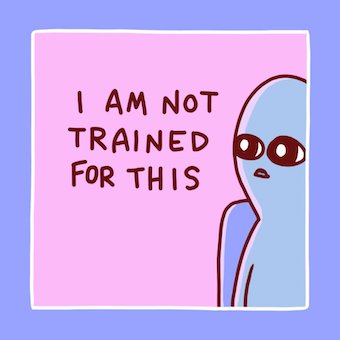
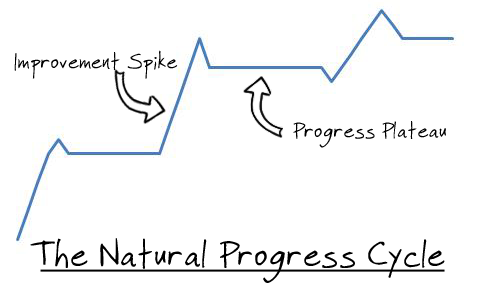

How I Did it - From Psych graduate to VP of Data Science at Lazada

# How I Did it - From Psych graduate to VP of Data Science at Lazada

 Tags: [ [career](https://eugeneyan.com/tag/career)  [datascience](https://eugeneyan.com/tag/datascience) ]

##    27 Feb 2020 · 10 min read

Many people are curious about how I got into the field of data science with a Psychology degree. They’re curious how I made the *first* step.

Then, they find out I was also VP of Data Science at Lazada and they’re interested in how that happened. (Spoiler alert: A lot hard work *and* some luck.)

In a world where almost every data science leader has a technical Ph.D. (or two), I’m unusual. A *statistical anomaly*. I guess this is why people are curious about my story. There’s perhaps also a bit of “underdog” dust in it.

Enough people (10+) have asked to write this down—it’s just more scalable. I’ve included some key anecdotes and also distilled some lessons at the end.

TL; DR: (i) self-learning, (ii) delivering value, and (iii) effective communication.

>

> As much as I try not to appear boastful, my intent is to share what I’ve learned and help others get into and be successful in this field. *> If it comes across as self-promotion to you, don't read further.*

### Before I got into data science

Having just graduated with my degree in Psychology and Organisation Behaviour, I was unsure of what to do next. I’m a Social Science graduate! I could do anything! Or I could do nothing.

I eventually got a role as an Investment Analyst for the government. I expected to use data to make better investment decisions. Which countries to invest in, which industries to focus on. However, it was mostly negotiation and legal work on Free Trade Agreements. I got bored.

Out of curiosity. I started taking online courses (Coursera and EdX are great!) Those early data courses very super interesting, and convinced me that I was made for something greater. Or at least different. I *had* to get a data-related job.

Luckily, IBM had a program to hire and train a cohort of mid-career professionals for data-related roles. It seemed like a long shot, but I decide to send in my resume anyway.

Surprisingly, I got invited for interviews. Some questions on statistics, SQL, R, most of which I had picked up through the online courses. Even more surprisingly, they gave me an offer.

The 33% pay cut was tough to swallow. But I was pretty bored (read: miserable) as an Investment Analyst after two years, so I accepted.

### My first step into the field

Day 1 was a shock. Of the 20 people hired, 18 had technical degrees, of which 10 were PhDs. The remaining two had a Psychology degree (me) and an economics degree. I was the **most non-technical** in the group.

*How I felt on the first day (from: https://www.nathanwpyle.art/)*

Why did IBM hire me? I’d like to think it was my charm, but my conscience says “no way!”. Thus, I offer three *more* rational reasons.

- I met the minimum technical bar (thanks to the free courses)

- My government experience was useful in my consultant role

- A bit of luck

The first year saw me working as a junior consultant, building supply chain dashboards, doing social media monitoring, etc.

In year two I was internally transferred to the workforce analytics team, working to forecast job demand and build a job recommendation engine to move people within the organization.

On the side, I continued self-learning. I picked up Python (love it) and took classes in machine learning. Spark, a shiny (pun intended) big data framework was emerging and provided free courses on EdX—I devoured these too.

### Serendipity

With my new-found skills in Python and machine learning, I was looking for an opportunity to practice. It was then I stumbled into my first Kaggle competition.

The [Otto Product Classification challenge](https://www.kaggle.com/c/otto-group-product-classification-challenge) had participants building machine learning models to classify 200k products into 9 categories. I took part and eventually teamed up with a fellow competitor towards the end. Our final submission was an ensemble of gradient boosted trees and neural networks that did well enough to rank in the top 3% of 3500+ teams. Not bad for a first attempt.

I thought Kaggle was the best thing since the iPhone. It was a great place to practice, learn from the best in the world, and get immediate feedback. I was excited to share my experience and learnings. So when a local [data science meet-up group](https://www.meetup.com/en-AU/DataScience-SG-Singapore/) invited me to share, I gamely agreed.

80+ people showed up that [Saturday afternoon](https://eugeneyan.com/2016/06/20/dssg-kaggle-top-3-percent). Mind-blown. Who are these people and don’t they have better things to do **on a Saturday**?! They were generous with their attention and feedback, and I learned as much from them as taking part in the competition.

Unbeknownst to me, *Serendipity* also attended the meet-up. And she brought along a friend in the audience.

>
> “You make your own luck” - Ernest Hemingway

### Opportunity comes knocking

[Lazada](https://en.wikipedia.org/wiki/Lazada_Group) was a start-up launched in 2012, backed by Germany’s Rocket Internet. It was trying to bring the convenience of e-commerce to Southeast Asia’s population. Achieving similar success to Amazon and Alibaba would have been nice too. (Acquired by Alibaba in 2016.)

They were struggling with accurate product categorization and had *heard about my sharing* on the Kaggle competition.

I was invited to Lazada for a “chat”. It started with a quick run-through of my meet-up presentation to the Head of Data Science (John Berns) and his boss, the CIO (Klemen Drole). The rest of the team (three people, *including one person who attended my meetup*) were also kind enough to take me out for lunch.

>

> I left wondering if I had been through an interview, and secretly hoped I did well.

They called to offer a position the next day.

I was hesitant to leave a venerable, branded company like IBM (in hindsight, this is hilarious). Lazada was an unknown start-up with a data team of three people. My family and closest friends thought it was risky. However, deep down, I knew I would [regret](https://www.inc.com/jessica-stillman/jeff-bezos-this-is-how-to-avoid-regret.html) not accepting the offer.

### Boarding the Lazada rocket ship

Joining Lazada was one of my best decisions ever.

*If you're offered a seat on a rocket, don't ask what seat. Just get on*

I got the opportunity to work with talented data scientists and engineers. We solved challenging problems and delivered a ton of value to consumers in Southeast Asia—very fulfilling.

My first project was (naturally) building a product classifier, similar to the Kaggle competition, with a *few small differences*.

Firstly, we had a couple hundred **million** products from **thousands** of categories. Second, it had to be in the form of an API for internal users and external sellers, with strict **latency requirements**. Third, it required **continuous re-training and validation** to ensure high accuracy.

Yeap, *just* like Kaggle.
>

> The learning curve was steep. Pushed me 2x beyond my existing abilities. Exhilarating.

Thankfully, awesome data engineers taught me how to scale and make systems more robust. With a bit of (read: 10+ hours weekly) self-tinkering on weekends, I delivered in a couple of months.

This **earned trust** from the team, my boss, and our stakeholders.

### Volunteering is (un)lucky

As I wrapped up my product classifier, two senior data scientists were working on email recommendations. However, they had a cold-start problem. A big portion of customers didn’t have enough activity to provide meaningful recommendations.

I volunteered to help by **ranking products** based on historical performance (e.g., clicks, purchases) and metadata (e.g., price, ratings, etc.). The top products would be recommended to these cold-start customers. Simple and manageable.

We presented our plan to senior management and it went well. Too well.
>

> “That’s a great idea! Why not extend product ranking to our entire website?, they asked.”

*Gulp.*

My early efforts using Python and pandas were futile. Processing a single day’s data took 2 hours—a month’s data would take 2.5 days. “Welcome to big data”, a data engineer chuckled.

Thankfully, I had picked up Spark from online courses (thank you DataBricks and EdX). It provided a good foundation and helped me ramp up faster than most.

After a couple of months, it was ready for AB testing. I started the AB test, casually mentioned it to my boss over drinks (**big mistake** on hindsight), and slept like a baby the next couple of days.

### How I lost millions on my first AB test

*Nope, I wasn't as happy as this guy looks*

>

> “What’s this AB test you launched and why did it lose millions in revenue last week?”, my boss asked over Slack.

I found out later he was getting hammered at a meeting with senior management.

Panicked, I starting triaging across the AB testing tool, Airflow, validation metrics, etc. Within a couple of hours, I came up with a few hypotheses and how to validate them, and a plan for the next iteration of experiments.

After incorporating feedback, I started working on it day and night. In about two weeks, we launched another AB test. This time, I did not sleep as peacefully.

Thankfully, we achieved positive results over the next rounds of AB testing. Improving the timeliness of data (e.g., behavioral logs, transaction data) and simplifying the model to reduce overfitting did the trick.

>

> The failure and embarrassment was very public. But so was the recovery and success.

This helped **improve the data science team’s standing within the organization**.

### Plateauing and a new focus

After a few projects, things were getting less scary and more comfortable. Easy even. *This meant my growth was slowing.*

*Progress is not linear, but a series of spikes and plateaus*

I tried various ways to figure out “what” and “how” to continue learning. This included reaching out to experts I admired. They were generally 2 - 3 levels above me. Then, I sent a casual email offering to buy them coffee, or politely requesting a Skype chat, indicating my willingness to learn from their experience. Unexpectedly, everyone I reached out to replied positively.

I knew it was important to be good at programming, math, statistics, machine learning, business, etc. *“Which should I prioritize?”*, I asked.

>

> “Those skills are important. But you’re missing the most essential (and transferable) skill—communication”, they responded.

You’re joking, right? Talking is the most important? (How naive I was back then.) Nonetheless, I decided to take their advice and deliberately focused on improving my communication.

At meetings with business stakeholders, I avoided data science jargon such as “area-under-curve (AUC)”, “recall”, “mean squared error”. Instead, I used their terms: “instances of fraud identified and savings”, “increase in conversion and revenue”, “reduction in late deliveries and complaints”.

I needed practice too. The data team wanted to launch an internal newsletter to spread awareness—I volunteered. Someone had to visit overseas markets to do a data science roadshow—I volunteered. We wanted to present our work at conferences—[I volunteered](https://eugeneyan.com/2016/12/09/shared-about-my-work-in-lazada-at-strata-hadoop-singapore-2016/).

Practice, practice, practice.

### Metamorphosis

Another year flew by. I focused on delivering small but impactful projects and improving my communication.

>
> Around that time, I was **> promoted twice in a year**> .

The first—to senior data scientist—was probably some time after the product ranking success and a few other wins.

Then, I moved up to VP of Data Science, leading the team of 12+ data scientists.

*It takes a while, but eventually you'll level up*

### How did I achieve this?

**Continuous self-learning** played a big role, especially in *getting into the field*. In almost all my roles and projects, I had to learn on my own—outside my job scope—to be barely qualified. This opened up increasingly challenging opportunities.

>

> But once in the field, there were people with better educational qualifications and more experience—why me?

It can’t be *just* luck. I couldn’t figure it out and decided to ask my boss and other senior leaders. Here’s what I gathered:

I was hungry and **got shit done**. The measurable value I created was 3x that of an average data scientist. This was how they justified it to senior leaders and HR.

In addition, **non-technical** stakeholders could **communicate** with me. Often, after stakeholders had a meeting with a data scientist, they (stakeholders) left not knowing what the data scientist was saying, or where the project was headed. (Sad, but true).

I was promoted to be a role model and to mentor the team to deliver and communicate better.

### That was a long read—could you summarise, please?

Okay, so here’s what I did:

- Self-learning and practice, which led to…

- My first data role, and more learning, which led to…

- Taking part in a Kaggle competition, which led to…

- Volunteering to share at a meet-up, which led to…

- Being invited for a chat and lunch, which led to…

- Joining a startup, learning lots, and mentors, which led to…

- Focusing on communication, which led to…

- Greater effectiveness and growth

### Parting words

I started this post to share my journey. The aim was to clear up the misconception that a technical degree was required to enter the field, much less achieve success in it. Hopefully, you’re convinced.

The post ended with a reflection on three keys for success as a data scientist—based on my experience—namely: (i) continuous self-learning, (ii) get shit done, and (iii) emphatic communication.

What else have you noticed as key to being an effective data scientist? Share in the comments below.

* * *

*P.S., Want to provide feedback on my content/writing to help me get better?

Reach out on [Twitter!](https://twitter.com/eugeneyan) We can help each other improve.*

[(L)](https://eugeneyan.substack.com/)

# [eugeneyan’s newsletter](https://eugeneyan.substack.com/)

Subscribe to follow what I share on data science & tech

[(L)](https://substack.com/?utm_source=embed&utm_content=eugeneyan)

Let me know what you think? Upvote if you like the content!
27 Responses

Upvote

Funny

Love

Surprised

Sad

- [6 comments]()
- [**eugeneyan**](https://disqus.com/home/forums/eugeneyan/)
- [** Disqus' Privacy Policy](https://help.disqus.com/customer/portal/articles/466259-privacy-policy)
- [Marc Cohen](https://disqus.com/embed/comments/?base=default&f=eugeneyan&t_u=https%3A%2F%2Feugeneyan.com%2F2020%2F02%2F28%2Fpsych-grad-to-vp-data-science&t_d=How%20I%20Did%20it%20-%20From%20Psych%20graduate%20to%20VP%20of%20Data%20Science%20at%20Lazada&t_t=How%20I%20Did%20it%20-%20From%20Psych%20graduate%20to%20VP%20of%20Data%20Science%20at%20Lazada&s_o=default#)
- [](https://disqus.com/home/inbox/)
- [ Recommend  3](https://disqus.com/embed/comments/?base=default&f=eugeneyan&t_u=https%3A%2F%2Feugeneyan.com%2F2020%2F02%2F28%2Fpsych-grad-to-vp-data-science&t_d=How%20I%20Did%20it%20-%20From%20Psych%20graduate%20to%20VP%20of%20Data%20Science%20at%20Lazada&t_t=How%20I%20Did%20it%20-%20From%20Psych%20graduate%20to%20VP%20of%20Data%20Science%20at%20Lazada&s_o=default#)
- tTweetfShare
- [Sort by Best](https://disqus.com/embed/comments/?base=default&f=eugeneyan&t_u=https%3A%2F%2Feugeneyan.com%2F2020%2F02%2F28%2Fpsych-grad-to-vp-data-science&t_d=How%20I%20Did%20it%20-%20From%20Psych%20graduate%20to%20VP%20of%20Data%20Science%20at%20Lazada&t_t=How%20I%20Did%20it%20-%20From%20Psych%20graduate%20to%20VP%20of%20Data%20Science%20at%20Lazada&s_o=default#)

Join the discussion…

[(L)](https://disqus.com/embed/comments/?base=default&f=eugeneyan&t_u=https%3A%2F%2Feugeneyan.com%2F2020%2F02%2F28%2Fpsych-grad-to-vp-data-science&t_d=How%20I%20Did%20it%20-%20From%20Psych%20graduate%20to%20VP%20of%20Data%20Science%20at%20Lazada&t_t=How%20I%20Did%20it%20-%20From%20Psych%20graduate%20to%20VP%20of%20Data%20Science%20at%20Lazada&s_o=default#)

-

    - [−](https://disqus.com/embed/comments/?base=default&f=eugeneyan&t_u=https%3A%2F%2Feugeneyan.com%2F2020%2F02%2F28%2Fpsych-grad-to-vp-data-science&t_d=How%20I%20Did%20it%20-%20From%20Psych%20graduate%20to%20VP%20of%20Data%20Science%20at%20Lazada&t_t=How%20I%20Did%20it%20-%20From%20Psych%20graduate%20to%20VP%20of%20Data%20Science%20at%20Lazada&s_o=default#)
    - [****](https://disqus.com/embed/comments/?base=default&f=eugeneyan&t_u=https%3A%2F%2Feugeneyan.com%2F2020%2F02%2F28%2Fpsych-grad-to-vp-data-science&t_d=How%20I%20Did%20it%20-%20From%20Psych%20graduate%20to%20VP%20of%20Data%20Science%20at%20Lazada&t_t=How%20I%20Did%20it%20-%20From%20Psych%20graduate%20to%20VP%20of%20Data%20Science%20at%20Lazada&s_o=default#)

Stephan  •  [5 days ago](https://eugeneyan.com/2020/02/28/psych-grad-to-vp-data-science#comment-4815136091)

Thanks for sharing your story. Very inspiring!

-

    - [−](https://disqus.com/embed/comments/?base=default&f=eugeneyan&t_u=https%3A%2F%2Feugeneyan.com%2F2020%2F02%2F28%2Fpsych-grad-to-vp-data-science&t_d=How%20I%20Did%20it%20-%20From%20Psych%20graduate%20to%20VP%20of%20Data%20Science%20at%20Lazada&t_t=How%20I%20Did%20it%20-%20From%20Psych%20graduate%20to%20VP%20of%20Data%20Science%20at%20Lazada&s_o=default#)
    - [****](https://disqus.com/embed/comments/?base=default&f=eugeneyan&t_u=https%3A%2F%2Feugeneyan.com%2F2020%2F02%2F28%2Fpsych-grad-to-vp-data-science&t_d=How%20I%20Did%20it%20-%20From%20Psych%20graduate%20to%20VP%20of%20Data%20Science%20at%20Lazada&t_t=How%20I%20Did%20it%20-%20From%20Psych%20graduate%20to%20VP%20of%20Data%20Science%20at%20Lazada&s_o=default#)

 [Yugo Gautomo](https://disqus.com/by/ygautomo/)    •  [3 days ago](https://eugeneyan.com/2020/02/28/psych-grad-to-vp-data-science#comment-4817663736)

Great story. Very inspiring!

-

    - [−](https://disqus.com/embed/comments/?base=default&f=eugeneyan&t_u=https%3A%2F%2Feugeneyan.com%2F2020%2F02%2F28%2Fpsych-grad-to-vp-data-science&t_d=How%20I%20Did%20it%20-%20From%20Psych%20graduate%20to%20VP%20of%20Data%20Science%20at%20Lazada&t_t=How%20I%20Did%20it%20-%20From%20Psych%20graduate%20to%20VP%20of%20Data%20Science%20at%20Lazada&s_o=default#)
    - [****](https://disqus.com/embed/comments/?base=default&f=eugeneyan&t_u=https%3A%2F%2Feugeneyan.com%2F2020%2F02%2F28%2Fpsych-grad-to-vp-data-science&t_d=How%20I%20Did%20it%20-%20From%20Psych%20graduate%20to%20VP%20of%20Data%20Science%20at%20Lazada&t_t=How%20I%20Did%20it%20-%20From%20Psych%20graduate%20to%20VP%20of%20Data%20Science%20at%20Lazada&s_o=default#)

 [Yash Gadodia](https://disqus.com/by/yashgadodia/)    •  [3 days ago](https://eugeneyan.com/2020/02/28/psych-grad-to-vp-data-science#comment-4817167281)

Very well written, inspiring story

-

    - [−](https://disqus.com/embed/comments/?base=default&f=eugeneyan&t_u=https%3A%2F%2Feugeneyan.com%2F2020%2F02%2F28%2Fpsych-grad-to-vp-data-science&t_d=How%20I%20Did%20it%20-%20From%20Psych%20graduate%20to%20VP%20of%20Data%20Science%20at%20Lazada&t_t=How%20I%20Did%20it%20-%20From%20Psych%20graduate%20to%20VP%20of%20Data%20Science%20at%20Lazada&s_o=default#)
    - [****](https://disqus.com/embed/comments/?base=default&f=eugeneyan&t_u=https%3A%2F%2Feugeneyan.com%2F2020%2F02%2F28%2Fpsych-grad-to-vp-data-science&t_d=How%20I%20Did%20it%20-%20From%20Psych%20graduate%20to%20VP%20of%20Data%20Science%20at%20Lazada&t_t=How%20I%20Did%20it%20-%20From%20Psych%20graduate%20to%20VP%20of%20Data%20Science%20at%20Lazada&s_o=default#)

 [gabrielrdz](https://disqus.com/by/gabrielrdz/)    •  [3 days ago](https://eugeneyan.com/2020/02/28/psych-grad-to-vp-data-science#comment-4817099708)

Congratulations on the career switch and very glad to hear about your success!

-

    - [−](https://disqus.com/embed/comments/?base=default&f=eugeneyan&t_u=https%3A%2F%2Feugeneyan.com%2F2020%2F02%2F28%2Fpsych-grad-to-vp-data-science&t_d=How%20I%20Did%20it%20-%20From%20Psych%20graduate%20to%20VP%20of%20Data%20Science%20at%20Lazada&t_t=How%20I%20Did%20it%20-%20From%20Psych%20graduate%20to%20VP%20of%20Data%20Science%20at%20Lazada&s_o=default#)
    - [****](https://disqus.com/embed/comments/?base=default&f=eugeneyan&t_u=https%3A%2F%2Feugeneyan.com%2F2020%2F02%2F28%2Fpsych-grad-to-vp-data-science&t_d=How%20I%20Did%20it%20-%20From%20Psych%20graduate%20to%20VP%20of%20Data%20Science%20at%20Lazada&t_t=How%20I%20Did%20it%20-%20From%20Psych%20graduate%20to%20VP%20of%20Data%20Science%20at%20Lazada&s_o=default#)

 [timtom](https://disqus.com/by/disqus_04aGi9yX3x/)    •  [3 days ago](https://eugeneyan.com/2020/02/28/psych-grad-to-vp-data-science#comment-4816791995)

I'm genuinely curious if you take Ritalin or Adderal or similar as an adult? I'm always curious about people developing the motivation to study hard after school, and I'm curious if they assist with medication

    -

        - [−](https://disqus.com/embed/comments/?base=default&f=eugeneyan&t_u=https%3A%2F%2Feugeneyan.com%2F2020%2F02%2F28%2Fpsych-grad-to-vp-data-science&t_d=How%20I%20Did%20it%20-%20From%20Psych%20graduate%20to%20VP%20of%20Data%20Science%20at%20Lazada&t_t=How%20I%20Did%20it%20-%20From%20Psych%20graduate%20to%20VP%20of%20Data%20Science%20at%20Lazada&s_o=default#)
        - [****](https://disqus.com/embed/comments/?base=default&f=eugeneyan&t_u=https%3A%2F%2Feugeneyan.com%2F2020%2F02%2F28%2Fpsych-grad-to-vp-data-science&t_d=How%20I%20Did%20it%20-%20From%20Psych%20graduate%20to%20VP%20of%20Data%20Science%20at%20Lazada&t_t=How%20I%20Did%20it%20-%20From%20Psych%20graduate%20to%20VP%20of%20Data%20Science%20at%20Lazada&s_o=default#)

 [eugeneyan](https://disqus.com/by/eugeneyan/)  Mod  [*>* timtom](https://eugeneyan.com/2020/02/28/psych-grad-to-vp-data-science#comment-4816791995)  •  [3 days ago](https://eugeneyan.com/2020/02/28/psych-grad-to-vp-data-science#comment-4816878436)

I didn't think that medication would be helpful and thus didn't take it.

What I have is a chronic case of imposter syndrome though. And understanding family members who give me the time and space to focus.

- [Powered by Disqus](https://disqus.com/)
- [*✉*Subscribe*✔*](https://disqus.com/embed/comments/?base=default&f=eugeneyan&t_u=https%3A%2F%2Feugeneyan.com%2F2020%2F02%2F28%2Fpsych-grad-to-vp-data-science&t_d=How%20I%20Did%20it%20-%20From%20Psych%20graduate%20to%20VP%20of%20Data%20Science%20at%20Lazada&t_t=How%20I%20Did%20it%20-%20From%20Psych%20graduate%20to%20VP%20of%20Data%20Science%20at%20Lazada&s_o=default#)
- [*d*Add Disqus to your site](https://publishers.disqus.com/engage?utm_source=eugeneyan&utm_medium=Disqus-Footer)
- [*⚠*Do Not Sell My Data](https://disqus.com/data-sharing-settings/)