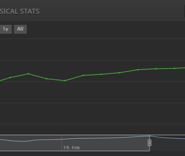

How I Finally Hit 2000 on Lichess, and Improved my Chess Rating by 200 Points in 16 Days - Trapeze

How I Finally Hit 2000 on Lichess, and Improved my Chess Rating by 200 Points in 16 Days - Trapeze

https://www.trapezemobile.com/2019/01/10/how-i-finally-hit-2000-on-lichess-and-improved-my-chess-rating-by-200-points-in-16-days/

Progress graph [1]: This guide won’t teach you any easy tricks for fast rating jumps. Improving at chess requires immense mental focus. I won many games just because I wanted a win more and thought harder and longer than my opponents – I could tell based on clock usage. This guide will teach you where… Read More »