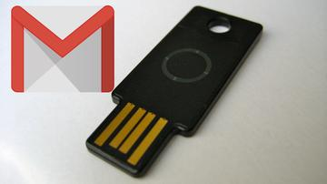
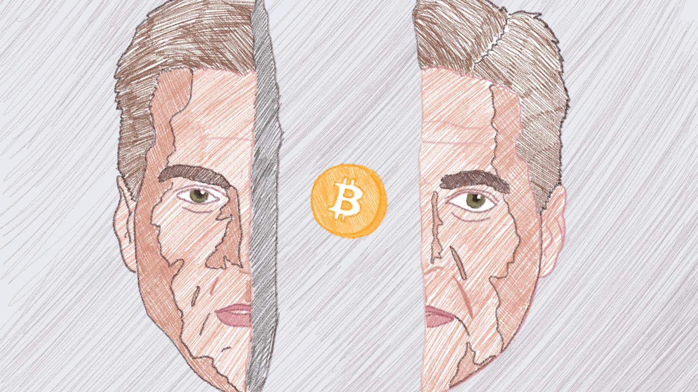
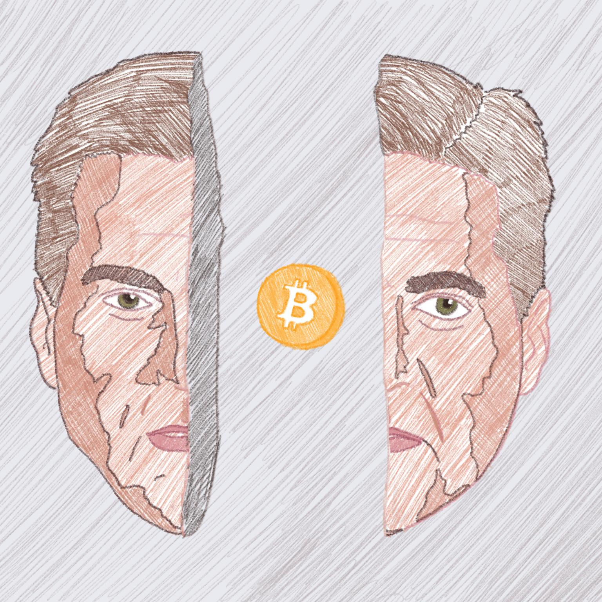

How I Socially Engineer Myself Into High Security Facilities

Advertisement

More From[Internet Insecurity](https://motherboard.vice.com/en_us/topic/internet-insecurity)

- [   Gmail vs ProtonMail: Which is More Secure?](https://motherboard.vice.com/en_us/article/pa3ye7/protonmail-gmail-security-comparison)
- [   Google Just Made Gmail the Most Secure Email Provider on the Planet](https://motherboard.vice.com/en_us/article/kz74ym/google-gmail-advanced-protection-security-keys-yubikey)
- [   There’s ‘No Excuse’ for the T-Mobile Bug That Helped Hackers Steal Accounts](https://motherboard.vice.com/en_us/article/7xkyyz/t-mobile-customer-data-bug-hackers-no-excuse)
- [   T-Mobile Website Allowed Hackers to Access Your Account Data With Just Your Phone Number](https://motherboard.vice.com/en_us/article/wjx3e4/t-mobile-website-allowed-hackers-to-access-your-account-data-with-just-your-phone-number)

How I Socially Engineer Myself Into High Security Facilities

### A pentester shares a story that shows how social engineering can get you anywhere.

- [[motherboard-tombstone.svg](../_resources/74c22bbfce3a24986248169c8f7a1cbc.bin)SHARE]()
- [[200w.webp](../_resources/05263608ee3395a946eca7b32b971334.bin)TWEET]()

 [Sophie Daniel](https://motherboard.vice.com/en_us/contributor/sophie-daniel)
Oct 20 2017, 4:00pm

Image: [Zephyr_p](https://www.shutterstock.com/g/zephyr_p)/Shutterstock

* Sophie is a physical penetration tester and information security consultant. She specializes in social engineering security assessments including physical, voice (vishing) and text (phishing). She consults in remediation and prevention of security incidents through creation of policy and procedures, as well as customized training for your individual office culture. Prior to working in infosec, Sophie was a journalist, photographer, and a mom.*

Advertisement

* * *

Hello! My name is Sophie and I break into buildings. I get paid to think like a criminal.

Organizations hire me to evaluate their security, which I do by seeing if I can bypass it. During tests I get to do some lockpicking, climb over walls or hop barbed wire fences. I get to go dumpster diving and play with all sorts of cool gadgets that Q would be proud of.

But usually, I use what is called [social engineering](https://motherboard.vice.com/en_us/article/mg79v4/hacking-glossary) to convince the employees to let me in. Sometimes I use email or phone calls to pretend to be someone I am not. Most often I get to approach people in-person and give them the confidence to let me in.

My frequently asked questions include:
What break-in are you most proud of?
What have you done for a test that you were the most ashamed of?

What follows is the answer to both of these questions.

A few months ago, a client had hired me to test two of their facilities. A manufacturing plant, plus data center and office building nearby.

First step: open source intelligence, or OSINT. I look at maps, satellite images, study what I can of their delivery and supply schedules, and so on.

The manufacturing facility looked like a prison. No windows, heavy iron gates, no landscaping. Generally a monstrosity of architecture.

This facility had armed guards, badge readers, biometric security controls and turnstiles at every entrance.

I remember thinking, "It's got to be hell to work in there. I wonder if I can use that…"

 [  [200w.webp](:/5ca7a2706a2f98b5354cb8c58aca8d5b) ''](https://giphy.com/gifs/ZikyVyLF7aEaQ?utm_source=iframe&utm_medium=embed&utm_campaign=Embeds&utm_term=https%3A%2F%2Fmotherboard.vice.com%2Fen_us%2Farticle%2Fqv34zb%2Fhow-i-socially-engineer-myself-into-high-security-facilities)  [(L)](https://giphy.com/?utm_source=iframe&utm_medium=embed&utm_campaign=Embeds&utm_term=https%3A%2F%2Fmotherboard.vice.com%2Fen_us%2Farticle%2Fqv34zb%2Fhow-i-socially-engineer-myself-into-high-security-facilities)


Share
 

One thing was for sure… The chances of tailgating (following behind an employee with valid credentials) into this building were next to non-existent.

I was going to have to get down and dirty with my social engineering.

First stop: LinkedIn. Your LinkedIn is my best friend. The more information you have on your LinkedIn, the more options I have.

I have several fake LinkedIn profiles that you are probably connected to.

 [ ''](https://giphy.com/gifs/gotham-fox-xTiTnx9q0JJHeMbTJm?utm_source=iframe&utm_medium=embed&utm_campaign=Embeds&utm_term=https%3A%2F%2Fmotherboard.vice.com%2Fen_us%2Farticle%2Fqv34zb%2Fhow-i-socially-engineer-myself-into-high-security-facilities)  [(L)](https://giphy.com/?utm_source=iframe&utm_medium=embed&utm_campaign=Embeds&utm_term=https%3A%2F%2Fmotherboard.vice.com%2Fen_us%2Farticle%2Fqv34zb%2Fhow-i-socially-engineer-myself-into-high-security-facilities)

 [  Gotham](https://giphy.com/gotham?utm_source=iframe&utm_medium=embed&utm_campaign=Embeds&utm_term=https%3A%2F%2Fmotherboard.vice.com%2Fen_us%2Farticle%2Fqv34zb%2Fhow-i-socially-engineer-myself-into-high-security-facilities)


Share
 

I scour profiles of employees who work at these facilities, and cross-reference them to other social media sites. And I find a lovely young woman who I'm going to call Mary.

Mary was a brand-new hire working as an assistant at the manufacturing facility. Mary had a public Facebook account too.

On Mary's public Facebook account, she documented all of her family's adventures.

Side note: Now I know where Mary went to high school, her mother's maiden name, the names of her pets, etc.

Answers to those "security questions" you use to reset your passwords are very easy to find if you aren't careful with that information.

 [  [200w.webp](../_resources/6e0f33c542f5186457c7964f09ab45fc.webp) ''](https://giphy.com/gifs/poker-gambling-card-game-xT9DPlAUKTl1GeZjC8?utm_source=iframe&utm_medium=embed&utm_campaign=Embeds&utm_term=https%3A%2F%2Fmotherboard.vice.com%2Fen_us%2Farticle%2Fqv34zb%2Fhow-i-socially-engineer-myself-into-high-security-facilities%3Futm_source%3Dvicefbus)  [(L)](https://giphy.com/?utm_source=iframe&utm_medium=embed&utm_campaign=Embeds&utm_term=https%3A%2F%2Fmotherboard.vice.com%2Fen_us%2Farticle%2Fqv34zb%2Fhow-i-socially-engineer-myself-into-high-security-facilities%3Futm_source%3Dvicefbus)


Share
 

Not to mention that now I know where Mary works, where her kids go to school, where they vacation…I could go on. Scary stuff.

This is not an advanced investigation. I'm not a private investigator and I don't have the resources of the NSA. But I can do a lot of damage with simple methods.

Most notably to me, there were photos Mary posted of her time volunteering with a certain maternity support center.

Her passion for children and caring new moms was very plain. So of course, I took advantage of it.

 [  [200w.webp](../_resources/62acf58daf0ddc941f86f43274bb3041.webp) ''](https://giphy.com/gifs/the-office-idk-shrug-jlVwTqRLdq7ew?utm_source=iframe&utm_medium=embed&utm_campaign=Embeds&utm_term=https%3A%2F%2Fmotherboard.vice.com%2Fen_us%2Farticle%2Fqv34zb%2Fhow-i-socially-engineer-myself-into-high-security-facilities)  [(L)](https://giphy.com/?utm_source=iframe&utm_medium=embed&utm_campaign=Embeds&utm_term=https%3A%2F%2Fmotherboard.vice.com%2Fen_us%2Farticle%2Fqv34zb%2Fhow-i-socially-engineer-myself-into-high-security-facilities)


Share
 

For this assessment I played two roles. For the first, I spoofed my phone number to make it look like it was coming from the company's headquarters.

I called the front desk of the manufacturing facility and was transferred to Mary. "Hi Mary!" I said, "My name is Barbara."

"I am a project coordinator with facilities management. We are renovating a few of our facilities. We are sending an interior designer out to you tomorrow so she can put together proposals to update your space!"

 [  [200w.webp](../_resources/57276039e01e3ee266c87e3ec84d2b67.webp) ''](https://giphy.com/gifs/disney-classic-cinderella-walt-disney-pictures-RLVHPJJv7jY1q?utm_source=iframe&utm_medium=embed&utm_campaign=Embeds&utm_term=https%3A%2F%2Fmotherboard.vice.com%2Fen_us%2Farticle%2Fqv34zb%2Fhow-i-socially-engineer-myself-into-high-security-facilities)  [(L)](https://giphy.com/?utm_source=iframe&utm_medium=embed&utm_campaign=Embeds&utm_term=https%3A%2F%2Fmotherboard.vice.com%2Fen_us%2Farticle%2Fqv34zb%2Fhow-i-socially-engineer-myself-into-high-security-facilities)

 [  Disney](https://giphy.com/disney?utm_source=iframe&utm_medium=embed&utm_campaign=Embeds&utm_term=https%3A%2F%2Fmotherboard.vice.com%2Fen_us%2Farticle%2Fqv34zb%2Fhow-i-socially-engineer-myself-into-high-security-facilities)


Share
 

Mary replied, "Well that's great! But why the short notice?" I could feel her getting suspicious, so I pulled out my trump card…

*Sigh* "Well Mary… You really should have heard from me sooner. I've just been so overloaded at work…I feel like I can't catch up, and to top it off the baby is due in 6 weeks. If my boss finds out I messed this up he's going to flip."

I was really getting into this, voice shaking. (Yes, I know, I'm a terrible human being.)

She cut me off, "Oh hunny, hunny it's ok. We will work this out! Tell me about the baby! Is it your first? Boy or girl?!"

Our Mary was committed at this point. Not because she is stupid, but because she is a good person. She wanted to help me.

We talked babies and birth plans for a while (never pick a pretext you can't speak about at length.)

Mary took down the name of the "designer" who was coming by the next day and we said our goodbyes. Mary could have saved her company a lot of heartache by simply verifying that I was who I claimed to be. (Just to be clear here, I would never give out Mary's real identity. I'm not totally heartless. This could have happened to anyone. She has not been fired.)

I showed up the next day as "Claire" with a fictional architecture firm that I had made business cards and a website for. My alter-ego Barb had done most of the leg work for me. When I arrived, Mary and her boss were waiting for me with smiles. I shook hands all around and handed them the business card I printed out the night before. I was given a visitor badge and the red carpet was rolled out.

I gained rapport with the staff there by asking them to tell me what they wanted in an office space. They were so excited. I might have claimed to be on the team that put together the Google offices…(Yes, I am HORRIBLE. This is my inner demon child.)

"You want a standing desk? New chairs over here?! Ergonomic keyboards for everyone! Let's look at swatches!"

We became best buds. I was given complete and unaccompanied access to the facility where I stayed for several hours.

I gained network access and stole several thousands of dollars in physical primitives by picking my way through cheap locks (credit to [Deviant Ollam](https://twitter.com/deviantollam) for the rad lockpicking animations.)

 [  [200w.webp](../_resources/82c5ad9798c8701fc82ed6ea41870292.webp) ''](https://giphy.com/gifs/locks-how-stuff-works-to-pick-a-lock-qmvlUjW01xCyA?utm_source=iframe&utm_medium=embed&utm_campaign=Embeds&utm_term=https%3A%2F%2Fmotherboard.vice.com%2Fen_us%2Farticle%2Fqv34zb%2Fhow-i-socially-engineer-myself-into-high-security-facilities)  [(L)](https://giphy.com/?utm_source=iframe&utm_medium=embed&utm_campaign=Embeds&utm_term=https%3A%2F%2Fmotherboard.vice.com%2Fen_us%2Farticle%2Fqv34zb%2Fhow-i-socially-engineer-myself-into-high-security-facilities)


Share
 

This client had been pretty confident that I wouldn't get into either facility, much less be able to hit both in a short time span. So the timeline was left to my discretion, but it was assumed that I would need to fly to the area twice.

I didn't see the need in burdening them with two round-trip expenses.

 [  [close-navigation-menu-dark.svg](../_resources/18f2b58ac0467ff110496562b32d701c.webp) ''](https://giphy.com/gifs/smile-creepy-sR91D133W02D6?utm_source=iframe&utm_medium=embed&utm_campaign=Embeds&utm_term=https%3A%2F%2Fmotherboard.vice.com%2Fen_us%2Farticle%2Fqv34zb%2Fhow-i-socially-engineer-myself-into-high-security-facilities)  [(L)](https://giphy.com/?utm_source=iframe&utm_medium=embed&utm_campaign=Embeds&utm_term=https%3A%2F%2Fmotherboard.vice.com%2Fen_us%2Farticle%2Fqv34zb%2Fhow-i-socially-engineer-myself-into-high-security-facilities)


Share
 

I went back to Mary's office and said, "Well I think I have what I need from here. How do I get to the office center?"

She looked at her watch and said, "It's almost lunch time. I'll take you there!" A whole group of us piled into the parking lot, and they took me to a nearby taco shop. That's right. My Marks took me to get tacos… I love my job.

After lunch they drove me to the offices and a few of them came in with me to show me around.

I took FOREVER looking around this office space, and eventually they said their goodbyes because they had to go back to work. They had a strict policy of escorting visitors. But I had been seen walking around with trusted insiders so no one questioned me.

I was free to take my time. I made myself at home. My main objective at this site was to weasel my way into private corner offices.

When I accomplished my goals, I tracked down my point of contact's office. This is the man who hired me in the first place. This is the best part of every job.

 [  [200w.webp](../_resources/ee762a38a3859aee7f990ffe10619825.webp) ''](https://giphy.com/gifs/reaction-grass-peep-GCjIE9C9Eb9V6?utm_source=iframe&utm_medium=embed&utm_campaign=Embeds&utm_term=)  [(L)](https://giphy.com/?utm_source=iframe&utm_medium=embed&utm_campaign=Embeds&utm_term=)


Share
 

Steve was there, hard at work when I disturbed his groove by knocking on the door. He glanced up, "Hi there, can I help you?"

I smiled. "Hi Steve! I'm Sophie from Sincerely Security. It's nice to meet you in-person!"

I will never forget the look on his face… Pure gold. "Who?.... Wait, what? How? How did you get in here?!"

 [  [twitter.svg](../_resources/838a61a56d20dbeeaf0cf0bc9be0392a.webp) ''](https://giphy.com/gifs/lol-oh-fck-h56b7ZOGJngsw?utm_source=iframe&utm_medium=embed&utm_campaign=Embeds&utm_term=https%3A%2F%2Fmotherboard.vice.com%2Fen_us%2Farticle%2Fqv34zb%2Fhow-i-socially-engineer-myself-into-high-security-facilities)  [(L)](https://giphy.com/?utm_source=iframe&utm_medium=embed&utm_campaign=Embeds&utm_term=https%3A%2F%2Fmotherboard.vice.com%2Fen_us%2Farticle%2Fqv34zb%2Fhow-i-socially-engineer-myself-into-high-security-facilities)


Share
 

We stayed in his office and talked for a long time. I went over exactly the steps that could have prevented my success. First of all, the desire to help others is human and natural. We don't want to discourage that.

Second, I'm sure they did have some sort of policy that required visitors to check in showing government issued identification, but they weren't following it.

We also need to post by every computer, phone and door: "TRUST, BUT VERIFY."
An employee who does their homework can ruin my day.
Third, if it seems too good to be true, it probably is.

Is your company going to hire the team who designed Google's offices? Magic 8 ball says no.

Lastly, the team who took me to the second location should have found someone else to escort me through the building.

I've been doing this job for a couple years now, and almost every job is a variant of this story. Very rarely do I go through an entire assessment without some sort of social engineering.

There are ways to protect yourself and your company from attacks like this. I think it starts by sharing stories like these, and educating and empowering each other to be vigilant.

Please share your thoughts with me. Reach out on Twitter where you will find me [@HydeNs33k](https://twitter.com/HydeNS33k).

**  * Get six of our favorite Motherboard stories every day ***[*by signing up for our newsletter.*](http://motherboard.club/)

[200w.webp](../_resources/0ddc9b9f6b172737987cd28e7283ba90.bin)

- [[facebook-square.svg](../_resources/74c22bbfce3a24986248169c8f7a1cbc.bin)SHARE]()
- [[200w.webp](../_resources/05263608ee3395a946eca7b32b971334.bin)TWEET]()
- [hacking](https://motherboard.vice.com/en_us/topic/hacking)
- [cybersecurity](https://motherboard.vice.com/en_us/topic/cybersecurity)
- [Infosec](https://motherboard.vice.com/en_us/topic/infosec)
- [social engineering](https://motherboard.vice.com/en_us/topic/social-engineering)
- [information security](https://motherboard.vice.com/en_us/topic/information-security)

Watch This Next

[    8:23     Miami's Most Powerful Speedboats]()

[Find us in the future.Like Motherboard](https://www.facebook.com/motherboardtv/)

Advertisement

[craig wright](https://motherboard.vice.com/en_us/topic/craig-wright)

Craig Wright Couldn’t Prove He Invented Bitcoin, But He’s Back Anyway
[(L)](https://motherboard.vice.com/en_us/contributor/jordan-pearson)

 [Jordan Pearson](https://motherboard.vice.com/en_us/contributor/jordan-pearson)

Oct 20 2017, 3:00pm

### Wright isn't mad, actually he's laughing.

Illustration: Marvin Lau

- [SHARE]()
- [TWEET]()

Bitcoin, a cryptocurrency with a market cap in the billions, is still largely [guided by the writings of Satoshi Nakamoto](https://motherboard.vice.com/en_us/article/gv55w3/why-satoshi-nakamoto-matters-craig-wright-bitcoin), its pseudonymous inventor. Satoshi first described the system in 2008 and remained anonymous for years, so it was rather extraordinary when, in May of last year, Australian businessman Craig Wright set up a [tightly coordinated press tour](http://www.bbc.com/news/technology-36168863) designed to prove his identity as Satoshi.

If Wright could back up his extraordinary claim, he would become one of the most influential people in the tech industry overnight. He failed.

Wright gained notoriety in 2015 after an anonymous tip led to parallel investigations in [* Wired*](https://www.wired.com/2015/12/bitcoins-creator-satoshi-nakamoto-is-probably-this-unknown-australian-genius/) and [Gizmodo](https://gizmodo.com/this-australian-says-he-and-his-dead-friend-invented-bi-1746958692) naming him as likely being Satoshi. At the time, Motherboard laid out why [the proof was insufficient](https://motherboard.vice.com/en_us/article/jpgq3y/satoshis-pgp-keys-are-probably-backdated-and-point-to-a-hoax). The following year, Wright went on a press tour publicly claiming to be Satoshi himself, but that didn't clear away the doubt. He didn't, or couldn't, do [the one thing that everyone agreed would prove his claim](https://motherboard.vice.com/en_us/article/vv77z9/craig-wright-satoshi-nakamoto-evidence-signature-is-worthless) and which the real Satoshi * should* be able to do: cryptographically sign the first block of Bitcoin data, created by Satoshi.

As a result, Wright was [labeled a fraud](https://cointelegraph.com/news/bitcoin-dev-greg-maxwell-id-pay-to-prove-craig-wright-fraud) or a scammer by many in the Bitcoin community. Just days after he first made the claim public in 2016, he stopped pushing it entirely [with a blog post](https://www.forbes.com/sites/thomasbrewster/2016/05/05/craig-wright-says-sorry-he-cant-offer-proof-hes-bitcoin-creator-satoshi/#6353f6d62a29) that alluded to some personal issues that prevented him from remaining in the public eye. Or so it seemed.

In the last six months, Wright has returned to the world of Bitcoin with a vengeance. He is the Chief Scientist of a new Bitcoin research [company called nChain](https://nchain.com/en/), which has already [filed numerous patents](https://www.reddit.com/r/btc/comments/6x8jhn/psa_nchain_published_the_following_patents_today/) for Bitcoin technology. He tweets with [unrestrained contempt](https://twitter.com/ProfFaustus/status/918330932385517570) for his perceived enemies in Bitcoin. He gives talks at conferences for the online gambling industry [while wearing sunglasses](https://www.youtube.com/watch?v=Zssu63rKT0Y&t=174s) indoors.

The one thing Craig Wright hasn't done during his comeback tour is to clarify whether or not he is Satoshi. When I reached Wright on Slack, he played coy, sometimes responding to my questions with smiley face emojis.

For many, this apparently calculated laissez-faire attitude (or less charitably, obfuscation) means that Wright hasn't earned his re-entry into the Bitcoin community.

"That's what fraudsters and scammers do—they want to leave the question open, quote-unquote, to get people thinking that they might be this or that and to take advantage of it," [Jimmy Song](https://twitter.com/jimmysong?lang=en), a Bitcoin developer and prominent commentator in the community, told me over the phone. "Everything about the guy screams fraud to me."

*****

The origins of the Bitcoin research company where Wright now serves as Chief Scientist, nChain, are tied up with his claim that he is Satoshi Nakamoto.

The idea, in May of last year, was to create a company built around Wright's previously published work and, the [* London Review of Books* reported](https://www.lrb.co.uk/v38/n13/andrew-ohagan/the-satoshi-affair), sell it to someone with deep pockets as a Bitcoin company with * the* Satoshi on staff. The Satoshi aspect was "the cornerstone of the commercialization plan," a Wright associate who helped set up the nChain deal told * LRB*.

Jon Matonis, one of [Wright's earliest supporters](https://medium.com/@jonmatonis/how-i-met-satoshi-96e85727dc5a) and the current PR spokesperson for nChain, disputes this. He told me in an interview that this plan was merely the opinion of one investor at the time, and doesn't reflect Wright's intentions.

Regardless, it's clear that the name of Bitcoin's inventor being attached to a Bitcoin company can be seen as providing a market advantage.

**Read More: [Why Satoshi Nakamoto Matters](https://motherboard.vice.com/en_us/article/gv55w3/why-satoshi-nakamoto-matters-craig-wright-bitcoin)**

After Wright's failed attempt to convince his critics that he invented Bitcoin, nChain—formerly known as nCrypt—was bundled into a suite of about 20 subsidiaries and [sold to a Malta-based equity fund in April](https://www.reuters.com/article/us-bitcoin-wright-fund-exclusive/exclusive-company-behind-bitcoin-creator-sold-to-private-investors-idUSKBN17F26V) of 2017 under the name nChain Holdings. The holding company is now primarily composed of nChain Limited, the research arm of the company with an office in London, and [nTrust](https://www.ntrust.com/), a digital payments company based in Vancouver, Canada.

The immediate plan, Matonis said, is for nChain to push its research to market through nTrust. First on the docket is a software development kit for Bitcoin applications that, Matonis explained, will make it easy for people to [develop Ethereum-like smart contracts](https://nchain.com/en/blog/nchain-innovation-road-smart-contracts/) on the Bitcoin blockchain.

Despite being the company's chief scientist, Wright doesn't work in the London office, Matonis said. Instead, he splits his time between his home in the UK and speaking at conferences. As for how much input Wright has when it comes to nChain's research, "He will work with the research director, so there's back and forth there in terms of prioritization for certain intellectual property," Matonis said.

It's a good thing that Wright isn't more involved with nChain's research, Matonis added.

"It's actually beneficial for nChain because there's a research team that's not dependant on one person," Matonis said. "Just like the holding company for Disney doesn't depend on Walt Disney or Martha Stewart, you can't just be dependent on one person."

But does Matonis believe that Wright is Satoshi? "I do," he said. But he was quick to distance his personal view from the company's.

nChain has no official position on Wright's identity as Satoshi, Matonis said. "And they probably won't, because they can't replicate his proof."

He continued: "Craig is toeing a thin line, and he knows he is."

*****

On Twitter, Wright's purple prose takes on a sermon-like tone. His handle is "[ProfFaustus](https://twitter.com/ProfFaustus)," an apparent [reference to a play](https://en.wikipedia.org/wiki/Doctor_Faustus_(play)) in which a man sells his soul to the Devil and is damned by his own pride. He has 280 characters and makes full use of them, pontificating on everything from Bitcoin to [political theory](https://twitter.com/ProfFaustus/status/918902024284065792).

Wright's main preoccupation online, though, seems to be opinionating and attempting to exert influence, specifically within Bitcoin's current debate about how to scale the system so that it can handle more traffic.

A group of users recently split off from Bitcoin proper to [create its own cryptocurrency called Bitcoin Cash](https://motherboard.vice.com/en_us/article/9kwepa/bitcoin-has-forked), which increased the size of the "blocks" that contain transaction data. The original Bitcoin is choosing to keep its blocks the same size. Wright is firmly on the side of Bitcoin Cash, and advocates ferociously for it on Twitter and at conferences.

He's made some famous friends among the Bitcoin Cash boosters, most notably Roger Ver.

"Anyone who is opposed to Bitcoin Cash is opposed to the original vision for Bitcoin"

Ver is a prominent investor who was [once popularly known as "Bitcoin Jesus"](https://www.coindesk.com/passion-bitcoin-jesus-blockchains-beloved-investor-became-polarizing/) for how forcefully he advocated for the cryptocurrency. These days, though, Ver is a bit of a * persona non grata *in some circles for his [full-throated support](https://twitter.com/rogerkver/status/920309023781535746) for Bitcoin Cash. He's also [appeared in public with Wright](https://www.youtube.com/watch?v=3bRBkkqLES0), and they're united in their evangelism.

"Satoshi or not, the things Craig Wright is saying are exactly the things that caused me to sign up for Bitcoin in the first place," Ver told me in an email. "They are also the the things that led to its success."

But does Ver think that Wright, with his reputation as it is, might actually * hurt* the Bitcoin Cash project?

"I think his involvement with nChain has been extremely helpful," Ver wrote. "nChain is a substantial organization with lots of very smart people working there." And, he added, "Anyone who is opposed to Bitcoin Cash is opposed to the original vision for Bitcoin."

**Read More: [Bitcoin Just Split Into Two Different Versions](https://motherboard.vice.com/en_us/article/9kwepa/bitcoin-has-forked)**

There's a [good deal of this "with us or against us" rhetoric](https://motherboard.vice.com/en_us/article/8qxy7g/bitcoin-core-devs-in-civil-war-insist-were-not-getting-the-whole-story) on both sides of the Bitcoin Cash-Bitcoin debate. With billions of dollars in investments potentially on the line, things are understandably heated. It's for this reason that it's tough to shake the feeling that people on both sides of the aisle are taking what they can get in terms of public support, even if it comes from Wright.

"I'm really puzzled over how they've embraced him because it takes away from their credibility in my mind," Song, the Bitcoin developer, told me over the phone. "Maybe they want him to be Satoshi so they can have the moral upper hand, and they're willing to believe that—I'm not really sure."

*****

Craig Wright isn't an easy man to get ahold of. He does not like to do interviews. I might not either, if I had the experience that he did last May—being publicly scrutinized and then roundly lampooned.

Regardless, when I caught up with Wright over the official Bitcoin Slack channel, he was more talkative. But that's not to say he was forthcoming.

"So, you want me to self-incriminate"

Talking to Craig Wright (in the medium of text, at least) is a deeply frustrating experience. He writes in a vaguely aphoristic style, making clear suggestions and then immediately backing off, and is prone to answering pointed questions with a smiley face emoji.

* If people say that you're a fraud for claiming to be Satoshi Nakamoto, but you maintain that you're not a fraud, are you still saying that you're Satoshi?*

Smiley face. "So, you want me to self-incriminate."

* Not at all. I'm just asking a question that many people have.*

"*HI, I am Satoshi, I built a system that would result in my being shot and dragged away, in that order… *Let them ask. I like where we are."

* As in killed, literally? *

"If you had control of 5 billion USD and in a couple years that was 50 to 100 billion USD… And it could be moved easily? Do the maths."

* Why weren't you as concerned about this when you previously claimed to be Satoshi in public?*

"No comment."

In our conversation, Wright was adamant that it does not matter whether or not he is Satoshi, because nChain is not looking for investors. (Be that as it may, the company will one day have a product that it will want to make money on.) The entire question, to him, is irrelevant. It's only important, he told me, to pay attention to the tech when it comes out.

But it's not irrelevant, because the media spokesperson for his company told me in an on-the-record interview that he personally believes Wright is Satoshi, even if the company doesn't officially have a position on the question. It's not irrelevant because the majority of the Bitcoin community looks upon Wright and nChain [with deep suspicion](https://www.reddit.com/r/Bitcoin/comments/730858/alan_silbert_your_periodic_reminder_not_to_trust/) precisely because that question remains open. Does he have any interest in clearing the air, for marketing or legal purposes?

"No."

One gets the impression that Wright might actually save himself a headache or two if he just came clean one way or the other.

But he won't. He just won't.

**  * Get six of our favorite Motherboard stories every day ***[**  * by signing up for our newsletter***](http://motherboard.club/)***.***

- [SHARE]()
- [TWEET]()
- [tech](https://motherboard.vice.com/en_us/topic/tech)
- [News](https://motherboard.vice.com/en_us/topic/news)
- [bitcoin](https://motherboard.vice.com/en_us/topic/bitcoin)
- [Features](https://motherboard.vice.com/en_us/topic/features)
- [cryptocurrency](https://motherboard.vice.com/en_us/topic/cryptocurrency)
- [Satoshi Nakamoto](https://motherboard.vice.com/en_us/topic/satoshi-nakamoto)
- [Satoshi](https://motherboard.vice.com/en_us/topic/satoshi)
- [Roger Ver](https://motherboard.vice.com/en_us/topic/roger-ver)
- [bitcoin cash](https://motherboard.vice.com/en_us/topic/bitcoin-cash)

Related Articles

[  News  Bitcoin’s Former Chief Developer Regrets Playing the ‘Who Was Satoshi’ Game](https://motherboard.vice.com/en_us/article/kb7kba/bitcoins-former-chief-developer-regrets-playing-the-who-was-satoshi-game-gavin-andresen-craig-wright)[  Australia  Why Satoshi Nakamoto Matters](https://motherboard.vice.com/en_us/article/gv55w3/why-satoshi-nakamoto-matters-craig-wright-bitcoin)[  News  Craig Wright's New Evidence That He Is Satoshi Nakamoto Is Worthless](https://motherboard.vice.com/en_us/article/vv77z9/craig-wright-satoshi-nakamoto-evidence-signature-is-worthless)[    bitcoin  Satoshi's PGP Keys Are Probably Backdated and Point to a Hoax](https://motherboard.vice.com/en_us/article/jpgq3y/satoshis-pgp-keys-are-probably-backdated-and-point-to-a-hoax)

[Find us in the future.Like Motherboard](https://www.facebook.com/motherboardtv/)

Advertisement

[life forms](https://motherboard.vice.com/en_us/topic/life-forms)

A New Collection of Nature Illustrations Is a Window Into 19th Century Science
[(L)](https://motherboard.vice.com/en_us/contributor/becky-ferreira)

 [Becky Ferreira](https://motherboard.vice.com/en_us/contributor/becky-ferreira)

Oct 20 2017, 2:00pm

### Gaze upon the dazzling prints of Ernst Haeckel, Darwin's artistic popularizer

* Image: *[*TASCHEN*](https://www.taschen.com/pages/en/catalogue/classics/all/01157/facts.the_art_and_science_of_ernst_haeckel.htm)

- [SHARE]()
- [TWEET]()

It's no small feat to become "both one of the best-loved and one of the most hated men" of an age. But Ernst Haeckel, a German naturalist and scientific illustrator who lived from 1834 to 1919, earned this mantle from his contemporaries, according to * The Art and Science of Ernst Haeckel*, [a new art collection](https://www.taschen.com/pages/en/catalogue/classics/all/01157/facts.the_art_and_science_of_ernst_haeckel.htm) just out from TASCHEN.

* Image: *[* TASCHEN*](https://www.taschen.com/pages/en/catalogue/classics/all/01157/facts.the_art_and_science_of_ernst_haeckel.htm)

The collection compiles 450 of Haeckel's most consequential prints of flora and fauna, alongside trilingual commentary by zoologist Rainier Willman and art historian Julia Voss.

* Cnidarians, from Art Forms in Nature, 1899–1904, plate 8. Image: *[* © TASCHEN Köln/Niedersächsische Staats- und Universitätsbibliothek Göttingen*](https://www.taschen.com/pages/en/catalogue/classics/all/01157/facts.the_art_and_science_of_ernst_haeckel.htm)

Though Haeckel is not a household name outside of evolutionary biology circles, he is one of the most influential minds in science history, having discovered thousands of species, while coining common terms like "ecology," "phylum," and "stem cell."

* Radiolarians, Art Forms in Nature, 1899–1904, plate 71. Image: *[* © TASCHEN Köln/Niedersächsische Staats- und Universitätsbibliothek Göttingen*](https://www.taschen.com/pages/en/catalogue/classics/all/01157/facts.the_art_and_science_of_ernst_haeckel.htm)

Best known as a key popularizer of Charles Darwin's theories for German speakers, Haeckel's captivating illustrations of life forms—from microscopic sea creatures to primates—helped propagate Darwin's ideas far beyond an academic audience.

* Cnidarians and Siphonophores, Art Forms in Nature, 1899–1904, plate 17. Image: *[* © TASCHEN Köln/Niedersächsische Staats- und Universitätsbibliothek Göttingen*](https://www.taschen.com/pages/en/catalogue/classics/all/01157/facts.the_art_and_science_of_ernst_haeckel.htm)

Controversies followed Haeckel throughout his life, and continue to shape his posthumous legacy, but for much different reasons. As a proponent of Darwin's ideas, Haeckel provoked fierce theological opposition for defending evolutionary theory, and advocating for a biology-driven reinterpretation of human philosophy and purpose.

* Haeckel's contoversial woodcut representations of embryos labeled as a dog, chick, and turtle. Image: *[* Ernst Haeckel's Natürliche Schöpfungsgeschichte/Georg Reimer (Berlin, 1868)*](https://en.wikipedia.org/wiki/Ernst_Haeckel#/media/File:Embryo_-_copies.jpg)

He was also heavily criticized for erroneously passing off the above three woodcuts of embryos as distinct species when they were actually identical copies, a mistake that haunted his reputation for the rest of his career.

** Read More: **[** Feast Your Eyes on These Artistic Visions of Earth's Prehistoric Past**](https://motherboard.vice.com/en_us/article/59pm7n/paleoart-taschen-visions-of-the-prehistoric-past-dinosaurs)

But Haeckel's most egregious blind spot was his racist interpretations of Darwinian ideas. Calling "woolly haired" people among the "lowest species" of humanity, he claimed they were "incapable of a true inner culture and a higher intellectual development," according to Willmann and Voss.

* Cnidarians and Scyphozoans, Art Forms in Nature, 1899–1904, plate 28. Image: *[* © TASCHEN Köln/Niedersächsische Staats- und Universitätsbibliothek Göttingen*](https://www.taschen.com/pages/en/catalogue/classics/all/01157/facts.the_art_and_science_of_ernst_haeckel.htm)

Haeckel, who so expertly portrayed the intricate beauty of nature in his volumes of illustrations, could not fully recognize it in his own species. His bigotry underlines the multifaceted social and humanist rifts catalyzed by Darwin's ideas, which persist to some level even today.

* Crustaceans, Art Forms in Nature, 1899–1904, plate 56. Image: *[* © TASCHEN Köln/Niedersächsische Staats- und Universitätsbibliothek Göttingen*](https://www.taschen.com/pages/en/catalogue/classics/all/01157/facts.the_art_and_science_of_ernst_haeckel.htm)

* The Art and Science of Ernst Haeckel *does not shy away from those controversies, and puts them into the context of the cataclysmic scientific revolution Haeckel and his contemporaries shaped in the late 19th century. The book's prints and commentary, provided in English, French, and German, shed new light on the prolific output of Ernst Haeckel, and his impact on modern science and philosophy.

**  * Get six of our favorite Motherboard stories every day ***[**  * by signing up for our newsletter***](http://motherboard.club/)***.***

- [SHARE]()
- [TWEET]()
- [earth](https://motherboard.vice.com/en_us/topic/earth)
- [Art](https://motherboard.vice.com/en_us/topic/art)
- [biology](https://motherboard.vice.com/en_us/topic/biology)
- [evolution](https://motherboard.vice.com/en_us/topic/evolution)
- [nature](https://motherboard.vice.com/en_us/topic/nature)
- [drawings](https://motherboard.vice.com/en_us/topic/drawings)
- [art history](https://motherboard.vice.com/en_us/topic/art-history)
- [Charles Darwin](https://motherboard.vice.com/en_us/topic/charles-darwin)

Watch This Next
[  2:07  Unboxing an iPhone 8 Dummy]()

[Find us in the future.Like Motherboard](https://www.facebook.com/motherboardtv/)

Advertisement

[ Up Next  Craig Wright Couldn’t Prove He Invented Bitcoin, But He’s Back Anyway](https://motherboard.vice.com/en_us/article/wjgqzn/craig-wright-couldnt-prove-he-invented-bitcoin-but-hes-back-anyway-satoshi-nakamoto-nchain)