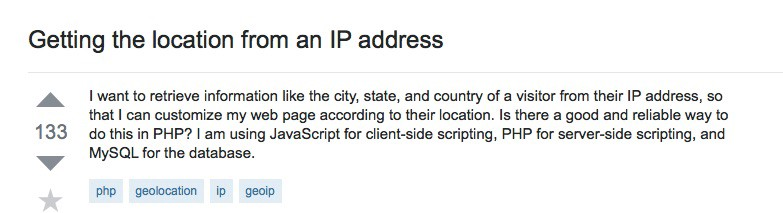
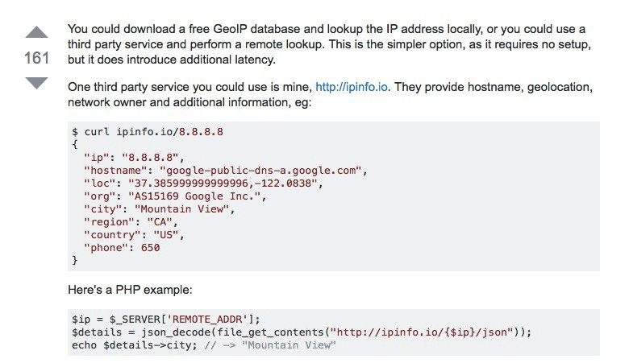
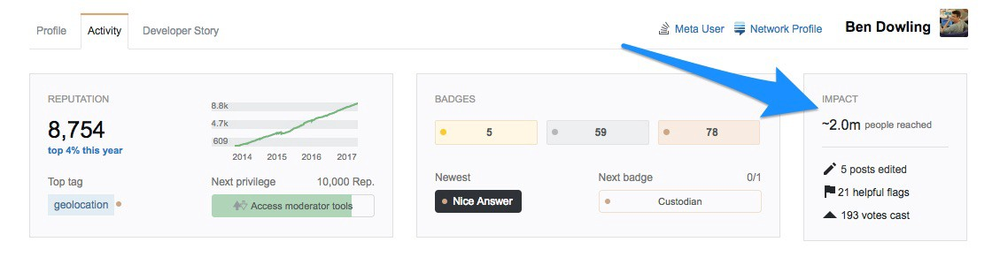

How I Took an API Side Project to over 250 Million Daily Requests With a $0 Marketing Budget

# How I Took an API Side Project to over 250 Million Daily Requests With a $0 Marketing Budget

Finding someone to market an API is like finding a unicorn. They need the technical knowledge to understand the API in detail, the communication skills to explain it, and the salesmanship to say why it’s the best. No one seems to have a concrete system, either — developer evangelists are encouraged to “[win the hearts](https://www.microsoft.com/northafrica/careers/positions/de.htm)” of the dev community.

But getting people to use your API isn’t nearly as mysterious as it seems. Because they have such a strong community presence, developers can be even easier to connect to than general consumers. You just have to know where to look.

My company [ipinfo.io](http://ipinfo.io/) started as a response to a question on Stack Overflow. It’s an IP Details API that can tell you a site visitor’s geolocation, organization, and more. I built the API in a few hours, posted the answer, and forgot about it — until a few months later I got an email saying my server usage was off the charts. I’d been getting millions of requests per day.

That side project has now become my full-time job.** We see 250 million daily requests, with absolutely no outbound sales efforts. **

 Being an active member of the online developer community is the only “marketing” I’ve needed. Here’s why.

### Make Something People Ask For

The Y Combinator slogan is the north star for most early stage startups: Make Something People Want.

 When you’re first starting out, everyone recommends collecting feedback at every turn. Best practices include spending hundreds on tools to survey and chat with your site visitors, talking about your product at Thanksgiving Dinner, and asking your entire professional network for advice.

 But no one talks about the easiest way to “Make What People Want”: **Make What People Ask For.**

 While chatting people up about your API might bring you the occasional new insight, asking questions about someone’s daily pain points puts them on the spot. When you ask for someone’s advice, they’ll usually say, “Sure, that sounds good,” or give you the first thing that comes to their mind.

 But when someone’s asking *you *for what they need — whether it’s on Stack Overflow, Quora, or Reddit — they’ve spent time thinking about why it’s important to them. In fact, it’s so important to them that they’ve taken the time to write out a question about it.

 When you’re a member of the online developer community, you don’t just see what people want. **You can see**  **what they want most, right now — and then you can make it.**

### Don’t Promote — Inform

Being a member of the dev community didn’t just tell me what to make. It’s also helped me communicate *that *I made it.

My entire marketing efforts (if you could call them that) have involved answering questions on Stack Overflow, Quora, and Reddit — when other developers have a problem my API can solve, I let them know it’s there.

Since then, I’ve reached** more than 2 million people** on Stack Overflow alone.

This method works when you’re informing someone of the way to solve their problem, and your API is actually the solution. It’s not awkward self-promotion if you are the answer they’ve been looking for all along.

 Eventually, my answers started reaching critical mass — I noticed people who’d read my answers in the past would link back to my site on new questions. Because my API solved a problem, other developers started marketing for me.

 Participating in the community is an easy, $0 way to market your product. But it only works proportionally to how relevant your product actually is. When you’re making something people ask for, giving them the answer puts you in their good graces, instead of putting them off.

### Keep Your Finger on the Pulse

The online community won’t just help you develop and market your product. It will help you improve it, too.

 Staying up on the latest industry trends will help keep your finger on the pulse of what people need (feature releases, different use cases), as well as the best ways to give it to them (new technologies, new best practices).

 Being a part of the community is what helped me create ipinfo, but it’s also part of why it’s evolved. ipinfo wasn’t previously able to support sites with https, but after I noticed users requesting it, I worked on the change.

 On Stack Overflow, I’ve learned use cases for my product that I would never have thought of, like:

- •[**Personalizing based on college names**](https://stackoverflow.com/questions/23275412/get-college-university-from-ip-address/25170271#25170271)
- •[**Showing websites in a visitor’s native language**](https://stackoverflow.com/questions/28630007/website-to-be-opened-in-native-language-of-a-particular-country-as-per-the-ip-ad/28635475#28635475)
- •[**Personalizing based on the weather**](https://blog.ipinfo.io/the-ultimate-guide-to-personalizing-by-location-for-e-commerce-sites-8dd4a51f0163)

I’ve also bounced from server to server trying to find the best way to handle my hosting needs, and Stack Overflow eventually led me to [Elastic Beanstalk,](https://aws.amazon.com/elasticbeanstalk/) which is basically a managed version of AWS. With it,** 90% of our 250 million daily requests get handled in less than 10 milliseconds.**

By being a continued member of the online dev community, you can stay in-the-know about what people need — and the best ways to give it to them.

### Be a Good Citizen

While being a member of the dev community doesn’t need a budget, it’s not free. It takes a lot of time, and it’s hard to measure the direct ROI. Being a good citizen means asking questions *and *answering them — not always related to your own product.

It can be hard to justify browsing through forums when you could be finessing a line of code or working on a feature release with a more direct payoff.

**But keeping your head down and focusing on your own product actually closes you off to what you might find in the community around you. **Being excited about the industry, instead of just excited about your current project, can help you improve your work for years to come.

You never know how what you will find will shape you — I never expected that a side project API I built in a couple of hours would start getting millions of requests per day.