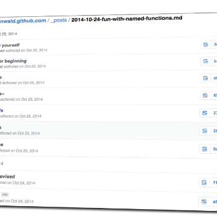

How I Write Books with GitHub and Leanpub

How I Write Books with GitHub and Leanpub

http://braythwayt.com/2015/01/29/how-i-write-books-with-github-and-leanpub.html

How I Write Books with GitHub and Leanpub Chris wrote to ask: I had a couple of questions about writing and publishing: What software do you use for writing? I’ve read that Sublime Text is the way to fly. I’m new to the markdown process of writing; I’m more at home with Word, but I’m willing to try something new. I’m investigating Leanpub . Another alternative would be to take a more DIY approach and use Gumroad. Why did you choose Leanpub? Was it because it’s the best end-to-end option? I know that it also allows you to support a Canadian-based business as an added bonus. Also, I can see the point that, since they are already established, you know that a specific, book-buying audience is visiting the site.