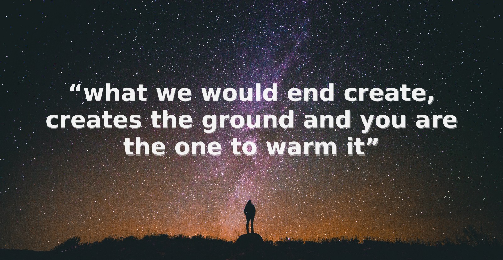
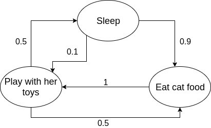
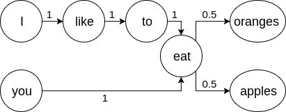
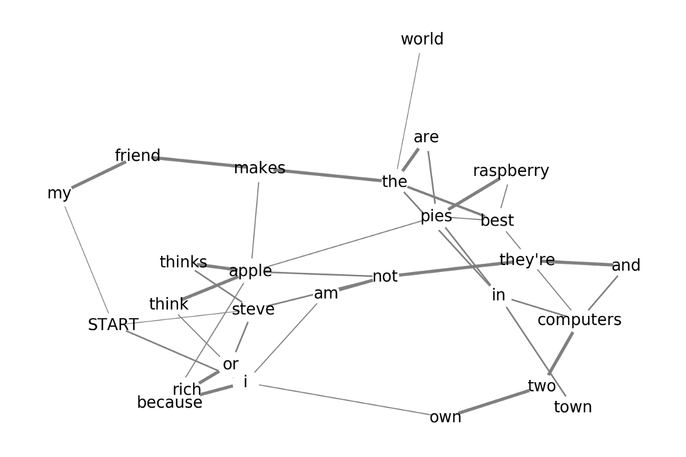
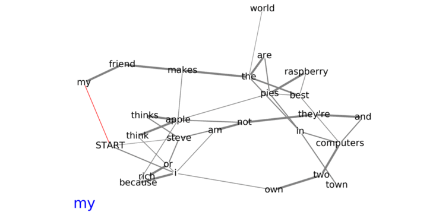

How I generated inspirational quotes with less than 20 lines of python code

# How I generated inspirational quotes with less than 20 lines of python code

> “Don’t think of the overwhelming majority of the impossible.”
> “Grew up your bliss and the world.”
> “what we would end create, creates the ground and you are the one to warm it”
> “look and give up in miracles”

All the quotes above have been generated by a computer, using a program that consists of less than 20 lines of python code.

When it comes to natural language generation, people normally think of advanced AI systems using advanced mathematics; however, that is not always true. In this post, I will be using the idea of Markov chains and a small dataset of quotes to generate new quotes.

### Markov chain

Markov chain is a stochastic model that predicts an event solely based on the previous event. A simple example could be the state transitions of my cat. I have a cat and she is always either eating, sleeping or playing with her toys. She is mostly sleeping; however, she occasionally wakes up for some food. Normally, after eating she gets energized and starts playing with her toys, then she either goes back to sleep or eating.

My cat’s state can easily be modeled with the Markov chain because she decides what to do based on her previous state. It is quite unlikely for her to wake up and start playing straight away, but after her meal, it is very likely. These state transitions can also be illustrated on a **state transition diagram**.

Each circle is a state, and the arrow points to the next state, the number beside each arrow is the probability of transition from one state to the other. As you can see, the probability of transition is solely based on the previous state.

#### Text generation with Markov chains

Text generation with Markov chains use the same idea and try to find the probability of a word appearing after another word. To identify the probabilities of the transitions, we train the model with some sample sentences.

For instance, we can train a model using the following sentences.
> I like to eat apples.
> You eat oranges.

From only the training data, we can conclude that ‘I’, ‘like’, ‘to’ and ‘eat’ are always in that sequence, and ‘you’ and ‘eat’ are also always together; however, there is an equal chance of either ‘oranges’ or ‘apples’ appearing after the word ‘eat’. The transition diagram below illustrates what I just said better.

The two training sentences were capable of generating two new sentences, but that is not always the case. I trained another model with the four following sentences, and the results were very different.

> my friend makes the best raspberry pies in town
> i think apple pies are the best pies
> steve thinks apple makes the best computers in the world
> I own two computers and they’re not apple because I am not steve or rich

The transition diagram for a model trained by the four sentences is much bigger.

Even though the diagram looks very different from a typical Markov chain transition diagram, the main idea behind it is the same. A path starts from the ‘START’ node and randomly picks the following words until an end node. The probabilities of words are illustrated by the width of the connections.

The model above is capable of generating hundreds of unique sentences, even though it has only been trained by four sentences.

### The code

The code for the generator is incredibly simple, and does not require any additional modules or libraries apart from the python’s random module. It consists of two parts, one for training and other for generating.

#### Training

The training code constructs the model that we will later use to generate the quotes. I have utilized a dictionary as the model; that has words as the keys and a list of the potential following words as the corresponding values. For examples the dictionary for the model that had been trained by the first two lines: ‘I like to eat oranges’, ‘You eat apples’ looks like the following:-

`{'START': ['i', 'you'], 'i': ['like'], 'like': ['to'], 'to': ['eat'], 'you': ['eat'], 'eat': ['apples', 'oranges'], 'END': ['apples', 'oranges']}`

We do not need to calculate the probability of the occurrence of the next words, because if they have a higher chance of appearing, then they will appear several times in the potential following word lists. For instance, if we were to add the additional training sentence ‘we eat apples’, the word ‘apples’ has appeared in two sentences after the word ‘eat’, thus has a higher probability. The higher probability is worked into the model’s dictionary by appearing twice in the ‘eat’ list.

`{'START': ['i', 'we', 'you'], 'i': ['like'], 'like': ['to'], 'to': ['eat'], 'you': ['eat'], 'we': ['eat'], 'eat': ['apples', 'oranges', 'apples'], 'END': ['apples', 'oranges', 'apples']}`

Furthermore, there are two additional items in the model dictionary above, ‘START’ and ‘END’, they indicate the starting and ending words for a generated sentence/quote.

|     |     |
| --- | --- |
| 1   | for line in dataset_file: |
| 2   | line = line.lower().split() |
| 3   |  for i, word in  enumerate(line): |
| 4   |  if i ==  len(line)-1: |
| 5   | model['END'] = model.get('END', []) + [word] |
| 6   |  else: |
| 7   |  if i ==  0: |
| 8   | model['START'] = model.get('START', []) + [word] |
| 9   | model[word] = model.get(word, []) + [line[i+1]] |

 [view raw](https://gist.github.com/RamtinAlami/f67726dce0a257d963035ca189984e9b/raw/9c37da3ef450f4d7715f0611116931ddc9467aae/train.py)  [train.py](https://gist.github.com/RamtinAlami/f67726dce0a257d963035ca189984e9b#file-train-py) hosted with ❤ by [GitHub](https://github.com/)

#### Generation

The generator section consists of a loop. It commences by picking a random starting word and appends it to a list. Then it searches the dictionary for the list that contains the potential next words and randomly picks one of them, and appends the new picked word to the list. It keeps choosing random potential next words until it reaches an ending word, and stops the loop and outputs the generated word sequence or “quote”.

|     |     |
| --- | --- |
| 1   | import random |
| 2   |     |
| 3   | generated = [] |
| 4   | while  True: |
| 5   |  if  not generated: |
| 6   | words = model['START'] |
| 7   |  elif generated[-1] in model['END']: |
| 8   |  break |
| 9   |  else: |
| 10  | words = model[generated[-1]] |
| 11  | generated.append(random.choice(words)) |

 [view raw](https://gist.github.com/RamtinAlami/436ad36ad16913904078f267b71beacd/raw/1a431fbae6a4cda284c435638b8403325a7cc9bd/generate.py)  [generate.py](https://gist.github.com/RamtinAlami/436ad36ad16913904078f267b71beacd#file-generate-py) hosted with ❤ by [GitHub](https://github.com/)

I have used Markov chains for generation of quotes, however when it comes to their application as text generators, any input can be provided, and similar text will be generated.

Another cool thing that can also be done with Markov chain text generators is mixing different types of text. For instance in one of my favorite TV shows, Rick and Morty, there is a character called [Abradolf Lincler](http://rickandmorty.wikia.com/wiki/Abradolf_Lincler) who is a mix of Abraham Lincoln and Adolf Hitler. You can generate something that Abradolf Lincler would say by feeding speeches of both leaders as the training data to a Markov chain text generator.

Markov chain is an incredible thing with loads of applications in all sort of fields. Text generation isn’t its most useful application, but I think it certainly is one of the funnest.

This post has been originally published on my[personal website](http://www.ramtin.xyz/post/4).