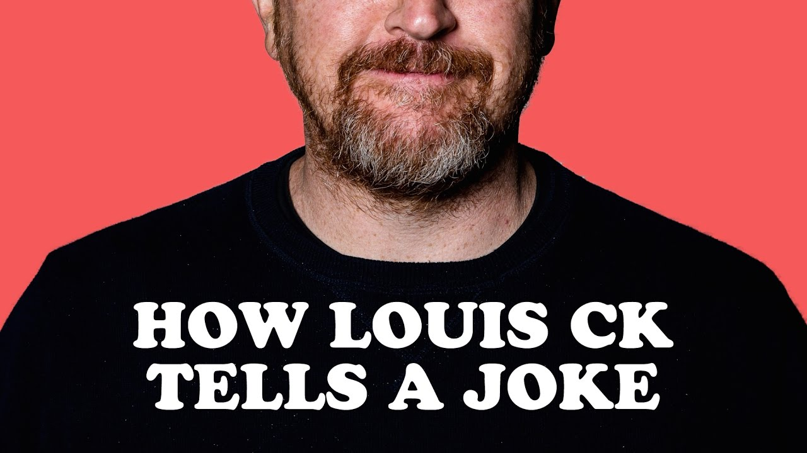

How Louis CK Tells A Joke

How Louis CK Tells A Joke
https://www.youtube.com/watch?v=ufdvYrTeTuU
[Nerdwriter1](https://www.youtube.com/channel/UCJkMlOu7faDgqh4PfzbpLdg)
1,802,380 views views
Published on Jan 18, 2017

|     |
| --- |
| [(L)](https://www.youtube.com/watch?v=ufdvYrTeTuU) |

Description

Get one month free at The Great Courses Plus here: http://ow.ly/OTFe307WTs8

THE NERDWRITER T-SHIRT: [https://store.dftba.com/products/the-...](https://store.dftba.com/products/the-nerdwriter-shirt)

ASK ME QUESTIONS HERE: [http://thenerdwriter.tumblr.com](http://thenerdwriter.tumblr.com/) TWITTER: https://twitter.com/TheeNerdwriter

Email me here: thenerdwriter@gmail.com

MUSIC:

Joey Pecoraro:

[https://soundcloud.com/joeypecoraro/t...](https://soundcloud.com/joeypecoraro/tired-boy)

https://soundcloud.com/joeypecoraro/warm

MY RULES FOR SPONSORSHIPS:
1) Sponsor cannot choose video topic.
2) Sponsor cannot give notes or ask for changes.
3) Sponsor cannot see video before it airs.

4) Sponsorship will not be integrated into the video proper in any way, but only appear on the end-screen after a few seconds of black.

5) I have to be sympathetic with the brand/client.